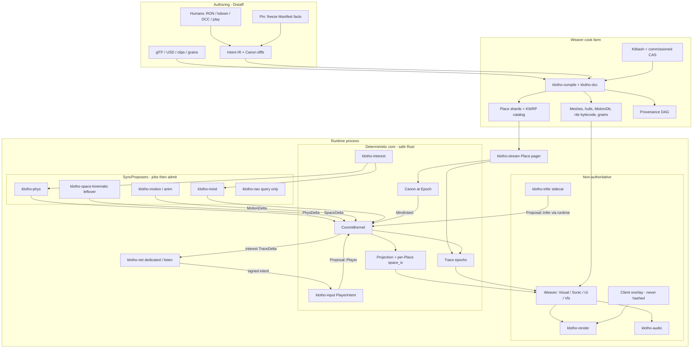
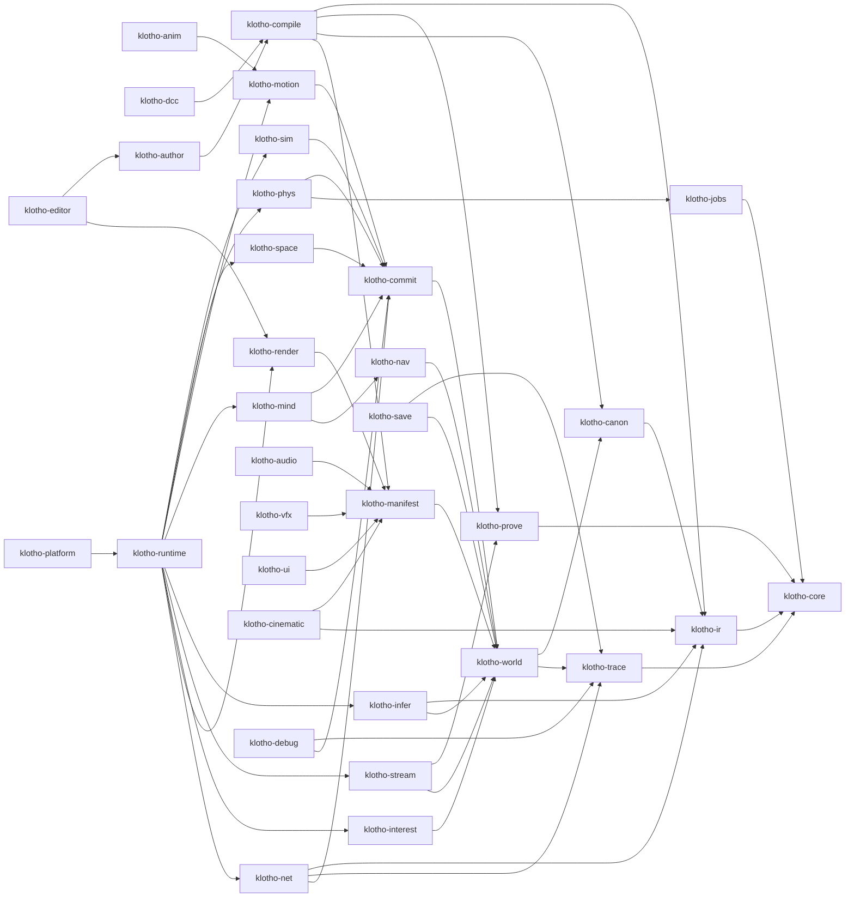
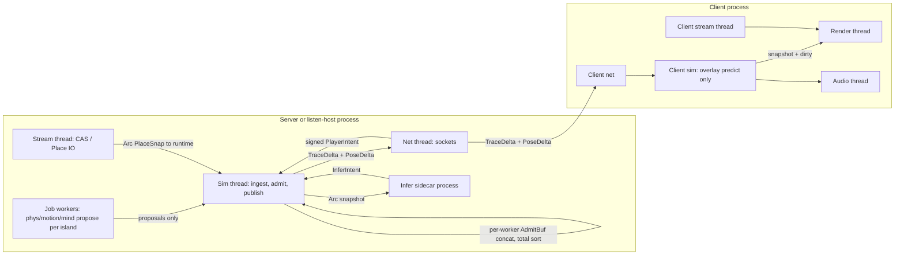
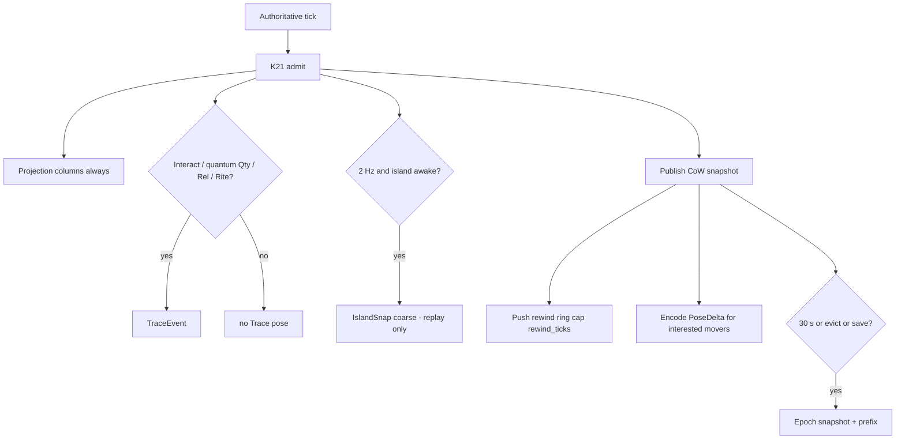
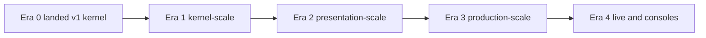
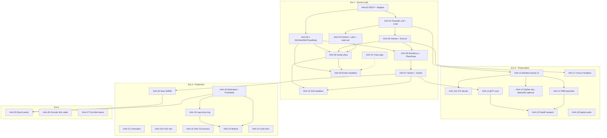

# Klotho AAA: A Semantic Kernel That Can Ship First-Party Titles

| Field | Value |
| --- | --- |
| Document | Successor High-Level Design — Klotho at AAA production scale |
| Author | Grok (for Gal Katz) |
| Date | 2026-08-27 |
| Status | Draft (rev 3, user Qs closed — Q8 probes+SSGI, Q13 OS-process infer, Q15 ClipSet-first) |
| Supersedes | `docs/hld.md` rev 5 (2026-08-22) — v1 semantic kernel, Hearth/Ash slice |
| Audience | Senior engine, tools, gameplay systems, and production engineers |
| Language | Rust (edition 2024; 2021-compatible crates OK) |

This is not a patch note on rev 5. It is the architecture for a studio that wants Klotho's programming model **and** a contemporary first-party quality bar. Rev 5 remains the law for landed crates until the PRs in this document merge.

---

## Overview

Rev 5 proved a hypothesis: a game can be authored and simulated as **Canon + Intent + Trace + Projection** instead of entities, components, and `Update()`. The landed kernel (`klotho-commit::CommitKernel`, K21 speculate, K20 integer pose, K25 determinism) is the product. Its explicit non-goals — cinematic GI, open-world streaming, conventional physics, rollback net, motion matching, DCC, marketplace — were honest for a 4-person 12-month slice. They are now the ceiling we are lifting.

**AAA here is not "clone Unreal."** It is the production bar a 40–200 person studio needs to ship a contemporary first-party-quality title: tens of thousands of loci in a streaming world, thousands of simultaneous agents, destruction and vehicles, PBR lighting, animation-driven combat, competitive-grade net, a real editor, a 50–200 GB cook, 60 Hz sim (or a justified split), and a team that does not all learn `AdmitBuf`.

The architecture that survives is the hybrid rev 5 already implied and then under-scoped:

> **Klotho remains a semantic commit kernel. Conventional physics, animation, navigation, rendering, audio, and streaming become proposers and presenters. They never become the source of truth.**

If we abandon Canon/Intent/Trace, we have thrown away the only reason to exist next to Unreal. If we keep the v1 stand-ins (2.5D AABB admission, verb→clip T-pose, 20 Hz listen-server, 512 MB `.warp`, 4,096 loci, unlit+lambert, closed kitbash) and "skin" them with Manifests, we cannot ship combat, vehicles, streaming, or net. The hybrid is the only design that keeps the simplicity **and** the quality bar.

---

## Background & Motivation

### What is actually in the repo (2026-08-27)

The workspace at `/Users/galkatz373/Documents/Projects/klotho` has landed PRs 01–20 of rev 5 as crates. This is not a paper engine. Cite these as the floor:

| Surface | Current fact | Why it is not AAA |
| --- | --- | --- |
| Locus cap | `klotho_world::MAX_LOCI = 4_096`; insert fails `WorldError::LocusCap` | A streaming region wants 50k–200k rows, most asleep |
| Snapshot | `SNAPSHOT_CAP = 16 MiB`; double-buffer `Arc<Projection>` clone | Full clone of 50k rows + `space_ix` will miss the memcpy budget |
| Warp | `WARP_CAP_DESKTOP = 512 MiB`, `MAX_BLOBS = 16_384`, `MAX_BLOB_BYTES = 32 MiB` (`klotho-prove`, `klotho-compile/src/warp.rs`) | AAA cooked data is tens to hundreds of GB, sharded |
| Kernel budget | `Budget::HEARTH.us_sim = 4_000` µs; **`CommitKernel::step` currently ignores it** (`let _ = budget.us_sim`); `klotho-debug` gates 64-awake | 4 ms for 4k loci is Hearth theater; AAA admit is 5–8 ms of a 30/60 Hz tick. `us_sim` must become a real gate (AAA-04), not a comment |
| Space | `klotho-space::Space` is ZST; `propose` walks `view.loci()`; 2.5D AABB + swept capsule; Actors skipped | O(n) locus walk; no gravity, stacking, joints, 6DOF, destruction |
| Motion | `klotho-motion`: verb→clip, debug T-pose, `WALK_MM_PER_TICK = 20`; clip time from `WorldView::tick` | Not skeletal, not motion matching, not hit-frame accurate |
| Mind | `klotho-mind::Mind` GOAP over a **hardcoded** `match goal` (`stay_near_forge`, `fetch_bucket`, …) | 3 Hearth NPCs; not 200–2,000 agents |
| Infer | `klotho-infer::InferHost` in-process stub; `fill` emits `Verb::Look` | Isolation is the contract; the model is not |
| Render | wgpu clustered static meshes; one unlit+lambert family (`shader.wgsl`); `RenderThread` via `mpsc` | No PBR, shadows, GI, skinning, post, virtualized geo |
| Audio | Integer mix to i16 stereo PCM; **no device output** | No spatial HRTF, no voices-at-scale, no middleware presenter |
| Net | Listen-server, 20 Hz signed `PlayerIntent`, delay-interp overlay, **no `Predicted` on Trace** (`klotho-net`) | Hearth-adequate. Not shooter-adequate. Not 32–64 player |
| Distaff | `klotho-author` CLI: RON + kdown, cook-time `Pin`, preview summary | Constraint cockpit without a production viewport, cook farm, or animation tools |
| Trace | `TraceLog` is `Vec<TraceEvent>` + blake3 prefix fold | `CommitKernel::admit_one` currently appends `PoseCommitted` on **every** admitted `SpaceDelta`/`MotionDelta` — already a 60 Hz pose log, contra rev 5 §1 |
| Spatial index | `GridIndex`, `CELL_MM = 1024`, XZ uniform, `BTreeMap<(i32,i32), BTreeMap<u16,bool>>`; packed index is **`u16`** (`Projection.by_sigil`, `WorldView::loci` as `0..len as u16`) | 65,536 wrap makes 200k loci a type error. AAA-03 is a `PackedIx = u32` PR (`klotho_ir::Slot` stays the pred-lang word) |
| Rite ISA | 12 ops, DAG + `WAIT`, caps 64/rite/tick and 2,000/tick (`docs/pred-lang.md`) | Enough for lock/carry/trade. Tight for animation-driven melee graphs unless combat stays in Laws |
| Unsafe | `#![forbid(unsafe_code)]` workspace-wide except infer, render, audio, platform | Physics SIMD, job steal, stream mmap will need an explicit allowlist, not a quiet leak |
| Crate firewall | `klotho-sim` does not depend on space/motion/mind/infer/render; `klotho-world/mutate` only from commit; `scripts/ci/forbidden-imports.sh` | **Keep.** This is how simplicity survives a 100-person team |

Hearth (`examples/hearth-slice`) seed is **~20 loci** (Place + 4 actors + door/key/tool/hammer/ingot/bucket + barrels; Appendix A furniture-to-~80 is a later pixel target, not the headless seed). Ash (`examples/ash-slice`) is a 20 m arena, hitscan, health, ammo, 100-projectile `Cap`. `klotho_core::Epoch` **already exists** and keys hulls `(Sigil, Epoch)`; K16 amends **policy** (live packs), not the struct. **Do not grow Hearth.** Ash remains the ontology leak detector (K26). AAA subsystems get **new slices**, not more Hearth props.

### Pain the v1 ceiling produces at studio scale

1. **Physics-adjacent gameplay is inexpressible.** Vehicles, stacking crates, destruction connectivity, character grounding, and animation-driven melee all require contact *resolution*, not only `never_clip_closed`. Rev 5 K7 forbade that on purpose. The forbid is now the blocker.
2. **Net is a genre.** 20 Hz hold-analog + no prediction (`klotho-net` docs, K8) cannot aim, cannot drive, cannot fight. Overlay already exists and is correctly unhashed — we build on that, we do not put `Predicted` on Trace.
3. **One Place, one grid, one `.warp`.** Streaming as "load another Hearth" will reintroduce a scene file as truth. Places must become **shards of Canon+seed**, not Unreal sublevels. Era 1 Drift proves **two Places on a flat strip**, not a 4 km foliage world.
4. **Trace will explode if it is also the pose stream.** The implementation currently logs pose every admit. AAA-01 thins Trace. Net pose and Aim rewind are **other channels** (K53), not a faster `IslandSnap`.
5. **Authors will invent `Update()`.** A 80-person team given only RON and a 12-op ISA will smuggle gameplay into proposers and Manifest tables. Distaff has to become a production editor **without** becoming a GameObject outliner.
6. **Presentation is not a trailer.** Unlit+lambert clustered statics cannot carry a first-party vertical slice. Presentation must scale **inside Manifest**, not by letting gameplay import `klotho-manifest::tables`.

### Why the inverted stack still holds

Unity/Unreal/Frostbite still share the 1998 ontology: identity = bag of data, world = container, behavior = tick, assets = files identities point at, editor = manipulator of those, AI = one more behavior. Grafting Klotho's nouns onto that stack as components is how you get a slower Unreal. The commit algebra (K21) and the state equation (K22) are the only things that make models, net, and replay cheaper than Unreal's. They scale if we stop pretending the stand-ins are the architecture.

---

## What "AAA" means (measurable)

These are **gates**, in the K14 sense: numbers we CI against, not slogans. Genre modulates the mix (a 32-player shooter is not a 1-player 8 km action-adventure), so each gate is a **range** plus a **proving slice**.

### Simulation scale

| Gate | Target | Proving slice |
| --- | --- | --- |
| Loaded loci (projection rows) | 50,000 typical / **200,000 process cap** (`PackedIx = u32`, not a bumped `u16`; not `klotho_ir::Slot`) | Drift |
| Awake full-rate **bodies** | 2,000 adventure / 1,000 shooter combat | Ember, Drift |
| Awake **islands** (contact groups) | typically ≪ bodies (one vehicle island, one crate pile); cap 65,535 (`island: u16` stays) | Ember, Drift |
| Far-rate agents (SimLod::Far) | 2,000–10,000 at `lod_period` ticks (default 6) | Chorus (Era 2 headless) |
| Simultaneous players (dedicated) | 8 adventure / 32 shooter lobby (64 is Era 4) | Netlock |
| Projectiles alive | **512** Cap (Ash remains 100) | Ember |
| Destruction | **64 simulated fragments per collapse**, global Cap **128** simulated; rest Manifest TTL debris (no Sigil) | Ember |
| Vehicles | 8 simulated 6DOF on a **flat strip** (Era 1); 32 is Era 3 | Drift |
| Inventory unique relics | 10,000 owned (mostly dormant Place `stash`); stacks are `Qty` | Ember |

### Presentation quality (Manifest-only)

| Gate | Target |
| --- | --- |
| Lighting | Clustered deferred **or** clustered forward+; PBR (metalness/roughness); cascaded shadows; **GI = cook-baked irradiance probes + SSGI** (Q8 closed). No SDF volume. AAA-12 still RFCs the pixel budget, not the technique |
| Animation | Skinned GPU palettes, 150–250 bones, 4-way blend + motion-match database; IK/look-at/cloth **presentation-only** unless a Law reads a planted foot |
| VFX | **Era 3:** GPU particles / ribbons as Manifest extract (`klotho-vfx`). Era 2: Trace-driven decals / one-shot meshes only |
| Post | Adventure: TAA, tonemap, bloom, color grade. **Shooter competitive permutation: no TAA/GI, one cascade or none** |
| Audio | 3D spatialization, occlusion stub from `OpaqueClosed` hulls, 256 voices, one bed + stems; optional FMOD/Wwise as a `Mixer` impl |
| Resolution / rate | 1080p–1440p 60 FPS desktop vNext; 4K 60 as a later console gate, not year-1 |

### Content pipeline

| Gate | Target |
| --- | --- |
| DCC | glTF 2.0 required; USD/FBX via cook workers. Blender/Maya/Houdini are **inputs to Weaver**, never sources of truth |
| Cooked `.warp` | 50–200 GB sharded CAS; catalog + place shards; not one 512 MB file |
| Incremental cook | Dirty one mesh/clip/grain < 5 s; dirty one Place < 60 s; full 100 GB farm is hours, not the inner loop |
| Hot-reload | Manifest CAS blobs and ClipSets hot-swap by `BlobId`; Canon diffs require epoch bump (K40) |
| License | Every blob still has `LicenseSpan` (`klotho-prove`). Unknown still fails export |

### Gameplay systems Ash/Hearth do not prove

Combat at shooter/action fidelity: Ember proves hit volumes + melee `WAIT` windows **without** lag-comp; Netlock proves lag-comp Fire (AAA-19). Animation-driven melee (Rite `WAIT` + MotionDelta, not AnimNotify). Vehicles on a flat strip (Drift). Inventory at stash scale. AI at hundreds (Chorus), not 3 GOAP NPCs. Cinematics/cameras as Beat + Observer Manifest (Era 3). Production UI is a **Knows-gated HUD skin** in Era 3, not a UMG clone. Save/load via epoch snapshot + 120 s suffix.

### Multiplayer

**Server sim 60 Hz** (shooter) or **30 Hz** (adventure), **intent 30–60 Hz** (Hello `intent_hz`), RTT target 30–80 ms LAN / 80–120 ms WAN, late join < 5 s, 8–32 players with interest culling. Protocol: **interest-managed dedicated server + unhashed `PoseDelta` + client overlay**. Not lockstep. Not GGPO-as-the-world. **Not anti-cheat.** K10 is not a humanity detector; Netlock ships a **sidecar** (cmd-rate, analog clamp, rewind cap) that may only *read* Trace. See K36, K53, K57.

### Tools

Distaff is a real production editor: viewport, outliner of **loci/affordances**, Canon diff review, Pin, cook dashboard, Trace player, profiler, animation retarget, lighting (Manifest). It is **not** a scene-graph WYSIWYG whose hierarchy is the world.

### Platforms

| Era | Platforms |
| --- | --- |
| vNext (Era 1–2) | Windows, Linux, macOS (already winit+wgpu) |
| Production (Era 3) | Steam Deck; dedicated Linux server |
| Later (Era 4) | PS5 / Xbox Series — `klotho-platform` backends, same kernel. Path exists; cert is not a shrug |

### Performance (kernel and frame)

| Quantity | Hearth (`Budget::HEARTH`) | AAA adventure (30 Hz auth) | AAA shooter (60 Hz auth) |
| --- | --- | --- | --- |
| Authoritative tick | 60 Hz / 16.67 ms | **30 Hz / 33.3 ms** | **60 Hz / 16.67 ms** |
| Presentation | 60 Hz | 60–120 Hz | 60–120 Hz |
| Kernel **admit** (`Budget.us_sim`, serial, sim thread) | 4.0 ms / 64 awake | **≤ 8 ms** / 2k awake **bodies** | **≤ 5 ms** / 1k combat-awake bodies |
| Parallel **propose** (jobs; sim thread **joins**) | n/a | **≤ 10 ms** join (max of phys/motion/mind on 8 workers) | **≤ 4 ms** join |
| Snapshot publish | 0.3 ms / 1–2 MB | **≤ 1.0 ms** CoW dirty-range | same |
| Stream hitch (sim thread) | n/a | **≤ 2 ms**, not every tick; **0 on shooter** | **0** (no streaming in Ember/Netlock) |
| Sim-thread **critical path sum** | ~5 ms | **≤ 21 ms of 33 ms** (ingest+interest+partition+join+admit+publish) | **≤ 11 ms of 16.67 ms** |
| Render present | 7.0 ms unlit | **≤ 11 ms** 1080p high (forward+/deferred + cascades + probes) | **≤ 8 ms** 1080p **competitive permutation** (no GI, ≤1 cascade) |
| RAM | 0.5–1.5 GB | **8–16 GB** | 8–12 GB |
| VRAM | 0.25–1 GB | **6–10 GB** | 4–8 GB |
| Net egress / client | tiny | **~115 kb/s** typical (8 players + ~40 movers × 12 B × 30 Hz delta); **~490 kb/s** spike (128 movers) | **~150–300 kb/s** typical (32 pawns × 16 B × 60 Hz); **~600 kb/s** spike |
| Cook dirty mesh | < 500 ms kitbash | **< 5 s** DCC import | same |
| Infer eval SLO | 12 ticks ≈ 200 ms @ 60 Hz | **`eval_slo_ticks = 6` ≈ 200 ms @ 30 Hz** | **12 ticks ≈ 200 ms @ 60 Hz** |
| Rewind window | n/a | n/a (adventure) | **≤ 12 ticks (200 ms) @ 60 Hz** |
| Save blob | snapshot + suffix | **≤ 64 MiB** last epoch snap + ≤ 120 s Trace suffix | same |

`Budget` grows `HEARTH` (unchanged), `AAA_ADVENTURE`, `AAA_SHOOTER`. `us_sim` is **admit-only**; propose has `us_propose` on `FrameReport`. Hearth 4 ms is **not** retired. **Bodies ≠ islands:** bandwidth and admit counts are per mover; `IslandSnap` is per contact group and is **not** the net pose stream (K53).

### Team / process

| Role | What they author | What they never touch |
| --- | --- | --- |
| Gameplay designer | RON/kdown, Laws, Rites, Beats, Pins | `AdmitBuf`, Projection columns, Manifest tables |
| Systems engineer | Rare new `SyncProposer` in engine crates | Gameplay as Bevy systems |
| Animator | DCC clips, ClipSet tags, retarget; MotionDb optional Era 2 | Hit timing (that is Canon `WAIT`) |
| Lighting / VFX | Manifest recipes, light relics, Trace-driven cues | Kernel numbers |
| Net / backend | Interest config, Canon epochs | Predicted bits on Trace |
| QA | Golden Intent scripts, Trace hashes, replay files | Ad-hoc "play until it looks right" as the only gate |

CI: same `.warp` + Intent file ⇒ same Trace prefix hash on linux/mac/windows for **kernel + Rite + kinematic Motion/Space**. **PhysDelta goldens are a pinned Linux image** (K44): three-OS hash is not claimed for vehicles/stacking. Overlay, PoseDelta, rewind ring, Manifest, GPU, ragdoll are never in that hash.

---

## Goals & Non-Goals

### Goals

- Keep the author-facing noun set: Locus, Canon, Intent, Trace, Manifest, Rite, Law. Runtime: Proposal, CommitKernel, Affordance, Predicate, Pin, Sigil.
- Keep four categories, K21 transactions, K22 purity, K3 "only CommitKernel commits."
- Make that model **sufficient** for the AAA gates above, by replacing v1 stand-ins with proposers/presenters that are allowed to be conventional internally.
- Ship new proving slices (Ember, Drift, Chorus, Netlock) on the **same** `klotho-commit` binary. If a slice needs `DamageComponent`, stop.
- Give a 40–200 person studio a Distaff-shaped production loop (git of IR, cook farm, viewport as view, Pin as save).
- Stay simpler than Unreal as a **programming model**, not as a feature checklist. Simplicity is "no `Update()`, no dual-truth, no component bag," not "no shadows."

### Non-goals

- Not a year-1 Unreal killer. No Nanite-equivalent as a promised milestone. Virtualized geometry is an Era 3 **presenter** option.
- Not a neural world model as the sim (rev 5 v3 `NeuralPresenter` stays isolated research).
- Not NL → Rite as the authoring path (still v2+/Era 4; RON+kdown remain canonical).
- Not UGC marketplace / Fortnite Creative. UGC Intent diffs remain a later Pin-policy problem (K9 still does not prove legal sufficiency).
- Not making gameplay programmers write XPBD. Physics is an engine proposer.
- Not process-isolating the kernel. Infer isolation grows; commit stays in-process, safe Rust.
- Not rewriting landed Hearth/Ash goldens to "look AAA." Do not grow Hearth.
- Not claiming cross-OS bit-identical Jolt or quantized vehicles. Phys is a **pinned scalar XPBD** on dedicated servers (K44); client phys is Overlay-only.
- Not Era 1–2: terrain mesh as Phys, foliage colliders, shader graph, loc/UI framework, GPU particle VFX, console SKU, live epoch *packs* (the `Epoch` **field** is plumbed earlier). Drift is a flat strip. Chorus is headless SimLod, not skinned crowds. Ember has no lag-comp (Netlock does).

---

## Key Decisions

### Disposition of rev 5 K1–K27

| # | Disposition | AAA statement |
| --- | --- | --- |
| **K1** | **Keep** | Four categories, nothing else. Projection is derived, not a fifth source. A scene graph as truth is still how you become Unity. |
| **K2** | **Keep** | Identity is `Sigil` naming a `Locus`. Affordance = capability, Predicate = eligibility. SoA inside Projection/Manifest is expected. `forbidden_gameplay_imports` stays and **extends** to new slices. |
| **K3** | **Keep** | Only `CommitKernel` commits. Everyone else emits `Proposal`s. |
| **K4** | **Keep, tighten** | Infer remains `klotho-infer`, polled only by `klotho-runtime` (CI allowlist). Era 3 (Q13 **closed**): **OS-process sidecar**, snapshot via IPC, `InferIntent` only, panic/OOM disables infer. Still no `&mut World`. Not wasmtime. UB recovery still not claimed. |
| **K5** | **Keep** | Cook-time binding default; runtime synthesis optional and stale-tolerant. AAA content is DCC-cooked, not 60 Hz mesh inference. |
| **K6** | **Amend** | v1 closed kitbash remains a **valid cook source**. AAA Weaver is DCC + kitbash + retrieval. Missing affordance tag is still a cook error. Neural Weaver's hard problem remains proving the semantic contract (unchanged). |
| **K7** | **Amend** | Space/Motion/Phys/audio/UI propose; kernel admits. v1 collision-admission-only is **Hearth/Ash**. AAA Space is a **deterministic physics proposer** (K31) plus presentation ragdoll (never hashed). |
| **K8** | **Retire as architecture; keep as Hearth transport profile** | Feature `net-listen` / runtime profile `hearth`: 20 Hz listen-server, `Role::Host` has the kernel. AAA ship protocol is **K36** (`net-dedicated`, `Role::Server`) + **K53** pose stream. Do not compile both roles into one session. |
| **K9** | **Keep** | Provenance DAG + `LicenseSpan` on every blob. Graph is audit, not legal proof. |
| **K10** | **Keep** | Infer cannot impersonate `PlayerIntent`. `WAIT.channel` kernel-enforced. Still not a humanity detector; still not anti-cheat by itself. |
| **K11** | **Amend** | Unsafe allowlist **adds** `klotho-phys`, `klotho-jobs`, `klotho-stream`. Audit rules in §Unsafe. All other crates stay `forbid`. |
| **K12** | **Keep** | No `Update()` on loci. Laws, Rites, Beats. Hot combat is dirty-island Laws, not per-actor ticks. |
| **K13** | **Amend** | Distaff remains a constraint cockpit; Pin remains the authoring act. AAA Distaff **also** ships a Manifest viewport, cook farm UI, animation retarget, lighting, profiler. The viewport is a view. Gizmo moves that are not Pinned are not real. |
| **K14** | **Amend** | Engineering budgets stay gates. Hearth 4 ms/64 awake **kept** as `Budget::HEARTH`. AAA budgets are the tables in this document (`AAA_ADVENTURE`, `AAA_SHOOTER`). AAA-02 **widens `pred_ops`/`rite_steps` to `u32`** (landed `u16` cannot hold 65_536) and adds `rewind_ticks`. 4 ms is not the AAA kernel budget. |
| **K15** | **Keep** | Klotho, Distaff, Weaver, `.warp`, `klotho-*`. |
| **K16** | **Amend** | Canon is frozen **per epoch**, not forever. `klotho_core::Epoch` already keys hulls — K16 is **policy**, not a new struct. **Plumb `epoch` on Hello/save in Era 1/3 (AAA-18, AAA-20).** Live-ops *packs* (`CanonDiff` + `EpochMap`) wait until AAA-25. Director still cannot invent Laws at runtime. |
| **K17** | **Amend** | One global `Tick(u64)` remains the causal clock. SimLod/dormancy skip propose; they do not mint a clock. **Cinematics may not slow-mo the kernel** (no second time scale). Cutscene "pause world" is stop `step` or a Beat that emits no Phys, not `Tick` dilation. Pause still stops `step` locally. |
| **K18** | **Amend** | Total admit order (K34): `Player(0) → Residency(1) → Phys(2) → Space(3) → Motion(4) → Mind(5) → Infer(6)`. **Phys and Space do not share a key.** Tie-break inside a class: `(order_key, mover Sigil, island, proposer_reg_ix)` — not insertion order. Carry still commits before Phys so this tick's pick is visible. Whole-tick mega-transactions stay rejected. |
| **K19** | **Keep** | `step` never `Err`s on legal rejects. Save is `(canon_hash, epoch, trace_prefix_hash, snapshot_blob, trace_from_tick)`. Mismatched ancestry refuses load. |
| **K20** | **Keep on the commit path; amend the split** | Committed pose/vel/yaw stay integer (`Mm`, `VelFx`, `YawMd`). Add `vel_y` and pitch/roll millidegrees on `PoseMm`. Presenters float. Phys **internals** may use f32 on a **single scalar path** (K44). Do not introduce `f32` in `klotho-commit` / Projection columns. |
| **K21** | **Keep** | Per-proposal speculative transaction. Same-tick Rite burst atomic. `WAIT` commits and yields. Laws on would-be post-state. Partial writes never visible. |
| **K22** | **Keep** | `State(t+1) = Commit(State(t), Canon, Intents, DeterministicProposals)`. Hidden proposer integrator state is a design violation. Phys may read **only** the Projection columns listed in §Physics. Island graph is **this-tick Partition** (K58): `F(space_ix overlap)`, not last tick’s `island_id`. XPBD lambdas **zero each tick**. Motion matching state lives on Projection / `MotionDelta`. Laws **do not** read `island` (prefer; if a Law needs contact groups it uses `AabbNear` / Rel). |
| **K23** | **Amend** | Kernel spatial index remains derived and rebuildable. **Packed identity is `PackedIx = u32`** (AAA-03). Do **not** name it `Slot` — that is `klotho_ir::Slot` (`This/Target/Other/Name`). Per-Place grids + coarse Place BVH. `island: u16` stays. Canon table ids stay `u16`. |
| **K24** | **Keep** | `HullWitness.swept` is kernel-derived. `BlobId` must match canonical hull at `(Sigil, Epoch)`. Mismatch → `WrongHull` / `WitnessMismatch`. Phys contact manifolds are hints; kernel re-derives overlap against canonical hulls for **gameplay-visible** contacts. |
| **K25** | **Keep** | No unordered iteration on the commit path; **total** sorts (not stable-on-insertion); pinned crates; deterministic proposer registration index; no GPU→sim; one `klotho_core::Rng` seeded `canon_hash ⊕ tick ⊕ epoch`. Parallel propose per **deterministically partitioned** island; join by island id; admit uses the K18 comparator. AAA-04 gate: 8 workers ≡ 1 worker Trace hash on Ash. |
| **K26** | **Keep, extend** | Do not grow Hearth. Ash remains the ontology leak detector. **New slices** (Ember/Drift/Chorus/Netlock) prove AAA subsystems on the same kernel. If Ember needs `CombatManager`, the ontology has leaked. |
| **K27** | **Keep** | No unbounded computation at runtime. Opcode *count* may grow (K41). Turing-complete WASM gameplay is still rejected. Caps scale with `Budget` profile, not with hope. |

### New decisions (K28–K52)

| # | Decision | Rationale |
| --- | --- | --- |
| **K28** | **Hybrid architecture.** Semantic kernel + conventional proposers/presenters. Physics, motion matching, nav, GI, virtualized geo, FMOD, DCC importers are legal **as long as they emit `Proposal` or consume Manifest**. They are never sources. | Alternative 1 (Manifest-only skin) cannot do combat/net/streaming. Alternative 2 (become ECS) throws away the product. |
| **K29** | **Simulation LOD / interest.** Every locus has `SimLod::{Full, Far, Dormant}` derived from observer interest + Place residency + island wake. Far steps every `N` global ticks (default 6). Dormant emits no Space/Phys/Mind proposals. Mesh LOD is a separate Manifest concern. | 30k crowd actors cannot full-rate. LOD of **sim** is the actual AAA problem. |
| **K30** | **World partitions are Places.** A Place is a cooked shard: Canon slice (shared) + seed Trace fragment + CAS range. Streaming **admits** a Place (apply snapshot or seed events) and **evicts** it (flush epoch snapshot, drop projection rows). There is no scene file. The editor viewport lists Places, not a hierarchy of meshes. | Stops sublevels from becoming UWorld. |
| **K31** | **Physics is a proposer, not a second world.** Era 1 `klotho-phys` is **in-house or vendored scalar XPBD/SI, no FFI** (Q9 closed). f32 internals, quantized `PhysDelta` out. SIMD is optional and **the same ISA in CI and every dedicated server**; there is no OS-varying path. Client-predicted phys is Overlay-only (K53). Dual-truth: if a contact can change a Law, it went through PhysDelta. Ragdoll/cloth/debris vis = Manifest, never read back. | Honest split. Rapier/Jolt-as-hashed-truth stays rejected (rev 5 A5). |
| **K32** | **Split-rate.** Global `Tick` at the **authoritative** Hz (30 adventure / 60 shooter, Canon-selected). Presentation thread 60–120 Hz interpolates published snapshots + unhashed overlay. Input sampling may exceed sim Hz; analog is held or sampled-latest per K8-profile. | 60 Hz 200k-locus admit is a fantasy. 30 Hz auth + 120 Hz present is how action-adventure actually ships. Shooter slice opts into 60 Hz. |
| **K33** | **Trace is semantic history, not a pose bus.** Hot ring (default 120 s) + epoch snapshots. Pose is **not** logged per admit (AAA-01). `IslandSnap` is **coarse** (2 Hz, awake islands, for replay *between* epoch blobs only). Compacted epochs keep `(prefix_hash, snapshot)`. `TraceDelta` replicates events, not 60 Hz pose. Net pose and rewind are **K53**, not a denser log. | Rev 5 already split “10 Hz IslandSnap vs snapshot blob 60 Hz columns.” One 10 Hz snap cannot also be lag-comp, shooter pose, and a compact save. |
| **K34** | **Parallel propose, serial admit.** After Interest, a **Partition** phase (K58) writes this-tick `island` ids. Jobs then call `propose_island(island, &WorldView, &mut AdmitBuf)` into per-worker buffers. Concatenate in island-id order; kernel sorts with the total K18 key. `SyncProposer::propose` remains for Hearth. K55 is **admit-time**. `klotho-sim` does not depend on jobs. | Without Partition, `propose_island` has no producer. Ash defaults `island_id = 0`, so 8≡1 would be vacuous. |
| **K35** | **DCC is a cook input.** glTF/USD/FBX → quantized CAS (`ClusteredMesh`, `SkinnedMesh`, `Hull`, `ClipSet`/`MotionDb`, `Texture`, `Grain`). Authoring source of truth remains Intent IR + Pins + provenance. Artists do not "save the scene." They export, cook, preview, Pin semantic facts (this mesh binds to `door.oak.lockable`). | Closed kitbash cannot staff 80 people. FBX-as-truth recreates Unity. |
| **K36** | **Dedicated server + interest + overlay.** `Role::Server` runs the only CommitKernel. `Role::Host` is the K8 listen profile. `Role::Client` does **not** run the kernel for the replicated world. Clients send signed `PlayerIntent` at Hello `intent_hz`. Overlay (6DOF) is fed by **`Packet::PoseDelta`** (K53), never by thinned Trace, never by presenter bones. Correction: snap-hard on local pawn when server pose error > Canon `overlay_snap_mm`; else permille blend. Remote proxies interpolate PoseDelta only. No `Predicted` on Trace (`no_predicted_in_packets` stays). Lag-comp uses the rewind **ring**, windowed (K57). | Overlay today is filled from `PoseCommitted`/`IslandSnap` and zeros Y (`overlay.rs`). AAA-01 would starve it without K53. |
| **K37** | **Animation: ClipSet first (Q15 closed).** Ember ships **verb→clip + root pose**. Hit frames = Rite `WAIT` + Laws, **never** clip notifies. Motion matching / `MotionDb` is **Era 2 research** (AAA-13 may land it; **AAA-09 does not depend on AAA-13**). Matching, if present, is `F(verb, vel, rates, clip, ticks_in_state, plant, rng)` on Projection / `MotionDelta`. Skeletal palettes, IK, look-at, additive, cloth = Manifest. Ember golden: swapping a ClipSet must not move a WAIT window. | Combat must not wait on motion matching. Hidden `ticks_in_state` in the proposer is still forbidden. |
| **K38** | **Renderer consumes Manifest, period.** `VisualManifest` grows instance lists, skinned palettes, lights, **cook-baked irradiance probes**, decals, post settings. Clustered deferred or forward+ is an impl of `Presenter`. **GI = probes + SSGI (Q8)**; SSGI is presenter-only, not Trace. Gameplay crates and slices still must not import `klotho-manifest::tables`. | Scales pixels without leaking the programming model. No SDF volume. |
| **K39** | **Unsafe allowlist: infer, render, audio, platform, phys, jobs, stream.** Phys Era 1: SIMD of the **scalar XPBD**, no solver FFI (Q9). FFI re-opens only after Ember stacking goldens exist. Jobs: steal queues. Stream: mmap after header validate. Stream/jobs/phys never enable `world/mutate`. | Forbidding SIMD is how you miss the budget. Optional Jolt FFI is how hashed truth sneaks back. |
| **K40** | **Canon epochs for live ops.** Packs wait until AAA-25; Hello/save **plumb `epoch` earlier**. Halt protocol: stop `step`; in-flight `WAIT`s `RiteEnd::Evicted` or Canon-mapped resume; apply pack + `EpochMap`; resume. Hello-mismatch → download or disconnect. No runtime `AddLaw`. | K16's "frozen at cook" forked every client on hotfix. The `Epoch` struct already exists. |
| **K41** | **Rite ISA may grow; hot loops are Laws.** AAA-08.1 RFC adds atoms `RayHits`, `SimLodIs`, `InPlace`; op `SPAWN template`; op `PHYS_REQ` writing a **`PhysRequest` Projection column** (not `Qty`). Combat tick is Laws (Ash hitscan). Designers never see `PhysRequest` in Distaff (author/engine split). Caps live in `Budget`. Verb adds (`Steer`, `Reload`) are IR enum extensions with frozen discriminants, scheduled in AAA-08.1. | `IMPULSE` as Qty is how `DamageComponent` returns. |
| **K42** | **New slices, not a bigger Hearth.** Ember (combat fidelity), Drift (vehicles + streaming Place), Chorus (sim LOD crowds), Netlock (dedicated 8p + prediction). Each is an `examples/*-slice` with goldens on the same kernel. | K26 generalized. |
| **K43** | **Distaff production UX is Pin-shaped.** Viewport, gizmos, outliner, sequencer (timeline of Intents/Pins), cook, profiler, retarget, lighting. Saving the viewport = Pin selected facts. Play-in-editor = `klotho-runtime` with `step` pausable (already `klotho-ui::Pause`). No hidden "editor world" that differs from cook. | Prevents the editor from becoming the ontology. |
| **K44** | **Phys determinism law (Q9 closed).** (A) The **only** path that may emit `PhysDelta` is a **pinned scalar XPBD/SI** (one software ISA). Dedicated servers and CI use that path. Client-predicted phys is Overlay-only and never admitted. Quantize at admit (mm trunc −∞, vel 16.16). **Do not claim** linux/mac/windows Trace equality for slices that include `PhysDelta`; Ember/Drift phys goldens are **pinned-Linux**. Kinematic Hearth/Ash remain three-OS. No warm-start lambdas unless hashed in Projection. (B) — f32 stacking as Manifest — is rejected because it kills Drift/Ember. | Quantize-at-admit does not stop f32 from crossing millimetre bins. Rev 5 A5 still applies to hashed contacts. |
| **K45** | **Console path is `klotho-platform` + GPU HAL, not a kernel fork.** Era 4 spike: devkit bring-up, **HAL TBD** (GDK is D3D12, not wgpu-as-cert; Prospero is Gnm/AGC). Same `CommitKernel` semantics. Cert evidence = replay files. | Do not imply wgpu is the SKU. |
| **K46** | **Job system is not a sim API.** `klotho-jobs` is engine-only: island propose, cook, stream decompress, parallel extract. Gameplay never schedules jobs. Registration order of proposers stays a static list in `klotho-runtime`. | Stops "jobified Update." |
| **K47** | **Sharded warp.** `KWRP` catalog (small) + CAS volumes (`KCAS` files, content-addressed, 1–4 GB each) + Place shards. Loader caps become **per-shard** (32 MB blob stays until virtual geo). Catalog mmap is tens of MB. | 512 MB desktop cap is the v1 bomb-prevention; AAA needs volume without removing caps. |
| **K48** | **Save is epoch-based.** Automatic: every 30 s write a full Projection snap + keep a ≤ 120 s Trace suffix. **Pause-menu save** (AAA-20): `step` is already stopped; write a **new epoch Projection snapshot now** and an **empty (or tiny) suffix**. Do not reconstruct pause-load from 2 Hz `IslandSnap`. Gate: **≤ 64 MiB**. 2 Hz IslandSnap is crash/replay **between** automatic epochs only. | Thinned Trace cannot pose-step a Drift vehicle at 500 ms. |
| **K49** | **Interest is a first-class crate.** `klotho-interest` depends on **`klotho-world` + `klotho-core` only** (not commit). Pure `F(view, tick)` → Full/Far/Dormant bitsets + Place residency *commands* (runtime wraps those as `Proposal::Residency`). Runtime calls it in the Interest phase. | `interest --> commit` would leak `AdmitBuf` and make interest a sneaky proposer. |
| **K50** | **Spawn is Canon templates, not `SpawnActor`.** Cooked `LocusTemplate` (affordances, default qty, hull bind, Place). Rite `SpawnTemplate` or Law emits `TraceBody::Spawned { template, sigil, at }`. Sigil allocation is kernel-dense, generation rules unchanged. Cap per Place. | Runtime entity factories are how component bags return. |
| **K51** | **Cinematics are Beats + Observer Manifest.** Distaff sequencer authors a Beat that emits Intents (camera `Look`, NPC `MindIntent`, `WAIT` on a Chorus). Cutscene cameras are `LocusKind::Observer` presented by `klotho-cinematic`. No second timeline that mutates Projection. | Sequencer-as-UWorld is dual-truth. |
| **K52** | **Staffing firewall is CI, not culture.** Extend `forbidden-imports.sh` **and** the `clippy.toml` comment: hearth, ash, ember, drift, chorus, netlock, `klotho-author`, `klotho-editor` must not import `klotho-manifest::tables`. Tables allowlist: render, audio, compile, vfx, cinematic. InferHost allowlist unchanged. `klotho-sim` deps remain commit/core/trace/world. Distaff save-path test: gizmo move without Pin is gone on recook (AAA-15). | A 100-person team will otherwise "just this once." |
| **K53** | **Three pose channels.** (1) **Hashed Trace** = rites/qty/rel/interact + coarse 2 Hz `IslandSnap` for replay between epoch blobs. (2) **Net pose** = interest-filtered `Packet::PoseDelta` from Projection at auth Hz (unhashed, not `Predicted`). Overlay and remote interpolation consume (2) only. (3) **Rewind ring** = server RAM of last `Budget.rewind_ticks` published `WorldSnapshot`s (default 12 @ 60 Hz = 200 ms). Aim Laws may read a ring view; the **result** is Trace. Ring itself is not hashed and not replicated. | One 10 Hz IslandSnap cannot be save, net, overlay, and lag-comp. Overlay today already dies if Trace is thinned. |
| **K54** | **`PackedIx = u32` process packed index.** AAA-03 replaces every identity `u16` listed in §Data Model. **Not** named `Slot` (`klotho_ir::Slot` is pred-lang `This/Target/Other/Name`). Per-Place row cap 100,000; process cap 200,000. Hearth tests keep `MAX_LOCI = 4_096`. `island: u16` remains. | Name clash with pred Slot would break AAA-03 vs AAA-08.1 in the same crate. |
| **K55** | **Exclusive spatial owner is admit-time.** After Player (and Rel writes this tick), exactly one of Phys, Space, Motion may **commit** a pose for a Sigil. Default: unattached `Actor` → Motion; `Driveable` / rigid relics → Phys; leftover kinematic → Space; `PilotedBy`/`AttachedTo` children → Phys. Jobs may **over-produce** (MotionDelta for a driver who possesses this tick); the extra nacks `Conflict`. `write_cells(PhysDelta)` of a parent **includes every currently attached child**. Motion/Space skip attached actors when the **pre-admit** view already shows the Rel; same-tick possess is the nack path. Drift golden: possess at T, no Motion root on the driver at T. | ProposeJobs run *before* Player admit. Owner-at-propose-time is a race with `PilotedBy`. |
| **K56** | **Attach is a kernel fact.** `Rel::PilotedBy` (Q12 closed). Optional `Rel::AttachedTo`. Era 1 compose is **yaw-only, not SO(3)**: `child.xz = parent.xz + rot_yaw(parent.yaw, attach_local.xz)`; `child.y = parent.y + attach_local.y`; **copy** parent yaw/pitch/roll onto the child (seat, not turret). General 6DOF welds are a later RFC. Motion does not integrate attached actors. `support` written only from admitted PhysDelta (or Motion swept for unattached). **Ban** Motion→phys calls. Drift v1: one vehicle + driver, flat AABB floor. | Millidegree Euler compose is gimbal-ambiguous. A seat copies parent attitude. |
| **K57** | **Rewind is bounded; anti-cheat is a sidecar.** `Budget.rewind_ticks` (shooter 12; adventure 0). Fire/melee with `PlayerIntent.at` older than `now - rewind_ticks` → `StaleEpoch`. Analog clamped at ingest. Cmd-rate sidecar **reads** only. K10 is not this box. | Unbounded `RTT/2` rewind is Source-style backtrack. |
| **K58** | **Partition is a sim-thread phase, not proposer memory.** After Interest, **before** ProposeJobs: union-find on `space_ix` **this tick**. Seed = Full-lod hulls that are already awake (`sleep_ticks == 0`) **or** have non-zero vel **or** `phys_req` **or** are `PilotedBy`/`AttachedTo` an awake locus. **Flood-fill through overlapping hulls including sleepers** (sleeping crate piles join the island). Island id = dense rank of min-Sigil in member-sorted order. Write `island: u16` onto the live view. This is `F(view)`, not last-tick memory. Partition is **not** an admit and is **not** hashed except via later PhysDelta sleep/pose. PhysDelta for a sleeper in the flood-fill sets `sleep_ticks = 0`. AAA-08 stacking golden uses this rule; `ContactTable` remains fallback if it still jitters. | `propose_island` cannot discover islands. Last-tick `island_id` reintroduces K22 memory. Awake-only partition cannot wake a stack. |

### Author-facing vs engine-facing (new nouns)

Designers learn Places are shards and Pins are facts. They do **not** learn `AdmitBuf`. Distaff hides derived columns.

| Noun | Face | Who sets it |
| --- | --- | --- |
| Locus, Canon, Intent, Trace, Manifest, Rite, Law, Pin, Affordance, Beat | **Author** | kdown/RON / Distaff |
| Place (as a region you Pin facts into) | **Author** | seed / Pin |
| `Driveable`, `Hittable`, `PilotedBy` | **Author** | Canon affordance / Rel |
| `SpawnTemplate` (named Canon template) | **Author** | Rite/Law; cook binds |
| ClipSet / optional MotionDb **tags** (verb, effort) | **Author** (animator) | DCC cook. Ember uses ClipSet |
| Interest **radii** | **Author** | Canon numbers on kind/affordance |
| SimLod Full/Far/Dormant | **Engine** | derived `F(view)` — not authored per NPC |
| Place hysteresis enter/exit | **Engine** | Canon defaults; not a per-gizmo number |
| Epoch / `canon_hash` | **Engine** (designers feel “patch”) | cook / live pack |
| `PhysRequest`, `PackedIx`, `AdmitBuf`, `order_key` | **Engine** | never in kdown. Pred-lang `Slot` is author-facing |
| `plant` Mm | **Engine** unless a Law reads it | MotionDelta; Distaff shows a gizmo only if Pin-able |
| Overlay / PoseDelta / rewind ring | **Engine** | never gameplay |

---

## Proposed Design

### Architectural thesis (unchanged sentence, new consequence)

> **Klotho is a game engine where semantic intent, explicit laws, and committed history replace mutable object graphs as the authoritative programming model.**

vNext consequence:

- Authors still do not write `Update()`, do not own a scene graph, do not import Manifest tables.
- Engine teams **may** write a Jolt-class solver, a motion matcher, a clustered deferred renderer, a streaming pager — as proposers and presenters.
- The kernel grows **capacity** (partitions, epochs, parallel propose, 6DOF integer pose), not **nouns** (no `DamageComponent`).



State equation, unchanged in form:

```text
AuthoritativeState(t+1)
  = Commit(
      AuthoritativeState(t),     // Projection_t + Trace prefix through t
      Canon[epoch],
      PlayerIntent(t),
      AIIntent(t),               // Mind + Infer, server-only
      DeterministicProposals(t)  // Phys, Space, Motion: F(view, tick, interest)
    )
```

Categories, unchanged:

| Category | Members | Rule |
| --- | --- | --- |
| **Source** | Canon (at epoch), `PlayerIntent`, committed Trace | Not derived |
| **Derived authoritative** | Projection (pose 6DOF-int, vel 3-axis, islands, rites, knows, **per-Place space_ix**, SimLod, residency) | Rebuildable from Canon[epoch] + epoch snapshot + suffix |
| **Non-authoritative proposal** | Phys, Space, Motion, Mind, Infer | `Proposal_t = F(Canon, Projection_t, Intent_t, Tick)`. Caches ≡ recompute |
| **Disposable presentation** | Manifest, renderer, audio, UI, VFX, ragdoll, client overlay | Never hashed. Never read back into Commit |

### Current crate graph vs proposed

**Keep the firewall.** `klotho-sim` still does not depend on phys/space/motion/mind/infer/render/stream. Runtime registers proposers. `klotho-commit` still does not depend on those types; `HullWitness` and number types stay in `klotho-core`. `klotho-world/mutate` remains commit-only.



New crates (named, implementable):

| Crate | Role | Unsafe | Notes |
| --- | --- | --- | --- |
| `klotho-phys` | Rigid + kinematic island proposer | **Yes** (SIMD of scalar XPBD; **no FFI in Era 1**) | Emits `PhysDelta`. No `&mut World` |
| `klotho-jobs` | Worker pool | **Yes** | Steal queue. Not a gameplay API |
| `klotho-interest` | SimLod + net relevancy | No | Pure `F(view)`. **Deps: world+core only** |
| `klotho-stream` | Place shard pager, CAS volumes | **Yes** (mmap) | Hands `Arc<PlaceSnap>` to **runtime**; runtime builds `Proposal::Residency`. Must not enable `mutate` |
| `klotho-save` | Epoch compaction, K19/K48 I/O | No | |
| `klotho-dcc` | glTF/USD/FBX cook workers | No (unless a decoder FFI; then platform) | Cook-time only |
| `klotho-anim` | ClipSet skinning; optional MotionDb, retarget cook | No | May start as modules inside `klotho-motion`. Ember does not wait on this crate |
| `klotho-nav` | Integer funnel on a **cooked hull-derived** grid | No | Mind may depend on nav. Grid is Manifest-of-cells, **not** a second walk mesh. Path is a hint; pose still Motion/Phys |
| `klotho-vfx` | Particle/decal extract from Trace | No (GPU in render) | Lands AAA-11b (Era 2 decals) / Era 3 GPU particles |
| `klotho-cinematic` | Observer tracks from Beats | No | Deps: **manifest + ir**, not world |
| `klotho-editor` | Distaff GUI (egui or native) | No | Depends on author + render; **joins forbidden-imports** |

**Stub honesty:** today `klotho-infer` is a stub, `klotho-audio` has no device, `klotho-mind` is a hardcoded goal table, `klotho-author` is CLI, `klotho-render` is unlit+lambert. Treat them as **real crates with stand-in impls**, not as empty boxes to replace with Unreal modules.

### Threading model



**Who may touch Trace:** only `CommitKernel` on the sim thread. Jobs, stream, infer, render, audio, net **never** append. `klotho-stream` mmap's a shard and returns `Arc<PlaceSnap>` to **runtime**; runtime (not stream) constructs `Proposal::Residency`. Infer submits `InferIntent`. Net submits signed `PlayerIntent`.

**Client dedicated-server mode:** `Role::Client` does **not** run `CommitKernel` for the replicated world. Overlay predicts the **local pawn** from last PoseDelta + unacked intents; remote proxies interpolate PoseDelta only. `Role::Host` (K8 `net-listen`) still runs a local kernel. `Role::Server` is dedicated.

**Sim thread phases** (extends `klotho-sim::Phase`):

```text
Ingest          // PlayerIntent, polled InferIntent, residency proposals
Interest        // klotho-interest: Full / Far / Dormant (pure F)
Partition       // K58: this-tick union-find + sleeper flood-fill → island:u16
                //   not an admit; Laws do not read island
ProposeJobs     // propose_island per sorted island → per-worker AdmitBuf
Join            // concat buffers in island-id order (sim thread waits)
Step            // K21 serial admit, total K18 key; K55 owner vs post-Player view
Publish         // CoW snapshot; push onto rewind ring (cap rewind_ticks)
InferKick
NetFlush        // TraceDelta (events) + PoseDelta (Interest-relative packed)
// Present on render thread from last published snapshot
```

`klotho-sim` still does not call phys/net/infer. Runtime wires them.

### World partitions and streaming (scene graph is not truth)

A "level" is a **Warp catalog** naming Places. Each Place:

```text
PlaceShard {
  place: Sigil,                 // LocusKind::Place
  canon_hash: Hash,             // must match process epoch
  seed_prefix_hash: Hash,
  snapshot: Option<PlaceSnap>,  // cooked or last-evict
  cas_range: [BlobId],          // hulls/meshes/clips for this Place
  aabb_mm: AabbMm,              // coarse residency
}
```

Load path:

1. Stream thread reads shard, header-validates, mmap's payload → `Arc<PlaceSnap>` (not a `Vec` copy through `AdmitBuf`).
2. **Runtime** (not `klotho-stream`) pushes `Proposal::Residency { Load, place, snap: Arc<PlaceSnap>, prefix, canon_hash }`.
3. Kernel, **one K21 transaction**: verify hashes; insert **all** rows or none; conflict set = every touched `PackedIx`; rebuild that Place's `space_ix`; append `TraceBody::PlaceLoaded { place, n }`. Partial Place is a kernel bug.
4. Laws/Caps of the Place become live (`Cap` `require_rel: In(place)` already exists).

Evict path: kernel writes `PlaceSnap`, appends `PlaceEvicted`, drops rows. In-flight rites on evicted loci end `RiteEnd::Evicted` (**new** status; not `FailBudget`, which is a step-cap path). Canon may instead `AttachedTo` a migrating actor (player) and keep those rows.

`klotho-stream` must not enable `klotho-world/mutate`. AAA-06 includes a **10k-row apply microbench** (gate: ≤ 2 ms after AAA-03 SoA; fail the PR if it misses on the Hearth profile's machine class).

Residency is **interest + hysteresis** (enter at 128 m, exit at 160 m, Canon-tunable). IO/decode are off the sim thread; hitch is apply only.

### Simulation LOD

```text
SimLod::Full     // every authoritative tick: Phys + Motion + Mind
SimLod::Far      // every lod_period global ticks (default 6 → 5 Hz @ 30 / 10 Hz @ 60): cheap kinematic + GOAP
SimLod::Dormant  // no propose; projection rows may still exist (sleepers, locked doors)
```

`OpaqueClosed` sleepers **remain in `space_ix`** (rev 5 K23 — an idle locked door still blocks). Dormant is not "deleted." Far agents still exist; they are omitted from `PoseDelta` except a cheap keep-alive, and they do not write 2 Hz `IslandSnap` unless interacting.

Crowds (Chorus slice): far agents are **one island per cluster** or a flow field in `klotho-mind` that writes `MindIntent::Move` toward a slot; Phys integrates a capsule. Presentation instancing is Manifest.

### Physics strategy (picked)

**Pick: real deterministic physics proposer + kernel admission + presentation ragdoll.** Not "authoritative kinematic only." Kinematic-only cannot do vehicles, stacking, or destruction connectivity without lying.

```mermaid
sequenceDiagram
  participant V as WorldView
  participant J as jobs / klotho-phys
  participant K as CommitKernel
  participant L as Laws
  participant T as Trace
  participant M as Manifest ragdoll

  V->>J: islands Full = F(overlap this tick), hulls, pose/vel, support, phys_req
  J->>J: scalar XPBD/SI f32 substeps, lambdas zeroed (not hashed)
  J->>K: PhysDelta quantized pose/vel + HullWitness
  K->>K: derive swept / overlap vs canonical hulls (K24)
  K->>L: never_clip_closed, Conserve, Cap, custom combat Laws
  alt Law fail or WitnessMismatch
    K->>T: Reject (delta discarded)
  else admit
    K->>V: apply pose/vel/sleep/support; attach children (K56)
    K->>T: IslandSnap only on 2 Hz coarse boundary or interact
  end
  V->>M: if Rel Dead: ragdoll from last admitted pose (never read back)
```

**Projection columns phys may read** (and only these): `pose`, `vel3`, `yaw/pitch/roll_rate`, `island`, `sleep_ticks`, `support: Option<(nx,ny,nz,depth_mm)>` (integer, written from last admitted PhysDelta or Motion swept), `phys_req`, `attach_local`, hull/affordance/rel. **Not** warm-start lambdas, not last-tick union-find.

**Island partition (K58):** sim-thread (or one job) **before** ProposeJobs. Union-find on `space_ix` this tick. Seed = Full-lod hulls with `sleep_ticks == 0` or non-zero vel or `phys_req` or attach-to-awake. **Flood-fill overlapping hulls including sleepers** so a sleeping crate pile is in the same island as the bumped crate; PhysDelta sets those `sleep_ticks = 0`. Members sorted by Sigil; island id = dense rank of min-Sigil. Do **not** reuse last tick’s `island_id`. Laws do not read `island`. AAA-08 stacking golden is this rule; hashed `ContactTable` only if it still jitters.

**Exclusive owner (K55) is admit-time.** Propose may emit both a MotionDelta (unattached actor) and a later Phys attach. After Player Rel admits, kernel nacks the extra spatial proposal `Conflict`. `write_cells(PhysDelta)` of a `Driveable` includes every `PilotedBy`/`AttachedTo` child (post-Player view). Motion skips attached actors when the **pre-propose** view already has the Rel. Drift golden: possess at T ⇒ no admitted Motion root on the driver at T. Motion **must not** import `klotho-phys`.

**Character grounding:** Motion reads `support` from Projection. If none, `grounded = pose.y <= 0` (v1). Slopes/steps in Era 1 Ember/Drift are AABB floors; no heightfield.

**Vehicles (K56):** `Affordance Driveable`. Phys 6DOF + traction rays against canonical hulls (floor AABB in Drift v1). `Verb::Steer` (AAA-08.1). Driver: `Rel::PilotedBy`. Era 1 attach compose (**not** SO(3) Euler multiply):

```text
child.x, child.z = parent.x, parent.z + rotate_xz(attach_local.x, attach_local.z, parent.yaw)
child.y           = parent.y + attach_local.y
child.yaw/pitch/roll = parent.yaw/pitch/roll    // seat copies attitude
```

`rotate_xz` is the existing integer millidegree rotate in `klotho-motion/src/yaw.rs`. General 6DOF welds wait for a later RFC. Drift v1: **one vehicle, one driver, no extra passengers.**

**Destruction:** `Rel::PartOf` (already in IR). Law `when Hit && Qty(integrity) Le 0` → `REL_DEL PartOf` + `SPAWN` up to **64** simulated fragments (global Cap **128**). Rest Manifest TTL, no Sigil.

**Ragdoll:** on `Rel Dead`, Phys stops. Presenter ragdolls. Interact/loot/carry during ragdoll uses **last admitted pose** and **will look wrong**; that is accepted. Revive uses that pose.

**Solver law (K44 / Q9 closed):** Era 1 ships **in-house or vendored scalar XPBD**, **no FFI**, SIMD optional and identical in CI and every dedicated server. Rapier/Jolt rejected as hashed truth. Client phys = Overlay only. No warm-start unless hashed. Ember/Drift phys goldens = pinned Linux, not three-OS Trace.

**Kernel does not re-solve.** It verifies conservative overlap. Budget miss → reject (fail closed).

### Animation

v1: `ClipSet` maps `(Verb, grounded)` → root samples (`klotho-motion/src/clip.rs`). Clip time from `tick`. Debug T-pose.

AAA:

| Concern | Where it lives | Hashed? |
| --- | --- | --- |
| ClipSet selection (Ember / Era 1) | Motion proposer, `(verb, grounded)` as today; clip id on `MotionDelta` | `MotionDelta.clip` (`u16` table id, not PackedIx) |
| MotionDb matching (Era 2, optional) | Same proposer, `F(verb, vel, rates, clip, ticks_in_state, plant, rng)` on **Projection** | Same `clip` column |
| Root translation / rotation | `MotionDelta` pose, kernel-admitted | Yes (quantized) |
| `ticks_in_state` / previous `clip` | Projection columns, rebuilt from Trace+snap | Yes |
| Planted foot (melee pivot, cover) | Optional `MotionDelta.plant` / Projection | Yes if present |
| Skeletal palette, additive, look-at, IK, cloth | Manifest / `klotho-anim` extract | No |
| Hit window, parry, lockpick | Rite `WAIT { channel: Timing }` + Laws | Yes |
| AnimNotify | **Forbidden** as a sim input | — |

**Q15 closed: ClipSet first.** Ember (AAA-09) ships v1 verb→clip + root motion; it does **not** depend on AAA-13. Motion matching is Era 2: cooked `MotionDb` (`ArtifactKind::ClipSet` already reserved as “v2 MotionDb”), table query, not a learned policy. AAA-13 may land MotionDb **or** stop at skinned ClipSet extract. Learned policies are Infer-class. **Ember golden:** swapping a ClipSet blob must not change Rite `WAIT` windows (hit timing is Canon).

**Nav:** `klotho-nav` builds an integer funnel on a **cooked grid derived from canonical hulls** (walkable cells), never Recast-as-truth. `klotho-mind` may depend on nav and ask for a waypoint; the pose still comes from Motion/Phys. Far LOD crowds path on that same grid. Slide-into-geometry vs hull is a cook error if the grid disagrees with `OpaqueClosed`.

### Rendering

Rev 5 `Presenter::present(&VisualManifest, Observer, GpuBudget)` stays the trait. `klotho-render` today: one object UB, lambert, no skinning, `RenderThread` mpsc (`thread.rs`).

Era 2 grows **extract**, not gameplay:

```text
VisualManifest
  epoch, tick
  instances: opaque / masked / skinned   // CAS mesh + gpu handle + quantized pose
  lights: punctual + sun
  probes: irradiance                     // cook-baked (Q8); SSGI is presenter-only
  shadows: cascade setup
  decals, particles (or delegated to klotho-vfx)
  post: flags + LUT blob ids
  debug_sigils
```

`tables` remains `pub(crate)`. `forbidden-imports.sh` **and** the `clippy.toml` comment add ember/drift/chorus/netlock/`klotho-author`/`klotho-editor`. Tables allowlist: `klotho-render`, `klotho-audio`, `klotho-compile`, `klotho-vfx`, `klotho-cinematic`.

**GI (Q8 closed):** cook-baked **irradiance probes + SSGI**. Honest Era 2 budget. **No SDF volume** as a second world, not “no GI.” AAA-12 RFCs the **pixel budget** (probe density, SSGI cost vs 11 ms), not the technique. Do not promise Lumen. Do not put GI in Trace. Competitive shooter permutation may still disable GI.

Virtualized geometry (Era 3 optional): a `ClusteredMesh` LOD strategy inside the presenter. Canon still names the Locus. Hulls stay integer AABBs/capsules for commit; they are not Nanite clusters.

### Trace, PoseDelta, rewind ring (K53)

**Bug to fix first.** `klotho-commit/src/kernel.rs` `admit_one` writes `TraceBody::PoseCommitted { reason: Land }` for every Space/Motion admit. Rev 5 §1 forbade folding 120 s of per-tick poses. AAA-01 makes `PoseCommitted` interaction-rate (`Pick`/`Drop`/`Hinge`/`Interact`) only.

These four jobs **must not** share one 10 Hz `IslandSnap`:

| Job | Channel | Hashed? |
| --- | --- | --- |
| Save / replay between epochs | Trace events + coarse **2 Hz** `IslandSnap` + epoch Projection snap | Yes |
| Shooter / adventure pose | `Packet::PoseDelta` from live Projection, interest-filtered, auth Hz | **No** |
| Overlay (local predict + remote lerp) | consumes PoseDelta; 6DOF; snap-hard vs blend (K36) | **No** |
| Aim lag-comp | server ring of last `rewind_ticks` `WorldSnapshot`s (default 12 @ 60 Hz = 200 ms) | Ring no; **Hit/Qty result** yes |



**Rates (adventure 30 Hz, 8 observers, ~40 nearby movers typical):**

| Stream | Estimate |
| --- | --- |
| Trace Rite/Rel/Qty | 0.5–2 k events/s ≈ 20–80 KB/s raw **server-side**; per client interest-filtered ≪ that |
| Trace IslandSnap 2 Hz, awake islands only | replay/save, **not** sent at 10 Hz to clients |
| PoseDelta typical | 8 players + ~40 movers × **12 B packed** × 30 Hz ≈ **14 KB/s ≈ 115 kb/s** (not 16 B Sigil + pose) |
| PoseDelta spike | 128 movers × 16 B × 30 Hz ≈ **61 KB/s ≈ 490 kb/s** |
| Epoch snapshot 30 s, 50k × ~64 B | ~3 MB; Place-chunked, not a 1 MiB packet |

**Delta publish:** stop cloning entire `Projection` (`World::snapshot` today `Arc::new(self.view.clone())`). CoW columns + dirty bitmask. Target ≤ 1.0 ms. Rewind ring holds **Arc** snapshots, not extra clones.

**Net packets** (extend `klotho-net::Packet`; **keep** `no_predicted_in_packets`):

```text
// tags 1..=5 stay Hello, Intent, TraceDelta, Nack, Snapshot (v1)
Hello { canon_hash, epoch, build, verifying_key, slot, intent_hz }  // TAG 1, extra fields
Intent { signed PlayerIntent }              // 30–60 Hz from Hello.intent_hz
TraceDelta { from, interest_gen, events }   // semantic events only
Nack { tick, reason }
Snapshot { tick, epoch, canon_hash, prefix, place, blob }
Interest { gen: u16, places, sigils }       // TAG 6; gen wraps; stale gen ignored
PoseDelta { tick, gen, packed poses }       // TAG 7; unhashed; Overlay input
Resync { tick, epoch, prefix }              // TAG 8
```

**PoseDelta codebook (K53):** `Interest.gen` names an ordered sigil dictionary (server→client). Hot payload contains **no `Sigil`**. After Resync (or gen change): one full pose block `repeat n { local_ix: u16, pose: PoseMm, vel: Vel3 }` (or a dense array in dict order). Steady-state: `repeat n { local_ix: u16, dpose: [i16; 6] }` — millimetre/millidegree **deltas vs last acked tick**, 12 B + 2 B index. Idle movers omitted. `local_ix` is u16 because an interest set is ≪ 65k. AAA-18 golden: round-trip 6DOF without Sigils in the hot payload.

`Role::Host` = listen (K8, `net-listen`). `Role::Server` = dedicated (`net-dedicated`). `Role::Client` = overlay only. Caps: `MAX_PACKET = 1 MiB`, `MAX_EVENTS = 4_096` stay as bombs. PoseDelta payload cap e.g. 64 KiB/client/tick.

`Interest.gen` is `u16`; wrap is defined (mod 65536); packets with `gen != client.gen && gen != client.gen.wrapping_add(1)` are dropped and trigger Resync.

### Interest management and lag-comp

`klotho-interest` inputs: Observer poses, Canon radii per `LocusKind` / Affordance, Place AABBs. Outputs: Full/Far/Dormant bitsets + residency **commands** (runtime wraps as proposals). Deterministic. Deps: world+core only.

Lag compensation is **Netlock / AAA-19**, not Ember. On `Verb::Fire` / melee, server selects a ring snapshot with `tick ∈ [now - rewind_ticks, now]`. Hitscan Law runs against that **view**. Older intents → `StaleEpoch`. The ring is RAM, unhashed, not replicated; `Emitted Hit` / `QtyChanged` are the Trace. Ember headless goldens do **not** require rewind.

### Authoring UX (Distaff stays Distaff)

v1 Distaff (`klotho-author`): RON canonical, kdown sugar, cook-time Pin, CLI. `use klotho_commit as _;` to preserve crate graph without constructing a kernel. Preview is a summary.

AAA Distaff (`klotho-editor` + author):

| Tool | What it is | What it is not |
| --- | --- | --- |
| Viewport | Manifest presenter + gizmos | UWorld |
| Outliner | Loci grouped by Place, affordance filter | GameObject tree |
| Inspector | Canon facts, Qty, Rel, Pin reasons | Component add button |
| Sequencer | Timeline of Intents / Pins / Beats | Matinee that writes transforms into the kernel |
| Cook dashboard | Dirty set, shard sizes, license coverage | |
| Animation | Retarget, ClipSet tags, preview; MotionDb optional | State machine that fires sim notifies |
| Lighting | Light relics, probe bake (cook), look-dev | GI as gameplay |
| Profiler | Tracy/`klotho-debug` Trace player | |
| Collision | Hull preview vs canonical AABB/capsule | Editing PhysX materials as truth |

**Team authors without AdmitBuf:** designers write kdown; cook fails on missing tags and CFG; goldens are Intent RON. They are told Places are shards and Pins are facts. They are **not** told about SimLod per NPC (it is derived). Systems engineers add proposers rarely. CI is the ontology cop. AAA-15 test: a gizmo translation that is not Pinned does not survive recook (including play-in-editor dirties).

Hot-reload: CAS blob by id (mesh/clip/grain) without epoch bump. Canon/Rite/Law changes **require** epoch (K40) because clients and goldens key on `canon_hash`.

### Gameplay systems the slices must prove

**Combat (Ember).** Hitscan already Ash. Ember adds: hit volumes as extra hulls, melee Rite windows, Aim channel on Fire, no Infer Aim (K10), destruction `PartOf` + `SPAWN` (AAA-08.1), Cap 512 projectiles / 128 fragments. **Not** lag-comp (that is Netlock AAA-19). Damage is `SETQ` / Law, not a component.

**Vehicles (Drift).** `Driveable`, Phys 6DOF, two Places on a **flat AABB floor**, `Rel::PilotedBy` (Q12 closed). One driver, no extra passengers. Heightfield is **not** in Era 1 (AAA-10 records the floor AABB decision).

**Inventory.** Stacks = `Qty`. Uniques = Relics with `OwnedBy` / `In(stash_place)`. Stash Place is Dormant until UI opens (still a Place, not a widget with secret state). UI is `UiManifest` from Knows + OwnedBy.

**AI.** `klotho-mind` loses the hardcoded `match goal` as the **only** planner. Cooked GOAP operators from Canon affordance graph (rev 5 already described this; the impl did not). Hierarchy: Director Chorus Beats emit Intents; per-agent GOAP; Far LOD uses a cheaper utility. 200–2,000 agents: jobs per partition, not one `for agent in agents` on the sim thread (`Mind::plan` today is exactly that).

**Cinematics (Era 3, AAA-21).** K51. No Tick dilation (K17). HUD hide is a Manifest flag on the Beat, not a second world. Phys during a cutscene: Beat stops player Phys or the kernel keeps stepping — pick one per Beat, do not blend a cinematic pose into Projection.

**UI (Era 3, AAA-21b).** Knows-gated HUD skin; not a loc/UMG framework.

**Save.** K48, ≤ 64 MiB gate.

### Platforms

vNext: Windows/Linux/macOS as now (`klotho-platform` winit). Dedicated server is Linux headless (`klotho-runtime` without render/audio). Steam Deck = Linux + conservative `GpuBudget`.

Console Era 4: `klotho-platform` **devkit spike, HAL TBD** (GDK = D3D12, Prospero = Gnm/AGC — not “wgpu or Vulkan” as the cert path). Same kernel. Evidence = replay files. No kernel `#[cfg(prospero)]` behavior except `Budget` numbers and file APIs.

### Unsafe vs safe Rust

| Crate | Unsafe for | Must not |
| --- | --- | --- |
| `klotho-infer` | ONNX/llama/Metal FFI in an **OS-process sidecar** (Q13; Era 3) | Hold `&mut World`; commit; wasmtime; claim UB recovery |
| `klotho-render` | wgpu/hal, shader upload | Read GPU into sim |
| `klotho-audio` | SIMD mix, decoder, device | Drive Trace |
| `klotho-platform` | window, file, JNI, console SDK | World mutation (already documented) |
| `klotho-phys` | SIMD of **scalar** XPBD; **no FFI in Era 1** | Bypass AdmitBuf; keep f32 in Projection; OS-varying ISA |
| `klotho-jobs` | steal, cache-pad atomics | Run admit; unordered reduction |
| `klotho-stream` | mmap, uncached IO | Insert loci except via Residency proposal |
| **all else** | **forbidden** | — |

Workspace `unsafe_code = "forbid"` stays; allowlisted crates `#![allow(unsafe_code)]` as today.

### Performance model (worked)

Adventure 30 Hz, 50k loci, **2k awake bodies** (not 2k islands), 8 players, 8 worker cores. Propose of phys/motion/mind **overlaps** on workers; sim thread **joins** then admits.

| Work | Thread | Budget | On sim critical path? |
| --- | --- | --- | --- |
| Ingest | sim | 0.3 ms | yes |
| Interest | sim | 0.3 ms | yes |
| Partition (K58 union-find) | sim (or 1 job) | ≤ 1.0 ms | yes |
| Phys+Motion+Mind propose 2k | 8 workers | ≤ 10 ms wall (max of the three) | **join ≤ 10 ms** |
| Serial admit ≤ 2k spatial + rites | sim | ≤ 8 ms (`us_sim`) | yes |
| Publish CoW + rewind push | sim | ≤ 1 ms | yes |
| Residency apply | sim | ≤ 2 ms **amortized / not every tick** | sometimes |
| Net encode PoseDelta | net | 1 ms | no |
| Stream IO/decode | stream | n/a | no |

**Sim-thread critical path (no residency tick): 0.3+0.3+1+10+8+1 = 20.6 ms of 33.3 ms.** Gate: **≤ 21 ms** (Partition is new; still under 33). Fail closed on Phys islands that miss. `FrameReport.over_budget` already exists; AAA-04 wires `us_sim` for admit and `us_propose` for join.

Shooter 60 Hz: 1k combat-awake, **no streaming**, join ≤ 4 ms, admit ≤ 5 ms, ingest+interest+publish ≤ 1.5 → **≤ 10.5 ms of 16.67**. Render 8 ms is the **competitive permutation**, not GI+TAA.

Memory: Projection SoA 200k × ~128 B ≈ 25 MB (`PackedIx = u32`); CoW snaps; rewind ring 12 × dirty ≠ 12 full clones; Manifest CPU 1–2 GB; phys caches rebuildable from view (no hidden warm-start); VRAM 6–10 GB. Trace hot ring tens of MB (thinned). Save ≤ 64 MiB. Pause save = fresh snap + empty suffix (K48).

Cook: 100 GB CAS on a farm; local inner loop recooks a Place. `MAX_BLOB_BYTES = 32 MiB` stays until virtual geo; meshes that exceed **split at cook** (already the clustered-mesh idea).

### Slices (K26 / K42)

| Slice | Proves | Must not add |
| --- | --- | --- |
| **Hearth** (exists) | lock/carry/burn/trade ontology | more props |
| **Ash** (exists) | hitscan, health, ammo, Cap, same kernel | `DamageComponent` |
| **Ember** (new) | melee windows, hit volumes, 32 AI, destruction `PartOf`+SPAWN (no lag-comp) | CombatManager |
| **Drift** (new) | two Places, one vehicle+driver (`PilotedBy`), 6DOF, flat AABB floor | umap/sublevel, heightfield, passengers |
| **Chorus** (new) | 2,000 Far + 200 Full, SimLod, **headless** | crowd component, skinned extract |
| **Netlock** (new) | dedicated 8p, PoseDelta+overlay, lag-comp Fire bounded, desync → replay | `Predicted` on Trace |

All slices: no `klotho-manifest::tables`. Goldens are Intent RON + prefix hashes.

---

## API / Interface Changes

### `klotho-core` — numbers and budgets

```rust
// Amend PoseMm (still integer; vehicles/jumps)
pub struct PoseMm {
    pub x: Mm, pub y: Mm, pub z: Mm,
    pub yaw: YawMd, pub pitch: YawMd, pub roll: YawMd,
}

pub struct Vel3 { pub x: VelFx, pub y: VelFx, pub z: VelFx }

/// Packed Projection index. Today this is `u16` and wraps at 65,536.
/// **Not** `klotho_ir::Slot` (pred-lang This/Target/Other/Name).
pub type PackedIx = u32;

impl Budget {
    // AAA-02: widen pred_ops / rite_steps to u32 (landed fields are u16;
    // 65_536 does not fit u16). Add rewind_ticks. Kernel counters follow.
    pub const HEARTH: Self = Self {
        us_sim: 4_000,
        pred_ops: 8_192,
        rite_steps: 2_000,
        eval_slo_ticks: 12,
        rewind_ticks: 0,
    };
    pub const AAA_ADVENTURE: Self = Self {
        us_sim: 8_000,          // serial admit only
        pred_ops: 65_536,       // u32
        rite_steps: 16_384,
        eval_slo_ticks: 6,      // 6 * 33 ms ≈ 200 ms at 30 Hz
        rewind_ticks: 0,
    };
    pub const AAA_SHOOTER: Self = Self {
        us_sim: 5_000,
        pred_ops: 32_768,
        rite_steps: 8_192,
        eval_slo_ticks: 12,     // 12 * 16.7 ms ≈ 200 ms at 60 Hz
        rewind_ticks: 12,       // 200 ms cap (K57)
    };
}

pub const MAX_LOCI_PROCESS: usize = 200_000;
pub const MAX_LOCI_HEARTH: usize = 4_096;
pub const MAX_ISLANDS: u16 = u16::MAX;
```

`RejectReason` adds `Residency`, `EpochMismatch`, `NotInterested`, and keeps `StaleEpoch` for rewind-too-old. Do not add `Predicted`.

`RiteEnd` adds `Evicted` (streaming; not `FailBudget`).

`ProposalKind` today is frozen `Player=1 … Infer=5`. AAA-08.1 adds `Phys=6`, `Residency=7` without reusing 1–5.

### `klotho-commit` — proposals

```rust
pub enum Proposal {
    Player(PlayerIntent),
    Mind(MindIntent),
    Infer(InferIntent),
    SpaceDelta { /* existing fields; vel becomes Vel3 */ },
    MotionDelta { /* existing + optional plant: Option<IVec3> */ },
    PhysDelta {
        mover: Sigil,
        pose: PoseMm,
        vel: Vel3,
        yaw_rate: i32, pitch_rate: i32, roll_rate: i32,
        island: u16,          // MAX_ISLANDS; not a Slot
        sleep_ticks: u16,
        hull: BlobId,
        witness: HullWitness, // kernel re-derives overlap; no trusted manifold
        support: Option<(i16, i16, i16, i32)>, // nx,ny,nz,depth_mm
    },
    Residency {
        place: Sigil,
        op: ResidencyOp,      // Load | Evict
        prefix: Hash,
        canon_hash: Hash,
        snap: Arc<PlaceSnap>, // payload; not prefix-only
    },
}

impl Proposal {
    /// Primary class. Not a total order — see admit_key.
    pub fn order_key(&self) -> u8 { /* Player 0, Residency 1, Phys 2, Space 3, Motion 4, Mind 5, Infer 6 */ }
    /// Total admit comparator (K18 / K34). Replaces `sort_by_key(order_key)`.
    pub fn admit_key(&self, proposer_reg_ix: u8) -> (u8, u128, u16, u8) {
        (self.order_key(), self.mover_raw(), self.island(), proposer_reg_ix)
    }
}
```

`write_cells`: spatial kinds share lane 0 **per mover**. **Admit-time K55:** `write_cells(PhysDelta)` of a parent includes every post-Player `PilotedBy`/`AttachedTo` child. A second spatial proposal for those cells is `Conflict`. Residency's conflict set is **every PackedIx** in the PlaceSnap (one transaction).

**Jobs API** (AAA-04). Hearth keeps `SyncProposer::propose`. AAA adds:

```rust
pub trait IslandProposer: Send {
    fn name(&self) -> &'static str;
    fn propose_island(&self, island: u16, view: &WorldView, out: &mut AdmitBuf);
}

/// Sim-thread (or one job), after Interest, before ProposeJobs. K58.
pub fn partition_islands(view: &WorldView) -> Vec<(u16, Vec<Sigil>)>;
```

`&self` not `&mut self` (K22). Per-worker `AdmitBuf`. Runtime concatenates in island-id order, then `sort_by(admit_key)`. **Gate:** 8 workers ≡ 1 worker Ash Trace hash on a fixture that **injects ≥ 8 disjoint islands** (default Ash `island_id = 0` would make the test vacuous). Partition must run in both 1-worker and 8-worker paths.

`CommitKernel::step` still takes `&mut [&mut dyn SyncProposer]` for Hearth. Runtime jobs path: fill heap via `ingest` / `AdmitBuf::drain` and pass `sync: &mut []`. `klotho-sim` stays off jobs.

**Trace pose logging:** no per-admit `PoseCommitted`. Coarse 2 Hz `IslandSnap` for replay only. `PoseCommitted` keeps 6DOF (fix `xz`+yaw; Overlay today zeros Y).

### `klotho-world`

- `PackedIx = u32`; `by_sigil: BTreeMap<Sigil, PackedIx>`; `GridIndex` maps `PackedIx`; `WorldView::loci` is `0..len as PackedIx` (not `u16`). **Never alias this as `Slot`.**
- Profile `MAX_LOCI`: Hearth 4,096; AAA 200,000.
- Per-Place grids + coarse Place BVH.
- Columns: `Vel3`, pitch/roll, `sim_lod`, `place`, `clip`, `ticks_in_state`, `plant`, `support`, `phys_req`, `attach_parent`, `attach_local`.
- `WorldSnapshot` CoW / dirty ranges.
- Identity `u16` that **must** widen to `PackedIx`: `Projection.by_sigil`, `GridIndex` cell maps, `occupied` index, `WorldView::loci`, rel/qty/rite maps keyed by packed index, `SpecDelta` index fields.
- Identity `u16` that **stays**: `island`, `RiteId` / `AffordanceId` / `PredId` / `LawId` (Canon tables), `MotionDelta.clip` (clip table index).

### Pred-lang / ISA (AAA-08.1 RFC, K41)

New atoms: `RayHits { from, dir, max: Mm, mask }`, `SimLodIs(s, lod)`, `InPlace(s, p)`. New ops: `SPAWN template`, `PHYS_REQ { lin: IVec3, ang: IVec3 }` writing **`PhysRequest`**, not Qty. CFG rules unchanged.

**Append-only wire tags** (do not reuse, do not insert in the middle):

| Type | Today | AAA-08.1 add |
| --- | --- | --- |
| `SourceKind` (`pred.rs`) | Player, Mind, Space, Motion, Infer | **`Phys`**, optional `Residency` if a Law uses `SourceIs` on loads. Append. `SourceIs(Phys)` is how `never_clip_closed` sees PhysDelta. |
| `Rel` / `RelTag` (`rel.rs` / `event.rs`) | 0=`In` … 10=`Dead` | **`PilotedBy = 11`**, **`AttachedTo = 12`**. Golden: old traces still decode 0–10. |
| `ProposalKind` | Player=1 … Infer=5 | Phys=6, Residency=7 |
| `RiteEnd` | Success=0, Fail=1, FailBudget=2 | **`Evicted = 3`**. Unknown tags stay `BadEvent`. |
| `PoseReason` | Interact, Land, Pick, Drop, Hinge | **Keep `Land`** even if AAA-01 stops emitting it |
| `TraceBody` | existing | `PlaceLoaded`, `PlaceEvicted`, `Spawned`, `Despawned` + encode tags |

`Verb` adds `Steer=11`, `Reload=12` with golden `from_u8`. `Mantle` waits. `IslandSnap.vels` → `Vec<Vel3>`; `PoseCommitted` stores full `PoseMm`. Keep `PartOf`.

### Net

See K53 packet list + **PoseDelta codebook**. Overlay grows 6DOF; `apply_delta` reads **`PoseDelta`**, not Trace. Keep `no_predicted_in_packets`. `Role::{Host, Server, Client}`. Hello carries `epoch` and `intent_hz`.

---

## Data Model Changes

```text
IntentDoc          git (RON/kdown)
Canon[epoch]       hashed, patched only by epoch pack
Trace hot ring     append-only events since epoch
Epoch snapshot     Projection CoW blob + prefix + place table
PlaceShard         seed + cas_range + aabb
Artifact CAS       KCAS volumes, ArtifactKind + SkinnedMesh + MotionDb + ProbeGrid
Save               (canon_hash, epoch, prefix, snap, suffix)
Provenance         unchanged DAG + LicenseSpan
```

**Migrations:** Canon hash is the schema. Old Trace needs old Canon. Epoch packs may include `EpochMap` (resource id remap, template remap). No component-field migrate. No "add a column to all actors in a .umap."

**Inventory / stacks:** `Qty` rows. Do not spawn a locus per bullet.

**Sigil generation:** 8-bit generation wrap still accepted if a Sigil is never reused within a live prefix (rev 5). Streaming churn of relics needs **generation bump on despawn** recorded as `TraceBody::Despawned`. 112-bit id-space is enough.

**`PlaceSnap`:** CoW column blob + sigil list + hull binds + `canon_hash` + `prefix`. Carried as `Arc<PlaceSnap>` on `Proposal::Residency`. Not a 3 MB clone through `Vec<Proposal>`.

---

## Alternatives Considered

### A1. Keep rev 5 HLD; AAA is Manifest-only skin

Ship PBR, motion-matched **presentation**, bigger kitbash, nicer Distaff viewport, but keep 2.5D admission, 20 Hz listen-server, 4k loci, 512 MB warp, single-threaded propose, Canon frozen forever.

**Fails:**

- Animation-driven melee: if hit frames are clip notifies into Manifest, the kernel cannot admit them and net cannot replicate them. If they are Rites without MotionDelta plants, feet slide and hit volumes lie.
- Vehicles / stacking / destruction: `never_clip_closed` reject-or-admit is not a solver. Authors will smuggle a hidden PhysX and dual-truth returns.
- Streaming: paging clustered meshes without Place residency still has no sim LOD; 50k rows in one `BTreeMap` and one grid will miss 4 ms **and** 8 ms.
- Net: overlay interpolation without prediction/lag-comp cannot aim. 20 Hz analog hold is Hearth.

**Keep from A1:** Manifest-only for GI, ragdoll, particles, post, audio spatialization. That part is correct and is K38.

### A2. Abandon Canon/Intent/Trace; become Bevy/Unreal-like ECS with nicer tools

Fastest path to "looks like a game engine hire." `Update()`, components, scene, PhysX, sequencer, replication graphs.

**Throws away the product.** The reason Klotho exists is that models, designers, net, and replay share **intent under law**. ECS-with-a-copilot is the market Unreal already owns. Ownership firewall (`no &mut World` in infer, `mutate` feature, forbidden imports) has no meaning in a world where every system mutates `World`. Ash as ontology leak detector becomes vacuous.

SoA **storage** in Projection is already allowed (K2). That is not this alternative.

### A3. Hybrid: semantic kernel + conventional proposers/presenters (**chosen**)

Physics, motion matching, DCC, clustered deferred, FMOD, streaming IO — conventional internally, Proposal/Manifest at the boundary. Kernel stays small, integer, transactional, deterministic on quantized fields.

**Costs:** dual-truth temptation at every boundary (ragdoll, AnimNotify, navmesh as truth, GPU readback). Mitigations are K24, K31, K37, K53, K55, K56, CI firewalls, slices that fail the PR if a new noun appears. Overlay is not a second pose Laws read.

**Why it still simple for authors:** they still write Laws/Rites/Pins. They still do not learn AdmitBuf. Engine complexity moved into crates that designers do not import.

### A4. Two kernels (gameplay kernel + physics world) synced each frame

Unreal's actual architecture. Contact reports become RPCs; animation notifies poke both.

**Rejected as programming model.** It is A2 with extra steps. A physics *proposer* (A3) is the same solver without a second source of truth.

### A5. Lockstep everything for determinism theater

Every client runs CommitKernel. 32 players, 50k loci, hitchy joins, no lag-comp, cheating = desync.

**Rejected as ship protocol.** Keep lockstep as the **CI harness** (already: golden Intent files). K36 is the ship protocol.

### A6. Integer-only physics including XPBD in i32

Philosophically pretty. A quarter (rev 5 A5) to get stacking wrong. **Rejected for Era 1.** K44 is not “quantize and hope”: the **only** `PhysDelta` path is pinned **scalar** XPBD, lambdas zeroed, dedicated-server-only, pinned-Linux goldens. Integer XPBD may be revisited if scalar f32 still crosses millimetre bins on Ember stacking; it is not the vNext bet.

---

## Security & Privacy Considerations

| Threat | Sev | Mitigation |
| --- | --- | --- |
| Model injects illegal facts | High | Kernel vs Knows/Trace; `HallucinatedFact` (unchanged) |
| Model steals skill / Aim | High | K10 channels; Infer Fire does not get Aim; Ember golden |
| Rite unbounded | High | K27 caps; CFG DAG |
| Phys FFI smash | High | **No FFI in Era 1** (Q9). Later FFI is trusted-but-abortable; UB not recoverable |
| Infer smash | High | Era 3 sidecar; default off |
| `.warp` / shard bomb | High | Per-shard caps; header validate before GPU/mmap; catalog size cap |
| Net spoof / aimbot / backtrack | Med/High | ed25519 client identity (not humanity). Rewind **≤ `rewind_ticks`**; older Fire → `StaleEpoch`. Anti-cheat **sidecar** may only read Trace/intents (cmd-rate, analog clamp) and disconnect; it never writes Projection. K10 is not this box. Netlock golden: Fire older than bound nacks |
| Prediction as authority | High | Overlay never hashed; test `no_predicted_in_packets` remains |
| Live-ops Canon fork | High | Epoch Hello mismatch disconnects; no silent Law add |
| UGC | — | Still not a vNext feature |
| Malicious DCC / kitbash | Med | Lockfile hashes, LicenseSpan, reviewed inputs |
| Editor leaks Manifest tables into gameplay | High | CI forbidden imports on all slices + author + editor |
| Save game cheat | Med | Server-auth worlds: server save is truth; single-player: accepted |

Auth: local none. Dedicated: ed25519 + server trust. Distaff cloud still later.

---

## Observability

Keep `tracing` fields `{tick, epoch, sigil, law, reject, us}`. No model transcripts in ship.

**Metrics (extend rev 5):**

- `klotho.sim.us`, `klotho.admit.us`, `klotho.propose.us{proposer}`, `klotho.jobs.island_ms`
- `klotho.rite.steps`, `klotho.pred.ops`, `klotho.reject.count{reason}`
- `klotho.interest.full`, `klotho.interest.far`, `klotho.interest.dormant`
- `klotho.stream.hitch_us`, `klotho.stream.places`
- `klotho.trace.bytes`, `klotho.trace.epoch`, `klotho.snap.bytes`, `klotho.proj.us`
- `klotho.net.kbps{dir}`, `klotho.net.interest_gen`, `klotho.infer.dropped_stale`
- `klotho.phys.awake`, `klotho.phys.rejected_budget`, `klotho.phys.quant_residual_mm`
- `klotho.rewind.ticks_used`, `klotho.residency.rows_applied`

**Ship P0:** Trace hash mismatch → disconnect + replay file (already). Epoch mismatch → patch or disconnect. Drift P0: residency rows + hitch_us. Netlock P0: rewind ticks used.

**Per-flag failure mode** (main stays Hearth-playable):

| Flag off | Gameplay | Physics / motion |
| --- | --- | --- |
| `phys` | Hearth/Ash unchanged. Drift vehicle **does not move** (`Driveable` SpaceDelta not registered; Steer nacks MissingAffordance or no-op). Ember destruction fragments do not simulate (Manifest-only). | v1 Space admission only. Motion `support` absent → `grounded = y <= 0` |
| `jobs=1` | Same Trace as N workers (AAA-04 gate) | Sequential `propose_island` |
| `stream` | Only seed Places. Drift seam golden skipped / cfg-gated | No Residency proposals |
| `net-listen` | Hearth optional 2p | Host has kernel (K8) |
| `net-dedicated` | Clients overlay-only | Server has kernel |
| `infer` | GOAP-only | — |

**Profiler:** Tracy feature `profile` on sim, jobs, render, stream. Distaff shows `klotho-debug::TracePlayer`.

**Goldens at AAA volume:** per-slice sampled encounters, not every tree in a 8 km map. Physics stacking tests are pinned-Linux, not three-OS Trace hashes.

---

## Rollout Plan

Honest staging. Year 1 is **not** Unreal. Each era leaves `main` playable; Hearth/Ash goldens never regress.



| Era | What "AAA" means that year | What you still cannot claim |
| --- | --- | --- |
| **0** (now) | Semantic kernel, Hearth/Ash, unlit pixels, 20 Hz optional listen-server | Engine |
| **1** Kernel-scale | `PackedIx=u32`, Partition, Places, interest, parallel propose, Trace thinned, PoseDelta codebook, scalar phys, Ember+Drift **headless** | Lumen, lag-comp, DCC farm, ragdoll-as-gameplay, 4 km terrain |
| **2** Presentation-scale | PBR, shadows, **probes+SSGI**, skinned ClipSet (MotionDb optional), spatial audio, Distaff viewport, glTF cook, Chorus headless, VFX decals | Console SKU, live packs, GPU particles, loc/UI framework, SDFGI |
| **3** Production-scale | Dedicated Netlock 8p, PoseDelta+lag-comp, 50 GB warp, cinematics, HUD skin, infer sidecar, save 64 MiB | Marketplace, NL→Rite, Nanite, 64p |
| **4** Live / console | Canon epoch **packs**, HAL TBD console spike, first-title freeze | Every Unreal checkbox |

**Explicitly not in Era 1–2:** terrain mesh as Phys, foliage colliders, shader graph, loc/UI framework, GPU particle VFX, console SKU, live epoch packs, cinematic time-scale, Drift heightfield, Ember lag-comp, Chorus skinned crowds.

**Feature flags:** `phys`, `jobs`, `stream`, `net-listen`, `net-dedicated`, `infer`, `profile`, `editor`. Runtime profiles: `hearth`, `aaa-adventure`, `aaa-shooter`. Main stays Hearth-playable with flags off (see Observability table).

**Rollback:** see per-flag table. Golden Trace tags every milestone.

**Staffing (indicative):** Era 1 is a **second engine**, not four people finishing rev 5. Plan: 2 kernel + 1 phys + 1 stream/tools as a *minimum*, sequentialized by the DAG (01∥02 then 03…). A 4-person team should **not** start Era 2 until Era 1 goldens exist. Do not claim 27 PRs are independently mergeable; claim **main green, Hearth/Ash goldens pass**.

---

## Open Questions

| # | Status | Note |
| --- | --- | --- |
| Q8 | **Closed** | **Irradiance probes (cook-baked) + SSGI.** No SDF volume. AAA-12 RFCs pixel budget, not the technique. Not “no GI.” |
| Q9 | **Closed** | Era 1: **in-house or vendored scalar XPBD, no FFI**. SIMD optional and identical in CI + every dedicated server. Rapier/Jolt rejected as hashed truth. FFI re-opens only after Ember stacking goldens. Client phys = Overlay-only. |
| Q10 | **Closed in this HLD** | Ship net is dedicated+interest+PoseDelta+overlay (K36/K53), not lockstep, not GGPO-world. |
| Q11 | **Closed** | Authoritative 30 Hz adventure / 60 Hz shooter, presentation 60–120 (K32). |
| Q12 | **Closed** | `Rel::PilotedBy` for drivers. `WieldedBy` keeps hands_free / mass Conserve and must not mean “in the driver’s seat.” `Rel::AttachedTo` for welds. |
| Q13 | **Closed** | **OS-process sidecar** (Era 3 / AAA-22). Snapshot via IPC, `InferIntent` only, panic/OOM disables infer. Not wasmtime, not stay-in-process. UB recovery still not claimed. |
| Q14 | **Closed** | Console is Era 4 platform backends (K45), not a kernel fork. |
| Q15 | **Closed** | **ClipSet first.** Ember (AAA-09) ships clip+root; hit frames stay Rite `WAIT`. Motion matching is Era 2 research. AAA-13 may land MotionDb; Ember does **not** depend on it. |
| Q16 | **Closed** | Hearth 4k cap and 4 ms gate **remain** for Hearth/Ash CI. AAA profiles are separate constants. |

---

## Risks

| Risk | Sev | Mitigation |
| --- | --- | --- |
| Dual-truth at phys/anim/nav boundary | **Critical** | K31/K37/K24; slices fail if a notify writes Projection; ragdoll never read back |
| Team authors against Projection / Manifest tables | **High** | CI firewall extended; Distaff inspector shows Laws not columns |
| Trace volume / save bloat | **High** | AAA-01 pose logging fix; K33 epochs; interest |
| Parallel propose reordering | **High** | Total `admit_key`; per-worker buffers; 8≡1 Ash hash gate |
| Phys not hash-stable | **High** | Scalar-only path; no warm-start; pinned-Linux goldens; **no** three-OS PhysDelta hash |
| 200k on `u16` packed index | **High** | AAA-03 `PackedIx=u32` is ABI, not a constant bump; name is not pred `Slot` |
| Ontology leak under deadline ("just add CombatManager") | **High** | K26/K42; Ash/Ember review rule in AGENTS.md |
| Distaff becomes a scene editor | **High** | Pin is the only save; play-in-editor is runtime |
| Era 2 graphics swallows kernel staff | **Med** | Kernel-scale goldens are a gate to presentation-scale |
| Console late | **Med** | Platform crate isolation from day one; no `std::fs` in kernel |
| Infer / phys FFI smash | **High** | Default off / no FFI; sidecar; do not claim panic-catch = integrity |
| Cook farm complexity | **Med** | glTF-first; FBX/USD workers optional; kitbash still works |
| Interest bugs (door not there) | **High** | Sleepers stay in space_ix; hysteresis; Ember/Drift goldens for locked door across Place edge |

---

## References

- Landed HLD: [`docs/hld.md`](docs/hld.md) rev 5 (2026-08-22).
- Pred/Rite: [`docs/pred-lang.md`](docs/pred-lang.md).
- Agent rules: [`Agents.md`](Agents.md).
- Crate graph / firewall: workspace `Cargo.toml`, `scripts/ci/forbidden-imports.sh`, `clippy.toml` K25 disallowed HashMap iter.
- Commit path: `crates/klotho-commit/src/{kernel,admit,proposal,laws,rite,swept}.rs`.
- World: `crates/klotho-world/src/{lib,proj,grid,world}.rs` (`MAX_LOCI`, `SNAPSHOT_CAP`, `CELL_MM`).
- Space/Motion/Mind/Infer/Net/Render/Author as cited inline.
- Slices: `examples/hearth-slice`, `examples/ash-slice`.
- Prior art: Quake delta snapshots; GGPO (prediction ancestor, not ship protocol); Orkin GOAP; event sourcing/CQS; PROV-DM; PuzzleScript/Ceptre (Laws/Rites); Unreal replication graphs (interest — as a **net** idea, not an actor list as truth).

---

## PR Plan

This plan **supersedes rev 5 PRs after the already-landed 01–20 work**. Do not relitigate `klotho-core` existence. **Do not claim 27 independent merges.** Claim: each PR leaves `main` green; Hearth/Ash goldens pass (AAA-01 is the sole allowed hash rewrite). Flags keep Hearth playable if phys/stream/jobs are off.



### Era 1 — Kernel-scale

#### AAA-01 — Trace pose discipline (fix the tape)

- **Files:** `crates/klotho-commit/src/kernel.rs`, `crates/klotho-trace/**`, goldens if hashes change (Hearth/Ash replay hashes in `klotho-debug/fixtures`)
- **Depends on:** none (can land on current v1)
- **Changes:** Stop `PoseCommitted` on every Space/Motion admit. Interaction-rate `PoseCommitted` only (`Pick`/`Drop`/`Hinge`/`Interact`). Coarse **2 Hz** `IslandSnap` for replay, not net. **This is the one PR allowed to rewrite Hearth/Ash hashes.** Overlay still works on Hearth listen-server via remaining IslandSnap until AAA-18 PoseDelta. Gate: 64-awake 120-tick Trace bytes drop by orders of magnitude.

#### AAA-02 — Integer 6DOF pose, `Vel3`, budget profiles

- **Files:** `crates/klotho-core/src/{units,space,budget}.rs`, `PoseMm` users, `klotho-world` vel columns, `Proposal` vel fields
- **Depends on:** none (parallel with AAA-01)
- **Changes:** `PoseMm` pitch/roll; `Vel3`; **widen `Budget.pred_ops` / `rite_steps` to `u32`** (65_536 does not fit landed `u16`); add `rewind_ticks` (`HEARTH` = 0). `Budget::AAA_*` with `eval_slo_ticks` 6 vs 12. Kernel `&mut u16` counters become `u32`. ABI flag-day for pose layout. No `f32` in commit. `us_sim` still unused in kernel until AAA-04.

#### AAA-03 — `PackedIx = u32` + CoW snapshot (ABI)

- **Files:** `crates/klotho-world/**`, `GridIndex`, any identity-`u16` column listed in §API
- **Depends on:** AAA-02 (pose columns). **Not** AAA-01
- **Changes:** `pub type PackedIx = u32` in `klotho-core`. **Do not name it `Slot`.** Widen identity columns. `MAX_LOCI` profile 4,096 / 200,000. SoA pose/vel. CoW dirty-range snapshot. Per-Place grid ready. 50k-row publish microbench. This is ABI, not a constant bump.

#### AAA-04 — `klotho-jobs` + Partition + total admit order

- **Files:** new `crates/klotho-jobs/**`, `partition_islands`, `klotho-commit` `admit_key`, `IslandProposer`, runtime, `klotho-sim` phases + **wire `us_sim`**
- **Depends on:** AAA-03
- **Changes:** **Partition phase (K58)** before ProposeJobs. Per-worker buffers, `propose_island`, concat by island id, sort by `(order_key, mover, island, proposer_reg_ix)`. Admit-time K55 tests. **Gate: 8 workers ≡ 1 worker Ash prefix hash on a fixture with ≥ 8 disjoint islands** (inject; default Ash is all `island_id = 0`). `klotho-sim` does not depend on jobs. Unsafe allowlist.

#### AAA-05 — `klotho-interest` + SimLod

- **Files:** new `crates/klotho-interest/**` (deps: **world+core only**), lod column, space/mind skip Dormant
- **Depends on:** AAA-03
- **Changes:** Pure `F(view)`. Sleepers remain in `space_ix`. Far period 6. Golden: Dormant locked door still blocks.

#### AAA-08.1 — Pred-lang / ISA / Verb / Rel / TraceBody

- **Files:** `docs/pred-lang.md`, `klotho-ir`, `klotho-canon`, `klotho-trace`, `klotho-commit` rite VM, `ProposalKind`
- **Depends on:** AAA-02
- **Changes:** Atoms `RayHits`, `SimLodIs`, `InPlace`. Ops `SPAWN`, `PHYS_REQ`. **Append-only:** `Rel`/`RelTag` `PilotedBy=11`, `AttachedTo=12` (golden old traces decode 0–10). `SourceKind::Phys` (and optional `Residency`). `ProposalKind::{Phys=6,Residency=7}`. `RiteEnd::Evicted = 3`. Keep `PoseReason::Land`. `TraceBody` new variants + encode tags. Verb `Steer=11`, `Reload=12`. 6DOF `PoseCommitted` + `IslandSnap` vels. CFG unchanged. **Ember and phys depend on this.**

#### AAA-06 — Place residency with payload

- **Files:** `proposal.rs`, kernel, `klotho-trace`, `klotho-world` per-Place index
- **Depends on:** AAA-05, AAA-08.1 (`PlaceLoaded` tags)
- **Changes:** `Proposal::Residency { snap: Arc<PlaceSnap>, … }`. Atomic all-rows-or-none; conflict set = all slots. `RiteEnd::Evicted`. Runtime builds the proposal. **10k-row apply microbench.** Fail closed on hash mismatch.

#### AAA-07 — `klotho-stream` + sharded warp

- **Files:** new `crates/klotho-stream/**`, compile catalog, prove caps, runtime loader
- **Depends on:** AAA-06
- **Changes:** `KWRP` + `KCAS`. Stream mmap → `Arc<PlaceSnap>` to runtime. Must not enable `mutate`. Hearth 512 MB warps still load.

#### AAA-08 — `klotho-phys` scalar XPBD v1

- **Files:** new `crates/klotho-phys/**`, runtime register, `PhysDelta`, attach apply in kernel
- **Depends on:** AAA-02, AAA-04, AAA-05, AAA-08.1
- **Changes:** Scalar XPBD, **no FFI**, SIMD optional same-ISA. Quantized out. Admit-time K55. Kernel yaw-only attach (K56). `support` column. Lambdas zeroed. Partition sleeper flood-fill. **Pinned-Linux stacking golden: bump bottom crate, sleeping neighbors wake and stay stacked** (K58). `never_clip_closed` still rejects. No ragdoll on commit. `phys` flag off → v1 Space only.

#### AAA-09 — Ember headless goldens (no lag-comp)

- **Files:** `examples/ember-slice/**`
- **Depends on:** AAA-08, AAA-08.1, AAA-01
- **Changes:** Melee `WAIT` windows, hit hulls, Cap 512 projectiles, 64-fragment collapse, 32 dummies, **ClipSet** clip-swap does not move WAIT (Q15). **Does not depend on AAA-13.** **Same `klotho-commit` binary.** Extend `forbidden-imports.sh`. No GPU. **No rewind.**

#### AAA-10 — Drift headless goldens

- **Files:** `examples/drift-slice/**`
- **Depends on:** AAA-07, AAA-08
- **Changes:** Two Places, flat **AABB floor** (heightfield explicitly out). One `Driveable` + `PilotedBy` driver, no extra passengers. Yaw-only seat compose. **Golden: possess at T, no Motion root on the driver at T** (K55). Seam load/evict. Locked door in B blocks when loaded. `phys` off → vehicle does not move. Residency metrics.

### Era 2 — Presentation-scale

#### AAA-11 — Manifest extract v2

- **Files:** `crates/klotho-manifest/**`, extract in render/audio
- **Depends on:** AAA-03
- **Changes:** Instance lists, skinned palette slots, lights, probes, post flags. `tables` still crate-private. No gameplay import.

#### AAA-11b — VFX decals (`klotho-vfx`)

- **Files:** new `crates/klotho-vfx/**`
- **Depends on:** AAA-11
- **Changes:** Trace-driven decals / one-shot meshes. GPU particles **deferred to Era 3**. Joins tables allowlist.

#### AAA-12 — PBR clustered presenter

- **Files:** `crates/klotho-render/**`, shaders
- **Depends on:** AAA-11
- **Changes:** Clustered deferred **or** forward+ (pick in PR description after a spike). IBL + directional + punctual. Cascaded shadows. **GI = cook-baked irradiance probes + SSGI (Q8 closed).** RFC in this PR is **pixel budget** (probe density, SSGI vs 11 ms), not SDFGI vs probes. No SDF volume. Unlit path remains for Hearth pixel goldens. Competitive permutation may disable GI. 1080p budget gate on a reference desktop.

#### AAA-13 — Skinned ClipSet extract; MotionDb optional

- **Files:** `crates/klotho-motion/**`, optional split `klotho-anim`, Manifest skinned
- **Depends on:** AAA-11, AAA-02. **Not a dependency of AAA-09 Ember.**
- **Changes:** GPU skinning from admitted root pose + **ClipSet** (Q15). `MotionDb` matching may land here if ready; if it slips, ClipSet is enough. IK/look-at presentation-only. Hit frames still Rites. Hearth T-pose path remains as fallback.

#### AAA-14 — `klotho-dcc` glTF cook

- **Files:** new `crates/klotho-dcc/**`, `klotho-compile` hooks, `data/` fixtures
- **Depends on:** AAA-07
- **Changes:** glTF 2.0 → quantized mesh/hull/clip. Missing affordance tag still cook error. Kitbash path unchanged. LicenseSpan on imported blobs. Deterministic LE verts three-OS hash.

#### AAA-15 — Distaff viewport (`klotho-editor`)

- **Files:** new `crates/klotho-editor/**`, `klotho-author` reuse
- **Depends on:** AAA-12, AAA-14
- **Changes:** Viewport of Manifest, outliner of loci, Pin UI, cook dashboard. Play-in-editor hosts runtime, pause = stop `step`. Joins `forbidden-imports.sh`. **Test:** gizmo move without Pin is gone on recook. Saving = Pin.

#### AAA-16 — Spatial audio device

- **Files:** `crates/klotho-audio/**`, platform device
- **Depends on:** AAA-11
- **Changes:** Device output, stereo panning/occlusion stub from `OpaqueClosed`, voice cap 256. Trace still the cue list. Optional FMOD later as a `Mixer` impl, not this PR.

#### AAA-17 — Chorus slice

- **Files:** `examples/chorus-slice/**`
- **Depends on:** AAA-05 (**not** AAA-13)
- **Changes:** 2,000 Far + 200 Full **headless**. Goldens: Far Opaque still blocks; lod_period Trace density; same kernel. Instanced pixels later.

### Era 3 — Production-scale

#### AAA-18 — Dedicated server + PoseDelta + overlay

- **Files:** `crates/klotho-net/**`, runtime server bin, Overlay 6DOF
- **Depends on:** AAA-05, AAA-03
- **Changes:** `Role::{Host,Server,Client}`. Hello `{canon_hash, epoch, build, key, slot, intent_hz}`. `Packet::PoseDelta` **codebook**: Interest.gen dictionary; hot payload `(local_ix: u16, dpose)` 12 B, no Sigil; full pose after Resync. Overlay fed by PoseDelta. Snap-hard vs blend. Keep `no_predicted_in_packets`. Golden: 6DOF round-trip without Sigils in the hot payload. `net-listen` Hearth unchanged. Plumbs `epoch` on Hello.

#### AAA-19 — Lag-comp rewind ring (Netlock, not Ember)

- **Files:** runtime server rewind ring; world view-from-snapshot; Netlock goldens
- **Depends on:** AAA-18
- **Changes:** Ring of last `rewind_ticks` snapshots. Fire older than bound → `StaleEpoch`. Hitscan against ring view; result is Trace. Golden: delayed Fire hits strafing dummy; too-old Fire nacks. Anti-cheat sidecar reads only.

#### AAA-20 — `klotho-save` epochs

- **Files:** new `crates/klotho-save/**`, `klotho-ui` pause save
- **Depends on:** AAA-07, AAA-01
- **Changes:** K48 quadruple. **Pause save = new epoch Projection snapshot now + empty/tiny suffix** (`step` already stopped). Automatic 30 s epochs keep ≤ 120 s Trace suffix; 2 Hz IslandSnap is **not** the interactive save path. **Gate ≤ 64 MiB.** Prefix mismatch refuses load.

#### AAA-21 — Cinematics

- **Files:** `klotho-cinematic` (deps: manifest + ir)
- **Depends on:** AAA-15
- **Changes:** Beat-driven Observer tracks. No Tick dilation. HUD hide = Manifest flag. No second world.

#### AAA-21b — Knows-gated HUD skin

- **Files:** `klotho-ui`
- **Depends on:** AAA-15
- **Changes:** Production styling of existing widgets. Not loc/UMG. Knows still gates facts.

#### AAA-22 — Infer OS-process sidecar

- **Files:** `crates/klotho-infer/**`, runtime spawn, CI allowlist
- **Depends on:** AAA-18 (host-only still)
- **Changes:** **OS process** sidecar (Q13 closed), not wasmtime, not in-process. Snapshot via IPC. Still `InferIntent` only. Panic/OOM disables infer. Default off. UB recovery not claimed.

#### AAA-23 — Netlock slice

- **Files:** `examples/netlock-slice/**`
- **Depends on:** AAA-18, AAA-19
- **Changes:** 8p dedicated, 60 Hz intent, PoseDelta overlay, bounded lag-comp, desync → replay, too-old Fire nacks. Same kernel. No Predicted bit. Joins forbidden-imports.

#### AAA-24 — Cook farm / large warp

- **Files:** `klotho-compile`, `klotho-dcc`, CI farm scripts
- **Depends on:** AAA-14, AAA-07
- **Changes:** Incremental dirty Place < 60 s demonstrated; multi-volume 50 GB fixture (can be repetitive CAS to avoid IP). License coverage 100% to export.

### Era 4 — Live / console

#### AAA-25 — Canon epoch packs (live ops)

- **Files:** `klotho-canon`, `klotho-compile`, net Hello epoch, runtime apply
- **Depends on:** AAA-18, AAA-20
- **Changes:** Cook `CanonDiff` pack → new `canon_hash` + `Epoch` + `EpochMap`. **Halt protocol:** server stops `step`; in-flight `WAIT`s `RiteEnd::Evicted` or Canon-mapped resume; apply pack; remap via `EpochMap`; resume. Clients Hello-mismatch → download or disconnect. Director still cannot `AddLaw` live. Golden: patch remaps a ResourceId; old Trace refuses load. (`Epoch` field already existed; this PR is the *pack*.)

#### AAA-26 — Console platform spike

- **Files:** `klotho-platform`, render HAL
- **Depends on:** AAA-12, AAA-16
- **Changes:** Devkit bring-up. **HAL TBD** (GDK=D3D12, Prospero=Gnm/AGC). Kernel unmodified. TRC evidence = replays. Not a ship SKU. Do not imply wgpu is the cert path.

#### AAA-27 — First-title freeze

- **Files:** `Agents.md`, `docs/hld.md` (replace rev 5 as current), slice list
- **Depends on:** a chosen title's needed subset of AAA-01–26
- **Changes:** Freeze which profile (adventure 30 Hz vs shooter 60 Hz) the first shipped title uses. Explicitly **cut** the other title's unique gates from the critical path. Do not grow Hearth.

---

*End of successor HLD (rev 3, user Qs closed). Klotho's product is still Canon / Intent / Trace / Projection. Pose has three channels. PackedIx is u32 (not pred Slot). Partition produces islands before jobs. K55 is admit-time. Phys is scalar XPBD. GI is probes+SSGI. Infer is an OS-process sidecar. Ember is ClipSet, not MotionDb. Pause save is a fresh snap. AAA is capacity, proposers, and presentation — not a component bag, not a second physics world, not Predicted-on-Trace, and not a year-1 Unreal clone. If a PR puts `&mut World` in infer, a scene file as truth, f32 in Projection, parallel admit, Jolt as hashed truth, or a CombatManager crate to ship Ember, it is a bug, not a feature.*
