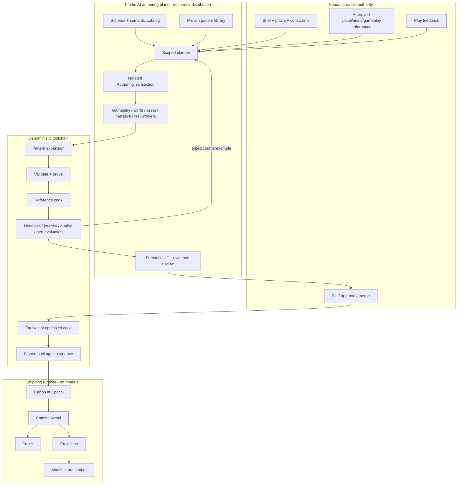
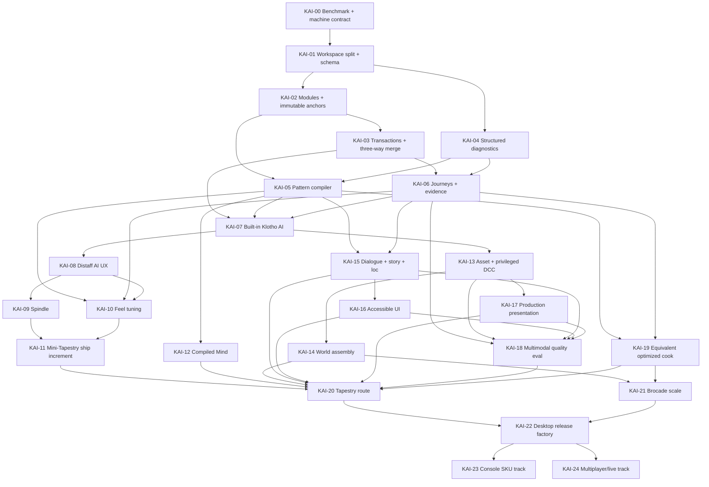

# Klotho: AI-Native End-to-End Production for the First AAA Title

| Field | Value |
| --- | --- |
| Document | High-Level Design — AI-native production for Klotho's first AAA title |
| Author | Gal Katz |
| Date | 2026-09-14 |
| Status | Active successor plan (KAI-00–22 landed; KAI-23–24 not landed) |
| Baseline | `docs/hld.md` rev 6; AAA-01–27 landed |
| Audience | Engine, tools, gameplay, content, AI platform, build, QA, and production leads |
| Language | Rust (edition 2024; 2021-compatible crates OK) |

This document specifies the next Klotho architecture after AAA-27. It does not
replace the landed runtime law in `docs/hld.md`. Until a KAI decision lands,
the current HLD and `AGENTS.md` win.

The problem is no longer whether Klotho can run a contemporary game. The landed
engine has the kernel, physics, streaming, presentation, networking, editor
boundary, cook farm, saves, epochs, and proving slices. The problem is that
making a game still requires people to translate design intent into RON/kdown,
Rite graphs, Laws, bindings, DCC exports, fixtures, and integration code by hand.
That translation cost makes Klotho AI-compatible, not AI-native.

The successor goal is:

> A small team expresses a game through goals, references, constraints,
> examples, and play feedback inside Klotho. Klotho's built-in AI subsystem
> understands the project, assembles and repairs typed artifacts, drives its
> tools, and presents playable evidence for human approval. The shipped game
> gives up no deterministic or performance guarantees.

“Minimal code” means title teams normally author no Rust and rarely inspect the
expanded IR. It does not mean prompt text becomes runtime truth, an agent may
write Projection, or generated behavior bypasses `CommitKernel`.

---

## Executive summary

The next product is **Klotho as one AI-native game engine**. Its editor/dev
distribution gains a first-class AI authoring plane alongside the semantic
kernel, Weaver, Distaff, runtime preview, and proving tools. A generic coding
agent is not the product and is not required. Model execution may be local or
remote, but Klotho owns project understanding, context construction, planning,
tools, transactions, evaluation, repair, provenance, and review.

1. `klotho-ai` becomes an engine subsystem and Distaff becomes its
   conversational, visual workbench. A request produces a
   typed, reviewable authoring change set rather than an unstructured source
   patch.
2. `IntentDoc` becomes modular and gains deterministic, parameterized patterns.
   Common gameplay is assembled from proven patterns and specialized at cook;
   it is not generated as bespoke Rust.
3. Every request carries an acceptance contract: semantic invariants, playable
   journeys, visual/audio references, accessibility requirements, and budgets.
4. Agents work in isolated authoring transactions with least-privilege tools.
   Compiler diagnostics and evidence drive bounded repair loops. Humans Pin or
   reject the result.
5. Weaver becomes a multimodal asset pipeline with provenance, semantic hull
   separation, DCC round-trip, automatic LOD/rig/material checks, and quality
   comparison against approved references.
6. The cook performs whole-title specialization: predicate folding, Rite
   specialization, packed tables, batching, streaming layout, and permutation
   pruning. The optimized build must be Trace-equivalent to the reference cook.
7. Automated players and critics evaluate headless behavior, journeys, pixels,
   animation, audio, localization, accessibility, performance, memory,
   streaming, saves, and package integrity. Model opinions never replace hard
   gates.
8. Shipping closes the deferred first-title surfaces: production dialogue and
   localization, accessible UI, GPU VFX, scalable geometry, title-scale world
   assembly, desktop packaging, crash/replay evidence, and bounded live epoch
   operations. Console adapters remain proprietary platform work, with the
   landed HAL boundary unchanged.

AI is therefore in Klotho, but it is not given authority over Klotho. No model
runs on the authoritative tick. The default final game executable strips the
authoring AI graph and remains the same Canon + Intent + Trace + Projection
machine described by the current HLD. A title that deliberately enables runtime
Infer still uses the existing isolated `InferIntent` boundary.

---

## Baseline and diagnosis

### What AAA-01–27 solved

The baseline already provides the architectural floor this plan depends on:

- four categories and K21 atomic admission;
- integer authoritative pose and deterministic ordering;
- scalar authoritative Phys, parallel proposal, SimLod, and Place residency;
- sharded CAS/warp cooking, glTF ingestion, provenance, and epoch packs;
- PBR presentation, skinned animation, spatial audio, HUD, and cinematics;
- Distaff's Pin boundary and Manifest-only viewport;
- exact saves, replay evidence, dedicated networking, and bounded rewind;
- a process boundary for optional runtime Infer;
- Hearth, Ash, Ember, Drift, Chorus, and Netlock regression slices.

Those are retained. This plan does not reopen the ontology, add a second world,
or turn Infer into the game.

### Why the current system is still hard to build with AI

The repository makes the remaining gap concrete:

| Surface | Landed behavior | AI-production gap |
| --- | --- | --- |
| Authoring IR | Canonical RON; partial kdown sugar | Models must know low-level enum shapes and hand-coordinate many files |
| Distaff | Headless document/session model with outliner, Pin, cook, and preview boundaries | No conversational change planning, semantic diff, branchable transaction, or evidence review loop |
| Canon/Rites | Strong validator and bounded VM | No reusable, typed title-pattern library or example-driven assembly |
| Mind | KAI-12 compiled hash-interned operators, integer utilities, relation targets, Beat clocks, and a table-only Far lane | Production dialogue is compiled in KAI-15; runtime Infer fill stays research |
| Infer | Safe OS-process protocol; placeholder behavior; runtime default-off | It is the wrong surface for authoring and cannot produce project artifacts |
| DCC/cook | KAI-13 typed asset requests, signed privileged-worker registry, semantic/visual split, release-rights gates, quarantine, and pinned DCC/color/interchange locks | Multimodal reference-quality scoring and advisory repair remain KAI-18 scope |
| Tests | Strong subsystem goldens | No title journey graph, visual-quality rubric, automated play exploration, or release evidence roll-up |
| Build | Incremental cook and large logical fixture | No whole-title specialization, budget-guided content reduction, package/SKU matrix, or one-command candidate build |

A general coding agent can edit these files today, but it must rediscover the
architecture, invent glue, interpret text diagnostics, run tools ad hoc, and ask
a human to judge an unstructured patch. That is precisely the expensive loop
the engine should absorb.

### Product thesis

Klotho's semantics are an advantage for AI only when exposed as a closed,
inspectable action space. Models are effective at proposing within typed
choices, comparing outcomes, and repairing from structured counterexamples.
They are unreliable as an unbounded runtime or as the sole judge of quality.

Therefore:

```text
human goal + references + constraints
              ↓
typed authoring change set
              ↓
validate → expand → prove → cook → simulate → present → measure
              ↑                                      ↓
       bounded repair from structured evidence ← failures/diffs
              ↓
          human Pin / merge
              ↓
optimized model-free ship build
```

The authoring loop is probabilistic. Every accepted artifact and every shipped
runtime behavior is explicit, versioned, bounded, and reproducible.

---

## Measurable definition of “AI-native AAA”

These are release gates, not aspirations. No latency number is enforceable until
KAI-00 checks in the exact benchmark corpus, machine manifests, farm topology,
model/backend lock, cache state, and timing harness described below. Queueing,
model execution, tool execution, and engine repair all count. Human decision
time is measured separately rather than subtracted invisibly.

### Minimal-code gates

| Gate | Target | Evidence set |
| --- | --- | --- |
| Engine-native workflow | **100%** of benchmark requests originate, execute, and reach review through Distaff + `KlothoAi`; no generic repository agent or shell workflow is required | Locked KAI benchmark |
| First playable | Approved title brief to controller-playable single-Place greybox in **≤ 4 hours p50 / 8 hours p95** | Cold Mini-Tapestry tasks |
| Common mechanic | Request to evidence-complete candidate in **≤ 15 min p50 / 45 min p95** | Mechanic corpus, by difficulty stratum |
| Content iteration | Dialogue/quest/encounter/world-dressing request in **≤ 10 min p50 / 30 min p95** when no new final asset is required | Content corpus, by difficulty stratum |
| Art cold start | Approved request + references to validated review candidate in **≤ 60 min p50 / 4 h p95** for bounded non-hero props; human approval time reported separately; hero assets have quality gates, not a speed target | 50-task asset corpus |
| Pattern capability coverage | **≥ 80%** of held-out common first-title tasks finish without an `ExtensionRFC`; report simple/composed/novel strata separately | Outcome ledger |
| Title-code escape rate | **0 title Rust** for Spindle and Mini-Tapestry; every later Rust change is attached to one benchmark outcome and approved `ExtensionRFC` | Outcome ledger + RFCs |
| Engineer burden | **≤ 2 engineer-hours p50 / 8 hours p95** for accepted non-novel tasks, including repair and review | Time ledger |
| Repair autonomy | **≥ 85%** of seeded validation failures repaired within three bounded attempts without human file edits, by failure class | Fault corpus |
| Regression containment | **100%** of accepted changes carry an acceptance contract and evidence bundle | Merge gate |
| Reproducibility | Same accepted authoring tree + toolchain lock yields the same expanded IR, Canon hash, CAS ids, and headless Trace hashes | Linux/macOS/Windows CI where K44 permits |

One benchmark request maps to one immutable `OutcomeId`, regardless of how many
operations, files, retries, or commits implement it. Splitting operations cannot
improve capability coverage or code-escape metrics. Generated title-specific
Rust counts as an extension. Compiler output from checked-in typed IR does not.
Novel tasks are not hidden: they are reported as their own stratum and are
expected to exercise K78 rather than make a false universal zero-code claim.

### Runtime and iteration gates

| Quantity | First-title target |
| --- | --- |
| Authoritative simulation | Existing `RuntimeProfile::AaaAdventure`: 30 Hz; ≤ 21 ms critical path; ≤ 8 ms serial admit |
| Presentation | 60–120 Hz; ≤ 11 ms GPU at 1080p High on the reference desktop |
| AI/runtime tax in ship build | **0 threads, 0 model weights, 0 network calls, 0 reflection tables required only for authoring** |
| Optimizer correctness | Every enabled pass has local equivalence/property tests; the locked replay, journey, and fuzz corpora produce identical admitted Trace under reference and optimized cooks |
| Optimizer value | Optimized cook must meet the title's actual sim, frame, memory, streaming, package, and cook-latency budgets; pass-level reduction ratios are diagnostics, not arbitrary release gates |
| Edit diagnostics | < 2 s for schema/local validation; < 5 s semantic recook when no DCC or Place shard changed |
| Play preview | < 30 s warm / < 90 s cold from accepted semantic edit to running local Place |
| Dirty Place | Existing < 60 s gate; target < 20 s p50 on farm cache hit |
| Release evaluation | Latency SLOs are derived from the pinned farm manifest; required coverage may not be dropped to hit an elapsed-time target |

### Locked benchmark contract

KAI-00 creates and protects these versioned inputs:

```text
benchmarks/kai/v1/public/              # 70% visible development corpus
benchmarks/kai/v1/held-out.hashes      # 30% release corpus; prompts escrowed
benchmarks/kai/v1/difficulty.ron       # simple / composed / novel labels
benchmarks/kai/v1/assets/              # 50 bounded asset outcomes
benchmarks/kai/v1/faults/              # repair corpus by diagnostic class
benchmarks/kai/v1/timing.ron           # start/stop and cache rules
ci/machines/kai-dev-a.ron              # exact CPU/RAM/storage/OS/power image
ci/machines/kai-gpu-a.ron              # exact GPU/driver/display configuration
ci/farms/kai-farm-a.ron                # worker counts, queues, storage, network
models/kai-benchmark.lock               # backend/model hash, sampling, context, tools
```

Machine manifests record manufacturer/model, CPU stepping/microcode and enabled
cores, RAM size/speed, storage model/firmware/filesystem, GPU/VBIOS/driver/API,
OS image/kernel, compiler/toolchain, display resolution/refresh/VRR, controller
and polling rate, power governor, thermal precondition, and benchmark process
affinity. Farm manifests record each worker class/count, maximum concurrency,
queue policy, CAS/cache topology, storage and network bandwidth/latency, retry
policy, and exclusive/shared scheduling. SKU manifests pin at least
`win-d3d12-high`, `linux-vulkan-high`, `mac-metal-high`, and the title's minimum
desktop tier with exact resolution/quality settings. Missing fields make the
lane invalid rather than “best effort.”

The full corpus contains 100 mechanic, 200 content, and 50 asset outcomes. The
mechanic/content sets are stratified as
40% simple standard-pattern use, 40% composed cross-domain work, and 20% novel
requests expected to reveal missing primitives. Seventy percent is public and
thirty percent is held out with the same task/stratum proportions. The held-out
split is administered by a benchmark owner who does not implement the agent
policy. Prompt hashes are published; prompts are revealed only to the release
runner, then added to the public corpus when a new major corpus is cut. Asset
tasks separately cover retrieval, generated non-hero prop, material/LOD/rig
repair, semantic-geometry classification, vendor drop, and hero-asset review;
hero tasks measure defect discovery and review quality rather than generation
speed.

Timing starts when a request is submitted and stops when an evidence-complete
candidate enters review. The primary wall clock never pauses: backend queue,
retries, DCC jobs, downloads, cook, evaluation, and clarification delay count.
Benchmark tasks define the only permitted clarification questions and fixed
harness answers, returned after the latency in `timing.ron`; an unlisted required
clarification fails the trial. Results separately report engine-active time,
backend queue/execution, farm execution, clarification, later human review,
tokens/cost, cache hit rate, and failures. Cold means an empty derived cache with
approved source assets already present; warm means only the declared cache
manifest.

Every run records the hashes above. A result without those hashes is telemetry,
not evidence. Hardware or model changes create a new benchmark lane and cannot
silently replace the release baseline. KAI-00 must populate the manifests with
machines the project actually owns; until then all wall-clock targets are
provisional and cannot block or green a milestone.

Each `OutcomeId` has fixed input, allowed clarification answers, acceptance
contract, maximum scope, difficulty, and success/failure result. Timeout,
provider refusal, invalid output, human takeover, and exhausted repair are
failures—not omitted samples. The release runner executes at least five trials
per public task and three per held-out task in a predeclared order; reports all
trials and may not select the best trial. Corpus edits require a major
version, migration note, and side-by-side old/new result. The benchmark owner,
not the implementation team or model, assigns strata and approves exclusions.

### Quality gates

“AAA quality” is not a scalar model score. It is a signed set of contracts and
comparisons:

- no placeholder asset, debug material, T-pose fallback, synthetic voice, or
  untranslated shipping string in a release package unless explicitly waived;
- all gameplay-visible contacts use canonical hulls; generated visual geometry
  never silently changes collision or navigation;
- every hero asset has approved references, topology/material/rig budgets,
  target-platform captures, and provenance/license coverage;
- every critical journey has semantic assertions, playable replay, camera
  captures, audio capture, save/resume coverage, and accessibility variants;
- animation foot-slide, penetration, pose discontinuity, camera occlusion,
  subtitle timing, loudness, streaming pop, and frame pacing have numeric gates;
- human art/design/audio owners approve taste. Models may rank and explain; they
  may not self-certify a release asset.

### End-to-end scope

The plan covers the entire first-title path:

| Stage | Required product surface |
| --- | --- |
| Concept | Brief, pillars, reference boards, scope/budget model, risk register |
| Preproduction | Greybox, mechanic patterns, camera, input, representative journey |
| Production | Places, quests, encounters, combat, animation, assets, VFX, audio, dialogue, UI |
| Content scale | Modular authoring, dependency-aware parallel generation, review queues, provenance |
| Polish | Automated play, visual/audio/animation critics, performance and accessibility gates |
| Localization | String identity, context, pseudo-locales, VO/subtitle timing, font/layout checks |
| Platform services | Achievements, cloud-save conflict/recovery, controller/device matrix, privacy/consent, crash reporting, storefront presence |
| Compliance | Age-rating evidence/content declarations, accessibility evidence including applicable CVAA review, licenses, third-party notices, privacy/security review |
| Ship | Deterministic cook, Windows/Linux/macOS packages, saves/migration, crash/replay bundle, symbols, signed evidence, installer/update/rollback |
| Operate | Support diagnostics, telemetry-derived proposals, human-approved DLC/epoch packs, staged rollout and rollback; no live self-modifying Canon |

This HLD's release-blocking meaning of end to end is the frozen desktop
single-player first title. Console certification and multiplayer/live service
are separately specified post-title tracks in KAI-23/24: public code can define
their contracts and evidence, while proprietary adapters and certification
records live in access-controlled workspaces. The document does not call those
SKUs shipped until that confidential work passes.

### Program capacity, cost, and stop/go contract

The KAI numbers are merge units, not a staffing estimate or calendar. KAI-00
must check in `planning/kai-program.ron` before KAI-01 starts. For every KAI PR
and proving production it records:

- accountable owner and required engineering, design, art, animation, audio,
  writing, QA, security, legal, release, and platform roles;
- estimated and available FTE-weeks per role, reviewer hours per week, critical
  path, dependencies, and contingency;
- model/token, GPU/CPU farm, storage/egress, DCC/license, vendor, device-lab,
  devkit, localization, certification, and support cost envelopes;
- expected benchmark volume, evidence volume, queue service rate, and maximum
  acceptable review backlog; and
- estimate basis, confidence range, actual spend, actual throughput, and
  reforecast trigger.

The plan is invalid if a required role has no named capacity, if modeled arrival
rate exceeds measured review or farm service rate, or if the critical path fits
only by assuming perfect parallelism. Dollar rates and compensation remain in an
access-controlled overlay, but the public plan retains role-weeks, machine-hours,
licensed-seat counts, queue capacities, and redacted totals/ranges so feasibility
can still be reviewed.

Funding and scope are approved in four waves:

| Wave | Work | Entry | Stop/go exit |
| --- | --- | --- | --- |
| Foundation | KAI-00–06 | approved capacity and benchmark charter | typed change → evidence loop works without a model; actual throughput and cost reforecasted |
| First value | KAI-07–11 | Foundation exit funded | Spindle and installable Mini-Tapestry pass; zero-title-Rust and reviewer-load claims measured |
| Production systems | KAI-12–19 | Mini-Tapestry retained and supported; title budget approved | each domain passes its own fixture; hero route and fallback staffed; Tapestry fan-in forecast remains within capacity |
| Title scale/release | KAI-20–22 | production-system exits and reforecast approved | Tapestry, Brocade, and desktop release gates pass |

KAI-23 and KAI-24 are separately funded programs, not tail items implicitly
covered by the first-title estimate. A failed stop/go gate produces a scope,
staffing, vendor, or architecture decision; it cannot be waived by renaming the
next PR. The program dashboard reports forecast versus actual FTE-weeks, cost,
farm utilization, model spend, review age, defect escape, and benchmark yield.

### Evidence and claim levels

Every platform or service statement uses exactly one level:

| Level | What may be claimed | Required evidence |
| --- | --- | --- |
| **P0 public boundary** | public interfaces, deterministic fixtures, mocks, protocol/conformance tests | reproducible public CI and artifacts available from the public tree |
| **P1 confidential validation** | a proprietary adapter or service passed on named internal hardware/environment | signed unredacted evidence in the access-controlled workspace plus a public redacted evidence id; authorized auditors can resolve the id |
| **P2 external acceptance** | a console SKU, rating, store submission, security review, or service certification was accepted | holder/regulator/vendor acceptance record bound to the exact package and P1 evidence |

“Console-ready,” “multiplayer production-ready,” and “certified” are forbidden
without their declared level and target. Public multiplayer correctness,
determinism, network-emulation, replay, and failure fixtures remain P0 wherever
no NDA prevents them. Credentials, proprietary SDK code, exploit details,
moderation cases, private player data, and holder records stay P1/P2. Redaction
may hide protected contents, never the evidence level, target, date, package
hash, responsible owner, expiry, or pass/fail state.

---

## Goals

- Make a bounded first-title vertical slice possible without handwritten title
  code, while keeping the same `CommitKernel` binary used by all proving slices.
- Turn natural language, images, video, audio, examples, and play feedback into
  typed proposals that humans can inspect at the level of game meaning.
- Make common action-adventure mechanics composable from proven semantic
  patterns that compile to existing Laws, Rites, Beats, Canon facts, and Intents.
- Provide agents a complete, versioned, machine-readable description of the
  legal authoring surface, project state, diagnostics, costs, and evidence.
- Make each accepted change reproducible and attributable: request, model/tool
  versions, source inputs, generated artifacts, repairs, approvals, and outputs.
- Close the production gaps for dialogue, localization, accessibility, world
  assembly, GPU VFX, scalable geometry, package variants, and release evidence.
- Improve runtime performance through ahead-of-time specialization and content
  layout, never by moving models or dynamic reflection onto the frame path.
- Preserve expert escape hatches without making them the normal title workflow.

## Non-goals

- Prompt text is not Canon, an Intent, or a new fifth runtime category.
- A model does not commit, mutate `World`, mint `PlayerIntent`, approve its own
  provenance, push to main, publish a build, or deploy an epoch.
- No autonomous live game director may add Laws or invent facts at runtime.
- No neural renderer, learned physics, LLM dialogue, or generated script is
  required in a shipping process. Runtime Infer remains optional and default-off.
- No general-purpose visual scripting VM, arbitrary WASM gameplay, or Blueprint
  clone. Patterns expand to the bounded existing language.
- No promise that one prompt creates a finished AAA title. The unit of work is a
  reviewable change with evidence; AAA remains iterative creative production.
- No attempt to replace specialist judgment in art direction, combat feel,
  writing, performance, accessibility, legal review, or release approval.
- No relaxation of K20, K21, K22, K25, the crate graph, or unsafe allowlist.
- No growth of Hearth, Ash, Ember, Drift, Chorus, or Netlock into title content.

---

## Key decisions

The numbered decisions continue after the current HLD's K58.

| # | Decision | Rationale |
| --- | --- | --- |
| **K59** | **AI is a first-class Klotho engine subsystem, not a runtime category.** `klotho-ai`, Distaff, Weaver, the semantic index, agent scheduler, model router, tool registry, transactions, and evaluation broker ship together in the editor/dev distribution. Model requests, plans, critiques, and transcripts are tooling records; accepted results cook to existing Canon/seed/Manifest artifacts. | Makes AI intrinsic to Klotho without creating a fifth authoritative category. |
| **K60** | **Natural language is a request, never source of truth.** Distaff compiles it into a typed `AuthorChangeSet` against a base project hash. Humans approve the semantic diff and Pin facts. | A prompt cannot be replayed, reviewed, or merged with sufficient precision. |
| **K61** | **Agents mutate only isolated authoring transactions.** Each transaction has a base hash, declared scope, tool capabilities, file/asset budget, wall-clock budget, and attempt cap. It cannot write main, release storage, credentials, or a live epoch. | Makes autonomy safe and reviewable. |
| **K62** | **The schema catalog is generated from code and Canon, not maintained as prose.** Stable ids, types, ranges, affordances, predicates, Rite ops, patterns, diagnostics, budgets, and examples are exported in a versioned machine format. | Agents fail when the actual action space is hidden or stale. |
| **K63** | **Patterns are deterministic authoring macros, not runtime objects.** A parameterized pattern expands to ordinary `IntentDoc` modules, Laws, Rites, Beats, seed facts, bindings, journeys, and required evidence. Expansion is pure and hashable. | Delivers low-code reuse without adding a gameplay VM or component ontology. |
| **K64** | **Patterns are capability-composed, not genre inheritance.** Examples include lockable passage, melee exchange, patrol/investigate, quest handoff, checkpoint, conversation, encounter wave, camera volume, and accessibility prompt. Each declares required/granted affordances and conflicts. | Avoids `ActionAdventureActor` and deep prefab inheritance. |
| **K65** | **Authoring changes are semantic operations.** Add/remove/rename locus, instantiate pattern, set parameter, bind asset, add journey assertion, and replace approved reference are first-class operations. Raw text edits are an engine-extension escape hatch and receive stronger review. | Stable operations merge and repair better than line patches. |
| **K66** | **Every request starts with an acceptance contract.** The contract combines hard invariants, journeys, quality references, platform budgets, and allowed change scope. Missing acceptance is a planning failure, not a reason to generate. | “Looks good” and “works” must be made testable before synthesis. |
| **K67** | **Evidence is produced by trusted tools.** Agents may choose tests and explain results, but hashes, traces, screenshots, frame captures, audio metrics, provenance coverage, and package manifests come directly from engine tools and are signed into an `EvidenceBundle`. | A model must not claim that a test passed. |
| **K68** | **Repair is counterexample-driven and bounded.** A failed gate returns typed blame, anchors, minimal witness, and suggested legal operations. Default is three repair rounds per stage. Scope expansion requires human approval. | Prevents endless loops and unrelated “fixes.” |
| **K69** | **Reference and optimized cooks coexist.** The reference cook is simple and auditable. The optimized cook may fold, pack, batch, prune, and reorder only under proven equivalence rules. Journey/fuzz Trace equality is the merge gate. | Maximum runtime performance without trusting opaque generated code. |
| **K70** | **AI ships with the Klotho editor, not implicitly with every game.** Authoring providers, embeddings, semantic indexes, prompts, transcripts, and critic weights are excluded from the default game package by allowlist. A title may separately opt into the existing runtime Infer boundary. | Klotho is AI-native while game performance, privacy, offline play, certification, and reproducibility remain controlled. |
| **K71** | **Generated assets enter through typed requests and validators.** An `AssetRequest` declares role, semantic tag, references, dimensions, topology/rig/material/LOD budgets, variants, licenses, and platform tiers. Output is untrusted DCC input until cooked and approved. | A text-to-3D blob is not a shippable asset contract. |
| **K72** | **Semantic geometry is separately approved.** Hulls, sockets, traversal markers, hit volumes, occluders used by Laws, and nav cells cannot be inferred from final visual geometry during a release cook. Generation may propose them; a Pin and gameplay tests make them real. | Prevents visual regeneration from changing authoritative behavior. |
| **K73** | **Quality evaluation is plural.** Numeric validators gate objective failures; deterministic journeys gate behavior; reference comparisons find regressions; model critics provide advisory ranked findings; named humans own final taste approval. | No single metric or model represents AAA quality. |
| **K74** | **Automated players use the public input path only.** Exploration, fuzz, and journey agents choose bounded device actions. A trusted test input adapter—not the model—creates test `PlayerIntent` with explicit harness Agency. They never write Projection or privileged debug facts. Successful runs are serialized as ordinary input/Intent scripts. | Tests the product path without giving a model Agency. |
| **K75** | **World generation is hierarchical authoring expansion.** A world plan expands into Places, semantic anchors, traversal graph, encounter/quest beats, dressing requests, and streaming budgets. Chosen placement is content-addressed and fully materialized before ship. | Enables scale without a procedural second world at runtime. |
| **K76** | **Title dialogue is compiled content.** Branching, conditions, localization keys, subtitle/VO timing, and cinematic Beats compile to existing predicates, Rites, Knows, and Manifest cues. Generative runtime dialogue is optional Infer research and not a first-title dependency. | Writers can use AI while shipped narrative remains reviewable and localizable. |
| **K77** | **Observability is privacy-bounded.** Studio prompts and assets are local by default. Remote providers receive only declared inputs. Player telemetry is aggregated/redacted before it can become an authoring suggestion and never directly changes Canon. | Protects IP, personal data, and live integrity. |
| **K78** | **Engine extension is explicit debt.** If no pattern can express a request, Distaff produces an `ExtensionRFC` with missing semantic primitive, alternatives, crate-graph impact, determinism risk, performance budget, and proposed proving slice. It does not silently generate a new proposer. | Keeps the ontology coherent while preserving an escape hatch. |
| **K79** | **Parallel agents coordinate through declared artifact ownership and the dependency graph.** No two active transactions own the same semantic anchor. Merge order is deterministic; conflicts are surfaced semantically. | Enables content scale without last-writer-wins corruption. |
| **K80** | **Release authority remains human and separate.** Agent credentials cannot sign provenance waivers, approve quality, merge protected branches, publish packages, or apply epoch packs. | End-to-end automation must not erase accountability. |
| **K81** | **Semantic identity is immutable and independent of names.** Every authoring object has an `AnchorId`; rename changes a label, not identity. Three-way merge uses base/current/proposed values and a checked-in operation conflict matrix. Only disjoint write sets commute. | Makes merge claims precise and prevents rename from invalidating references. |
| **K82** | **External creation tools run through a privileged worker broker.** Title agents never receive a shell. Registered Blender/Maya/Houdini/mocap/encoder workers have pinned executable/container hashes, typed arguments, bounded mounts, resource/network policy, and validated outputs. | Reconciles real DCC automation with least privilege. |
| **K83** | **Editor AI and game shipping are separate Cargo workspaces and products.** `engine/` contains runtime crates and the game package graph; `studio/` contains `klotho-ai`, Distaff, evaluation, provider SDKs, and privileged workers and may depend inward through versioned public crates/artifacts. `engine/` never depends outward. | Rust feature unification is not a sufficient ship firewall. |
| **K84** | **Game feel is typed, tunable, and measured.** Input buffering, coyote/cancel/combo windows, acceleration/easing, camera response, hit-stop, shake, aim assistance, and haptics are Canon/Rite/Motion/Manifest parameters with bounded units, live preview, sweep experiments, and device-latency evidence. | Discrete affordances alone cannot produce action-adventure quality. |
| **K85** | **Bulk review is risk-based, never approval-free.** Changes are classified by semantic blast radius, asset class, novelty, rights, and budget delta. Low-risk homogeneous batches may use sampled human review under an approved policy; critical gameplay, hero assets, semantic geometry, narrative canon, legal waivers, and release actions require item/owner approval. | Makes 10k-change production reviewable without rubber-stamping high-risk work. |
| **K86** | **Materialization stores references, not duplicate content.** Generated dressing resolves to sorted placement records referencing CAS blobs and instancing groups. Place shards deduplicate shared geometry/materials and delta-compress repeated placement fields. | A materialized world need not become hundreds of gigabytes of duplicate DCC data. |
| **K87** | **Automated players have bounded authority.** Scripted journeys and deterministic reachability are hard gates. Search agents may discover and minimize failures, but failure to solve open-ended combat, navigation, or puzzles is advisory unless the acceptance contract names a proven capability envelope. Critical-path completion and feel remain human-owned. | Avoids false release failures while keeping public-input validation. |
| **K88** | **“End to end” is scoped to the frozen first title.** Windows/Linux/macOS single-player action-adventure, platform services, ratings, cloud saves, achievements, updates, and support evidence are release-blocking. Certified console SKUs and multiplayer/live-service production are explicit post-title tracks that retain their landed boundaries and do not block title one. | AAA quality does not imply every genre/service, and the current first-title freeze must remain honest. |
| **K89** | **Far simulation is an explicit observational refinement, not approximate Full simulation.** A Far policy may affect only its declared `FarSafe` facts. Anything that could change a protected gameplay fact, contact, spawn, Rite phase, or cross-Place outcome promotes the locus to Full before the effect is proposed. | Makes LOD equivalence testable and prevents cheap AI from silently changing the game. |
| **K90** | **Planning work and memory have content-independent hard caps.** Compiled Mind programs are hash-interned; Full planning has fixed fact/operator/goal/depth/expansion/scratch limits; Far uses bounded table lookup rather than GOAP search. Overflow produces a diagnostic and no proposal. | Keeps 2k Far actors from creating an unbounded compile-time or runtime planner problem. |
| **K91** | **Risk is assigned by trusted policy, never by the proposing agent.** The risk router uses an exhaustive, versioned allowlist; unknown operations, classifiers, artifacts, or policy versions become R3. Sample selection occurs only after the population is frozen and uses a reviewer-supplied nonce committed to the audit record. | Prevents R0 misclassification, batch shaping, and predictable-sample gaming. |
| **K92** | **Hero-asset parity is an empirical production assumption with a staffed fallback.** Klotho qualifies AI/retrieval routes in a blinded bake-off against a commissioned baseline. Failure increases human/vendor labor and cost; it may not lower the approved quality bar or block the non-AI asset path. | Architecture can enforce quality evidence, but cannot prove that a generator will produce AAA hero work. |
| **K93** | **Claims name their evidence level.** Public boundary conformance, confidential implementation validation, and external platform/service certification are distinct claims. A public interface or redacted hash is never presented as proof that private console or live-service work passed. | Keeps proprietary work possible without making unverifiable public claims. |

### Disposition of the current hard rules

| Existing law | KAI disposition |
| --- | --- |
| Four categories | Kept. Briefs, plans, change sets, patterns, and evidence exist only in the authoring plane. |
| Only `CommitKernel` commits | Kept. “Accept change” is called Pin/merge, not a runtime commit. Automated players use normal intents. |
| World is a view | Kept. Agent inspection uses immutable snapshots and semantic indexes derived from files/snapshots. |
| No `Update()` | Kept. Patterns expand to Laws/Rites/Beats and bounded proposers already owned by engine crates. |
| No `&mut World` in infer | Kept and extended: no authoring agent process links `world/mutate`. |
| Integer commit path | Kept. Generated assets and quality metrics may use floats outside Commit. |
| One RNG | Kept exactly. Engine/compiler/pattern code adds no RNG. Stochastic model backends must materialize candidate output; accepted bytes, not a seed or regeneration procedure, are the input to Klotho. Runtime retains the sole `klotho_core::Rng` and its existing seed law. |
| Crate graph | Kept. New authoring/eval crates sit outside `klotho-sim` and `klotho-commit`. |

---

## Architecture

### Two planes and one ship artifact



The AI authoring plane is part of Klotho, not an external service wrapped around
the repository. It may execute models locally, remotely, or in a mixed setup,
but its engine APIs and records are provider-neutral. Provider APIs do not
appear in `klotho-ir`, `klotho-canon`, `klotho-world`, `klotho-commit`, or game
packages.

### Klotho AI subsystem

`klotho-ai` is the built-in authoring intelligence of the engine:

```rust
pub struct KlothoAi {
    pub catalog: SchemaCatalog,
    pub project: SemanticProjectIndex,
    pub models: ModelRouter,
    pub agents: AgentScheduler,
    pub tools: ToolRegistry,
    pub transactions: TransactionStore,
    pub evaluation: EvaluationBroker,
}

impl KlothoAi {
    pub fn request(&self, request: CreativeRequest) -> RequestId;
    pub fn poll(&self, request: RequestId) -> AiProgress;
    pub fn review(&self, change: ChangeId) -> ReviewPackage;
    pub fn cancel(&self, request: RequestId);
}
```

This is an engine API, not a prompt wrapper. The subsystem owns:

- incremental semantic indexing of modules, Canon, Places, loci, affordances,
  patterns, references, assets, journeys, budgets, history, and evidence;
- context compilation: the smallest authoritative project slice needed for a
  request, with stable anchors and explicit omissions;
- model routing across reasoning, vision, image, geometry, animation, audio,
  speech, critique, and local fallback capabilities;
- dependency-aware multi-agent scheduling and semantic ownership;
- typed Klotho tools, transaction isolation, validation, repair, and evaluation;
- persistent project memory made only of approved decisions, summaries linked
  to exact source hashes, and human feedback—not opaque model memory;
- Distaff progress, intervention, comparison, and approval UX;
- Weaver generation and optimization jobs using the same artifact contracts and
  provenance DAG as human/DCC inputs.

The semantic index has an authoritative structural layer generated from locked
modules/CAS metadata and an optional retrieval layer. Embeddings are disposable
cache entries keyed by `(project_hash, schema_version, chunker_hash,
embedding_backend_hash, model_hash, distance_metric)`. Mixed-key queries are
forbidden; cache mismatch rebuilds rather than migrates silently. Retrieval
results cite exact anchors/source hashes, and validation never trusts vector
similarity. Accepted artifacts make regeneration unnecessary, so a later model
or embedding change cannot alter an already-approved project.

Klotho remains usable with AI disabled. Disabling it removes generation and
agent assistance, not the ability to inspect, edit, cook, run, or ship a project.
This fallback is a resilience property, not the intended production workflow.

### Authoring transaction lifecycle

1. **Understand.** Distaff resolves the user's request against project pillars,
   selected Places/loci, active milestone, schema catalog, budgets, and prior
   approvals. It shows assumptions when ambiguity affects game behavior.
2. **Contract.** It drafts the smallest acceptance contract that demonstrates
   the requested outcome and names non-regression journeys.
3. **Plan.** The planner emits ordered semantic operations, declared artifact
   ownership, expected costs, provider/tool needs, and rollback boundary.
4. **Branch.** Distaff creates an isolated transaction at an exact project hash.
   Agent tools see only allowed paths, snapshots, references, and commands.
5. **Synthesize.** Workers instantiate patterns, edit typed modules, request
   assets, author journeys, or—only after an approved RFC—change engine code.
6. **Repair.** Fast validators run after each operation batch. Typed failures
   carry minimal witnesses into at most three repair attempts per stage.
7. **Evaluate.** The farm produces deterministic, play, quality, budget,
   provenance, and package evidence. Advisory critics may annotate it.
8. **Review.** Distaff presents meaning: “door now requires brass key,” affected
   journeys, before/after captures, costs, risks, and raw expansion on demand.
9. **Accept.** A human Pins facts/assets, approves reference updates, and merges.
   Acceptance records the exact evidence hashes and invalidates stale evidence.
10. **Specialize.** Release cook lowers accepted modules to compact tables and
    verifies behavior against the reference cook.

Transactions are resumable and content-addressed. A model crash, timeout, or
provider switch cannot corrupt the authoring tree. Cancellation drops only the
transaction workspace and cached unapproved artifacts.

### Machine-readable schema catalog

`klotho-schema` exports a versioned catalog generated from the Rust types,
Canon tables, registered patterns, project modules, and toolchain:

```rust
pub struct SchemaCatalog {
    pub version: u32,
    pub toolchain_hash: Hash,
    pub kinds: Vec<TypeSchema>,
    pub verbs: Vec<VerbSchema>,
    pub rels: Vec<RelSchema>,
    pub predicates: Vec<PredSchema>,
    pub rite_ops: Vec<RiteOpSchema>,
    pub affordances: Vec<AffordanceSchema>,
    pub patterns: Vec<PatternSchema>,
    pub diagnostics: Vec<DiagnosticSchema>,
    pub budgets: Vec<BudgetSchema>,
}
```

Every enum discriminant and pattern version is stable and explicit. The catalog
includes positive and negative examples, value ranges, cost models, ownership,
and compatible operations. CI compares exported schemas with golden files, so a
Rust change cannot silently invalidate agent tooling.

The catalog is discovery, not authority. The normal validators and cook remain
the authority.

### Modular Intent and pattern expansion

The monolithic `IntentDoc` becomes a deterministic project of modules:

```rust
pub struct IntentProject {
    pub project: Name,
    pub modules: Vec<IntentModuleRef>, // sorted canonical order
    pub lock: ModuleLock,
}

pub struct IntentModule {
    pub anchor: AnchorId,
    pub id: Name,
    pub version: u32,
    pub imports: Vec<ModuleImport>,
    pub exports: Vec<Name>,
    pub parameters: Vec<ParameterDecl>,
    pub body: IntentDoc,
}

pub struct PatternInstance {
    pub anchor: AnchorId,
    pub instance: Name,
    pub pattern: PatternId,
    pub version: u32,
    pub args: Vec<PatternArg>,
}
```

Rules:

- imports are explicit, locked by content hash, acyclic, and resolved before
  Canon cook;
- expansion is a pure function of locked module bytes and arguments; output
  order is canonical and pattern/compiler code introduces no RNG;
- generated names derive from `(module, instance, local_name)` and never from
  insertion order;
- expansion emits ordinary existing IR plus source spans back to pattern and
  request; there is no pattern representation at runtime;
- patterns cannot emit Rust, register proposers, add RNGs, or bypass validation;
- upgrades are explicit migrations with before/after journey evidence;
- a title may fork a pattern, but the fork becomes a versioned project module
  with ownership and stops receiving implicit upstream changes.

The initial standard library is deliberately small and action-adventure-shaped:

| Family | First patterns |
| --- | --- |
| Traversal | door/key, lever/gate, checkpoint, ladder/ledge contract, streaming threshold |
| Combat | light/heavy exchange, parry window, ranged hit, destructible assembly, encounter boundary |
| AI | patrol/investigate, guard/chase/return, assist ally, flee hazard, conversation availability |
| Quest | acquire/use, escort checkpoints, investigate clues, multi-step handoff, optional objective |
| Narrative | conditional conversation, bark set, cinematic Beat, knowledge reveal, lore entry |
| World | Place shell, traversal graph, encounter pocket, safe hub, dressing zone, audio zone |
| UI/accessibility | Knows-gated prompt, remappable action, subtitle cue, hold/toggle alternative, contrast variant |
| Production | save checkpoint, analytics marker, screenshot marker, journey fixture, performance encounter |

These are patterns over Klotho nouns, not new runtime nouns. If a family needs a
new Law primitive, K78 requires an RFC and proving slice.

### Semantic authoring changes

An agent returns operations, not a replacement project blob:

```rust
pub struct AuthorChangeSet {
    pub id: ChangeId,
    pub base_project_hash: Hash,
    pub request_hash: Hash,
    pub scope: ChangeScope,
    pub ops: Vec<AuthorOp>,
    pub acceptance: AcceptanceContract,
    pub provenance: AuthoringProvenance,
}

pub enum AuthorOp {
    AddModule { module: IntentModule },
    Instantiate { instance: PatternInstance },
    SetArgument { instance: AnchorId, key: Name, value: PatternArg },
    AddLocus { module: AnchorId, anchor: AnchorId, name: Name, kind: LocusKind },
    AddFact { module: AnchorId, fact: AnchoredSeedFact },
    AddCanonDiff { module: AnchorId, diff: CanonDiff },
    BindAsset { locus: AnchorId, request: AssetRequestId },
    AddJourney { journey: JourneySpec },
    AddReference { target: AnchorId, reference: ReferenceId },
    Remove { target: AnchorId, reason: String },
    Rename { target: AnchorId, to: Name },
}
```

`AnchorId` is a 128-bit authoring identity deterministically derived from
`blake3(project_namespace, ChangeId, operation_local_token)` and collision-checked
at transaction creation. It is never derived from a mutable name, list position,
packed runtime index, model output ordering, or another RNG. Expansion derives
child anchors from `(parent AnchorId, pattern-version, local-id)`. Rename changes
only `Name`; old names become scoped aliases for one migration epoch and cannot
be reused ambiguously.

Each operation declares read and write cells `(AnchorId, FieldId)` plus value
preconditions. Three-way merge compares `base`, `current`, and `proposed`:

| Pair | Merge rule |
| --- | --- |
| disjoint write cells | commute; apply in canonical `(AnchorId, FieldId, ChangeId)` order |
| same field, identical value | coalesce and retain both provenance edges |
| same ordered collection | merge by child `AnchorId`; conflicting relative-order constraints reject |
| rename vs field edit | merge; identity is unchanged |
| rename vs rename | conflict unless the new normalized name is identical |
| remove vs any read/write of target or dependent | conflict with dependent witness |
| pattern-version/argument changes from both sides | conflict unless expanded semantic diff is identical |
| asset candidate additions | coexist; approval selects bindings |
| semantic geometry or Canon change | never bulk-automerge across concurrent writers |

Ownership is a renewable lease on anchor subtrees used to avoid predictable
conflicts, not a correctness mechanism. Expiry does not authorize overwriting.
Rebase re-evaluates preconditions and regenerates the semantic diff/evidence;
it never replays raw text patches. Application fails on missing anchors,
dangling imports, unmet preconditions, or conflict-matrix rejection. Deletion
always includes impact analysis and a tombstone until dependent migrations land.

Raw file patches are excluded from `AuthorOp`. Engine work uses the ordinary
review path and must cite an approved `ExtensionRFC`.

### Acceptance contracts and journeys

```rust
pub struct AcceptanceContract {
    pub claims: Vec<SemanticClaim>,
    pub journeys: Vec<JourneyId>,
    pub invariants: Vec<InvariantRef>,
    pub quality: Vec<QualityTarget>,
    pub budgets: Vec<BudgetTarget>,
    pub non_regression: Vec<JourneyId>,
    pub allowed_scope: ChangeScope,
}

pub struct JourneySpec {
    pub id: JourneyId,
    pub start: StartStateRef,
    pub steps: Vec<JourneyStep>,
    pub assertions: Vec<JourneyAssertion>,
    pub capture_points: Vec<CapturePoint>,
    pub max_ticks: u32,
}
```

Journey steps are device actions, trusted pre-authored `PlayerIntent` fixtures,
bounded waits, camera moves, or save/load operations. Assertions query public
semantic facts—Trace events, Qty, Rel, Knows, Place residency, or approved
presentation metrics. A journey cannot set Projection fields, and a model never
receives player Agency or constructs an authenticated `PlayerIntent` packet.

Each generated journey runs in three modes where applicable:

- scripted deterministic replay for exact behavior;
- automated-player execution through the public input path for bounded
  reachability and regression claims declared in the bot capability manifest;
- human play with capture markers for feel/taste review.

The automated player may search in an ephemeral run. Only its reduced legal
input sequence enters the evidence bundle. Failure to discover a solution is not
proof of unreachability and is advisory outside the declared capability
manifest. Critical-path completion, combat feel, puzzle comprehension, and the
full 30-minute route require recorded human play evidence.

### Evidence bundles

```rust
pub struct EvidenceBundle {
    pub change: ChangeId,
    pub project_hash: Hash,
    pub toolchain_hash: Hash,
    pub expanded_ir_hash: Hash,
    pub canon_hash: Hash,
    pub cas_root: Hash,
    pub checks: Vec<CheckEvidence>,
    pub captures: Vec<ArtifactRef>,
    pub approvals: Vec<ApprovalRef>,
}
```

Trusted tools append evidence records; the agent-facing protocol is read-only
for results. Distaff refuses acceptance when evidence was produced against a
different project, toolchain, Canon, reference, or budget profile.

Required layers:

1. schema, syntax, module, and provenance validation;
2. Canon contradiction, predicate bound, Rite CFG, Cap, and agency checks;
3. headless deterministic journeys and affected proving slices;
4. save/load, Place transition, and long-session soak relevant to the change;
5. render, animation, VFX, audio, UI, localization, and accessibility captures;
6. CPU/GPU/memory/IO/network budgets for affected stress scenes;
7. package allowlist, license, secret, model-weight, and debug-asset scans;
8. named human approvals required by asset/change class.

### Structured diagnostics and repair

All authoring tools implement a common diagnostic envelope:

```rust
pub struct Diagnostic {
    pub code: DiagnosticCode,
    pub severity: Severity,
    pub message: String,
    pub primary: AnchorId,
    pub related: Vec<AnchorId>,
    pub witness: Option<Counterexample>,
    pub legal_repairs: Vec<RepairShape>,
    pub cost: Option<EstimatedCost>,
}
```

Examples:

- a contradictory affordance returns the two minimal predicate paths;
- an unreachable journey returns the last reachable semantic state and blocked
  affordance, not a screenful of logs;
- a budget miss returns dominant loci/pattern instances and estimated savings;
- a visual regression returns aligned before/after captures and changed
  Manifest inputs;
- a provenance failure identifies the exact source span and all dependent CAS
  blobs;
- a localization overflow identifies key, locale, widget constraint, and
  screenshot crop.

Diagnostics never include secrets or arbitrary untrusted asset text in model
instructions. External content is escaped and labeled as data.

---

## Built-in AI workers and tool boundaries

### Worker roles

These workers are scheduled by `KlothoAi`; they are not generic repository
agents that users must install and coordinate themselves. Roles are capability
profiles, not separate truths or mandatory model calls. One configured model
can fill several roles; deterministic engine operations remain tools.

| Worker | Reads | May propose | Cannot do |
| --- | --- | --- | --- |
| Planner | brief, schema, semantic index, budgets, prior evidence | acceptance contract, plan, ownership | edit project |
| Gameplay | selected modules/patterns/journeys | semantic `AuthorOp`s | add proposer or Rust |
| World | world graph, Place budgets, references | Place/pattern instances, asset requests | write runtime procedural state |
| Narrative | canon facts, character bible, loc context | dialogue/Beat modules, strings, VO requests | runtime free-form dialogue |
| Asset | typed request, approved references | DCC candidates and metadata | Pin hull/license/quality approval |
| Test | acceptance contract, schema, public input/action model | journeys, fuzz seeds, assertions | mutate Projection or mark pass |
| Optimizer | expanded IR, profiles, traces | optimization plan/cooked layout | change reference semantics |
| Critic | captures, references, numeric reports | advisory findings and ranking | waive a gate or approve itself |

### Tool protocol

Klotho exposes these narrow AI tools through `klotho-ai`; Distaff, headless
automation, and approved plugins call the same structured interface:

```text
project.describe(scope)             -> semantic graph + hashes
schema.query(kind, compatibility)   -> catalog subset
change.create(base, scope, budget)  -> transaction id
change.apply(id, AuthorOp[])        -> new hash + diagnostics
change.diff(id)                     -> semantic diff + impact graph
pattern.search(capabilities)        -> compatible pattern versions
validate.run(id, tier)              -> diagnostics
cook.run(id, profile, reference)    -> artifact hashes + diagnostics
journey.run(id, set, mode)          -> trusted evidence
capture.run(id, markers, sku)       -> trusted visual/audio/frame evidence
asset.request(id, AssetRequest)     -> candidate ids; never approval
evidence.build(id)                  -> immutable bundle
change.submit(id, evidence_hash)    -> human review queue
```

There is no `shell`, arbitrary path read, raw database query, `world.set`,
`trace.append`, `git push`, release upload, or epoch apply in the default agent
profile. An engine developer can deliberately grant a separate coding profile;
that profile is outside the zero-code metric and normal title workflow.

### Privileged worker broker

DCC and media automation is not implemented by granting the model a shell.
`klotho-worker` is a broker in the studio workspace with a registry such as:

```rust
pub struct WorkerSpec {
    pub id: WorkerId,
    pub executable_hash: Hash,
    pub container_or_bundle_hash: Hash,
    pub input_schema: SchemaId,
    pub output_schema: SchemaId,
    pub mounts: Vec<BoundedMount>,
    pub network: NetworkPolicy,
    pub cpu_ms: u64,
    pub memory_bytes: u64,
    pub output_bytes: u64,
}
```

Blender, Maya, Houdini, USD, texture, mocap, lip-sync, audio, and encoder jobs are
registered by tools/platform owners. The AI submits typed job descriptions; the
broker constructs arguments, mounts a transaction-specific input/output area,
runs the pinned worker, validates every artifact, and returns CAS ids plus logs.
No arbitrary executable, argument injection, undeclared file traversal, or
ambient network is allowed. Vendor-native GUI work remains human-operated and
enters through the same validated drop contract.

Schema validation is not the sandbox boundary. Each worker runs as a fresh,
unprivileged OS identity with no inherited credentials, controlling terminal,
home directory, host IPC, device access, or writable path outside its job root.
Linux lanes enforce user/mount/PID/network namespaces, read-only roots, cgroup
limits, and a per-worker seccomp allowlist; Windows lanes enforce an AppContainer
or equivalently restricted token plus Job Object, ACL, network, and process-tree
limits; macOS lanes enforce a signed sandbox profile, per-job container, denied
keychain access, and process/resource limits. Where a DCC cannot run under that
profile, it is human-operated or isolated in a disposable VM runner; weakening
the broker profile is not an automatic fallback.

The broker resolves executable and plug-in hashes from an administrator-signed
registry, builds arguments structurally without shell parsing, rejects links and
path traversal at both input staging and output collection, caps recursive
archive expansion, and validates outputs in a second process with a different
parser identity. Egress is deny-by-default and any approved endpoint is pinned
by worker id and purpose. Security fixtures exercise argument injection,
malicious archives, symlink/hardlink escape, parser bombs, fork/resource bombs,
credential reads, undeclared network, plug-in replacement, and forged output
manifests on every supported worker OS. Registry changes are R3 and require a
security owner.

### Built-in model fabric and provider isolation

Klotho owns the model registry, routing policy, context builder, caching,
budgets, and job lifecycle. Actual model execution sits behind a Klotho-defined
backend: an isolated local worker, a studio-hosted endpoint, or an approved
remote provider. This process/service boundary contains model runtimes; it does
not outsource Klotho's authoring intelligence. Unlike runtime `InferHost`, the
Klotho AI host handles development requests and never links into the game
runtime.

- request/response payloads are size-capped and schema-validated;
- time, token, dollar, tool-call, artifact, and repair budgets are explicit;
- provider/model/version/parameters are recorded, but provider reasoning text
  is not required for reproducibility;
- model output is untrusted and cannot directly become an accepted artifact;
- local-only projects reject remote adapters at the capability layer;
- provider failure leaves a resumable transaction and never blocks manual use;
- credentials stay in the host keychain/secret service and are never included
  in context, logs, evidence, `.warp`, or crash bundles.

The built-in model fabric may use different capabilities for planning, project
understanding, images, meshes, animation, speech, music, critique, and test
exploration. Each output still enters through its typed Klotho domain contract.

---

## Gameplay without title code

### Feel contract and tuning loop

Action quality is not inferred from discrete affordances. Every playable action
has a typed `FeelContract` authored through patterns and Distaff:

```rust
pub struct FeelContract {
    pub input_buffer_ticks: u8,
    pub coyote_ticks: u8,
    pub cancel_windows: Vec<TickWindow>,
    pub combo_windows: Vec<TickWindow>,
    pub accel_curve: QuantizedCurve,
    pub decel_curve: QuantizedCurve,
    pub camera: CameraResponse,
    pub aim_assist: Option<AimAssistContract>,
    pub impact: ImpactPresentation,
    pub haptics: HapticPatternId,
}
```

Commit-visible windows and curves use ticks and frozen integer/fixed-point units.
Camera smoothing, shake, hit-stop imagery, audio sweetening, and haptics are
Manifest presentation. Hit-stop never dilates or pauses the authoritative Tick;
gameplay recovery/stun is an explicit Rite `WAIT`. Accessibility alternatives
are parameters of the same action, not separate hidden scripts.

Authority over displacement remains singular:

- a Law/Rite selects verbs, relations, quantities, timing, or `PHYS_REQ`; it
  does not write pose directly;
- Motion owns unattached actor root displacement; Phys owns rigid/attached
  movement; Space owns remaining kinematic movement under existing K55;
- root-motion samples in a ClipSet are semantic motion artifacts. Changing them
  is not a visual rebake and must rerun Trace/journey evidence;
- skeletal mesh, material, secondary IK, facial pose, cloth, and presentation
  clips with zero root displacement are visual artifacts and must be proven by
  an automatic artifact-class diff before they can take the visual-only path;
- hull, hit volume, socket, traversal marker, root-motion, or nav changes are
  semantic and require Pin plus affected deterministic journeys.

Distaff exposes parameter sweeps and A/B play sessions over immutable candidate
branches. Each candidate records input-to-intent, intent-to-admit, and
input-to-photon latency; frame pacing; action success/failure; cancel use; camera
occlusion; and human ratings. First-title wired-controller gates on the pinned
reference display are: input sample → local presentation response ≤ 25 ms p95,
input sample → authoritative response ≤ one simulation tick plus 8 ms p95, and
no unexplained queue beyond the authored input buffer. Platform/device manifests
may set stricter thresholds. Feel is approved by the combat/camera/design owner;
an optimizer or model may not silently retune it.

### Capability graph as the assembly surface

Patterns declare semantic interfaces:

```text
Pattern lockable_passage
  parameters: passage, key, locked_at_start, consume_key, denied_bark
  requires: passage grants Openable; key grants Carryable
  grants: passage Lockable; journey hooks unlocked/opened/denied
  conflicts: passage Driveable
  expands: Canon affordance + Law + Rite + seed Rel/Qty + three journeys
  budgets: 2 predicates, 6 rite steps, 0 per-tick work when idle
```

The planner solves compatibility against the graph before expansion. A request
like “the observatory opens after Mira decodes all three plates, but companions
may pass once the player has opened it” becomes parameter choices, relations,
knowledge conditions, a Rite, and journeys. The review shows those facts, not
the generated RON unless requested.

### Missing semantic primitive path

When the request cannot be represented, the system stops at an `ExtensionRFC`:

```text
request and minimal counterexample
why existing Law/Rite/Beat/patterns cannot express it
candidate semantic primitive and author-facing meaning
category and crate-graph analysis
determinism, save, replay, net, and performance effects
new caps and structured diagnostics
proving slice (new, bounded; never grow Hearth)
migration and rollback
```

Approval authorizes normal engine implementation. Generated scaffolding may
create tests and boilerplate, but a systems engineer owns the semantic decision.
The new primitive is unavailable to content workers until its schema and slice
land. This is the expected path for genuinely new combat, traversal, physics, or
network semantics. It is counted as a code escape in the novel benchmark stratum;
the HLD claims zero title Rust only for Spindle and Mini-Tapestry, not for every
future mechanic an AAA team may invent.

### AI behavior and encounter direction

KAI completes the landed-but-shallow Mind surface with compiled authoring data:

- GOAP operators are cooked from affordance preconditions/effects and costs;
- utility curves and goal selection are bounded integer tables;
- short-term memory consists only of explicit Projection/Knows/Trace-derived
  facts; planner scratch is disposable each call;
- squads are Chorus/Beat coordination over relations and Intents, not a hidden
  blackboard world;
- encounter direction is a deterministic Beat/Law policy over visible facts;
- authored barks and dialogue are selected from compiled candidates;
- Far LOD uses a bounded compiled policy under the refinement contract below;
- learned policies remain Infer-class and may only return `InferIntent` under
  the existing stale/agency restrictions. They are not a first-title blocker.

The hardcoded `match goal` in `klotho-mind` is removed. Mind still holds no
mutable tick state and emits proposals only.

#### Full/Far refinement and planner bounds

LOD correctness is defined over the existing Projection, not by visual or
trajectory similarity. Each compiled Mind program declares `FarSafe`, a closed
set of facts whose values Far may propose. The following are always protected
and can never be `FarSafe`: authoritative `Qty`, `Rel`, or `Knows` used by a Law,
Rite, quest, save, achievement, critical journey, or cross-Place predicate;
Rite phase/timing; damage, inventory, ownership, hostility, death, spawn/despawn,
checkpoint, or encounter completion; residency transfer; and any Phys contact,
hull, hit volume, socket, traversal, nav, or player-visible interaction state.
The compiler computes this transitive protected set from predicate/effect and
impact graphs. An unresolved dependency is protected.

For protected anchor set `P`, `alpha_P(Projection_t)` is the canonical sorted
tuple `(AnchorId, existence, Place, value)` for every member of `P` at Tick `t`,
including explicit absence/tombstone. Given the same Canon and Intent prefix,
the all-Full reference run `F` and any legal mixed-LOD run `M` must satisfy
`alpha_P(F_t) == alpha_P(M_t)` at every declared synchronization tick and at the
ticks immediately before and after every promotion. Their admitted Trace
subsequences whose effects reach `P` must also be byte-identical.

Between synchronization ticks, a Far proposer may propose effects only for
`FarSafe` anchors. Before an actor could observe, propose, schedule, or cross a
boundary that affects a protected value, the runtime requests Full residency and
the existing Commit path admits any effect only after the Full snapshot is
available. Time-sensitive protected transitions are either precompiled as the
same tick-exact schedule in both modes or force promotion before their earliest
possible tick. Promotion reconstructs Full scratch solely from Canon plus
Projection; there is no hidden Far memory.

The proof suite runs Full and mixed Full/Far executions from the same Canon and
Intent script, checks protected Projection at every synchronization/promotion
boundary, and requires identical admitted Trace for every protected effect.
Unprotected movement may differ only inside declared integer bounds and must not
alter promotion tick, reachability, contact, or player observation. A compiler
cannot label a fact `FarSafe` merely to make the corpus pass.

Mind has the following initial hard caps, versioned per runtime profile rather
than inferred from content size:

| Resource | Full cap per planning call | Far cap |
| --- | ---: | ---: |
| visible boolean/integer facts | 64 | 16 table inputs |
| compiled operators | 32 | no operators |
| simultaneous candidate goals | 4 | 1 selected table row |
| search depth | 8 | no search |
| expanded nodes | 128 | no search |
| disposable scratch | 64 KiB | 1 KiB |

Programs are normalized, content-hashed, and stored once; actors reference a
`MindProgramId` plus bounded inputs rather than receiving expanded copies.
Compilation rejects an over-cap program with source anchors and suggested
partitions. Runtime cap exhaustion emits no intent and a structured diagnostic;
it never widens a cap, allocates proportionally to world population, or falls
back to model inference. The Chorus scale gate measures compile bytes/time,
unique program count, resident bytes, and p50/p95/p99 planning time for 2k Far +
200 Full actors. The Far lane is O(actor count) bounded table evaluation, not
2k independent GOAP searches.

---

## Multimodal content and quality pipeline

### Title brief and style constitution

Distaff stores two authoring documents outside the runtime categories:

- the **title brief**: audience, fantasy, pillars, anti-pillars, scope, rating,
  platforms, runtime profile, input assumptions, content boundaries, milestones;
- the **style constitution**: approved reference ids plus measurable visual,
  animation, camera, writing, audio, UI, and accessibility rules.

These constrain generation and evaluation but never execute in the game. Each
rule names its owner, strength (`must`, `target`, `advisory`), measurement, and
waiver authority. References are stored or linked by content hash with rights
metadata; a URL alone is not stable provenance.

### Asset requests

```rust
pub struct AssetRequest {
    pub id: AssetRequestId,
    pub role: AssetRole,
    pub semantic_tag: Name,
    pub references: Vec<ReferenceId>,
    pub dimensions_mm: BoundsMm,
    pub visual_budget: VisualBudget,
    pub material_budget: MaterialBudget,
    pub rig: Option<RigContract>,
    pub lods: LodContract,
    pub collision: CollisionRequest,
    pub variants: u16,
    pub platform_tiers: Vec<GpuTier>,
    pub license_policy: LicensePolicy,
}
```

Candidate generation may call procedural tools, local models, remote models,
library retrieval, Houdini/Blender/Maya workers, mocap processing, or human
vendors. Every route produces source hashes and license spans.

The project lock pins interchange and color contracts (`glTF`, USD, MaterialX,
OpenColorIO), DCC application/plugin versions, skeleton/retarget versions,
texture encoders, audio session/export versions, and platform compression tools.
Version changes are explicit migrations with a representative recook/capture
set. Klotho does not claim that “USD” or “FBX” alone is a reproducible pipeline.

Candidate gates include:

- file/header/cap validation before decoder use;
- scale, axes, pivots, sockets, watertightness where required, UV/material slot,
  texture resolution, shader feature, triangle/cluster, bone/influence, clip,
  and LOD budgets;
- reference-view renders under fixed neutral and title lighting;
- silhouette, palette, material response, and temporal stability comparisons;
- rig deformation, retarget, foot slide, root-motion, and contact tests;
- platform memory and GPU cost estimates, followed by measured stress capture;
- provenance reachability and exportability.

Models may repair candidates within the request budget. A named owner approves
hero/final assets. Approved visual CAS blobs can hot-swap. Any collision, socket,
hit-volume, traversal, or occlusion change requires semantic review and Pin.

Hero production is not predicated on a model reaching parity. Before production
systems receive full funding, the art director runs a blinded qualification on
a checked-in representative set: principal character, signature outfit/weapon,
hero environment kit, facial/rig deformation case, and damaged/variant case.
For each brief, at least one candidate uses the proposed AI/retrieval route and
one uses a commissioned human/vendor baseline under the same references, target
SKUs, time accounting, and rights requirements. Reviewers do not see the route.
The evidence records acceptance, ranked defects, hands-on rework hours by
discipline, elapsed time, iteration count, topology/UV/material/rig/LOD/facial
fitness, style consistency, measured runtime cost, and provenance/legal result.

The qualification answers a sourcing question; it does not grant permanent
quality credit to a provider. It is repeated when the hero style, provider,
material/rig pipeline, or target tier materially changes. A generated route that
loses the quality/rework gate remains available for ideation or non-hero work
only. The resource plan must carry enough concept, modeling, material, rigging,
animation, technical-art, and vendor capacity to deliver the commissioned route.
Schedule or model failure never permits a lower hero acceptance threshold. Thus
Klotho's asset contract and review system remain valuable even if final hero
assets are entirely human-authored.

Source-control policy is split by artifact class. Text/module/metadata changes
use semantic merge. Binary DCC sources use lock leases with owner, expiry, and
handoff; generated intermediates stay in CAS and are not committed as duplicate
files; large approved sources use content-addressed LFS/object storage with hash
pointers in the project. A vendor drop enters a quarantine namespace and cannot
overwrite an approved binding until validation and acceptance.

Every vendor/outsourcing workspace has a disclosure manifest: organization,
NDA/project partition, permitted references, permitted providers, territories,
retention, subcontracting, export restrictions, and artifact destinations.
Drops may carry partial provenance while under quarantine, but release binding
requires complete origin/license/consent records, contractual representations,
and the project's legal approval. “Provider policy decides” is not a waiver of
training-data, performer, trademark, likeness, or indemnification review.

### World assembly

Title worlds are authored as a graph before detailed dressing:

```text
World plan
  → Place graph and streaming envelopes
  → critical-path and optional journey graph
  → semantic anchors and traversal contracts
  → encounter / quest / cinematic Beats
  → greybox hulls and performance budgets
  → approved visual dressing requests
  → materialized Place shards
```

Generation is coarse-to-fine. Critical traversal and gameplay anchors are
approved before high-cost art. Dressing workers may propose procedural
placement, but the accepted, content-addressed result is materialized into Place
shard inputs; runtime only streams the result. Every Place carries density,
visibility, streaming, nav, Phys, audio, and GPU budgets. The world planner
cannot solve a budget miss by deleting a critical journey anchor.

Materialized dressing is compact: a sorted placement table references shared
CAS mesh/material/foliage/animation blobs; identical bindings are instanced;
repeated transforms and variants are delta/column encoded per Place; cross-Place
assets live once in catalog volumes. Source generation graphs are retained for
recook, but the game package contains only selected placement records and shared
artifacts. Brocade gates unique bytes, reference count, instancing ratio, and
incremental invalidation rather than rewarding a large logical fixture.

The first scale gate is a contiguous 30-minute action-adventure route across
eight Places with a hub, combat pocket, traversal beat, conversation, cinematic,
checkpoint, return shortcut, and optional objective. It is a new Tapestry slice,
not an expansion of Drift.

### Animation, camera, VFX, and audio

- Animation requests bind semantic verbs and Rite timing to clips without using
  notifies as sim inputs. Retarget and motion-quality tests validate the binding.
  Production sets pin skeleton, MotionDb/ClipSet, retarget profile, root-motion,
  additive, facial rig, lip-sync, IK, and LOD contracts across representative
  body types and equipment permutations.
- Camera authoring compiles shot/volume/observer patterns and evaluates framing,
  collision, occlusion, motion sickness limits, cut continuity, and control
  handoff across aspect ratios.
- GPU particles and ribbons extend `klotho-vfx` as Trace/Manifest consumers.
  Gameplay-significant area effects remain hulls/Laws; GPU output is never read
  back.
- Presentation cooking pins USD/glTF, MaterialX (or the selected bounded
  material-graph subset), OpenColorIO, shader compiler, probe/light-bake, texture
  encoder, and scalable-geometry versions. The material graph compiles to
  Manifest shader permutations and is never a gameplay graph.
- Audio requests produce grains, spatial metadata, concurrency, loudness, duck,
  stems, adaptive-music transition rules, lip-sync/facial timing, and
  subtitle/closed-caption cues. Music state follows committed semantic cues; the
  mix renderer and facial detail remain presentation.
- Generated voice/music is development-only unless the license policy, performer
  consent, casting approval, union/territory/reuse requirements, and named audio
  approval permit ship.

### Dialogue, localization, UI, and accessibility

Dialogue modules contain stable line ids, speakers, conditions, knowledge
effects, choices, timing, performance notes, subtitle/CC descriptions, and
approved text/VO bindings. They compile to predicates, Rites/Beats, Knows, and
Sonic/UI Manifest cues.

The writers' room owns a versioned story bible: character facts and voice,
timeline, locations, terminology, secrets by Knows state, themes, content/rating
limits, unresolved questions, and approved exceptions. AI suggestions cite
exact bible anchors. Quest modules expose prerequisites, grants, failure/cancel
paths, mutual exclusions, critical-path membership, and re-entry/save states.
Static graph checks catch impossible prerequisites, orphan objectives, cycles
without an authored escape, continuity contradictions, premature knowledge, and
unreachable endings. Writers review dialogue/quest semantic diffs in narrative
order, not file order; changing canon invalidates dependent lines, quests,
cinematics, localization, VO, and journeys through the impact graph.

Localization is keyed and context-rich from first authoring, not a final export:

- ICU-style message data or an equivalently bounded format; no executable text;
- glossary, character voice, gender/plural/context metadata;
- pseudo-locales, bidirectional text, CJK/complex shaping, font fallback, and
  controller-glyph variants;
- screenshot per key/context and automated clipping/overlap detection;
- subtitle reading speed, duration, safe-area, speaker, SDH cue, and VO alignment;
- human linguistic approval for shipping locales.

UI uses declarative Manifest layout patterns with bounded responsive constraints,
not a mutable widget world. Required first-title accessibility includes full
remapping, hold/toggle alternatives, subtitle/CC controls, text scaling, safe
areas, contrast/color-independent cues, camera shake and motion reduction, and
screen-reader metadata for menu flows where the platform supports it.

### Platform services, compliance, and operation

The first-title desktop package includes typed, testable adapters for:

- achievements derived from committed Trace/Knows facts, with offline queue and
  idempotent platform submission;
- cloud saves with `(canon_hash, epoch, prefix)` validation, device conflict UX,
  backup, corruption recovery, quota behavior, and offline reconciliation;
- storefront identity, entitlement where required, controller glyph/device
  changes, install/update/repair/uninstall, crash upload consent, and symbols;
- privacy/telemetry consent, data export/deletion routing, retention manifests,
  and regional feature configuration;
- age-rating questionnaires and capture evidence (ESRB/PEGI/USK/IARC as
  applicable), content descriptors, credits, third-party/open-source notices,
  and accessibility evidence including applicable CVAA review;
- DLC/patch manifests, save compatibility, staged Canon epoch rollout,
  disconnect/halt protocol where relevant, and rollback rehearsal.

Platform adapters may read Trace/saves/package identity and call platform APIs;
they do not mutate Projection. Achievement or telemetry failure never changes
gameplay. Cloud-save resolution selects a validated whole save; it never merges
Projection columns. AI may assemble declarations and evidence, but legal,
ratings, privacy, storefront, and release owners submit and approve them.

---

## Evaluation architecture

### The evaluation pyramid

| Tier | Runs | SLO unit | Authority |
| --- | --- | --- | --- |
| E0 | schema, local type/range, ownership | request; dev machine | hard gate |
| E1 | module expansion, Canon contradiction, CFG, provenance | affected module set; dev machine | hard gate |
| E2 | affected headless journeys, slice goldens, property/fuzz seeds | shard; CPU worker | hard gate |
| E3 | local Place play, save/load, bounded bot reachability | journey; runtime worker | hard gate only for declared capability |
| E4 | fixed-camera pixels, animation, audio, UI/loc/a11y captures | capture × GPU/locale/device lane | numeric hard gates + human/reference review |
| E5 | stress, frame pacing, memory, streaming, long soak | stress/soak lane | hard gate |
| E6 | SKU/platform package, driver/device matrix, critical human journeys | package × SKU/platform lane | release gate |

The planner uses dependency/impact analysis to select the smallest sound subset.
Nightly and release runs ignore selection and execute the complete matrix.
Elapsed SLO for E2–E6 is computed from the checked-in lane count, repetitions,
worker inventory, concurrency limit, and retry policy in `kai-farm-a.ron`.
KAI-00 publishes the resulting p50/p95 target per tier. Adding locales, GPUs,
drivers, devices, Places, or repetitions changes that target or farm size; it
may not silently reduce required coverage to retain “30 minutes” or “8 hours.”

### Deterministic and property testing

In addition to existing golden hashes:

- pattern expansion goldens cover every standard pattern version;
- metamorphic tests rename loci, reorder modules, change irrelevant Manifest
  bindings, and vary worker count without changing semantic results;
- property generators construct valid bounded combinations from the schema
  catalog and assert no panic, no partial write, cap enforcement, replay, and
  save/load identity;
- reference vs optimized cook runs identical intent corpora and compares every
  Trace prefix and selected Projection snapshots;
- automated play minimizes failures to a short legal input trace;
- title journeys record expected semantic outcomes, not fragile internal row ids.

Phys-containing tests retain the K44 pinned-Linux rule. Presentational captures
are GPU/backend-specific baselines with tolerance metrics and human review, not
cross-device byte hashes.

Capture policy pins resolution, color transform, camera, warm-up frames, driver,
backend, temporal-jitter sequence, and metric version. SSIM and LPIPS (or their
approved successors) are reported with per-view masks and thresholds alongside
pixel histograms and domain metrics; none alone decides artistic equivalence.
Driver/backend baselines are separate. A capture is retried only for a recorded
infrastructure fault, never merely because the comparison failed.

### Quality metrics

Initial objective metrics include:

| Domain | Gate examples |
| --- | --- |
| Feel/input | input-to-presentation and input-to-authority latency; buffer/coyote/cancel windows; frame pacing; controller remap; haptic cue presence and device fallback |
| Visual | missing/fallback assets = 0; exposure/NaN/overdraw limits; LOD pop screen-space threshold; reference capture deltas |
| Animation | foot slide < 20 mm on planted frames; no > 50 mm root discontinuity; skin penetration report; Rite `WAIT` timing unchanged on clip swap, while root-motion changes take the semantic evidence path |
| Camera | hero target visibility; collision-free camera hull; cut/handoff continuity; shake/acceleration accessibility caps |
| Audio | true peak/loudness range by mix; voice concurrency; missing cue = 0; dialogue intelligibility and subtitle alignment |
| Narrative | quest reachability, continuity/Knows consistency, save/re-entry paths, orphan line/objective count, story-bible impact completeness |
| UI/loc | overflow/overlap = 0 in supported locale/aspect matrix; focus path complete; input glyph and remap coverage |
| Streaming | no sim-thread IO; Place apply within existing gate; visible pop and audio gap capture thresholds |
| Performance | p50/p95/p99 frame time, one-percent low, sim critical path, VRAM/RAM/IO/package budgets |
| Platform/release | achievement idempotence, cloud conflict/corruption recovery, offline operation, installer/update/rollback, crash-symbol/replay linkage, rating/license/privacy completeness |

Thresholds live in versioned project budgets and device profiles. A model critic
may find issues that metrics miss, but its score is advisory and must link to a
capture and a concrete style-constitution rule.

### Human review UX

Distaff review is change-centric:

- request, assumptions, acceptance contract, and actual semantic diff;
- interactive before/after play at named journey checkpoints;
- side-by-side image/video/audio captures with changed inputs highlighted;
- budget deltas, provenance graph, affected Places/modules/journeys, and risk;
- findings grouped into hard failures, owner approval, and advisory suggestions;
- one-click accept by semantic group, reject with reason, or request bounded
  repair. Partial acceptance creates a new transaction and reruns evidence.

Approval cannot be inferred from silence, model score, green CI, or playtime.

Review routing uses four risk levels:

| Risk | Examples | Human policy |
| --- | --- | --- |
| R0 mechanical | exact operation/version combinations on the checked-in R0 allowlist, such as byte-preserving metadata normalization or reproducible derived rebuild with zero semantic and approved-art delta | policy-approved bulk acceptance; deterministic gates only |
| R1 low | homogeneous dressing using already-approved assets inside an approved zone | sampled review at a predeclared rate plus outlier review |
| R2 medium | dialogue variants, encounter parameters, new non-hero assets, UI layout | discipline-owner batch review with representative play/captures |
| R3 critical | Canon/Law/Rite timing, feel, semantic geometry, hero art, story canon, rights waiver, package/release | item-level named-owner approval; never sampled |

The trusted risk router—not the model, transaction author, or worker—assigns the
level from operation kind/version, read/write set, impact graph, novelty, rights,
artifact class, classifier evidence, and budget delta. R0 is an exhaustive
allowlist whose entry names the exact operation version and proofs required.
Unknown input, missing classifier evidence, policy-version mismatch, ambiguous
semantic/visual classification, or an operation not on the list is R3. Lowering
a level or changing the allowlist is itself R3 and security-owner reviewed.

For R1 sampling, the evidence service first freezes a canonical population
manifest containing the policy version, batch root, every `AnchorId`, operation
hash, evidence hash, and author/transaction lineage. Only then does a named
reviewer provide a fresh unpredictable nonce through a separate trusted UI. The
sample is the lowest hash ranks of
`BLAKE3("klotho-review-v1" || batch_root || reviewer_nonce || AnchorId || op_hash)`.
The signed audit record publishes the population manifest hash, policy, nonce,
ranking algorithm, selected ids, reviewer, time, and disposition. This is a
content-selection hash, not runtime randomness; it does not add another engine
RNG. A model cannot know the nonce while shaping the population, replace the
population after freeze, choose the sample, or retry selection.

Sampling policies also name minimum sample, escalation threshold, expiry, and
owner. Any sample failure rejects or escalates the entire frozen batch. Related
changes from one request cannot be split across batches without a trusted-policy
reason recorded in both manifests. Review queue budgets and owner capacity are
planned per milestone; evidence expires rather than accumulating indefinitely.

---

## Ahead-of-time specialization and performance

### Reference lowering

The reference path is:

```text
locked modules + pattern instances
  → canonical expanded IntentDoc
  → current Canon/Rite/seed/Manifest cook
  → current runtime APIs
```

This path remains readable and is used for equivalence, debugging, and fallback.

### Optimized lowering

`klotho-compile` adds deterministic whole-title passes:

- constant-fold predicates against frozen Canon and pattern parameters;
- eliminate unreachable Rite nodes and unused pattern exports;
- specialize generic patterns by affordance and resource ids;
- intern identical predicate/Rite fragments;
- precompute capability compatibility and static Pin lookups;
- pack hot tables by measured deterministic access groups, preserving explicit
  total order and stable semantic ids;
- build per-Place interest, nav, audio, visibility, streaming, and asset bundles;
- prune impossible shader/material/VFX/UI permutations per SKU;
- merge compatible draw/animation/material batches and build clustered geometry;
- choose LOD and texture/mesh residency tiers under declared quality floors;
- strip schema, source maps, diagnostics, transcripts, references not licensed
  for redistribution, test-only data, and model artifacts from ship packages.

Optimization profiles may use measured counters, but the chosen layout is an
explicit cooked artifact. Runtime behavior cannot depend on nondeterministic
online profiling. Profile changes alter cook hashes and receive normal evidence.

### Equivalence boundary

Allowed transformations must preserve:

- every admitted/rejected proposal and Trace prefix for the declared input
  corpus, fuzz corpus, and proving slices;
- K21 transaction boundaries and Rite `WAIT` behavior;
- total proposal/admission order;
- Canon ids visible to save, net, epochs, and debug tools;
- package license/provenance reachability.

Presentation optimizations need not be pixel-identical, but must remain within
the SKU's approved reference and quality tolerances. Semantic geometry cannot be
changed by presentation optimization.

### Cost-aware authoring

Every pattern, asset, Place, and quality option exposes static estimates and
measured costs. Distaff shows budget impact while planning, before expensive
generation. When over budget, it proposes choices such as fewer unique material
families, a lower-cost VFX tier, different encounter concurrency, or adjusted
Place boundaries. It may not silently reduce quality, SimLod, collision, or
journey scope to make a graph green.

No model call, dynamic schema lookup, authoring telemetry, or general-purpose
reflection occurs in `Step`, proposal jobs, Manifest extract, render submission,
audio mix, streaming apply, or networking.

---

## Crate and dependency plan

### Workspace boundary

KAI-01 performs a one-time repository split:

```text
engine/Cargo.toml       # core/runtime/presenter/game-package workspace + lock
engine/crates/...
engine/examples/...     # landed semantic/runtime slices
studio/Cargo.toml       # Distaff/Weaver authoring/AI/eval/worker workspace + lock
studio/crates/...
studio/tools/...
projects/...            # title source/CAS pointers; no Rust workspace membership
```

The studio workspace may use versioned path dependencies on public engine
crates. The engine workspace manifest, lockfile, build scripts, and package tool
contain no path, optional dependency, feature, build dependency, or dev
dependency into `studio/`. Game release builds run only from
`engine/Cargo.toml` in a clean export that does not contain `studio/`; therefore
Cargo feature unification cannot pull AI/model code into the graph. Editor and
game binaries are distinct products with distinct lockfiles and signing identities.

CI checks `cargo metadata` in both directions, attempts a clean-export engine
build, rejects any engine dependency whose canonical path is under `studio/`,
and scans the final package. Package byte scanning remains defense in depth, not
the architectural boundary. Shared schemas cross through public engine crates
or versioned generated artifacts, never a reverse dependency.

### New crates

| Crate | Responsibility | Key dependency limits |
| --- | --- | --- |
| `klotho-schema` | Generate/query stable machine-readable authoring schema | `core + ir + canon + prove`; no world/commit/runtime |
| `klotho-pattern` | Pattern definitions, compatibility, pure expansion, module lock | `schema + ir + prove`; no commit/world |
| `klotho-ai` | Built-in semantic index, context compiler, model router, agent scheduler, typed tool registry, transactions, evaluation broker, and review records | authoring crates only; no `world/mutate`; excluded from the default game ship graph |
| `klotho-eval` | Journeys, assertions, test selection, evidence bundles, capture orchestration | may invoke binaries; library does not enable world mutate or append Trace |
| `klotho-dialogue` | Dialogue/loc source validation and lowering to existing IR/Manifest descriptors | `ir + manifest + prove`; no commit/world mutate |
| `klotho-worker` | Privileged typed DCC/media worker registry and sandbox broker | studio-only; no engine workspace membership; never exposes shell to a model |
| `klotho-release` | Desktop platform services and release factory: achievements, cloud saves, crash/replay/symbols, storefront install/update/rollback, ratings/privacy, named human signing | `compile + save + world + trace + prove`; no `world/mutate`, commit, sim, infer, ai, or eval |

`klotho-ai` is a Klotho engine crate and a required part of the AI-native editor
profile. Model execution backends may live under `tools/ai-backends/`, in
isolated local processes, or behind approved service connectors. Those backends
implement Klotho's protocol; they do not own the semantic index, agent loop,
tools, transactions, evaluation, or review policy.

### Existing crate changes

| Crate | Change |
| --- | --- |
| `klotho-ir` | Module/project types, stable semantic anchors/source spans, pattern-expanded provenance; no model SDK |
| `klotho-author` | Semantic operation application, module lock, migrations, format-preserving export |
| `klotho-editor` | Conversational request, plan/contract review, semantic diff, evidence/capture review, transaction UX |
| `klotho-canon` | Structured counterexamples and reference lowering; no agent dependency |
| `klotho-compile` | Pattern input, asset request bindings, reference/optimized lowering, SKU strip/package allowlist |
| `klotho-prove` | Authoring/provider/activity provenance, approvals, evidence signatures, license policy |
| `klotho-debug` | Journey reducer, semantic blame, profile/capture correlation |
| `klotho-mind` | Cooked operator/utility tables; remove hardcoded goal dispatch |
| `klotho-dcc` | Typed asset contracts, round-trip metadata, richer validation and repair diagnostics |
| `klotho-manifest` | Declarative UI/loc/accessibility, GPU VFX and scalable-geometry descriptors; still disposable |
| `klotho-vfx` | GPU particle/ribbon presentation from Trace/Manifest only |
| `klotho-render` | SKU permutations, scalable geometry/texture streaming, capture hooks; no gameplay imports |
| `klotho-audio` | Mix/VO/CC metadata and deterministic offline capture; no Trace writes |
| `klotho-runtime` | Journey/capture hooks through existing public inputs and snapshots; no authoring/provider deps in ship feature set |

### Firewall additions

- `klotho-schema`, `klotho-pattern`, `klotho-ai`, and provider adapters may
  not be dependencies of `klotho-core`, `klotho-world`, `klotho-commit`,
  `klotho-sim`, `klotho-runtime` ship features, proposers, or presenters.
- `klotho-release` may not depend on `klotho-ai`, `klotho-eval`, `klotho-commit`,
  `klotho-sim`, or `klotho-infer`, and may not enable `klotho-world/mutate`.
- `klotho-eval` may depend on public debug/runtime test interfaces but may not
  enable `klotho-world/mutate` or construct hidden player Agency.
- `klotho-ai` may invoke the editor/compiler/eval binaries; it does not link
  `klotho-commit` to mutate a live world.
- `klotho-dialogue` lowers at cook and cannot be imported by gameplay slices.
- Existing gameplay bans on `klotho-manifest::tables` and `klotho-stream` stay.
- The `InferHost::{new,submit,poll}` allowlist remains unchanged. Klotho AI
  backend hosts use different types and cannot appear in runtime crates.
- All new crates use `#![forbid(unsafe_code)]`. Provider/DCC processes requiring
  unsafe/FFI remain out-of-process or in an already allowlisted boundary. This
  HLD adds no crate to the unsafe allowlist.

Feature graph:

```text
game ship:    existing runtime graph; optional infer remains separately gated
editor:       editor → ai → author/pattern/schema/eval/prove
                         ↘ compile/dcc/render/audio
AI backend:   isolated model process/service ↔ klotho-ai typed protocol
eval:         eval → public debug + artifact formats; invokes runtime/render tools
```

CI must prove that the clean-export `engine/Cargo.toml` graph and packaged game
contain none of the studio crates, authoring-AI backends, or model SDKs.

---

## Data, provenance, security, and privacy

### Provenance chain

The provenance DAG grows authoring activities without treating model identity as
a license:

```text
human request/reference/license
  → provider/model/tool activity
  → candidate text/DCC/audio/test artifact
  → deterministic transform/repair activities
  → human approval or Pin
  → cook artifacts
  → package and evidence bundle
```

Each external input has origin, rights policy, retention policy, content hash,
and allowed usage. `LicenseSpan::Unknown` still fails export. Model provenance
does not prove training-data rights. The release rights matrix requires recorded
provider terms, output ownership/indemnity, training/input restrictions where
contractually available, source/reference permissions, likeness/voice consent,
trademark review, territory, union obligations, and named legal approval for
each output class. Unsupported or unknown rights fail release. Synthetic output
never inherits “commissioned” merely because an agent requested it.

### Threat model

Treat prompts, imported files, reference metadata, model output, DCC files,
plugin output, and telemetry labels as untrusted.

Required controls:

- capability-scoped transaction tokens; deny by default;
- path and semantic-anchor allowlists, operation and byte caps;
- no arbitrary shell/network tool in the title-content agent profile;
- decoder/header validation and subprocess isolation for complex DCC/media;
- instruction/data separation for imported text and metadata;
- output-schema validation before any operation application;
- secret scanning before context assembly, logging, evidence, and packaging;
- outbound provider policy with a visible per-request disclosure set;
- immutable audit log of tool calls and artifact hashes;
- signed human approvals for restricted assets and release actions;
- transaction kill switch and provider circuit breaker;
- package allowlist proving absence of prompts, private refs, model weights,
  credentials, source-only licenses, test telemetry, and debug endpoints.

An agent finding an instruction inside a texture name, glTF extra, dialogue
import, or web page must treat it as content, not authority.

### Privacy and telemetry

- Local project content is not sent remotely unless the transaction disclosure
  explicitly names it and project policy allows it.
- Voice/face/mocap data is biometric-sensitive, encrypted, access-controlled,
  retention-bounded, and never reused for model training without separate consent.
- Playtest/player telemetry is minimized, pseudonymized where possible, and
  aggregated before authoring use. Raw chat, voice, account identifiers, and free
  text are excluded by default.
- Telemetry produces a proposed change with evidence; it never edits Canon or
  activates an epoch automatically.
- Provider “zero retention” claims are recorded policy inputs, not assumed facts.

---

## Failure handling and observability

Every transaction exposes a timeline of semantic operations, tool invocations,
budgets, diagnostics, repair attempts, outputs, and approvals. Correlation ids
join request → change → cook → journey → capture → package without entering
runtime Trace hashes.

Required metrics:

```text
klotho.ai.request_latency_ms{class,stage}
klotho.ai.accept_rate{class,backend}
klotho.ai.repair_attempts{diagnostic}
klotho.ai.human_edit_after_accept{class}
klotho.ai.raw_patch_ratio
klotho.ai.extension_rfc_rate
klotho.pattern.expansion_ms{id,version}
klotho.eval.flake_rate{gate,platform}
klotho.eval.escape_rate{gate}          // failure found after earlier green evidence
klotho.optimize.pred_ops_saved
klotho.optimize.rite_steps_saved
klotho.package.authoring_bytes         // must be zero in ship package
```

Failure policy:

| Failure | Result |
| --- | --- |
| Provider unavailable/timeout | Preserve transaction; allow retry/provider switch/manual work |
| Invalid model output | Reject operation batch; return schema diagnostic; count repair attempt |
| Scope/capability violation | Terminate worker attempt; security event; no partial application |
| Validator/cook failure | Typed counterexample; bounded repair |
| Flaky evidence | Gate is red and quarantined only by named owner with expiry; agent cannot retry to green indefinitely |
| Quality disagreement | Preserve candidates and evidence; route to named discipline owner |
| Budget miss | Present cost attribution and explicit tradeoffs; never silently downgrade |
| Stale base/evidence | Rebase semantic transaction or rerun; never force apply |
| Optimizer mismatch | Ship/reference fallback remains available; optimizer pass disabled; investigate |
| Package scan failure | No signing/publishing |

Agent success metrics must be segmented by task class and difficulty. A global
acceptance percentage is easy to game by choosing trivial work.

Flake quarantine requires a reproducible infrastructure signature, linked issue,
owner, expiry ≤ 7 days, and replacement deterministic gate where possible.
Release-critical semantic, package, rights, privacy, save, and migration gates
cannot be quarantined. Each owner/team has a quarantine-count budget; exceeding
it blocks new AI-generated batch work for that lane instead of growing an
unbounded review queue.

---

## Alternatives considered

### A1. Give a coding agent repository access and improve prompts

Fast to demo, but it leaves the schema implicit, edits unstructured files,
cannot merge content-scale work safely, and makes evidence optional. It also
optimizes for generated code volume—the opposite of the goal.

### A2. Put an LLM in the runtime and let it author the world while playing

Rejected for determinism, latency, cost, safety, localization, ratings,
certification, replay, save compatibility, and quality control. Runtime Infer is
useful for bounded optional suggestions, not as the title's authored logic.

### A3. Natural language directly to RON/kdown

Useful as an import prototype, insufficient as architecture. Text replacement
has weak merges, poor source mapping, no stable semantic anchors, and no
acceptance/evidence boundary.

### A4. General visual scripting or arbitrary WASM generated by AI

This recreates per-object behavior, unbounded computation, hidden state, and a
second programming model. It also makes optimization and semantic review harder.
Klotho patterns are deliberately less expressive and compile away.

### A5. Generate Rust for every mechanic, then test it

Tests cannot prove ontology fit, and generated engine code carries permanent
review, maintenance, compile-time, security, and performance cost. Rust remains
the explicit semantic-extension path, not normal title authoring.

### A6. One giant “game model” trained on the whole project

Rejected as a dependency and authority. The Klotho AI subsystem uses
specialized workers, retrieval from the exact project/schema, deterministic
tools, and artifact-level contracts. A strong single model may fill several
roles without changing the architecture.

### A7. Let model critics approve quality automatically

Critics are valuable issue finders but unstable judges and vulnerable to reward
hacking. Objective metrics and named human approvals remain authoritative.

### A8. Keep generic IR at runtime for flexibility

Rejected on the hot path. Authoring flexibility is compiled away. The reference
cook preserves auditability and the optimized cook proves equivalence.

---

## Risks and mitigations

| Risk | Consequence | Mitigation / gate |
| --- | --- | --- |
| Pattern library becomes prefab/component ontology | Klotho loses its semantic advantage | Capability interfaces, pure expansion, no runtime pattern type, Ash/Ember-style ontology reviews |
| Agent produces plausible but shallow content | Large quantity, low quality | Style constitution, reference comparisons, journey density, named owner approval, content budgets |
| Pattern coverage stalls and Rust escape grows | “Minimal code” claim fails | Immutable benchmark outcomes, simple/composed/novel escape rates, ExtensionRFC review, prioritize primitives by repeated held-out demand |
| Repair loops thrash | Cost/latency and unrelated changes | Typed counterexamples, three-attempt default, immutable scope, human escalation |
| Evaluation overfits goldens | Green build feels bad | automated exploration, fuzz/metamorphic tests, human play, periodically hidden benchmark tasks |
| Model/provider drift changes output | Irreproducible authoring | accepted artifacts are stored; provider lock in provenance; replay does not require regeneration |
| Asset/vendor IP or privacy incident | Cannot ship / studio harm | disclosure manifests, quarantine, per-input disclosure, complete provenance/consent/terms/indemnity matrix, local options, named legal approval |
| Optimizer changes semantics | Replay/save corruption | reference path, pass-level bisection, Trace equivalence, fallback ship cook |
| AI hides performance cost until late | Unshippable content | static cost on patterns/assets, per-change stress evidence, milestone budgets |
| Semantic diffs overwhelm humans | Rubber-stamp review | trusted R0–R3 routing, frozen-population/reviewer-nonce sampling only for approved R1 populations, failed-sample escalation, owner-capacity budgets |
| Tool protocol becomes a second IDE API forever | Maintenance burden | generated schema, version negotiation, narrow semantic operations, deprecation tests |
| Automated player uses shortcuts or cannot solve content | False confidence or false blocking | public input only, declared capability envelope, serialized runs, search miss advisory, human critical-path/feel evidence |
| World generator breaks traversal | Content churn | approve greybox journey graph first, anchor protection, reachability and camera tests |
| Materialized dressing duplicates content | Package/checkout explosion | CAS references, instancing groups, column/delta placement encoding, unique-byte and invalidation gates |
| DCC automation becomes arbitrary execution | Source/IP compromise | privileged worker registry, pinned hashes, typed args, bounded mounts/network/resources, quarantine |
| Binary DCC changes are lost | Artist rework | lock leases, handoff/expiry, CAS/LFS pointers, vendor namespaces; semantic merge is not claimed for binaries |
| Benchmark is gamed or drifts | Misleading autonomy/latency claims | immutable OutcomeIds, strata, 70/30 escrow, independent owner, machine/farm/model/cache hashes, corpus versioning |
| Feel remains technically correct but poor | Unshippable combat/traversal | typed feel contracts, latency gates, parameter sweeps, A/B play, named human approval |
| Localization/accessibility arrives late | Redesign and delay | patterns require keys/metadata/alternatives from initial expansion |
| Ship binary accidentally includes authoring stack | size/security/cert failure | separate engine/studio workspaces and lockfiles, clean export without studio tree, metadata/package scans |
| Program fan-in exceeds staff or budget | KAI-20 waits on unfinished domains; review/farm queues dominate | checked-in role/FTE-week/cost/capacity model, four funded waves, actual-versus-forecast dashboard, stop/go after Foundation and Mini-Tapestry |
| Far abstraction changes gameplay or planner work explodes | invalid Trace or missed frame budget at Chorus scale | protected-fact refinement, promote-before-effect, tick-exact schedules, hash-interned programs, fixed GOAP caps, table-only Far policy, p99/bytes gates |
| Worker escapes or risk router under-classifies | source/credential compromise or unsafe bulk approval | OS-enforced disposable workers, signed registry, adversarial fixtures, exhaustive R0 allowlist, unknown-to-R3, R3 policy changes |
| Predictable sampling is gamed | defects avoid human review | freeze canonical population before reviewer nonce, signed hash-ranked selection record, no retry or post-freeze replacement |
| AI hero route misses the art bar | schedule slip or quality compromise | early blinded comparison to commissioned baseline, measured rework, provider/style requalification, fully staffed human/vendor fallback with unchanged bar |
| Private platform work creates unverifiable claims | users mistake interfaces for shipped console/live support | P0/P1/P2 claim labels, public core fixtures, resolvable redacted evidence ids, exact holder/service acceptance required for P2 |

---

## Rollout principles

1. **Close the loop before increasing scope.** Semantic change → validation →
   journey → evidence → review must work for one tiny mechanic before asset/world
   generation.
   Spindle proves the loop; Mini-Tapestry proves a shippable single-Place product
   before the eight-Place route.
2. **Deterministic tools before model autonomy.** Schema, operations,
   diagnostics, patterns, and evidence are the foundation. A chat pane on the
   current editor would only hide brittle text generation.
3. **Greybox before final pixels.** The first end-to-end slice proves mechanics,
   journeys, saves, and budgets using approved library assets. Multimodal
   generation follows through the same contracts.
4. **Reference before optimizer.** Whole-title optimization lands only after the
   reference modular/pattern cook is stable and equivalence corpora exist.
5. **One title profile first.** The critical path remains the frozen
   single-player action-adventure. Shooter/Netlock regressions stay green but do
   not dictate the authoring product.
6. **No fake integrations.** A provider mock proves protocol, not asset quality;
   a repeated-CAS fixture proves scale, not world production; a screenshot proves
   rendering, not playability.
7. **Fund capacity before fan-in.** A PR number is not a schedule. Each wave starts
   only with named discipline/reviewer capacity, farm and model budget, and an
   approved reforecast from the preceding production.

---

## Proving productions

Existing slices remain bounded and unchanged. KAI adds four new productions:

| Production | Purpose | Required gates | Must not become |
| --- | --- | --- | --- |
| **Spindle** | One request → typed mechanic change | lockable observatory pattern, semantic diff, three journeys, repair seeded failure, zero Rust | Bigger Hearth |
| **Mini-Tapestry** | First independently shippable increment | one Place / 10 minutes, final feel/art/audio/UI, save, three locales, accessibility, desktop package, zero title Rust | A throwaway prototype |
| **Tapestry** | End-to-end first-title vertical route | eight Places / 30 minutes, combat, traversal, quest, dialogue, cinematic, save, loc/a11y, final assets, budgets, package | Full title content dump |
| **Brocade** | Content and parallel-agent scale | 100 Places logical project, 10k changes, ownership/merge, incremental cook, optimizer, release evidence | Claim of artistic quality from repeated fixtures |

Spindle is intentionally small but exercises the complete authoring transaction.
Mini-Tapestry is a releasable product increment before world-scale work.
Tapestry is the multi-Place quality gate. Brocade is the production-scale gate.
All use the same landed `CommitKernel`; none may add title-specific runtime
managers.

---

## PR plan

Landed baseline: AAA-01–27 and KAI-00–22 (2026-09-14). KAI-23–24 remain planned.
Each header gains `— landed` only with its implementation, tests, date bump, and
this section's landed list update.



### Foundation

#### KAI-00 — Benchmark, hardware, model, and farm contract — **landed 2026-09-11**

- **Files:** `benchmarks/kai/v1/**`, `ci/machines/**`, `ci/farms/**`,
  `models/kai-benchmark.lock`, `planning/kai-program.ron`, timing harness and
  benchmark/program governance.
- **Depends on:** AAA-27.
- **Changes:** publish/escrow the 100+200+50 outcome corpus with difficulty strata,
  fault corpus, anti-chunking `OutcomeId`, exact clock boundaries, cold/warm
  cache manifests, actual owned machine/farm inventory, locked model lane, and
  per-wave role/FTE-week/reviewer/farm/model/license/vendor/devkit cost and
  capacity plan with confidence ranges and reforecast triggers.
- **Gate:** every advertised time/quality/code metric is emitted by the runner
  with all environment hashes; held-out administration and promotion are tested;
  Foundation is funded with named owners and no role, farm, or review queue is
  modeled above available capacity.

#### KAI-01 — Workspace separation and generated schema catalog — **landed 2026-09-11**

- **Files:** `engine/Cargo.toml`, `studio/Cargo.toml`, crate moves, lockfiles,
  clean-export packaging, new `studio/crates/klotho-schema/**`; derives/build
  support in public engine core/IR/Canon; schema goldens and compatibility CI.
- **Depends on:** KAI-00.
- **Changes:** establish the one-way workspace boundary and export stable machine
  schemas for authorable types, operations, diagnostics, caps, costs, and
  examples. No model integration.
- **Gate:** catalog round-trips every public authoring type; stale discriminant or
  undocumented authorable field fails CI; clean engine export builds/tests with
  the `studio/` tree absent and has no reverse dependency.

#### KAI-02 — Modular Intent, locks, and immutable semantic anchors — **landed 2026-09-11**

- **Files:** `klotho-ir`, `klotho-author`, `klotho-compile`, migration tool.
- **Depends on:** KAI-01.
- **Changes:** `IntentProject`, modules/imports/exports/parameters, content-hash
  lock, immutable `AnchorId` independent of names, aliases/tombstones, stable
  source spans, and deterministic flattening to current `IntentDoc`.
- **Gate:** flattening a migrated existing slice yields the same Canon and Trace;
  module reorder has no effect; import cycles and hash drift fail closed.

#### KAI-03 — Authoring transactions and three-way semantic merge — **landed 2026-09-11**

- **Files:** new `klotho-ai`, `klotho-author`, editor transaction model.
- **Depends on:** KAI-02.
- **Changes:** scoped transactions, read/write cells and preconditions, checked-in
  operation conflict matrix, base/current/proposed merge, anchor-tree leases,
  rename aliases, removal tombstones, rebase, audit record, and resumable
  content-addressed workspace.
- **Gate:** crash/cancel leaves base byte-identical; 1,000 **disjoint-write**
  changes commute independent of completion order; every conflict-matrix pair
  has positive/negative tests; rename/edit merges by identity; remove/dependent
  edit always returns a witness and never last-writer-wins.

#### KAI-04 — Structured diagnostics and counterexamples — **landed 2026-09-11**

- **Files:** IR/Canon/compile/prove/debug diagnostics; shared envelope.
- **Depends on:** KAI-01.
- **Changes:** stable codes, anchors, minimal witnesses, legal repair shapes, cost
  attribution. Preserve concise human rendering.
- **Gate:** seeded corpus covers contradiction, CFG, cap, agency, provenance,
  package, journey, and budget failures; ≥ 90% point to a semantic anchor.

#### KAI-05 — Pattern compiler and standard library v1 — **landed 2026-09-11**

- **Files:** new `klotho-pattern`; standard pattern modules; author/compile hooks.
- **Depends on:** KAI-02, KAI-04.
- **Changes:** pure capability-checked expansion and the initial traversal,
  combat, AI, quest, narrative, world, UI/accessibility, and production patterns.
- **Gate:** expansion deterministic on three OSes; every pattern has positive,
  negative, migration, cost, and journey fixtures; no runtime pattern type.

#### KAI-06 — Journeys and trusted evidence — **landed 2026-09-11**

- **Files:** new `klotho-eval`; debug/runtime test hooks; evidence in prove.
- **Depends on:** KAI-03, KAI-04.
- **Changes:** journey DSL/types, public-input automated execution, assertion and
  capture markers, evidence hashes/signatures, affected-test selection.
- **Gate:** test agent cannot mutate Projection; stale evidence is rejected;
  minimized failure replays exactly; selection never skips declared dependents.

### Agentic production loop

#### KAI-07 — Built-in Klotho AI subsystem and model fabric — **landed 2026-09-11**

- **Files:** `klotho-ai` semantic index/context/model/agent/tool/eval modules;
  Klotho model-backend protocol; isolated local/remote adapters;
  policy/capability sandbox; deterministic fake backend for CI.
- **Depends on:** KAI-03, KAI-04, KAI-05, KAI-06.
- **Changes:** make AI a standard Klotho editor service; incremental project
  understanding, context compilation, model routing, agent scheduling, request
  budgets, typed tool calls, disclosure policy, backend records,
  timeout/resume/switch, versioned structural/embedding indexes, persistent
  approved project memory, and secret boundary.
- **Gate:** hostile-output corpus cannot escape transaction operations/paths,
  access secrets, forge evidence, invoke release, or enter the default game ship
  dependency tree. Locked benchmark requests complete through Klotho tools with
  no generic coding agent or shell access.

#### KAI-08 — Distaff conversational plan/diff/evidence UX — **landed 2026-09-11**

- **Files:** `klotho-editor`, `klotho-ai` client.
- **Depends on:** KAI-06, KAI-07.
- **Changes:** request and assumption UX, acceptance-contract editor, semantic
  plan/diff, before/after play/captures, cost/risk/provenance, R0–R3 routing,
  sampled-batch policy, grouped Pin/reject, and owner queue budgets.
- **Gate:** a designer completes a benchmark transaction without viewing RON or
  Rust; unpinned changes disappear; partial approval invalidates and reruns
  evidence; one failed R1 sample escalates the entire batch.

#### KAI-09 — Spindle zero-code AI slice — **landed 2026-09-11**

- **Files:** new `examples/spindle-slice/**`, benchmark outcomes.
- **Depends on:** KAI-05, KAI-06, KAI-07, KAI-08.
- **Changes:** an observatory request made inside Distaff expands to a typed
  mechanic, approved-kit bindings, journeys, semantic review, evidence, and Pin.
- **Gate:** cold creation with zero handwritten/generated title Rust; seeded
  broken key relation repaired from a structured counterexample within three
  tries; accepted entirely through Klotho; existing slices unchanged.

#### KAI-10 — Action feel, camera, input, and haptics tuning — **landed 2026-09-11**

- **Files:** IR/Canon pattern schemas, `klotho-input`, motion/cinematic/manifest,
  Distaff parameter-sweep and A/B play UI, device latency capture.
- **Depends on:** KAI-05, KAI-06, KAI-08.
- **Changes:** typed `FeelContract`; bounded input buffer, coyote/cancel/combo
  windows, fixed-point response curves, aim-assist contract, camera response,
  authoritative recovery vs presentation hit-stop, haptics, accessibility
  alternatives, and explicit displacement/artifact authority classification.
- **Gate:** input/presentation and authoritative-response latency meets the pinned
  device/display lane; clip/hull/root-motion classification automatically selects
  visual-only versus semantic evidence; human feel owner approves the Spindle
  action suite.

#### KAI-11 — Mini-Tapestry independently shippable increment — **landed 2026-09-11**

- **Files:** new `examples/mini-tapestry-slice/**` or dedicated proving project;
  one-Place package fixture and installer lane.
- **Depends on:** KAI-09, KAI-10.
- **Changes:** AI-authored 10-minute single-Place adventure with traversal,
  combat, checkpoint/save, camera, final approved library art/audio, production
  HUD, three locales, accessibility settings, credits, and desktop package.
- **Gate:** zero title Rust and no placeholders; Windows/Linux/macOS clean-export
  package installs and completes recorded human critical-path play; all KAI-00
  time/code/latency/evidence gates run; actual FTE, reviewer, farm, model, DCC,
  vendor, and defect data reforecast KAI-12–22 and must show funded capacity for
  the Tapestry fan-in. This is retained as a shippable product, not discarded
  when Tapestry begins.

### Multimodal production

#### KAI-12 — Compiled Mind and encounter policies — **landed 2026-09-13**

- **Files:** `klotho-mind`, Canon/IR schemas, patterns, Chorus/Ember regressions.
- **Depends on:** KAI-05.
- **Changes:** compiled GOAP operators, integer utilities, relation-based squad and
  deterministic Beat direction; protected-fact Full/Far refinement, hash-interned
  programs, fixed planner caps, and table-only Far policy; delete hardcoded goal
  dispatch.
- **Gate:** 20 authored goals require no Rust match arms; 2k Far + 200 Full budget
  meets compile bytes/time, resident bytes, and p50/p95/p99 call budgets; mixed
  LOD matches protected Projection at every sync/promotion boundary and admitted
  Trace for protected effects; over-cap programs fail with anchored diagnostics;
  worker-count Trace equality; no hidden planner state.

#### KAI-13 — Asset contracts, privileged DCC, VCS, and vendor intake — **landed 2026-09-13**

- **Files:** `klotho-dcc`, compile/prove, new `klotho-worker`, Klotho AI asset
  tools, DCC/interchange/color locks, neutral capture scene, LFS/CAS pointer and
  vendor-quarantine tooling.
- **Depends on:** KAI-05, KAI-07.
- **Changes:** typed asset requests/candidates; pinned Blender/Maya/Houdini/USD/
  MaterialX/OCIO/mocap/media workers; geometry/material/rig/LOD/license gates;
  DCC lock leases; semantic-versus-visual artifact diff; disclosure manifests;
  vendor rights/consent/indemnity evidence; OS-enforced disposable worker
  profiles; blinded hero-route qualification and commissioned fallback.
- **Gate:** hostile worker requests cannot execute arbitrary commands or escape
  mounts, credentials, process, device, or network policy across supported OSes;
  signed-registry and parser-isolation attack fixtures pass; mixed retrieval/
  generated/vendor fixture reaches CAS with complete release rights; visual-only
  rebake proves unchanged semantic hashes/Trace; semantic geometry cannot bind
  without Pin; blinded representative hero bake-off reports quality and rework,
  and the approved program plan funds the winning route or human/vendor fallback.

#### KAI-14 — Hierarchical world assembly and compact materialization — **landed 2026-09-13**

- **Files:** world patterns, editor graph view, Place budget solver, CAS-instance
  placement codec, cook materializer, eval reachability.
- **Depends on:** KAI-05, KAI-06, KAI-13.
- **Changes:** coarse-to-fine world/Place/traversal plans, protected anchors,
  content-addressed dressing, shared CAS references, instancing groups,
  delta-encoded placement tables, per-Place multidomain budgets.
- **Gate:** eight-Place greybox route streams and completes scripted and human
  critical journeys; regeneration preserves protected anchors; duplicate source
  blobs are not packaged; one dressing edit invalidates only owning placement
  chunks and does not add runtime generation.

#### KAI-15 — Story bible, quest coherence, dialogue, and localization — **landed 2026-09-13**

- **Files:** new `klotho-dialogue`, story/quest schemas, IR/Manifest descriptors,
  writer-room editor, impact graph, audio/UI hooks, localization tooling.
- **Depends on:** KAI-05, KAI-06.
- **Changes:** versioned story bible anchors; quest prerequisite/grant/failure/
  re-entry graph; continuity checks; stable line keys; choice/Beat lowering; VO,
  facial/lip-sync, subtitle/CC, glossary/context, pseudo-locale and shaping/font
  contracts.
- **Gate:** impossible quest/continuity faults are detected; conditional
  conversation replays deterministically in 10 locales; canon edits invalidate
  dependent dialogue/quest/VO/loc evidence; missing key/VO/CC/rights fails
  release; no runtime model dependency.

#### KAI-16 — Accessible declarative UI — **landed 2026-09-13**

- **Files:** `klotho-ui`, Manifest descriptors, patterns/eval/editor.
- **Depends on:** KAI-15.
- **Changes:** responsive constraint layouts, menu focus semantics, remapping,
  text scale, subtitles/CC, contrast/motion/camera alternatives, screen-reader
  metadata and applicable compliance evidence.
- **Gate:** supported locale × aspect × input × accessibility capture matrix has
  zero overflow and complete critical human/scripted focus journeys.

#### KAI-17 — Production presentation: geometry, VFX, lighting, faces, and audio — **landed 2026-09-13**

- **Files:** `klotho-vfx`, manifest/render/stream/compile/anim/audio/cinematic,
  platform profiles and pinned presentation toolchain.
- **Depends on:** KAI-13.
- **Changes:** GPU particle/ribbon presenters; clustered/scalable geometry and
  texture residency; bounded compiled material graph; probe/light baking;
  permutation pruning; skeleton/retarget/MotionDb scale; facial/lip-sync;
  adaptive music; casting/consent metadata; quality tiers.
- **Gate:** effects never feed sim; semantic area-effect golden is unchanged when
  presentation swaps; artifact classifier catches root-motion/hull changes;
  Tapestry stress scene meets the pinned High-tier frame/VRAM budgets with
  deterministic fallback tiers.

#### KAI-18 — Multimodal quality evaluation and review scaling — **landed 2026-09-13**

- **Files:** `klotho-eval`, render/audio/anim/UI capture hooks, pinned SSIM/LPIPS
  metric plugins, backend baselines, risk router, sampling and flake policy.
- **Depends on:** KAI-06, KAI-13, KAI-15, KAI-16, KAI-17.
- **Changes:** farm-derived lane SLOs, aligned capture sets, numeric gates,
  reference comparisons, advisory findings, R0–R3 owner routing,
  trusted exhaustive R0 allowlist, unknown-to-R3 routing, frozen-population plus
  reviewer-nonce hash-ranked sampling, flake budgets and expiry.
- **Gate:** seeded visual/animation/camera/audio/loc/a11y faults are detected;
  known infrastructure flakes cannot retry-to-green; one bad sample escalates a
  batch; adversarial relabel/split/post-freeze replacement/predictable-sample
  attempts fail; signed sample records reproduce exactly; critic cannot change
  pass/fail, risk, policy, or approval.

### Performance, scale, and ship

#### KAI-19 — Reference and equivalent optimized whole-title cook — **landed 2026-09-14**

- **Files:** `klotho-compile`, optimizer passes, debug source maps, package strip,
  equivalence runner.
- **Depends on:** KAI-05, KAI-06.
- **Changes:** constant folding, specialization, interning, table/layout packing,
  Place/SKU planning, permutation pruning, source maps, pass bisection/fallback.
- **Gate:** each pass has local equivalence/property tests; reference/optimized
  Trace equality holds across the locked finite slice/journey/fuzz/replay corpus;
  optimized Tapestry meets actual sim/frame/memory/stream/package/cook budgets;
  clean engine package has zero studio/model artifacts. Reduction ratios are
  reported per pass but do not substitute for product budgets.

#### KAI-20 — Tapestry multi-Place vertical route — **landed 2026-09-14**

- **Files:** new `examples/tapestry-slice/**` or a dedicated proving project; never
  add content to existing slices.
- **Depends on:** KAI-11–19 as shown in the graph.
- **Entry:** every production-system exit is green and the reforecast names
  funded discipline, reviewer, farm, model, and vendor capacity through KAI-22;
  parallel work that has not produced compatible evidence blocks entry.
- **Changes:** bounded 30-minute action-adventure route across eight Places with
  combat, traversal, optional quest, compiled Mind, dialogue, cinematic, final
  art/animation/VFX/audio, save/resume, localization, accessibility, telemetry,
  and desktop package.
- **Gate:** no unapproved title Rust; no placeholders; complete
  quality/rights/evidence; 30 Hz auth and 60–120 Hz present budgets; recorded
  human critical-path completion; bounded bots pass only their declared
  reachability envelope; fresh team reproduces from brief and approved refs
  within the locked benchmark lanes.

#### KAI-21 — Brocade parallel-content and review scale — **landed 2026-09-14**

- **Files:** farm/orchestration fixtures, semantic merge benchmarks, large
  modular project, DCC lock/VCS fixtures, review queue model, optimizer/package
  stress.
- **Depends on:** KAI-03, KAI-14, KAI-18, KAI-19.
- **Changes:** 100-Place logical project, 10k semantic changes, multi-worker
  ownership scheduling, binary lock handoff, CAS instancing/dedup, cache/impact
  analysis, evidence aggregation, trusted R0–R3 routing, frozen-population batch
  sampling, and measured farm/reviewer arrival-versus-service capacity.
- **Gate:** disjoint semantic writes merge independently of completion order;
  conflicting writes always surface; no lost binary lock updates; one-module
  change avoids unrelated recook; review demand stays within the checked-in
  owner-capacity model under burst and owner-absence fixtures; sample audit
  records reproduce; unique/package bytes and runtime caps hold. Repeated assets
  may prove scale but not quality.

#### KAI-22 — Desktop platform services and release factory — **landed 2026-09-14**

- **Files:** `engine/crates/klotho-release/**`, `studio/examples/desktop-release/**`,
  signed package/evidence tooling, desktop installers, crash/replay bundle,
  achievements/cloud saves/store adapters, rating/accessibility/privacy evidence,
  update/DLC/rollback runner, dashboards and operations runbooks.
- **Depends on:** KAI-20, KAI-21.
- **Changes:** one-command candidate build from clean locked engine inputs; SKU
  allowlists; symbols/privacy split; achievement/offline behavior; cloud-save
  conflict/corruption recovery; storefront install/repair/uninstall; save/epoch/
  DLC migration; ratings/third-party notices; staged rollout/rollback.
- **Gate:** Windows/Linux/macOS candidate installs and completes critical journeys
  offline; achievements reconcile idempotently; cloud conflicts never merge
  Projection; package/rights/privacy scans are clean; crash maps to symbols and
  replay evidence; prior save migrates; failed update/epoch rehearsals roll back;
  release requires separate named human approvals and signing authority.

### Post-title platform tracks

These do not block KAI-22 or alter the AAA-27 first-title freeze. They prevent
“later” from remaining an unspecified promise.

#### KAI-23 — Certified console SKU completion

- **Files:** access-controlled GDK/Prospero adapter workspaces, platform service
  adapters, cert checklist/evidence import, device farm, performance/memory/input/
  suspend/resume/storage/network compliance suites.
- **Depends on:** KAI-22 and licensed SDK/devkit access.
- **Changes:** complete the landed HAL boundary with proprietary device calls,
  platform UI/services, packaging/signing, certification evidence and submission
  workflow. Public Klotho retains P0 interfaces/fixtures and resolvable redacted
  P1/P2 evidence ids; it never treats those ids as public reproduction.
- **Gate:** actual target hardware meets kernel replay, presentation, memory,
  storage, suspend/resume, controller, accessibility and certification suites;
  unredacted signed P1 evidence binds to the package; platform holder acceptance
  supplies P2. Until then Klotho claims only the achieved lower level, never a
  certified or shipped console SKU.

#### KAI-24 — Multiplayer and live-service production track

- **Files:** Netlock-derived production project, matchmaking/lobby/session,
  balancing/economy configuration, lag/packet/rewind matrix, moderation/reporting,
  anti-cheat sidecar integration, cloud operations, experiments and live/DLC
  runbooks.
- **Depends on:** KAI-22 and an approved multiplayer title profile.
- **Changes:** AI authoring/evaluation patterns for replicated encounters and
  balance; regional/service failure tests; matchmaking and reconnect; bounded
  lag-comp validation; signed economy/experiment configs; moderation/privacy;
  staged deployment, rollback and support. Canon/epoch changes remain human
  approved; A/B assignment and telemetry never mutate Projection.
- **Gate:** declared player/region/platform scale, latency/loss/cheat regressions,
  economy rollback, moderation/privacy, incident response, and live deployment
  rehearsals pass. Deterministic/network-emulation/core failure suites remain P0;
  private service, security, moderation, and scale results require signed P1
  evidence; any external platform/service acceptance requires P2. Netlock
  remains a regression until this track is selected.

---

## First-title ship acceptance checklist

The first title is ready to ship only when all are true:

- Spindle proves the complete zero-code request-to-Pin loop.
- Mini-Tapestry is independently installable, playable, supportable, and kept
  green before multi-Place production begins.
- Tapestry proves a representative 30-minute route at target quality and
  performance, not merely a greybox or trailer path.
- The locked 100-mechanic/200-content/50-asset public and held-out strata meet
  latency, capability, repair, cost, quality, and engine-native workflow gates
  with complete machine/farm/model/cache hashes.
- Spindle and Mini-Tapestry contain zero title Rust. Every later title-specific
  Rust change maps to one immutable outcome, approved `ExtensionRFC`, new bounded
  proving slice, maintenance owner, and measured budget impact; novel-task escape
  rate is reported rather than hidden by operation counting.
- Existing Hearth/Ash/Ember/Drift/Chorus/Netlock goldens remain green on the same
  kernel under their existing platform/determinism rules.
- Each optimizer pass is locally justified, the locked finite equivalence corpus
  is green, actual title budgets pass, and a clean engine-only workspace produces
  a package with zero studio/model dependency.
- Every final asset has provenance, budgets, platform captures, and named owner
  approval; semantic geometry is separately Pinned; every external/vendor output
  has complete disclosure, consent, license, and legal evidence.
- Critical journeys cover new game, traversal, combat, death/retry, conversation,
  cinematic handoff, save/quit/resume, Place transitions, optional content,
  accessibility settings, achievements, cloud conflict/recovery, offline mode,
  update/rollback, credits, and end state. Critical-path/feel evidence includes
  recorded human play; bots gate only their declared capability envelope.
- Supported locales, input devices, aspect ratios, quality tiers, and desktop
  platforms pass their required matrix.
- Release packages, installers, crash/replay/symbol evidence, save/DLC/epoch
  migration, rollback, ratings, accessibility compliance, privacy, third-party
  notices, and license audits pass with separate human authorization.
- Console certification and multiplayer/live-service acceptance are not claimed
  for title one; KAI-23/24 define the post-title work required to claim them.

---

## Final invariant

The AI-native system is successful only if it makes Klotho easier to author
without making Klotho harder to reason about.

```text
AI may propose authoring operations.
Patterns may expand authoring intent.
Tools may prove, cook, specialize, and present.
Humans may Pin and release.
Only CommitKernel commits the game.
```

If an implementation ships prompt text as truth, gives an agent `&mut World`,
allows a model to create `PlayerIntent`, adds a runtime pattern/component graph,
generates title Rust as the normal path, accepts a visual mesh as collision
without Pin, lets a critic approve itself, includes model infrastructure in the
ship binary, changes Trace under optimization, or deploys an epoch without
human authority, it violates this HLD.
