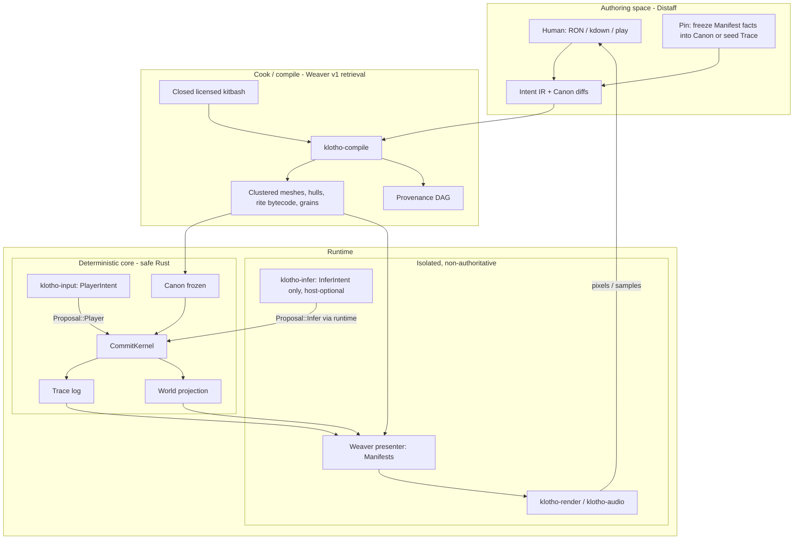
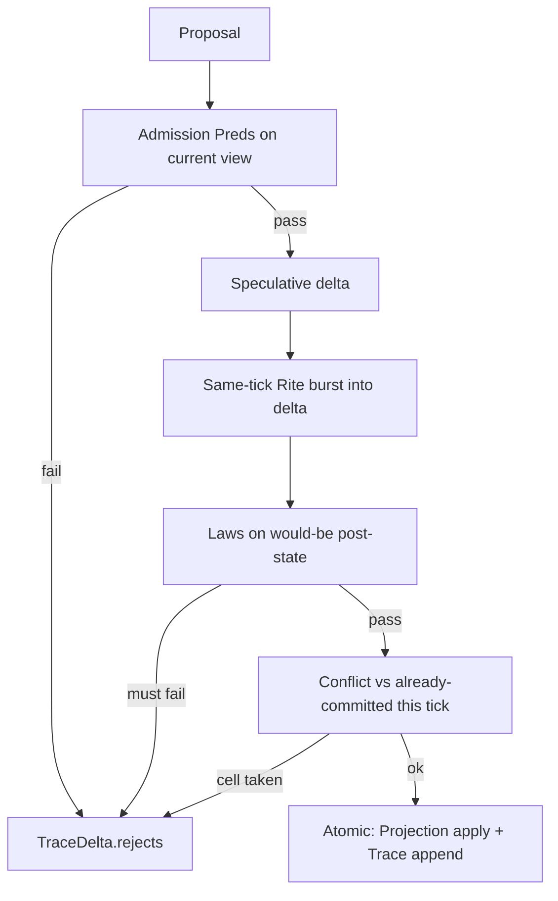
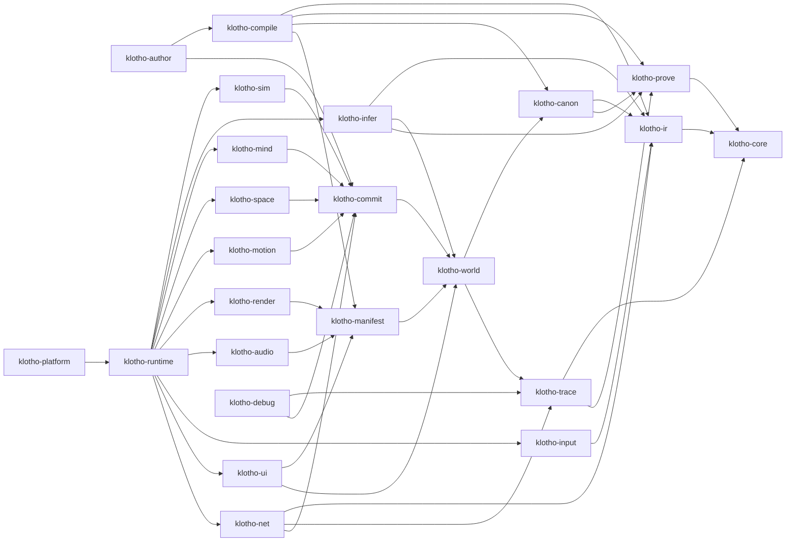
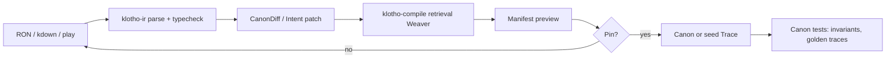
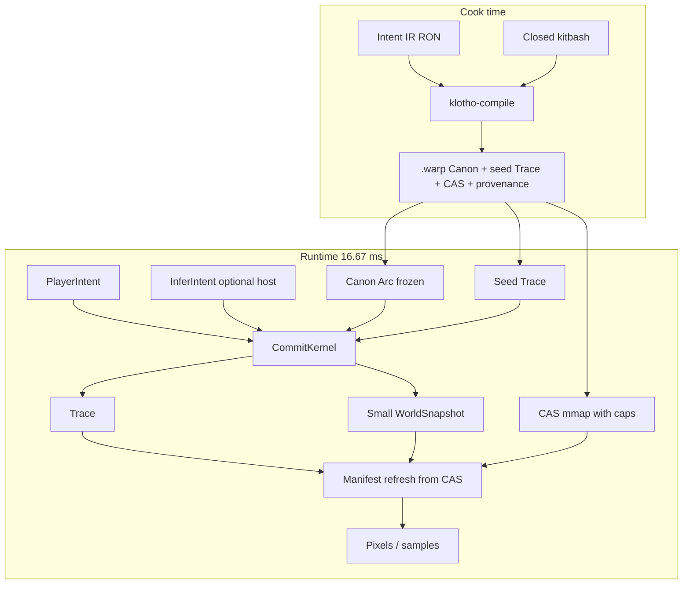

# Klotho: A Semantic Game Engine (AI-ready)

| Field | Value |
| --- | --- |
| Document | High-Level Design — Klotho Engine Architecture |
| Author | Grok (for Gal Katz) |
| Date | 2026-08-22 |
| Status | Draft (rev 5 — commit algebra, honest v1 framing, Test B) |
| Engine | **Klotho** |
| Language | Rust (edition 2024 target; 2021-compatible crates OK in v1) |
| Audience | Senior engine, tools, and gameplay systems engineers |

---

## Overview

Existing engines treat **objects, assets, and scripts** as the programming model. Artists place meshes. Designers attach colliders and components. Programmers write `Update()`. Generative AI, when present at all, is a plugin that emits those same objects, assets, and scripts — a faster intern for a 1998 information architecture.

**Klotho inverts that stack.** The source of truth is *intent under law*: a structured, versioned, provenance-bearing description of what the world *is allowed to be*, what agents *want*, and what *has happened*. The runtime **commits** a deterministic simulation from that description and **weaves** a disposable presentation. Meshes, clips, hulls, grains, UI, and Rite bytecode are **compiled artifacts** — caches, not the programming model.

This is not "Bevy + an LLM." It is not a neural video model pretending to be an engine. It is also **not**, in v1, an engine whose primary author is a model.

v1 tests one hypothesis:

> Can a game be authored and simulated as **Canon + Intent + Trace + Projection** instead of entities, components, and scripts?

A second hypothesis is deferred to v2:

> Can a model operate on that representation more reliably than on Unity/Unreal primitives?

v1 is therefore an **AI-ready semantic kernel**, not an "AI-first content factory." Authors write **structured Intent IR** (**RON canonical + kdown sugar**, same AST, both parsers). The Weaver **retrieves** from a small commissioned/licensed, affordance-tagged kitbash. Missing tags are cook errors, not invitations to hallucinate a mesh. Models may propose at runtime (off by default). They cannot commit.

If Klotho succeeds, the revolutionary part is Canon / Intent / Trace / Projection. The LLM becomes powerful *because* that representation exists.

---

## Architectural Thesis

> **Klotho is a game engine where semantic intent, explicit laws, and committed history replace mutable object graphs as the authoritative programming model. Models become powerful because they can propose into that model without being allowed to commit.**

v1 consequence of that sentence (the "constrained synthesizer" still holds — it synthesizes *presentation* and *admitted deltas*, not gameplay facts):

- **Four categories, nothing else.** Source (Canon, PlayerIntent, committed Trace). Derived authoritative state (Projection). Non-authoritative proposal (Space, Motion, Mind, Infer). Disposable presentation (Manifest, renderer, audio, UI).
- **`World` is not a source.** It is a materialized view of `(canon_hash, trace_prefix_hash)` plus the live Intent heap. Snapshots are **deterministic checkpoints of Trace**, not a second world. Reconstructable state is **Canon + snapshot + Trace suffix with matching prefix hash**.
- **AI may propose. Only `CommitKernel` commits.** "Only the kernel mutates" is not enough: every proposal is a **speculative transaction** (K21). Partial writes are never visible.
- A designer declares `Barrel is Portable, Flammable, Opaque, mass=12000g`. v1 cook **binds** a tagged kitbash. Missing tag → cook **fails**. v2 may synthesize; the hard problem then is *proving* the artifact matches the semantic contract, not the schema.
- A player emits `PlayerIntent`. Admission against Canon is skill expression **inside the kernel** (Infer cannot impersonate `PlayerIntent`). It is **not** a proof that a human produced the packet.

**Name.** **Klotho** (Clotho), the Fate who spins the thread of life. Authoring tool is **Distaff**. Package is `.warp`. Crate prefix `klotho-*`. Working title was Loom.

**Author-facing vocabulary (learn these first):** Locus, Canon, Intent, Trace, Manifest, Rite, Law. **Runtime machinery (engine contributors):** Proposal, CommitKernel, Affordance, Predicate, Pin. **Branding:** Weaver, Distaff, Warp, Sigil. Distaff docs must not mention `AdmitBuf` or `SyncProposer`.

---

## Glossary

**Core (authors):** Locus, Canon, Intent, Trace, Manifest, Rite, Law.

**Runtime (engine):** Proposal, CommitKernel, Affordance, Predicate, Pin, Sigil.

**Tools / branding:** Weaver, Distaff, Warp, Hearth.

| Klotho term | Meaning | Rough old-engine analogue (not equivalent) |
| --- | --- | --- |
| **Sigil** | Stable typed id (`u128`) | Entity / Actor id |
| **Locus** | Addressable region of meaning (Actor, Place, Relic, …) | Entity, without a component bag |
| **Canon** | Immutable-at-runtime (v1) laws, affordances, rites, beats | Design data / rules, not a scene |
| **Trace** | Canonical committed history (append-only) | Replay log. **Not** "the world" by itself. |
| **Intent** | A desire to mutate (player, mind, infer) | Input / AI goal, unified |
| **Proposal** | What a proposer offers the kernel this tick | N/A (engines mutate in place) |
| **Manifest** | Derived presentation (visual, sonic, UI, hull bytes) | Mesh/collider/widget instances |
| **World / Projection** | Deterministic checkpoint of Canon+Trace (+ Intent heap) | `UWorld`, but a view |
| **Pin** | Authoring commit of a preview fact into Canon or seed Trace | "Save the scene" of one fact |
| **Rite** | Bounded, total procedure, compiled to a capped ISA | Script / ability graph |
| **Law** | Always-on predicate invariant or conservation rule | N/A (or a hidden manager) |
| **Beat** | Episode / encounter state chart | Level sequence |
| **Affordance** | Stable semantic **capability** (`Lockable`, `Portable`) | Component *type*, not instance state |
| **Predicate** | Dynamic **eligibility** (`hands_free`, range, not already wielded) | Runtime condition |
| **Weaver** | Cook-time binder + runtime Manifest presenter | Importer + extractors |
| **Distaff** | Authoring tool (constraint cockpit) | Editor |
| **Warp (`.warp`)** | Cooked package: Canon + seed Trace + CAS | Pak / uasset bundle |
| **Hearth** | v1 im-sim slice (lock / carry / burn / trade) | Sample project |
| **Ash** | v1.1 second-genre slice (tiny arena) | Generality test |
| **CommitKernel** | Sole mutator of Trace and the Projection | Game thread, minus scripts |

`RejectReason` and metric names stay literal (`TimingMiss`, `klotho.sim.us`). Metaphor does not leak into the ABI.

---

## Background & Motivation

### Current state

Unity, Unreal, Godot, Bevy, Source 2, and Frostbite share a hidden ontology, regardless of ECS vs. GameObject vs. Actor vs. Node:

1. **Identity = bag of data** (components, properties, UObject fields).
2. **World = container of identities** (scene, level, World).
3. **Behavior = imperative code or visual script attached to identities**, ticked.
4. **Assets = files that identities point at** (FBX, PNG, WAV, uasset).
5. **Editor = manipulator of 1–4.**
6. **AI = one more behavior module** (BT, EQS, navmesh, and lately an LLM that writes 3–4).

That ontology is why "AI game engines" keep shipping as *asset generators* and *script copilots*. The engine cannot consume intent, so the model is forced to emit the engine's 1998 nouns.

### Pain points this design attacks

| Pain | Why the old ontology produces it |
| --- | --- |
| Content cost | Every noun needs a mesh, collider, material, clip, cue, and script, authored in different tools. |
| Incoherence | Animator, physics, nav, and gameplay each keep a private truth; they fight in `LateUpdate`. |
| Inaccessibility | You must learn a scene graph, an asset pipeline, a scripting VM, and a shader graph before you can make a door that locks. |
| AI impedance mismatch | Models speak semantics ("a locked oak door the blacksmith is proud of"). Engines speak `StaticMeshComponent`. The translation layer *is* the product, and today it is a pile of glue. |
| Multiplayer & replay | Replicating component soup is bandwidth-heavy and semantically lossy. The original *intent* of an action is discarded. |
| Debugging | Inspecting an entity's components does not tell you *why* it is legal for the barrel to be on fire. |

### Why Rust, greenfield

There is no engine in this workspace to extend, and there should not be. Grafting this ontology onto Unreal or Bevy would require lying to their scene/ECS every frame. Rust is the implementation language because:

- Ownership is how we **statically prevent inference from mutating sim state**.
- Deterministic sim and unsafe GPU/NPU FFI want a hard isolation boundary, not a `GC pause + plugin DLL`.
- A small team can ship a crate graph in 6–12 months; they cannot fork UE5.

---

## Goals & Non-Goals

### Goals (v1 slice, 6–12 months)

**Minimum staff:** 2 kernel, 1 presenter, 1 tools (4). A 3-person team can ship **Hearth headless by month 4** and **pixels by month 8**; net and Distaff preview slip rather than the kernel. 8 seniors who have shipped a small game can finish the full v1 list below.

- Specify and implement the **commit algebra** (K21) and the **authoritative state equation** (K22) before pixels.
- Ship **Hearth headless**: one Place, one local player, 3 GOAP NPCs, lock / carry / burn / trade as Appendix A. **Do not grow Hearth.** Pixels are a later gate, not a reason to add props.
- Ship **Ash** (Test B) as a **second golden pack on the same kernel**: tiny arena, hitscan, projectiles, health, ammo, respawn — no new architecture nouns. If Ash needs `DamageComponent` / `CombatManager`, the ontology has leaked.
- Make **Canon / Intent / Trace / Projection** the programming model. v1 authoring is **RON canonical + kdown sugar** over the **same AST**. Natural language → Rite remains v2.
- Ship a **small commissioned/licensed, affordance-tagged kitbash** as a first-class v1 deliverable. Missing tag = cook error.
- Keep the **CommitKernel 100% safe Rust, inference-free, tick-deterministic**.
- Runtime inference **off** is the default. Optional host-only dialogue fill is stale-tolerant, never on the commit path.
- Prove accessibility on the **author-facing** noun set (Locus, Canon, Intent, Trace, Manifest, Rite, Law), not on `AdmitBuf`.

### Non-goals (explicit)

- Not "an LLM makes games" in v1. v1 is a semantic kernel. The AI-author hypothesis is v2.
- Not a Unity/Unreal killer. No cinematic GI, open-world streaming, marketplace, or UGC.
- Not a realtime video world model. v3 `Presenter` research bet.
- Not "the AI plays the game." Kernel admission is not a humanity detector.
- Not a promise that the ISA stays at exactly 12 opcodes. The invariant is **no unbounded computation at runtime** (K27).
- Not ECS as the **authoring or gameplay** model. SoA / ECS-like tables **inside** the Projection and Manifest are expected and not a betrayal (K2). Semantic opacity is the enemy, not packed arrays.
- Not a conventional physics engine. v1 is **spatial movement and collision admission** (§7).
- Not cloud-required at runtime. Cloud authoring is v2.
- Not replacing rasterization in v1.
- Not NL → Rite, generative mesh, motion matching, 3D integer solver, or rollback net in v1.
- Not process-isolated infer in v1 (trusted-but-abortable in-process FFI). Panic-catch is not UB recovery.

---

## Key Decisions

| # | Decision | Rationale |
| --- | --- | --- |
| K1 | **Four-space ontology: Canon, Trace, Intent, Manifest.** Projection is derived authoritative state, not a fifth source. | Differentiator. A scene graph as truth becomes a generator for Unity. |
| K2 | **Identity is a `Sigil` naming a `Locus`.** **Affordance** = stable capability. **Predicate** = dynamic eligibility. Projection may use SoA/ECS *storage*. Authors never see component bags. | Semantic opacity is the enemy, not packed arrays. |
| K3 | **Only `CommitKernel` commits.** Everyone else emits `Proposal`s. Combined with K21 (transactions). | Hallucination cannot become gameplay. |
| K4 | **Inference is `klotho-infer`, non-sim timeline, polled only by `klotho-runtime`.** No `InferToken`. GOAP in `klotho-mind`. CI allowlist on `InferHost::{new,submit,poll}`. | Crate deps + CI beat a cfg the linker unifies. |
| K5 | **Cook-time binding is the default; runtime synthesis is optional and stale-tolerant.** | 60 Hz mesh inference is research. |
| K6 | **v1 Weaver = closed kitbash retrieval.** v2 neural Weaver shares the schema; the **research problem is proving generated artifacts satisfy the semantic contract**, not the data model. | Honest v1; don't pretend the schema solves synthesis. |
| K7 | **Space / motion / audio / UI propose; kernel admits.** v1 space is **collision admission**, not a physics engine. | Ends dual-truth without pretending we have Jolt. |
| K8 | **v1 net (optional): listen-server, host-only proposers, TraceDelta + signed PlayerIntent.** Client overlay is not hashed. 20 Hz intent is **Hearth-adequate**, not shooter-adequate. | One protocol. Label the genre limit. |
| K9 | **Provenance DAG on every compiled artifact and Trace event.** License metadata is **machine-auditable**. The graph does **not** prove legal sufficiency of a license. | Auditability is defensible; "legality is one graph" is not. |
| K10 | **Infer cannot impersonate `PlayerIntent`.** `WAIT.channel` is kernel-enforced. This does **not** prove a human produced the packet (bots/macros/remote LLM on the client). | Anti-mush inside the engine; not anti-cheat. |
| K11 | **Unsafe only in `klotho-infer`, `klotho-render`, `klotho-audio`, `klotho-platform`.** | Small audit surface. |
| K12 | **No `Update()` on loci.** Laws, Rites, Beats. | Per-entity ticking is un-reason-able. |
| K13 | **Editor is Distaff: constraint cockpit.** Pin is the authoring act. | WYSIWYG of Manifests is a view. |
| K14 | **Engineering budgets (not established facts):** 60 Hz host, kernel **budget** 4 ms, infer poll ≤ 0.2 ms, infer eval SLO 50–200 ms, cancel if `tick - job.tick > eval_slo_ticks` (12). PR 18 microbench is the proof, not this table. | Precision theater hid missing invariants. Budgets stay; they are gates. |
| K15 | **Engine Klotho; Distaff; Weaver; package `.warp`; crates `klotho-*`.** Working title was Loom. | Fate who spins the thread. |
| K16 | **Canon is frozen at cook in v1.** Director injects Intents, never Laws. | Otherwise every client forks Trace. |
| K17 | **One global `Tick(u64)`.** Pause = stop `step` (local). Pause-menu save is a runtime command (K19), not a Rite. | Pause-as-Place desyncs the kernel. |
| K18 | **Commit order `Player → Space → Motion → Mind → Infer`.** Heap priority matches. Space **must** see this tick's admitted Carry. Whole-tick mega-transactions are rejected. | Per-proposal atomicity + ordered commit. |
| K19 | **`step` never `Err`s on legal rejects.** Save = `(canon_hash, trace_prefix_hash, snapshot_blob, trace_from_tick)`. Suffix ancestry is mathematical. | Replay cannot splice snapshot A with Trace B. |
| K20 | **Committed space: mm `i32`; vel 16.16; yaw millidegrees.** Presenters may float. | Cross-OS hashes need one number type. |
| K21 | **Commit algebra (B+C).** Each proposal is speculative. Same-tick Rite burst is one transaction. `WAIT` commits and yields. Continuous Laws evaluate the would-be post-state; failure rolls the proposal back. Atomic Trace append + projection apply, or nothing. **Budget split, signed off:** pred-op exhaustion rejects the whole proposal; rite-step exhaustion admits the burst-so-far with `RiteEnded{FailBudget}` as the atomic outcome (see §Rite ISA). Both are deterministic; neither exposes a write outside a transaction. | "Only the kernel mutates" without this is a slogan. |
| K22 | **Authoritative state equation + proposer purity.** `State(t+1) = Commit(State(t), Canon, Intents, DeterministicProposals)`. `Proposal_t = F(Canon, Projection_t, Intent_t, Tick)`. Hidden proposer state is a design violation. Caches must be rebuildable from the view. | Space already obeys this; Mind/Motion must. |
| K23 | **Kernel spatial index** is a Projection column: derived from Pose + canonical Hull + Opaque/LockedBy, maintained by the kernel, never a source, rebuildable from snapshot. Manifest BVH is presentation-only. | Collision must not scan 4,096 loci. |
| K24 | **`HullWitness.swept` is kernel-derived**, not trusted: `prev_pose ⊕ proposed_pose ⊕ hull(mover, epoch)`. `BlobId` must be the mover's canonical hull at this Canon/epoch. Mismatch → `WitnessMismatch` / `WrongHull`. | A proposer must not describe the region it claims to prove. |
| K25 | **Determinism contract:** no unordered container iteration on the commit path; stable sorts; pinned crate versions; deterministic proposer registration order; no GPU-derived sim inputs; one RNG (`klotho-core`, seeded from Canon hash + tick). | Integers were ~60% of the problem. |
| K26 | **Hearth proves the im-sim ontology. Ash (Test B) is the generality gate.** Do not grow Hearth. Do not call Klotho "an engine" until Ash goldens pass on the same kernel. | Overfitting lock/carry/burn/trade is the product risk. |
| K27 | **No unbounded computation at runtime.** Caps on pred-ops, rite-steps, scans, spread writes. The opcode *count* may grow; a Turing-complete or unbounded loop may not. | "Exactly 12 ops forever" will lose to game logic. |

---

## Proposed Design

### Stack (inverted)



### Formal center (rev 5)

Every authoritative decision is a function of published semantic state:

```text
AuthoritativeState(t+1)
  = Commit(
      AuthoritativeState(t),   // Projection_t + Trace prefix through t
      Canon,                   // frozen
      PlayerIntent(t),
      AIIntent(t),             // Mind + Infer, host-only
      DeterministicProposals(t) // Space, Motion: pure F(view, tick)
    )
```

| Category | Members | Rule |
| --- | --- | --- |
| **Source** | Canon, `PlayerIntent`, committed Trace | Not derived. Canon frozen at cook. |
| **Derived authoritative** | Projection (including vel, island, rite machines, **kernel spatial index**) | Rebuildable from Canon + Trace prefix (via snapshot + suffix). |
| **Non-authoritative proposal** | Space, Motion, Mind, Infer | `Proposal_t = F(Canon, Projection_t, Intent_t, Tick)`. No hidden integrator / GOAP working memory. Caches must be equivalent to recomputing `F`. |
| **Disposable presentation** | Manifest, renderer, audio, UI | Never hashed. Never read back into Commit. |

Hidden proposer state is a **design violation**, not a style issue. `klotho-space` already obeys this. `klotho-mind` working memory lives in `KnowsTable` (Trace-backed) or is a cache of the view. `klotho-motion` clip time is either a projection column or derived from `RiteMachine` / `Verb` + tick.

### Commit algebra (K21)

"Only CommitKernel commits" is the trust boundary. This is the **transaction** model.

**Grain.** The tick is **not** one mega-transaction (Space must see this tick's admitted Carry — K18). **Each proposal** is one transaction. A Rite's **same-tick instruction burst** is one transaction. `WAIT` **commits and yields**; later ticks are new transactions (debt during a 120-tick trade wait is supposed to be visible).

```text
ingest heap (K18)
for each proposal in order Player → Space → Motion → Mind → Infer:
    snapshot proposal-local speculative delta (copy-on-write rows)
    run Rite burst / apply SpaceDelta fields into the delta
    evaluate admission Preds + Conserve + Cap + never_clip_closed
      against the *would-be* post-state (continuous Laws: Ramp/Spread after the burst)
    on any must-fail or budget-fail:
        discard delta; append Reject to TraceDelta; continue
    else:
        atomic: apply delta to Projection + append Trace events
        (no other proposer observes a half-applied rite or a pose without its vel)
publish WorldSnapshot (includes trace_prefix_hash)
```

**Invariant:** no proposal mutates committed Projection/Trace during validation. Either all writes of that proposal become committed Trace events (and matching projection columns) or none do.

**Conflict.** Two proposals in the same tick that write the same cell: later in K18 order **Nacks** with `RejectReason::Conflict` unless the writes commute (declared: `Qty` add that `Conserve` still holds; two `REL_ADD` of the same triple are idempotent). Space vs Motion on the same Sigil: Motion runs after Space and may Nack if its derived swept hits `OpaqueClosed`.

**Rite CFG.** Cook rejects unreachable nodes, `COMPLETE`/`HALT` with fall-through, `fail_pc` / `BRANCH` targets that do not exist, and graphs that are not DAGs except for `WAIT` (which yields across ticks). PR 04a acceptance includes the trade graph in Appendix A.



### Crate graph (v1, implementable)



**Hard compile-time rules**

- `klotho-sim` does **not** depend on `klotho-infer`, `klotho-render`, `klotho-mind`, `klotho-space`, or `klotho-motion`. It runs `step` with `&mut [&mut dyn SyncProposer]` supplied by `klotho-runtime`.
- `klotho-commit` does **not** depend on space/motion/mind types. `HullWitness` and number types live in `klotho-core`.
- `klotho-infer` does **not** depend on `klotho-commit`. It returns `InferIntent` (`klotho-ir`). Runtime wraps `Proposal::Infer`.
- `klotho-world` feature `mutate` is enabled **only** by `klotho-commit`.
- **No `InferToken`.** CI grep/allowlist: `InferHost::new`, `InferHost::submit`, `InferHost::poll` may appear only in `crates/klotho-runtime/**` (and `klotho-infer` itself). Feature flags are **not** used for this firewall (Cargo unifies features per package).
- CI clippy allowlist `forbidden_gameplay_imports`: `examples/hearth-slice`, `examples/ash-slice`, and `klotho-author` gameplay may not import `klotho-manifest::tables`. Only `klotho-render`, `klotho-audio`, `klotho-compile` may.

Workspace layout (new repo, not this home directory):

```
klotho/
  Cargo.toml
  clippy.toml                    # forbidden_gameplay_imports
  docs/pred-lang.md              # PR 04a RFC
  crates/
    klotho-core/                   # Tick, Mm, VelFx, Sigil, Budget, HullWitness
    klotho-ir/                     # IntentDoc, PlayerIntent, InferIntent, MindIntent
    klotho-prove/
    klotho-canon/                  # Laws, Affordances, Pred bytecode, Rite ISA
    klotho-trace/
    klotho-world/                  # private World, WorldSnapshot, feature "mutate"
    klotho-commit/                 # CommitKernel, Proposal, AdmitBuf, Rite VM
    klotho-manifest/               # Visual/Sonic/Ui manifests; tables pub(crate)
    klotho-compile/
    klotho-infer/                  # FFI host, returns InferIntent
    klotho-mind/                   # GOAP SyncProposer
    klotho-sim/                    # phase loop, profiler hooks
    klotho-space/                  # 2.5D AABB SyncProposer
    klotho-motion/                 # verb→clip SyncProposer
    klotho-input/
    klotho-render/
    klotho-audio/
    klotho-ui/
    klotho-net/                    # feature "net"
    klotho-author/
    klotho-debug/
    klotho-platform/
    klotho-runtime/
  examples/hearth-slice/
  examples/ash-slice/            # Test B; same kernel
  data/kitbash/                  # hashed, licensed, tagged
```

### v1 type locations (contract)

| Type | Crate |
| --- | --- |
| `Tick`, `Epoch`, `Mm`, `VelFx`, `YawMd`, `Sigil`, `Budget`, `Hash`, `HullWitness`, `AabbMm`, `RejectReason` | `klotho-core` |
| `IntentDoc`, `PlayerIntent`, `MindIntent`, `InferIntent`, `Agency`, `Channel`, `Verb` | `klotho-ir` |
| `Law`, `Affordance`, `Predicate`, `PredChunk`, `RiteGraph`, `RiteChunk`, `Beat` | `klotho-canon` |
| `TraceEvent`, `TraceLog`, `TraceDelta` | `klotho-trace` |
| `World`, `WorldSnapshot`, `WorldView` | `klotho-world` |
| `Proposal`, `AdmitBuf`, `SyncProposer`, `CommitKernel` | `klotho-commit` |
| `VisualManifest`, `SonicManifest`, `UiManifest` | `klotho-manifest` |

### Ownership model

```text
CommitKernel  : owns World (via klotho-world/mutate). Canon is Arc, frozen.
                Trace is mut. Projection tables are mut. IntentHeap is mut.
WorldSnapshot : Arc-swapped small sim blob (target ≤ 16 MB, Hearth ~1–2 MB).
                Double-buffer memcpy, not crossbeam-epoch, not a full World clone.
ManifestCache : owned by Weaver presenter; NOT inside the snapshot; refreshed
                from dirty Sigil set + CAS mmap.
InferHost     : owns weights/sessions; never &mut World. Only klotho-runtime
                constructs/polls it (CI allowlist). No InferToken.
Renderer      : owns GPU resources; borrows VisualManifest.
NetHost       : sockets; signed PlayerIntent / TraceDelta. Authority only.
Distaff         : separate process or feature; submits Pin / CanonDiff at cook,
                never at runtime in v1 (K16).
```

v1 snapshot: two `WorldSnapshot` buffers. At Snapshot phase, kernel writes buffer `1-i`, then `Arc::clone` of that buffer is published. Memcpy of 2 MB is ≪ 1 ms. **No crossbeam-epoch in v1.** Manifest CPU cache (128–256 MB) is not cloned.

**No capability token.** Cargo unifies crate features in one binary: a `klotho-caps` `issue` feature enabled by `klotho-runtime` would also expose `issue()` to `klotho-infer`. v1 firewall that actually works:

1. Crate graph: `klotho-sim` does not depend on `klotho-infer`. Only `klotho-runtime` holds an `InferHost`.
2. CI allowlist: `rg 'InferHost::(new|submit|poll)'` must match only `crates/klotho-runtime/**` and `crates/klotho-infer/**`.

```rust
// crates/klotho-infer/src/lib.rs
pub struct InferHost { /* sessions, pools */ }

impl InferHost {
    /// Public so runtime can construct it. CI forbids other crates from calling this.
    pub fn new() -> Self { Self { /* ... */ } }
    pub fn submit(&self, job: InferJob) -> JobId { let _ = job; JobId(0) }
    pub fn poll(&self) -> Vec<InferIntent> { Vec::new() }
}
```

`InferJob.snap: Arc<WorldSnapshot>` (`klotho-world`). No `&mut World`. No `Proposal` type in this crate. Snapshot is queried via `snap.view()` (`WorldView`).

### Unsafe boundaries

| Crate | Unsafe allowed for | Audit rule |
| --- | --- | --- |
| `klotho-infer` | ONNX / llama.cpp / Metal / Vulkan compute FFI | Snapshot + `InferIntent` only. **Trusted-but-abortable in v1.** Recoverable panic/OOM → disable infer. **UB is not recoverable.** Process isolation is v1.5. |
| `klotho-render` | wgpu/hal, shader upload | Manifest bytes after header validation |
| `klotho-audio` | SIMD mix, decoder FFI | Grain bytes after header validation |
| `klotho-platform` | window, file, JNI | No world mutation |
| **all other crates** | **forbidden** (`#![forbid(unsafe_code)]`) | CI lint |

---

## 1. World / Scene Representation

### How existing engines do it

Unity: a tree of GameObjects with Transforms. Unreal: ULevel of Actors. Godot: node tree. Bevy: a World of entities in archetypes, plus a Transform hierarchy as a convention. Source: BSP + entity lump. In every case the **scene is a container of objects with poses**, and "the level" is a file that deserializes into that container.

### Klotho replacement

A Klotho **World** is a **field** whose *sources* are Canon + Trace + Intent, and whose *runtime object* is a projection. **Trace is the canonical committed history. Snapshots are deterministic checkpoints of that history.** Reconstructable state is `Canon + snapshot + Trace suffix` with matching `trace_prefix_hash`. Trace is not "the world" by itself.

1. **Canon** — frozen laws for this `.warp`.
2. **Trace** — append-only events (the history).
3. **Intent heap** — this-tick desires, not yet (or never) committed.
4. **Projection** — identity, relations, quantities, pose, vel / yaw_rate, rite machines, mind-knows, island id / sleep, **kernel spatial index**. Rebuildable from snapshot + suffix. `klotho-space` is a pure function of `&WorldView`.
5. **Manifest spatial index** — presentation BVH. Blow-away-able. **Not** used for admission.

There is no scene file. A "level" is a cooked Warp: Canon + seed Trace + style Intent + CAS. v1 Weaver bakes generator contracts **once at cook** into seed Trace. Live locus generation is v2.

```rust
// crates/klotho-world/src/lib.rs
#![forbid(unsafe_code)]

pub struct World { /* private */ canon: Arc<Canon>, trace: TraceLog, view: Projection, intents: IntentHeap, epoch: Epoch }

pub struct Projection {
    identity: LocusTable,      // sigil, kind, affordance bitset, names
    relations: RelTable,       // sparse CSR
    quantities: QtyTable,      // ResourceId → i32, see units
    pose: PoseTable,           // Mm x/z, height Mm, yaw millidegrees
    vel: VelTable,             // VelFx xz, yaw_rate millideg/tick — NOT private to space
    rites: RiteMachineTable,   // pc, wait_remaining, bound_slots
    knows: KnowsTable,         // mind → FactId bitset
    islands: IslandTable,      // island_id, sleep_ticks, member bits
    space_ix: GridIndex,       // K23: Pose+Hull+Opaque/LockedBy; kernel-owned; rebuildable
}

pub struct WorldSnapshot {
    pub epoch: Epoch,
    pub tick: Tick,
    pub canon_hash: Hash,
    pub trace_prefix_hash: Hash, // K19: ancestry of this checkpoint
    blob: Arc<Projection>, // small; Hearth 1–2 MB; cap 16 MB
}

impl WorldSnapshot {
    pub fn view(&self) -> WorldView<'_> { WorldView { proj: &self.blob } }
}
```

`World` fields are private. Read path: `WorldView<'_>` from live World **or** `WorldSnapshot::view()` — **same query API**. Write path: `WorldMut<'_>` gated by feature `mutate` (only `klotho-commit`).

**Where live facts live**

| Fact | Source | Projection | Trace event |
| --- | --- | --- | --- |
| In-progress Rite | Trace | `RiteMachineTable` | `RiteBegan`, `RiteAdvanced { pc, wait_left }`, `RiteEnded` |
| Quantities (heat, mass, stamina, hands_free) | Trace (quantized) | `QtyTable` | `QtyChanged { id, to, quantum }` when crossing quantum or on interact/sleep |
| Semantic pose (picked up, door unlatched, landed) | Trace | `PoseTable` | `PoseCommitted { s, xz, yaw, reason }` at **interaction rate** |
| Island physics (pose **and vel / yaw_rate / sleep / island_id**) | Trace | `PoseTable` + `VelTable` + `IslandTable` | `IslandSnap { island, poses, vels, yaw_rates, sleep_ticks }` at **10 Hz** or on sleep/interact — **not** 60 Hz per locus into the log. Between snaps, the **snapshot blob** carries the 60 Hz columns. |
| Mind.knows | Trace | `KnowsTable` | `Learned { mind, fact }` |

There is **no** kernel-private integrator in `klotho-space`. Space is `fn(&WorldView, Tick, &mut AdmitBuf)`. The kernel applies an **admitted** `SpaceDelta` atomically with its Trace events (K21); a rejected delta does not mutate. Folding 120 s of `PoseCommitted` every tick is forbidden. Replay = snapshot blob (including velocities **and** `trace_prefix_hash`) + Trace suffix whose first event hashes onto that prefix. **No hidden space fields.**

**Kernel spatial index (`space_ix`).** Uniform grid over millimetre AABBs of canonical hulls at current pose, tagged with `OpaqueClosed`. Maintained by `CommitKernel` when pose/hull/LockedBy changes. Never a source: dropping it and rebuilding from Projection is legal. Admission query:

```text
kernel_derived_swept(prev_pose, proposed_pose, hull(mover))
  → space_ix candidates
  → exact AABB vs OpaqueClosed (sleepers included)
```

The Manifest BVH is **not** this index. Scanning all 4,096 loci is a spec bug.

Queries are semantic-first and **typed**, not a fluent builder fantasy:

```rust
impl WorldView<'_> {
    pub fn with_affordance(&self, a: AffordanceId) -> impl Iterator<Item = Sigil> + '_;
    pub fn related(&self, a: Sigil, r: Rel) -> impl Iterator<Item = Sigil> + '_;
    pub fn qty(&self, s: Sigil, r: ResourceId) -> i32;
    pub fn pose(&self, s: Sigil) -> Option<PoseMm>;
    pub fn vel(&self, s: Sigil) -> Option<(VelFx, VelFx, i32)>; // vx, vz, yaw_rate
    pub fn island(&self, s: Sigil) -> Option<(u16, u16)>;       // island_id, sleep_ticks
}
```

### Why simpler / faster / more accessible

- Authors and models speak laws, places, relations. No "empty + mesh + collider + script."
- Coherence is structural: a locus that cannot satisfy `Flammable` cannot be on fire.
- The kernel iterates **dirty islands and active rites**, not a hierarchy.
- Net streams Trace windows, not actor lists.

### v1 stand-in

One Place, **hard cap 4,096 loci** (microbench gate in PR 10/18; **not** a 4 ms promise). Hearth working set is ~80 loci / **~20 awake nominal**, **~80 worst-case** if every simulated hull is one contact group (fire-in-shop). Grid spatial index. No streaming. Islands are defined in §7.

---

## 2. Entity / Identity / Composition Model

### How existing engines do it

GameObject + components; Actor + components; ECS archetypes. Composition means "attach more data/behavior to an ID." Identity is cheap and semantically empty.

### Klotho replacement: Sigils, Loci, Affordances

```rust
// crates/klotho-core/src/sigil.rs
#[derive(Copy, Clone, Eq, PartialEq, Hash, Debug)]
pub struct Sigil(u128);
// 8 bit kind | 8 bit generation | 112 bit id-space
// Generation wrap (256) is v1-accepted: a Sigil is never reused within a Trace
// prefix that still references it. Cook allocates densely; runtime churn of
// relics in Hearth is tens, not millions.

#[repr(u8)]
pub enum LocusKind { Actor = 1, Place = 2, Relic = 3, Law = 4, Beat = 5, Chorus = 6, Observer = 7 }
```

**Composition is capability, not attachment.** Split two ideas that "affordance = proof" used to smuggle:

| | Meaning | Example |
| --- | --- | --- |
| **Affordance** | Stable semantic capability, cooked | Barrel `Portable`, `Flammable`, `Opaque` |
| **Predicate** | Dynamic eligibility, evaluated at admission | `hands_free ≥ 1`, `AabbNear`, nobody else `WieldedBy` |

You cannot add a `Portable` component to a mountain. You *can* have a `Portable` barrel that is not currently carryable. Laws bind the two at admission. Authors never see a `Transform` or `Rigidbody` type.

Quantities (`mass_g`, `heat`, `stamina`) are rows in `QtyTable`, keyed by `(Sigil, ResourceId)`. Relations replace hierarchy (`In`, `OwnedBy`, `WieldedBy`, `KeyedBy`, `Knows`, `Owes`, `Fears`, `PartOf`, `DerivedFrom`).

Projection SoA (`PoseTable`, `VelTable`, …) and Manifest SoA **are allowed**. That is storage, not the programming model. `forbidden_gameplay_imports` still bans gameplay from `klotho-manifest::tables`.

### Why simpler / faster / more accessible

- Small semantic type set. Models emit affordances, not `BoxCollider2D`.
- Identity survives resynthesis of a barrel mesh.
- Projection columns can be SoA without becoming the programming model.

---

## 3. Authoring / Editor / Content Pipeline

### How existing engines do it

WYSIWYG viewport, hierarchy, inspector, asset browser. DCC → importer → entity references. AI tools generate inside that pipeline.

### Klotho replacement: Distaff

Distaff is a **constraint cockpit**:

1. **Intent thread** — structured forms and text that parse to Intent IR. **Q3 closed:** v1 ships **both** parsers, **same AST**: RON is canonical; **kdown** (`*.kdown`) is indentation sugar (`law lock.use:` → `CanonDiff::AddLaw`). Natural language → Rite remains v2. There is **no NL compiler** in v1.
2. **Canon ledger** — laws in force; diffs reviewable and testable.
3. **Manifest preview** — disposable 3D/audio view. Gizmos move Manifests. **Nothing is real until Pin.**

```rust
pub enum Pin {
    ToCanon { fact: CanonFact, reason: String },
    ToSeedTrace { event: TraceEvent, reason: String },
    Reject { proposal_id: u64, reason: String },
}
```



v1 Distaff: **CLI cook + egui/wgpu preview**. Large generative models are **v2 cook workers**; they are not on the v1 critical path.

**Accessibility demo (acceptance):** author writes `hearth/door.ron` declaring `Lockable` + key relation + lockpick rite (or references the Hearth rite by id) and `hearth/bran.ron` `MindIntent`, cooks against the closed kitbash, plays. No FBX import, no C#. If the kitbash lacks `door.oak.lockable`, cook errors with the missing tag — that is the honest v1.

### Why simpler / faster / more accessible

- One document type (Intent IR), not five.
- The same AST is what a v2 model will emit.
- Canon diffs are reviewable.
- Dirty recook of library Manifests < 500 ms.

### Concrete modules

- `klotho-author/src/parse.rs` — RON canonical + kdown desugar → same `IntentDoc` AST (both in v1)
- `klotho-author/src/pin.rs`
- `klotho-author/src/preview.rs` — hosts `klotho-runtime` in editor mode (pause = stop `step` while Pin UI is up)
- `klotho-compile/src/lib.rs` — dirty-set incremental cook; **depends on ir, prove, canon, manifest**

---

## 4. Asset Representation and Streaming

### How existing engines do it

Source FBX/PNG/WAV are truth. Importers produce engine blobs. Streaming loads mips for nearby entities.

### Klotho replacement

**Source = Intent document + provenance + pins.**  
**Compiled = CAS blob**, keyed by blake3 of canonical little-endian bytes of `(Canon slice, style Intent, compiler version, seed, kitbash blob ids)`.

Cook **must** be deterministic: quantized integer vertices, no host floats in hashed bytes, explicit endianness. Retrieval-and-fit uses integer placement (millimetres) and integer yaw.

```rust
pub enum ArtifactKind {
    ClusteredMesh, // v1 geometry; NOT mesh-shader meshlets
    Hull,          // AABB / capsule, integer
    Texture,
    Grain,
    ClipSet,       // v1 verb→clip; v2 MotionDb
    RiteChunk,     // 12-op bytecode
    AffordanceGraph,
    Embedding,
}
```

v1: **no live streaming of synthesis**. Cook writes LOD0 (+ optional LOD1) clustered meshes per Place. Runtime pages from `.warp` by observer distance.

**v2 research (K6) — the hard problem is not the schema.** A neural Weaver that emits CAS blobs against the same `ArtifactKind` still has to **prove** that generated geometry, hull, mass, affordances, scale, materials, clips, and `LicenseSpan` **agree**. A finite kitbash will not contain `ancient ∧ rusty ∧ two-handed ∧ portable ∧ flammable ∧ wet ∧ ornate ∧ lockable ∧ metal ∧ heavy`. Missing-tag-as-error is the correct v1; synthesis-that-satisfies-Canon is an explicit unsolved problem, not "same data model so we're done."

`.warp` loader **caps** (reject before mmap of unbounded data):

| Cap | v1 |
| --- | --- |
| File size | 512 MB desktop, 192 MB mobile |
| Blob count | 16,384 |
| Single blob | 32 MB |
| Loci in seed | 4,096 |
| Rite cap_steps | 64 |
| Clustered mesh header | magic, index count ≤ 200k tris/mesh, quantized i16 verts |

Magic: `KLTH` + version. Mesh and grain headers are validated before GPU/decoder upload.

### Why simpler / faster / more accessible

- Authors do not manage import settings; tags + style Intent do.
- Dedup is free. Compiler version invalidates by hash.
- Semantic LOD is a budget query both humans and (v2) models understand.

---

## 5. Rendering (Visuals)

### How existing engines do it

Renderer walks a scene/ECS, extracts mesh+material+lights, culls, rasters. Coupled to entity identity.

### Klotho replacement

The renderer is a **pure function of `VisualManifest` + `Observer` + `GpuBudget`**. No Sigils in the hot path except debug labels.

```rust
pub struct VisualManifest {
    pub epoch: Epoch,
    pub clusters: Vec<ClusterRef>, // CAS id + GPU handle
    pub materials: Vec<MaterialRef>,
    pub lights: Vec<LightStub>,
    pub debug_sigils: Vec<(Sigil, AabbMm)>,
}

pub trait Presenter {
    fn present(&mut self, vis: &VisualManifest, observer: Observer, budget: GpuBudget);
}
```

**v1 presenter:** wgpu **clustered static meshes**, one shader family (**clustered forward, unlit+lambert**), shadow atlas optional, sRGB swapchain. Geometry from kitbash retrieval. No mesh shaders.

**v1 material tags** (closed set, one permutation): `organic`, `metal`, `stone`, `cloth`, `emissive`, `water`. Palette from style Intent. No shader graph.

**v2:** neural textures at cook. **v3:** `NeuralPresenter` behind the same trait.

Observer / camera (Hearth): `Observer` locus with `PoseTable` eye height 1600 mm, yaw from `PlayerIntent { verb: Look }`, pitch clamped. Constructed in `klotho-runtime` from the snapshot, not by the renderer.

### Why simpler / faster / more accessible

- Renderer engineers consume a dumb buffer.
- Authors never touch draw calls.
- One dirty Sigil set feeds visual, sonic, and UI manifests.

### Latency

Render phase **≤ 7.0 ms** on a **dedicated render thread** (K14/Q2). Manifest extract ≤ 1.5 ms on the render thread from the published snapshot + dirty set.

---

## 6. Animation and Character Motion

### How existing engines do it

Skeletal clips, blend trees, state machines, Control Rig. Gameplay waits on `AnimNotify`.

### Klotho replacement

Canon carries **motion contracts** (`BodyClass`, verbs, effort). Motion is a **SyncProposer** emitting `Proposal::MotionDelta`.

**v1 stand-in:** **verb → clip + root motion**. A cooked `ClipSet` maps `Verb` to one looping or one-shot clip. Selection is deterministic `(verb, grounded)`. Root motion is millimetre deltas applied as a `MotionDelta` the kernel admits against hull witnesses (no sliding through a closed door). Authors do not draw state machines. This is not motion matching (v2).

Gameplay-critical timing (lockpick windows, hit frames) lives in **Rite `WAIT` + Laws**, not clip notifies. Clips may carry cooked *presentation* events that only affect Manifests.

**v2:** motion matching or learned policy, same `MotionDelta` type.

### Why simpler / faster / more accessible

- Designers specify verbs and contracts, not 40 blend parameters.
- Hit timing is Canon, inspectable.
- v1 cost is a table lookup plus root-motion add.

---

## 7. Spatial Movement and Collision Admission

v1 is **not a physics engine**. It does not define friction, restitution, gravity as a field, stacking, impulse propagation, rotational inertia, joints, slope handling, or character grounding. Those are out of scope. What it *does* define:

- 2.5D pose / velocity integration on awake islands
- conservative swept-AABB **admission** against `OpaqueClosed` hulls
- carry, hinge yaw, one light projectile, player walk

Calling this "physics" made the philosophy look weaker than it is. Dual-truth with animation is still forbidden. Contact *resolution* beyond reject-or-admit is not promised.

### How existing engines do it

PhysX/Havok/Jolt/Rapier as independent truth. Dual-truth with animation.

### AI-ready replacement

Space is a **pure `SyncProposer`**. The kernel **derives** the swept volume and **admits** the delta. The kernel does **not** reimplement the island integrator.

```rust
// klotho-core — the kernel can check this without linking klotho-space
pub struct HullWitness {
    pub mover: Sigil,
    pub proposed: PoseMm,  // where the proposer wants to go
    // `swept` is NOT trusted input. Kernel computes:
    //   swept = conservative_aabb(prev_pose(mover), proposed, hull(mover, epoch))
    pub overlaps_closed_opaque: bool, // hint only; kernel recomputes
}

pub struct AabbMm { pub min: IVec3, pub max: IVec3 } // millimetres
```

`Proposal::SpaceDelta` / `MotionDelta` carry a full projection row: `pose`, `vel_x`, `vel_z`, `yaw_rate`, `island`, `sleep_ticks`, `witness`. On **atomic admit** (K21) the kernel copies those fields; reject leaves the row unchanged.

**Canonical hull binding (K24).** `hull(mover, epoch)` is the `BlobId` recorded on the Locus at cook / last Pin, looked up from Projection, not from the proposal. A proposer that names a different `BlobId` is `RejectReason::WrongHull`.

The kernel overlap test:

1. Derive `swept` from `pose(mover)` (pre-proposal) + `proposed` + `hull(mover, epoch)`. Ignore any proposer-supplied swept AABB.
2. Query **`space_ix`** (K23) for candidate hulls overlapping `swept`. Test those whose locus is `OpaqueClosed` — **sleepers and static obstacles included**. Awake is an **integration** cost, not existence. An idle locked door still blocks.
3. If the hint says no overlap and the kernel finds overlap → `WitnessMismatch`. Do not trust the proposer.
4. If Law `never_clip_closed` fires → reject, even if the proposer wanted the pose.

If the test cannot be completed in remaining kernel **budget**, **reject** (fail closed). The kernel does not run a second solver; it verifies a conservative volume.

**v1 solver:** **2.5D fixed-point AABB islands + swept capsule for the player**, vendored overlap (see A5). XZ AABBs, Y as height slab. No 3D isometry, no ragdoll, no fracture. Hearth interactions: carry, door swing (hinge yaw), light projectile (bucket water), player walk.

**`klotho-space` is stateless.** It is `SyncProposer::propose(&WorldView, Tick, &mut AdmitBuf)` with **no** fields that persist integrator state across ticks (hull CAS mmap is a read-only cache of Manifest bytes, not sim). Every input is pose, vel, yaw_rate, sleep_ticks, island_id, hulls from the view. The kernel writes admitted deltas into those same columns. Rejected `SpaceDelta` leaves the projection unchanged — space does not need to roll back private state because it has none.

**Islands** = **contact-connected AABB groups of simulated hulls** (Actor, Portable, swinging door, projectile, Burning). Static scenery hulls (floor, walls, anvil) are **obstacles**, not members — a shared floor AABB does not union the whole shop. Sleep: island members all have vel=0, not Burning, no Intent this tick. `LawBody::Spread` **AWAKE**s the neighbor's island when heat is written (otherwise a cold barrel never becomes dirty and spread deadlocks).

Hearth awake: **~20 nominal** (player, 3 NPCs, a few portables). **Do not claim ~20 while `Cap(Burning)` is saturated** unless burning barrels are disjoint sleep groups. Worst-case if the shop's simulated hulls form one contact group: **~80**. PR 18 microbench **64 awake** is the fire-in-shop case, not a quiet shop.

`IslandSnap` includes **poses, velocities, yaw_rates, sleep_ticks, island ids**. The save blob is the full `Projection` (those columns included). Replay does not reconstruct 6 ticks of motion from poses-only.

Gameplay spatial queries are affordance queries in a region. Shapecasts exist inside `klotho-space` as implementation of one tick of `propose`.

### Why simpler / faster / more accessible

- Closed door is a Law plus a witness the kernel rechecks against **all** `OpaqueClosed` hulls, including sleepers.
- Authors tag `Opaque` / `Portable`; cook emits hulls from the kitbash collider tags.
- Simulate awake islands only.

---

## 8. Audio

Unchanged in ontology: Trace events *are* the cue list. `SonicManifest` is a presenter. v1: cooked grains + one ambience bed. No runtime music LM. Header-validate grains before decode.

---

## 9. Input and Player Agency

Devices emit `PlayerIntent` (`klotho-ir`). Runtime wraps `Proposal::Player`.

```rust
// crates/klotho-ir/src/player.rs
pub struct PlayerIntent {
    pub player: PlayerId,
    pub at: Tick,
    pub verb: Verb,
    pub target: IntentTarget,
    pub analog: Analog,     // timing phase, stick, look delta (millidegrees)
    pub agency: Agency,
}

pub struct Agency {
    pub claimed: ChannelSet, // Timing, Aim, ResourceSpend, DialogueChoice
    pub assist: AssistLevel, // only if Canon.allows — v1 Hearth: None
}

pub enum Channel { Timing = 1, Aim = 2, ResourceSpend = 3, DialogueChoice = 4 }
```

**Engine-level skill rules (in the VM, not commentary):**

1. `WAIT { channel: Some(Timing) }` advances only on `Proposal::Player` whose `agency.claimed` contains `Timing` and whose analog phase is inside the window predicate. `Proposal::Infer` or `Mind` with `verb: Time` is `RejectReason::UnclaimedAgency` **before** the Rite PC moves.
2. Assist is a Canon law. Hearth ships with no assist laws.
3. DialogueChoice claimed ⇒ Infer may not fill the player's line.

**What this actually proves (K10).** Infer / Mind cannot impersonate `PlayerIntent` *inside the kernel*. A signed `PlayerIntent` with `agency.claimed = Timing` can still come from a bot, a macro, or a client-side LLM. Ed25519 authenticates the **client identity**, not a human. v1 listen-server does not attempt anti-cheat or "is this a person." Say that in net docs; do not advertise humanity detection.

v1 binds: Canon `bindings` table, keyboard/mouse/gamepad. No player-controller class.

---

## 10. Gameplay / Scripting / Rules

### How existing engines do it

`Update()`, coroutines, Blueprints, Turing-complete mutation of anything reachable.

### Klotho replacement: Laws, Rites, Beats

| Construct | Lifetime | Turing? | Role |
| --- | --- | --- | --- |
| **Law** | Always | No — pred bytecode | Invariant / conservation / admission |
| **Rite** | Bounded ISA | No — capped ops, no unbounded loops | lockpick, trade, ignite; optional diegetic save |
| **Beat** | Episode | No — state chart | evening_trade pacing |

### v1 predicate language (`klotho-canon`)

Closed-world, two-valued: failing to prove is **false** (no Kleene unknown at runtime). No nested quantifiers except one pre-indexed `ExistsRelated` / `CountRelated`. No recursion. No string match. Arithmetic is `Qty` compare only. **Unbound names are a cook error.** Every Sigil is `Self`, `Target`, `Other` (bound by a related-scan), or a **cook-time `Name(id)`** pinned to a seed Sigil (`bran`, `hearth`, `fathers_hammer`, …).

**Slots:** `Self | Target | Other | Name(NameId)`.

**Atoms**

| Atom | Meaning |
| --- | --- |
| `Affordance(s, a)` | projection bitset |
| `Rel(a, r, b)` | relation table |
| `Qty(s, res) cmp n` | `Lt Le Eq Ge Gt`, i32 |
| `EqVerb(Verb)` | current proposal's verb (`Use`, `Time`, …) |
| `RiteActive(RiteId)` | a `RiteMachine` row exists for this actor+id |
| `AabbNear(a, b, Mm)` | conservative AABB distance ≤ Mm (integer) |
| `InWindow(rite, ch)` | current tick in that WAIT |
| `Knows(mind, fact)` | knows table |
| `SourceIs(kind)` | Player, Mind, Space, Motion, Infer |
| `AgencyClaimed(ch)` | on the *current* proposal |
| `Burning(s)` | sugar: `Qty(s, heat) Ge IGNITE` (IGNITE=400) |
| `OpaqueClosed(s)` | sugar: `And(Affordance(s, Opaque), ExistsRelated { of: s, rel: LockedBy, pred: OtherIs(Other) })`. **Not** “affordance Open” — `Open` is a verb. Unlock = `RelDel LockedBy` ⇒ this atom is false. |
| `SweptHitsOpaqueClosed` | current `SpaceDelta`/`MotionDelta` swept AABB overlaps **any** `OpaqueClosed` hull, **sleepers and statics included** |
| `IslandAwake(s)` | `sleep_ticks == 0` |
| `SelfIs(s)` / `TargetIs(s)` / `OtherIs(s)` | slot equality |

Sugar (cook desugar, not extra atoms): `Possessed(actor, relic)` → `Rel(relic, WieldedBy, actor)`. `key_of(Target)` is **not** a name: it is `ExistsRelated { of: Target, rel: KeyedBy, pred: Rel(Other, WieldedBy, Self) }`.

**Combinators:** `And`, `Or`, `Not`.

- `ExistsRelated { of, rel, pred }` — scan cap 64 neighbors. `pred` is **quantifier-free** (atoms + And/Or/Not using `Other` / `Self` / `Target` / `Name`). No nested `ExistsRelated`/`CountRelated`.
- `CountRelated { of, rel, pred, cmp, n }` — same scan cap 64; **not** a global 4k scan. Global caps use `LawBody::Cap`.

**Compilation:** cook emits `PredChunk`. Ops: `PushAtom`, `And`, `Or`, `Not`, `ExistsRelated`, `CountRelated`, `Halt`.

**Caps:** 64 ops per predicate eval; **8,192 pred-ops per tick** global. Exceed → `RejectReason::Budget`, Law treated as fail-closed for *admission* (proposal dies) and fail-open for *soft ought* (skip cost).

**Law pass:** on the **speculative post-state of the current proposal** (K21), dirty-island only. An island is dirty if a Trace event touched it this tick, it is burning, it was `AWAKE`d (including by `Spread`), or it hosts an active Rite. Not a theorem prover. A Law `must` failure **discards the whole proposal delta**.

**Cost (engineering, not a proof):** the expensive part is not "5.4k pred ops." It is broadphase via `space_ix`, witness derivation, relation gathers, rite bursts, Trace encode, prefix hash, snapshot memcpy. The **4 ms figure is a budget gate** (K14) proven by PR 18 microbench (64 awake), not by multiplying pred ops. The **4,096 locus cap** is a memory/ID cap; admission queries go through `space_ix`, never a full scan.

**Continuous writers — only `Ramp` and `Spread`.** There is no kernel-instantiated 1-op Rite.

```rust
pub enum LawBody {
    Pred { must: PredId, ought: Option<Cost> },
    Ramp { res: ResourceId, per_tick: i32, quantum: i32, cap: i32 },
    Spread {
        res: ResourceId,
        per_tick: i32,
        near: Mm,
        cap_global: u16,
        ignite_at: i32,
    },
    Conserve { res: ResourceId, over: Rel },
    Cap { mark: PredId, n: u16, require_rel: Option<(Rel, Slot)> },
}
```

- `Ramp` — self-qty on dirty loci matching `when`. `QtyChanged` only when `floor(qty/quantum)` changes or at cap/ignite. Hearth heat quantum = 10, ignite = 400.
- `Spread` — write `res += per_tick` on neighbors with `AabbNear(self, other, near)` matching `when` on other (Hearth: `Flammable`). **Always `AWAKE` the neighbor's island.** If applying the write would exceed `Cap`/`cap_global`, **reject the write** (no 9th fire).
- `Conserve { mass_g, WieldedBy }` — admission-time: `Qty(actor, mass_g) + CountRelated-sum of mass_g over Rel(*, WieldedBy, actor)` is invariant across the admitted proposal (pick/drop).
- `Cap { mark: Burning, n: 8, require_rel: Some((In, Name("hearth"))) }` — kernel counter, not a 4k scan.

`SETQ` mutates **quantities only**. Relations use `REL_ADD` / `REL_DEL`. `Owes` is a `Rel`, never a `SETQ`.

### Rite ISA (capped; v1 ships 12 opcodes)

Authoring form is a **CFG with explicit `pc` labels**, not an unlabeled list (rev 4 trade bug: `Complete(Success)` halted before `RelDel`). Cook compiles to `RiteChunk`. Interpreter in `klotho-commit`, no JIT.

**K21 + rites.** Ops in one tick up to (but not including) `WAIT` or `HALT` run in a speculative delta. `WAIT` **commits** the delta (`RiteAdvanced`) and yields. Next resume is a new transaction. No other proposer observes a half-burst. `SPEND` then Law-fail ⇒ neither write lands.

**K21 budget split (signed off, not a violation).** Pred-op exhaustion fails the admission decision, so the whole proposal is rejected. Rite-step exhaustion instead ends the burst: the delta admits together with `RiteEnded{FailBudget}`, which is the atomic outcome of that transaction — progress-then-truncation with its marker, never an unmarked half-burst. Rationale: rites are progress (WAIT commits, debt is visible by design); pred-ops bound a single yes/no gate. Deterministic under both.

**Cook CFG checks (PR 04a, fail cook):** every node reachable from `entry`; every `fail_pc` / `BRANCH` target exists; `COMPLETE`/`HALT` has no fall-through; no unreachable ops; graph is a DAG except `WAIT` edges that resume on a later tick.

| Op | Encoding | Effect |
| --- | --- | --- |
| `HALT` | `status` | end; emit `RiteEnded` |
| `GUARD` | `pred, fail_pc` | if pred false, PC = fail_pc |
| `SPEND` | `res, amount, fail_pc` | qty subtract; fail if insufficient |
| `WAIT` | `ticks, channel: Option<Channel>` | emit `RiteAdvanced`; stall; channel gates who may resume |
| `EMIT` | `event_kind, slots…` | append TraceEvent |
| `BRANCH` | `pred, yes, no` | |
| `BIND` | `slot ← Target \| Self \| Related(rel)` | |
| `SETQ` | `slot, res, amount` | |
| `REL_ADD` | `a, rel, b` | |
| `REL_DEL` | `a, rel, b` | |
| `AWAKE` | `slot` | unsleep island |
| `COMPLETE` | `status` | alias of HALT with Success/Fail |

Caps: 64 steps / rite / tick, 2,000 rite-steps / tick, 180 ticks wall for Hearth lockpick. Exceed → admit burst-so-far with `RiteEnded { FailBudget }` (atomic K21 outcome per the signed-off split above), no stall.

In-progress state is **in Trace** (`RiteBegan` / `RiteAdvanced`) **and** `RiteMachineTable`. Replay and net see it. There is no hidden VM fifth space.

### Worked example: Hearth lockpick

RON (canonical IR):

```ron
AddAffordance(Affordance(
  id: "Lockable",
  requires: [Affordance(Self, "Opaque")],
  grants: ["Use", "Lockpick", "Open"],
  conflicts: [],
))

AddLaw(Law(
  id: "lock.use",
  when: And(EqVerb(Use), Affordance(Target, "Lockable")),
  body: Pred(
    must: Or(
      ExistsRelated(
        of: Target,
        rel: KeyedBy,
        pred: Rel(Other, WieldedBy, Self),
      ),
      RiteActive("lockpick"),
    ),
    ought: None,
  ),
))

AddRite(RiteGraph(
  id: "lockpick",
  cap_steps: 32,
  cap_ticks: 180,
  entry: 0,
  nodes: [
    Bind(Target),
    Guard(And(
      Affordance(Target, "Lockable"),
      Rel(Name("lockpick_tool"), WieldedBy, Self),
    ), 99),
    Emit("NoiseLow"),
    Wait(45, Some(Timing)),
    Guard(And(InWindow("lockpick", Timing), And(SourceIs(Player), AgencyClaimed(Timing))), 80),
    Wait(45, Some(Timing)),
    Guard(And(InWindow("lockpick", Timing), And(SourceIs(Player), AgencyClaimed(Timing))), 80),
    RelDel(Target, "LockedBy", Target),
    Emit("Unlocked"),
    Awake(Target),
    Complete(Success),
    // 80:
    Emit("NoiseHigh"),
    Complete(Fail),
    // 99:
    Complete(Fail),
  ],
))
```

Compiled ISA (illustrative): `BIND Target; GUARD p0,99; EMIT NoiseLow; WAIT 45,Timing; GUARD p1,80; WAIT 45,Timing; GUARD p1,80; REL_DEL LockedBy; EMIT Unlocked; AWAKE; COMPLETE Success; …`

Sequence: first `Use` admits the rite (`RiteBegan` in Trace this tick). `WAIT` does not unlock the door — `Rel(door, LockedBy, door)` still holds, so `OpaqueClosed` is true and an idle player sweep against the **sleeping** door is still rejected by `never_clip_closed`. Two later `PlayerIntent`s with claimed `Timing` inside the windows advance the PC (`RiteAdvanced`). Infer cannot. On success, `RelDel LockedBy` + `Unlocked`; `OpaqueClosed` is now false (no `LockedBy` edge, not an `Open` affordance bit). Space proposes a hinge `SpaceDelta` with full pose/vel/yaw_rate/island/sleep; kernel rechecks swept vs remaining `OpaqueClosed` hulls (this door no longer in the set) and admits. Presenter swaps closed→open clustered mesh from CAS.

There is no English-to-this-graph compiler in v1. A human (or a v2 cook model under review) writes the RON.

### Why simpler / faster / more accessible

- Graphs terminate; the kernel can prove it (DAG + caps).
- Designers read Laws. They cannot read 800 Blueprint nodes.
- No script GC, no per-entity `Update`.

---

## 11. AI / NPC / World Simulation (Diegetic Intelligence)

NPCs are loci that hold `MindIntent` — the same agency path as players, minus `Agency` claims.

**Authority (v1, frozen with K8):** `Mind` (GOAP) and `Infer` proposers run **only on the listen-server host**. Clients never run GOAP or dialogue models for commit. Client-side chatter for an already-committed `Utterance` is Manifest cosmetics and **must not** type-check new facts.

```rust
// klotho-ir
pub struct MindIntent {
    pub locus: Sigil,
    pub verb: Verb,
    pub target: IntentTarget,
    pub utility: u16, // debug only; not replicated as authority
}

// klotho-world projection
pub struct Mind {
    pub locus: Sigil,
    pub knows: FactSet, // cannot contain facts not in Trace
}
```

**Director:** a Chorus locus whose **cooked** Beat emits Intents ("increase scarcity of iron"). It cannot add Laws at runtime (K16). Those Intents still pass Canon (`never succeed a claimed Timing window`).

**v1 mind:** `klotho-mind` GOAP over the affordance graph. Deterministic. `SyncProposer`. **Purity (K22):** planner working memory is `KnowsTable` plus a per-tick scratch that is wiped; no cross-tick fields. Dialogue: **slot templates** on the host. Optional `klotho-infer` fill of template slots, host-only, 50–200 ms stale; kernel type-checks `Knows`; failure → canned line or silence. Pathing: walkability grid baked as a Manifest of cells; not Recast-as-truth.

**v2:** larger local model, still Proposal-only, still host-only for commit.

### Why simpler / faster / more accessible

- One agency path.
- NPCs cannot cheat epistemically unless Canon says so.
- "Bran will not sell his father's hammer" is a Law + `Knows`, not a BT.

---

## 12. UI / HUD / Menus

**Attention Manifest** from observer + Canon + snapshot. Denied facts have no widget path.

v1 widgets: text, bar, list, prompt, diegetic label. No LLM layout.

**Menus / pause (K17):** not Places. Pause stops `step` locally and **does not enqueue PlayerIntent**. **Pause-menu save is a runtime command**: `klotho-runtime` writes K19's `(canon_hash, trace_prefix_hash, snapshot_blob, trace_from_tick)` from the **last published snapshot** — no Rite, because the VM is not stepping. Optional in-play diegetic save remains a Rite that `EMIT SaveRequested` (only while unpaused). Load restores that quadruple (prefix hash must match) and rebuilds Manifests. Net v1: no host pause (disconnect or play).

---

## 13. Networking / Multiplayer

### How existing engines do it

Replicate actors/components, client prediction + reconciliation, RPCs. Ancestor worth naming: Quake delta snapshots; fighting-game rollback (GGPO) for "input in, world out."

### Klotho replacement — v1 protocol **frozen**

**Listen-server. Host runs the only CommitKernel, Space, Motion, Mind, Infer. Clients send signed PlayerIntent at 20 Hz. Host kernel 60 Hz. Clients delay-interpolate Manifests from TraceDelta. No rollback. No lockstep as the ship protocol** (lockstep *harness* may replay golden Intents in CI). Net is **optional after the local Hearth trailer**.

**Genre limit.** 20 Hz intent + no prediction is adequate for doors, trades, lockpicking, inventory. It is **not** an architecture for aiming, fighting games, platformers, or vehicles (K8, K26). Hearth validates the semantic-interaction kernel. Ash (Test B) is local/headless first; it does not imply 20 Hz net is enough for a shooter.

```rust
pub enum Packet {
    Hello { canon_hash: Hash, build: CompilerStamp }, // mismatch → disconnect
    Intent { signed: Signed<PlayerIntent, Ed25519> },
    TraceDelta { from: Tick, events: Vec<TraceEvent> }, // includes RiteAdvanced, Qty quantum, IslandSnap
    Nack { tick: Tick, reason: RejectReason },
    Snapshot { tick: Tick, canon_hash: Hash, trace_prefix_hash: Hash, blob: SnapshotBlob },
}
```

**Intent vs sim rate:** each host tick consumes the latest unconsumed intent per player (0 or 1). Stick/look analog is sampled 20 Hz and held. Physics runs 60 Hz on the host. Clients do **not** run the kernel on predicted Trace. They keep a **client-only overlay** (interpolated `PoseTable` for remote proxies) that is **never hashed** and is discarded on each `TraceDelta`.

**Predicted events do not exist on Trace.** GGPO-style rollback is v1.5 with a separate prediction buffer design — not a `Predicted` bit in the canonical log.

**Dialogue:** host-only. If trade/facts depend on an utterance, it is a committed `TraceEvent::Uttered { fact_ids }` on the host. Client cosmetics cannot add facts.

**Trust:** listen-server host is trusted. Per-player **ed25519** keys generated at join; host records the mapping. Spoofed intents fail verify. Signatures authenticate **which client** sent `PlayerIntent`, not whether a human produced it (K10).

**v1.5:** rollback, dedicated server, 2–4 players. Not v1.

### Why simpler / faster / more accessible

- Wire nouns are semantic. Ignite is tens of bytes.
- Desync = Trace hash mismatch → **disconnect and write a replay file** (ship P0). No cloud alert required.
- GPU quality is a client choice.

---

## 14. Memory, Scheduling, and Frame Loop

### Frame loop

```mermaid
sequenceDiagram
    participant OS
    participant RT as render thread
    participant Loop as sim thread klotho-runtime
    participant In as klotho-input
    participant K as CommitKernel
    participant Inf as klotho-infer async
    participant W as Weaver
    participant Gpu as klotho-render

    OS->>Loop: 60 Hz host tick
    Loop->>In: sample (0.3ms)
    Loop->>Inf: poll InferIntent (0.2ms, never block)
    Inf-->>Loop: 0..n InferIntent (may be 50-200ms old)
    Loop->>K: ingest Player, Infer, then SyncProposer Space/Motion/Mind inside step (≤4.0ms)
    K-->>Loop: TraceDelta + publish Arc WorldSnapshot (memcpy ≤0.3ms)
    Loop->>Inf: kick job stamped with Tick (eval SLO 50-200ms; cancel if tick-job.tick > eval_slo_ticks)
    Loop->>RT: snapshot + dirty sigils
    RT->>W: Manifest refresh (≤1.5ms)
    RT->>Gpu: present (≤7.0ms)
    RT->>RT: audio mix (≤0.7ms)
    Loop->>Loop: net flush 0.3ms
```

**Q2 closed:** v1 has a **dedicated render thread** (macOS vsync must not eat the 4 ms kernel). Sim thread does not wait on GPU.

```rust
pub enum Phase {
    Ingest,    // PlayerIntent, polled InferIntent
    Step,      // K21: per-proposal speculative commit in order Player → Space → Motion → Mind → Infer; then publish snapshot
    InferKick, // async, after snapshot
    NetFlush,
}
// Present is on the render thread, after snapshot publish.
```

**Sync vs async proposers**

| Kind | When | Sees | Writes |
| --- | --- | --- | --- |
| `SyncProposer` (Space, Motion, Mind/GOAP) | Inside `step`, this tick, after Player admit | `&WorldView` (includes this tick's admitted Carry) | `AdmitBuf` only |
| Async Infer | After previous Snapshot; poll next Ingest | `Arc<WorldSnapshot>` **previous** tick (`snap.view()`) | `InferIntent` queue. Cancel if `now.tick - job.tick > Budget.eval_slo_ticks` (default 12). **Not** "two epochs." |

Mid-frame re-snapshot of `Arc<WorldSnapshot>` is **not** done. Space sees this tick via `&WorldView` on the live projection **after Player proposals have atomically committed** (K18/K21). Each later proposer sees only fully committed prior proposals; never a speculative half-rite. Infer still sees the previous published snapshot.

### Memory envelope (v1) — RAM vs VRAM split

**Hearth working set (the thing we ship):** ~80 loci, ~20 awake, ~10–40 Trace events/tick (≈ 200–800 B/tick) → **1.5–6 MB / 120 s** of log, not 32–64 MB. Snapshot **1–2 MB**. Awake island pose is in the snapshot, not a 60 Hz pose event per relic.

| Pool | Desktop | Mobile | Notes |
| --- | --- | --- | --- |
| Sim projection + snapshot pair | 2–16 MB | 2–8 MB | **Not** 64–256 MB |
| Trace ring (120 s) | 8–32 MB | 8–16 MB | quantum Qty + 10 Hz IslandSnap |
| Manifest **CPU** cache | 128–256 MB | 64–128 MB | not cloned |
| Audio grains CPU | 64–128 MB | 32–64 MB | |
| Optional host weights | **0 default**; 100–400 MB host-only | **0** | never on mobile |
| **System RAM total** | **0.5–1.0 GB** typical; 1.5 GB if host weights | **256–512 MB** | |
| **VRAM** (discrete or shared) | **256 MB–1.0 GB** | **256–512 MB** | clustered meshes 1080p |
| Process budget | RAM+VRAM together may be 1.5–2.5 GB on discrete desktop; **do not add VRAM into a 1.5 GB RAM cap** | 512 MB–1.0 GB unified | |

4,096 loci is a **hard cap** with a microbench, not a frame-time promise.

Allocators: bump-per-tick in kernel; infer pool OOM disables infer (if the process still stands). v1 FFI is in-process: a hard smash can still kill the process (Issue 13 — do not claim otherwise).

---

## 15. Tooling, Debugging, Determinism, Replay

Replay is the product. `klotho-debug` is a Trace player.

```rust
pub struct DebugEvent {
    pub tick: Tick,
    pub admitted: Vec<TraceEvent>,
    pub rejected: Vec<(ProposalKind, RejectReason)>,
    pub laws_fired: Vec<LawId>,
    pub budget: BudgetUsed,
    pub snap_bytes: u32,
    pub proj_us: u32,
}
```

Determinism CI: same `.warp` + same Intent file ⇒ identical Trace hash on linux/mac/windows. **Number types frozen in PR 01 (K20)** before PR 18.

**Profiler:** `puffin` or Tracy behind feature `profile`, wired in PR 08 on the 4 ms path.

**Telemetry:** opt-in, **local-first**. Ship P0 on desync: disconnect + write replay file next to the `.warp`. There is **no** required cloud "frame > 20 ms" alert for a boxed game.

---

## 16. Platform / Packaging / Distribution

Cooked `.warp` + `klotho-runtime`. v1 platforms: desktop macOS/Windows/Linux, winit + wgpu. Steam Deck v1.5. Mobile v2, infer off.

UGC Intent diffs are **v2** and are not a v1 security property.

Kitbash under `data/kitbash` is a reviewed, hashed, licensed input with the same `LicenseSpan` gate as any generated blob. A malicious kitbash binary is a supply-chain threat: CI verifies hashes against a lockfile; cook refuses unknown hashes.

---

## Compile-time vs Runtime Data Flow



**Precomputed (v1):** affordance graph, rite bytecode, hulls, clustered-mesh LODs, clip set, grains, walk grid, attention layouts.

**Live:** Trace, Intent heap, admission, 2.5D islands, verb→clip, dirty Manifest patches, host GOAP, optional stale dialogue fill.

**Not live in v1:** mesh synthesis, texture synthesis, music LM, law invention, NL→Rite, motion matching.

---

## Subsystem Sequence: Player Intent → World Mutation → Render

```mermaid
sequenceDiagram
    actor P as Player
    participant Pad as klotho-input
    participant K as CommitKernel
    participant C as Canon
    participant T as Trace
    participant Sp as klotho-space
    participant We as Weaver
    participant Gpu as klotho-render

    P->>Pad: Use on looked-at door
    Pad->>K: Proposal::Player { verb: Use, target: door, agency: Timing claimed }
    K->>C: lock.use
    C-->>K: Possessed(key) OR start lockpick
    K->>T: no key; append RiteBegan { lockpick }
    Note over K,T: WAIT 45 Timing — door still locked
    P->>Pad: timing press in window
    Pad->>K: Proposal::Player { verb: Time, agency: Timing }
    Note over K: InferIntent Time would Nack UnclaimedAgency
    K->>T: RiteAdvanced { pc: after first WAIT }
    P->>Pad: second window
    K->>T: Unlocked; RiteEnded Success; RelDel LockedBy
    Note over K: OpaqueClosed(door) now false — no LockedBy edge
    K->>Sp: SyncProposer sees unlocked this tick via WorldView
    Sp-->>K: SpaceDelta hinge pose/vel_x/vel_z/yaw_rate/island/sleep + HullWitness
    K->>K: recheck swept vs ALL OpaqueClosed hulls (sleepers included; door not in set)
    K->>T: PoseCommitted interact-rate; IslandSnap
    K->>We: publish snapshot epoch+1
    We->>Gpu: dirty(door) swap clustered mesh closed→open
    Gpu->>P: pixels
```

---

## API / Interface Changes

Greenfield contracts. These are intended to **compile as types** (bodies omitted, no contradictory `unimplemented!` sketches).

```rust
// crates/klotho-core/src/lib.rs
#![forbid(unsafe_code)]

pub struct Tick(pub u64);
pub struct Epoch(pub u64);
pub struct Mm(pub i32);
pub struct VelFx(pub i32);   // 16.16 mm / tick
pub struct YawMd(pub i32);   // millidegrees, 0..360_000
pub struct Hash(pub [u8; 32]);
pub struct BlobId(pub [u8; 32]);
pub struct Sigil(pub u128);
pub struct LawId(pub u16);
pub struct AffordanceId(pub u16);
pub struct ResourceId(pub u8);
pub struct PlayerId(pub u8);

pub struct Budget {
    pub us_sim: u32,
    pub pred_ops: u16,
    pub rite_steps: u16,
    pub eval_slo_ticks: u16, // default 12; infer cancel threshold, not "two epochs"
}

pub struct IVec3 { pub x: i32, pub y: i32, pub z: i32 }
pub struct AabbMm { pub min: IVec3, pub max: IVec3 }
pub struct PoseMm { pub x: Mm, pub z: Mm, pub y: Mm, pub yaw: YawMd }
pub struct HullWitness {
    pub mover: Sigil,
    pub proposed: PoseMm, // kernel derives swept; proposer-supplied swept is ignored
    pub overlaps_closed_opaque: bool, // hint
}

#[derive(Clone, Debug)]
pub enum RejectReason {
    Law(LawId),
    MissingAffordance(AffordanceId),
    TimingMiss,
    Resource(ResourceId),
    HallucinatedFact,
    StaleEpoch,
    UnclaimedAgency,
    WitnessMismatch,
    WrongHull,
    Conflict,
    Budget,
}

#[derive(Debug)]
pub enum KernelFault { Invariant(&'static str) } // step Err only
```

```rust
// crates/klotho-ir/src/lib.rs
#![forbid(unsafe_code)]

pub struct IntentDoc {
    pub style: StyleIntent,
    pub canon_diffs: Vec<CanonDiff>,
    pub seed: Vec<SeedFact>,
    pub minds: Vec<MindSpec>,
    pub provenance: ProvenanceId,
}

pub enum CanonDiff {
    AddLaw(Law),
    RetractLaw { id: LawId, reason: String }, // cook-time only (K16)
    AddAffordance(Affordance),
    AddRite(RiteGraph),
    AddBeat(Beat),
}

pub struct PlayerIntent { /* see §9 */ }
pub struct MindIntent { /* see §11 */ }
pub struct InferIntent {
    pub model: ModelId,
    pub locus: Option<Sigil>,
    pub verb: Verb,
    pub target: IntentTarget,
    pub claimed_facts: Vec<FactId>, // kernel subsets against Knows
}
```

```rust
// crates/klotho-commit/src/lib.rs
#![forbid(unsafe_code)]

pub enum Proposal {
    Player(PlayerIntent),
    Mind(MindIntent),
    Infer(InferIntent),
    SpaceDelta {
        pose: PoseMm,
        vel_x: VelFx,
        vel_z: VelFx,
        yaw_rate: i32,
        island: u16,
        sleep_ticks: u16,
        witness: HullWitness,
    },
    MotionDelta {
        pose: PoseMm,
        vel_x: VelFx,
        vel_z: VelFx,
        yaw_rate: i32,
        island: u16,
        sleep_ticks: u16,
        clip: ClipId,
        root: IVec3,
        witness: HullWitness,
    },
}

pub struct AdmitBuf { inner: Vec<Proposal> } // write-only from proposers

pub trait SyncProposer: Send {
    fn name(&self) -> &'static str;
    fn propose(&mut self, view: &WorldView, dt: Tick, out: &mut AdmitBuf);
}

pub struct TraceDelta {
    pub tick: Tick,
    pub events: Vec<TraceEvent>,
    pub rejects: Vec<(ProposalKind, RejectReason)>,
    pub snap_bytes: u32,
}

pub struct CommitKernel { world: World }

impl CommitKernel {
    pub fn ingest(&mut self, p: Proposal) { /* heap, K18 priority */ }

    /// Legal rejects are in `TraceDelta.rejects`. Err = kernel bug.
    pub fn step(
        &mut self,
        dt: Tick,
        budget: Budget,
        sync: &mut [&mut dyn SyncProposer],
    ) -> Result<TraceDelta, KernelFault> {
        // K21: per-proposal speculative delta; Laws on post-state; atomic apply.
        let _ = (dt, budget, sync);
        Ok(TraceDelta { tick: Tick(0), events: vec![], rejects: vec![], snap_bytes: 0 })
    }

    pub fn snapshot(&self) -> Arc<WorldSnapshot> { self.world.snapshot() }
}
```

New gameplay does not add a Bevy `System`. It adds Laws/Rites at cook, or a new `SyncProposer` only when extending the engine (registered in `klotho-runtime`).

---

## Data Model Changes

```text
IntentDoc  (RON / kdown)  → git
Canon      (flattened bytes) → .warp, hashed, immutable at runtime
TraceEvent (bincode, LE)     → append-only
Projection snapshot blob     → periodic + save
Artifact   (CAS, quantized)  → clustered meshes, hulls, grains, rite chunks
Provenance (DAG)             → sidecar
Save       (canon_hash, trace_prefix_hash, snapshot_blob, trace_from_tick)
```

**Save/load:** last published snapshot (full `Projection`, including vel/island/`space_ix`, plus `trace_prefix_hash`) + Trace suffix that hashes onto that prefix. Mismatched prefix → refuse load (`KernelFault` / disconnect). **Pause-menu save** is that runtime command with `step` stopped. An in-play Rite may `EMIT SaveRequested`; the runtime still writes the quadruple — the Rite does not serialize.

Migration: Canon hash. Old Trace needs old Canon. No component-field migrate.

---

## Security & Privacy Considerations

| Threat | Severity | Mitigation |
| --- | --- | --- |
| Model injects illegal facts | **High** | Kernel vs `Knows` / Trace; `HallucinatedFact` |
| Model steals skill | **High** | `WAIT.channel` + `UnclaimedAgency` in VM |
| Rite infinite loop | **High** | ISA caps, `#![forbid(unsafe_code)]` |
| Provenance wash | **High** | LicenseSpan; export fails on Unknown; kitbash lockfile hashes |
| Infer FFI smash | **High** | v1: **trusted-but-abortable, in-process**. Recoverable panic/OOM on the infer thread → disable infer. **UB / memory corruption is not recoverable** at the Rust layer; a smash can still kill or corrupt the process. Do not claim "catch panics = sim integrity." Process isolation is v1.5. |
| `.warp` bomb | **High** | Loader caps §4; mesh/grain header validation before GPU/decoder |
| Net spoof | **Med** | ed25519 per player; host trusted on listen-server |
| Cloud IR leak | **Med** | Default cook local; cloud v2 |
| UI cheat | **Med** | Attention denied; debug feature-gated |
| UGC Canon | — | **Not a v1 feature.** Do not advertise structural safety of UGC until v2 Pin policy |
| Malicious kitbash | **Med** | Hashed lockfile, LicenseSpan, reviewed inputs |

Auth: local none. Net: ed25519. Distaff cloud: v2.

---

## Observability

**Logs.** `tracing` fields `{tick, epoch, sigil, law, reject, us}`. No model transcripts in ship.

**Metrics:** `klotho.sim.us`, `klotho.space.us`, `klotho.rite.steps`, `klotho.reject.count{reason}`, `klotho.infer.us`, `klotho.infer.dropped_stale`, `klotho.manifest.dirty`, `klotho.trace.bytes`, `klotho.canon.hash`, **`klotho.snap.bytes`**, **`klotho.proj.us`**.

**Ship P0:** Trace hash mismatch → disconnect + write replay file. No mandatory cloud frame-time alert.

**Authoring:** cook time, blob hit-rate, license coverage % (100% to export).

**Profiler:** feature `profile` (puffin/Tracy) from PR 08.

---

## Hard Problems (Honest)

### Controllability

Canon is not a hint. Pin locks beats. Residual: poorly written Canon is a bad game — tests, not more model.

### Copyright / provenance

No anonymous bytes. Residual **High, legal:** unsettled law.

### Hallucination

Kernel path has no model. v1 NPCs play with infer **off**.

### Determinism

Models off commit path. Positions `i32` mm, velocities 16.16, Rite VM integer. Cook quantized LE bytes. Presenters may float.

**K25 additionally:** no `HashMap`/`HashSet` iteration on the commit path (use `BTreeMap` / sorted `Vec`); stable sorts; pinned `Cargo.lock`; proposers registered in a fixed list in `klotho-runtime`; no GPU readback into sim; one `klotho_core::Rng` seeded from `canon_hash ⊕ tick`. Allocator addresses must not leak into Trace. Parallel reductions in v1: **none** on commit (single-threaded kernel).

### Player skill vs mush

K10 encoded in `WAIT.channel`. Residual: a cheating **client** can still claim Timing. That is outside the kernel's threat model in v1.

### Runtime cost of inference

Default **zero** weights. **Eval SLO 50–200 ms async**; 0.2 ms is poll+kick+copy-out on the sim thread. A 1–3B model will **not** meet 2 ms eval and is **not** a v1 target. The optional 400 MB pack is host-only, allowed many frames stale, **cancelled if `now.tick - job.tick > eval_slo_ticks` (default 12 ticks = 200 ms)**. A 50–200 ms-old `InferIntent` is still ingested. Older than the cap → drop with `StaleEpoch`. Do **not** cancel after two snapshot epochs (~33 ms). Mobile: stub crate.

### Fallbacks

| Failure | Fallback |
| --- | --- |
| Infer OOM / panic | Disable host, GOAP-only, **if** the process still stands. UB is not in this table. |
| Dialogue garbage | Templates; typecheck fail → silence/canned |
| Missing kitbash tag | **Cook error** (not synthesis) |
| Missing LOD | Previous LOD or Canon "unseen" (silhouette cube if style allows) |
| Law contradiction | Cook reject |
| Space budget miss | Reject delta (fail closed) |

### Art direction

v1 is kitbash + palettes + screenshot goldens. Feature, not cop-out.

---

## Engineering budgets (targets, not proofs)

K14: these are **gates for PR 18**, not an argument that 5.4k integer ops fit in 4 ms. Broadphase, hashing, and snapshot memcpy dominate pred-ops.

| Quantity | Target |
| --- | --- |
| Host tick | 16.67 ms (60 Hz) |
| Sim thread: input | 0.3 ms |
| Sim thread: infer poll+copy | 0.2 ms |
| Sim thread: kernel step | **≤ 4.0 ms** |
| Sim thread: snapshot memcpy | ≤ 0.3 ms |
| Sim thread: net flush | 0.3 ms |
| Sim thread total critical | **≤ 5.1 ms** (headroom to vsync on this thread) |
| Render thread: manifest | ≤ 1.5 ms |
| Render thread: present | ≤ 7.0 ms |
| Render thread: audio | ≤ 0.7 ms |
| Infer **eval** SLO (async) | **50–200 ms**, stale-OK; default **off** |
| Authoring IR parse | < 50 ms |
| Local recook dirty library | < 500 ms |
| Hearth loci / awake | **~80 loci; ~20 awake nominal; ~64–80 fire-in-shop / one contact group** |
| Locus hard cap | 4,096 (microbench, not 4 ms promise) |
| Rite-steps / tick cap | 2,000 |
| Pred-ops / tick cap | 8,192 |
| Players | 1 local required; **2-player listen-server optional after trailer** |
| Runtime weights | **0** default; 100–400 MB host-only optional |
| Trace 120 s Hearth | ~2–8 MB typical |
| Desktop RAM / VRAM | 0.5–1.0 GB / 256 MB–1 GB |
| Mobile RAM+VRAM unified | 512 MB–1.0 GB, infer off |

Frame arithmetic is **not** forced to sum to 16.67 on one thread. Sim-critical ~5 ms; present ~9 ms on the other thread; vsync waits.

---

## Appendix A — Hearth Canon (v1 acceptance)

This is the ontology proving lock / carry / burn / trade. **PR 04a acceptance:** the RON in this appendix **parses** as `IntentDoc` / `CanonDiff` under §10 (no extra atoms, no unbound names). Golden traces in PR 07b compile from this RON only.

### Place and style

- `Place hearth`: interior, tidal blacksmithy, evening, scarce iron.
- Style Intent: chunky readable silhouettes, `stone`/`metal`/`organic` palettes.
- Kitbash tags required (cook fails if missing): `place.hearth.interior`, `door.oak.lockable`, `barrel.oak.portable.flammable`, `npc.human.biped`, `relic.hammer`, `relic.key`, `relic.lockpick`, `relic.bucket`, `relic.ingot`, `prop.anvil`, `prop.forge`, `prop.stool`.

### Loci (seed Trace)

| Sigil name | Kind | Notes |
| --- | --- | --- |
| `hearth` | Place | geometry; **not** one physics island. Islands = contact-connected *simulated* hulls (§7) |
| `player` | Actor | Observer `player_eye` height 1600 mm |
| `bran` | Actor | blacksmith, proud |
| `mira` | Actor | apprentice |
| `kel` | Actor | trader |
| `oak_door` | Relic | Lockable, Opaque, starts LockedBy self |
| `iron_key` | Relic | seed `Rel(oak_door, KeyedBy, iron_key)`; in chest or on hook |
| `lockpick_tool` | Relic | player starts WieldedBy or finds |
| `fathers_hammer` | Relic | OwnedBy bran, not for sale |
| `barrel_oak` | Relic | Portable, Flammable, mass 12_000 g |
| `bucket` | Relic | Portable, holds water, extinguish |
| `ingot` ×4 | Relic | Portable, mass 2_000 g, value 50 copper |
| `anvil`, `forge`, `stool`, `bellows`, `tongs`, `chest` | Relic | mostly Static Opaque |
| `beat.evening_trade` | Beat | kel arrives |

~40 furniture props from kitbash to reach ~80 loci.

### Resources (units)

| ResourceId | Unit | Quantum | Notes |
| --- | --- | --- | --- |
| `mass_g` | grams | 1 | `Conserve` on carry |
| `heat` | 0–1000 | 10 | ignite at 400 |
| `stamina` | 0–100 | 5 | carry cost |
| `copper` | integer | 1 | `Conserve` on trade |
| `fuel` | 0–100 | 5 | forge |
| `hands_free` | 0–2 | 1 | grasp slots; not a component |

### Carry

```ron
AddAffordance(Affordance(
  id: "Portable",
  requires: [Qty(Self, "mass_g", Lt, 40000)],
  grants: ["Carry"],
  conflicts: [],
))
AddLaw(Law(id: "carry.mass", when: Or(EqVerb(Carry), EqVerb(Drop)),
  body: Conserve(res: "mass_g", over: WieldedBy)))
AddLaw(Law(id: "carry.hands", when: EqVerb(Carry), body: Pred(must: Or(
  And(Qty(Target, "mass_g", Lt, 8000), Qty(Self, "hands_free", Ge, 1)),
  And(Qty(Target, "mass_g", Ge, 8000), Qty(Self, "hands_free", Ge, 2)),
), ought: None)))
AddRite(RiteGraph(id: "carry.pick", cap_steps: 16, cap_ticks: 30, entry: 0, nodes: [
  Bind(Target),
  Guard(Or(Not(TargetIs(Name("fathers_hammer"))), SelfIs(Name("bran"))), 9),
  Guard(Affordance(Target, "Portable"), 9),
  Guard(Qty(Self, "stamina", Ge, 10), 9),
  Spend("stamina", 10, 9),
  // two-handed: SETQ hands_free -= 2 if mass>=8000 else -= 1 (two Branch+SETQ in ISA)
  RelAdd(Target, WieldedBy, Self),
  Awake(Target),
  Complete(Success),
  Complete(Fail),
]))
```

Drop is the inverse (`REL_DEL WieldedBy`, restore `hands_free`). `pride.hammer` (below) is an **admission** check on the proposal's `Target`/`Self`, mirrored as the first `Guard` on `carry.pick`.

### Lock

Literal RON is the §10 lockpick fixture (`EqVerb`, `RiteActive`, `ExistsRelated`+`KeyedBy`, `Name("lockpick_tool")`). Seed: `Rel(oak_door, LockedBy, oak_door)` so `OpaqueClosed(oak_door)` holds. Success `RelDel LockedBy` makes `OpaqueClosed` false — there is no `Open` affordance bit. Failure `NoiseHigh` → mira `Knows` → MindIntent Investigate.

```ron
AddLaw(Law(
  id: "never_clip_closed",
  when: Or(SourceIs(Space), SourceIs(Motion)),
  body: Pred(must: Not(SweptHitsOpaqueClosed), ought: None),
))
```

Kernel implements `SweptHitsOpaqueClosed` against **all** `OpaqueClosed` hulls overlapping the swept AABB (idle locked door included). PR 10: player sweep vs sleeping locked door is rejected; the same sweep after golden 1 (`Unlocked`) is admitted.

### Burn

```ron
AddLaw(Law(id: "fire.ramp", when: Burning(Self),
  body: Ramp(res: "heat", per_tick: 2, quantum: 10, cap: 1000)))
AddLaw(Law(id: "fire.spread", when: And(Burning(Self), Affordance(Other, "Flammable")),
  body: Spread(res: "heat", per_tick: 1, near: Mm(1500), cap_global: 8, ignite_at: 400)))
AddLaw(Law(id: "fire.bound", when: Burning(Self),
  body: Cap(mark: Burning(Self), n: 8, require_rel: Some((In, Name("hearth"))))))
AddRite(RiteGraph(id: "ignite", cap_steps: 8, cap_ticks: 10, entry: 0, nodes: [
  Bind(Target),
  Guard(And(Affordance(Target, "Flammable"), Not(Burning(Target))), 3),
  Setq(Target, "heat", 400),
  Awake(Target),
  Emit("Ignited"),
  Complete(Success),
  Complete(Fail),
]))
AddRite(RiteGraph(id: "douse", cap_steps: 8, cap_ticks: 10, entry: 0, nodes: [
  Bind(Target),
  Guard(Rel(Name("bucket"), WieldedBy, Self), 3),
  Setq(Target, "heat", 0),
  Emit("Doused"),
  Complete(Success),
  Complete(Fail),
]))
```

`Spread` **AWAKE**s the neighbor. A 9th ignite/`Spread` write that would exceed `Cap` is rejected. This bound plus obstacle-not-member islands is what keeps 4 ms honest.

### Trade

```ron
AddLaw(Law(id: "trade.pay", when: EqVerb(Pay),
  body: Conserve(res: "copper", over: Owes)))
AddLaw(Law(id: "pride.hammer", when: EqVerb(Carry),
  body: Pred(must: Or(
    Not(TargetIs(Name("fathers_hammer"))),
    SelfIs(Name("bran")),
  ), ought: None)))
AddRite(RiteGraph(id: "trade.offer", cap_steps: 24, cap_ticks: 600, entry: 0, nodes: [
  // Explicit pcs. COMPLETE has no fall-through. RelDel is the refuse path, not after Success.
  { pc: 0, op: Bind(Target) },
  { pc: 1, op: Guard(Not(TargetIs(Name("fathers_hammer"))), fail: 10) },
  { pc: 2, op: Guard(Or(Rel(Target, OwnedBy, Self), Rel(Target, WieldedBy, Self)), fail: 10) },
  { pc: 3, op: RelAdd(Target, Owes, Self) }, // WAIT will COMMIT this (K21)
  { pc: 4, op: Wait(120, Some(DialogueChoice)) },
  { pc: 5, op: Guard(And(SourceIs(Player), AgencyClaimed(DialogueChoice)), fail: 8) },
  { pc: 6, op: Complete(Success) }, // Owes remains until Pay (trade.pay Conserve)
  { pc: 8, op: RelDel(Target, Owes, Self) }, // refuse / timeout
  { pc: 9, op: Complete(Fail) },
  { pc: 10, op: Complete(Fail) },
]))
```

Accepted offer: `Owes` remains until `Pay`. Refused/timeout: `RelDel` then Fail. Fail-to-pay after accept: `Owes` remains; Beat flags kel unhappy. Cook must reject the rev-4 unlabeled list (`Complete(Success)` then dead `RelDel`). No unbound `other`.

### Minds (GOAP)

- Bran: stay near forge, refuse hammer sale, Investigate NoiseHigh.
- Mira: pump bellows (fuel), Investigate, fetch bucket if Burning.
- Kel: Beat evening_trade — offer copper for ingots, leave if Owes unpaid.

Dialogue templates only (`"{name} won't sell that."`). Optional infer fill on host does not add FactIds.

### Camera

`PlayerIntent` Look → yaw/pitch on `player_eye`. Move → MotionDelta walk clip + swept capsule.

### Goldens (PR 07b)

1. Lockpick success (two windows) → `Unlocked` hash.
2. Lockpick Infer-spoof → `UnclaimedAgency`.
3. Carry barrel → mass conserved.
4. Ignite 8 barrels, 9th rejected.
5. Trade hammer → `trade.offer` Guard / `pride.hammer` reject.
6. Trade ingot: accept leaves `Owes`; `Pay` conserves copper. **Refuse** (no `DialogueChoice`) → `RelDel Owes` + Fail (rev-4 dead `RelDel` is a cook error).
7. Player `Carry` `fathers_hammer` → `pride.hammer` reject (`must` talks about `Target`/`Self` of the proposal; `carry.pick` Guard mirrors it).
8. Idle locked door: player `MotionDelta` sweep rejected (`never_clip_closed`). After golden 1, the same sweep is admitted.

PR 12b: visual goldens of door open, barrel carried, one fire, HUD owed mass. **Do not add more Hearth props.**

---

## Appendix B — Ash (Test B, K26)

Second-genre validation **on the same kernel**. If any of this requires a new architecture noun (`DamageComponent`, `ProjectileSystem`, `CombatManager`, `CharacterController`), the ontology has leaked — stop and fix Canon, do not grow the crate graph.

**Place:** 20 m square. **Loci:** 1 player, 4 GOAP dummies, ≤ 50 dynamic AABBs, hitscan `Verb::Fire`, projectile relics (max 100 alive, `Cap`), `Qty health`, `Qty ammo`, `Rel Dead`, respawn Beat.

Canon sketch (must parse under §10):

- Affordance `Hittable`, `Solid`, `Armed`.
- Law `fire.hitscan`: `when EqVerb(Fire)` `must` `Affordance(Self, Armed) ∧ Qty(ammo) Ge 1`; body `SPEND ammo`; `EMIT Hit` on first `space_ix` ray vs `Hittable` not Self.
- Law `damage.health`: `when Hit` `SETQ health -= 25`; `health Le 0` → `REL_ADD Dead` + `AWAKE`.
- Law `never_clip_closed` reused (arena walls `Opaque` + `LockedBy` self, never unlocked).
- Rite `respawn` 90 ticks after `Dead`.

**Goldens (PR 07c):** (1) Fire spends ammo. (2) Hit reduces health. (3) 0 health → Dead. (4) 101st projectile Cap-rejected. (5) Infer `Fire` with claimed Timing Nacks `UnclaimedAgency` if a WAIT exists; else Infer `Fire` is just another Mind-like intent — **Ash must not grant Infer a Player channel.** (6) Same kernel binary as Hearth; only Canon/Intent files differ.

Ash is **headless first**. Pixels optional. Net is **not** required to pass K26.

---

## v1 / v2 / v3 Slices

### v1 (6–12 months) — kernel, Hearth, Ash

Headless Hearth month 4. **Ash goldens before calling it an engine.** Pixels month 8 (3–4 people). Kitbash wgpu, verb→clip, 2.5D AABB **admission**, grain audio, GOAP, Distaff CLI, `.warp`, replay CI. **Net optional after trailer.** Infer off default. **Do not grow Hearth.**

Stand-ins that **preserve the data model:** kitbash Weaver, verb→clip, GOAP, grains, mm/16.16 space, template dialogue.

### v2

Streaming Places, motion matching / learned motion, host 1–3B mind, rollback net, iOS/Android, neural textures at cook, UGC Intent diffs + Pin policy, NL→Rite cook worker (reviewed), process-isolated infer, Distaff timeline of Pins, **semantic-contract proof for generated artifacts** (K6).

### v3 (research, isolated)

`NeuralPresenter`. Diegetic weights as Relics. Live locus generation. Not on the v1 path.

---

## Alternatives Considered

### A1. Bevy (or Unity) + LLM plugin

**Rejected** as architecture. Bevy-*presenter* consuming `VisualManifest` may exist as an experiment, not the kernel.

### A2. Neural world model as the engine

**Rejected for v1–v2.** Isolated as v3 `NeuralPresenter`.

### A3. ECS internally, intent as a component

**Rejected as programming model.** SoA / ECS-like tables in the **Projection** and Manifest are **expected** (K2). Intent-as-a-component-on-Bevy-World is still rejected. Semantic opacity is the enemy, not archetypes.

### A4. Full Prolog/ASP at runtime

**Rejected.** v1 is the closed pred bytecode in §10. ASP may run **at cook** to prove Canon consistency (optional, not a v1 gate).

### A5. Greenfield 3D integer islands vs vendored 2.5D overlap

Writing a 3D integer physics engine is a quarter. **v1 picks a tiny vendored fixed-point overlap** (pinned git, no OS-varying SIMD paths; integer AABB + swept capsule). Rapier/Box2D float + SIMD-by-OS is **rejected** for hash CI. PhysX/Jolt **rejected**. Custom 3D islands **rejected for v1**. We still own `HullWitness` verification in the kernel so the vendor cannot become a second truth.

### A6. Invented graph interpreter vs an explicit ISA (or WASM)

Turing-complete WASM **rejected** (K27). A graph without an ISA is an unspecified compiler. **v1: capped ISA in §10; RON CFG is sugar that cook compiles.** Opcode count may grow; unbounded loops may not. WASM with a total subset is a v2 option; not v1.

**Net prior art:** Quake delta snapshots (TraceDelta) and GGPO (intent in, world out). v1 is closer to **authoritative Quake with no prediction**; GGPO rollback is the v1.5 design, not a `Predicted` bit on Trace.

---

## Rollout Plan

Greenfield slice risk, not production flags.

1. **Weeks 0–4:** crates, K20/K25 numbers+Rng, IR, empty kernel, Intent file → Trace prefix hash.
2. **Weeks 4–10:** pred language + CFG + **K21 transactions** + Hearth **and Ash** headless goldens.
3. **Weeks 8–14:** 2.5D admission + `space_ix` + clustered meshes + first pixels.
4. **Weeks 12–18:** Distaff CLI, Pin, verb→clip, audio, HUD. **Do not grow Hearth.**
5. **Weeks 16–22:** GOAP (pure), infer stub, replay inspector, profiler.
6. **Weeks 20–28:** `.warp`, license gate, determinism CI, **optional** 2p listen-server.
7. **Weeks 26–36:** 60 Hz on target desktop, Hearth trailer, polish.

**Feature flags:** `infer`, `net`, `debug-overlay`, `profile`. Runtime `infer=off` default.

**Rollback:** tag every milestone by golden Trace. Disable `net` / `infer` / drop to unlit presenter without touching Canon.

**Staffing:** 2 kernel, 1 presenter, 1 tools. If 3 people: drop Distaff preview to CLI-only and drop net.

---

## Open Questions

| # | Status | Resolution / remaining |
| --- | --- | --- |
| Q1 | **Closed** | Positions `i32` mm; velocities 16.16 mm/tick; yaw millidegrees. Authoring meters convert at cook. |
| Q2 | **Closed** | Dedicated render thread in v1 (macOS vsync). |
| Q3 | **Closed** | v1 authoring is **RON canonical + kdown sugar**, same AST. **Both parsers ship in v1.** Natural language → Rite remains v2. |
| Q4 | **Closed** | v1 Weaver ships a **small commissioned/licensed, affordance-tagged kitbash** (door, barrel, hammer, NPC meshes, grain audio). Missing tag = cook error. Placeholders are not the content strategy. The library is a first-class deliverable; every blob has `LicenseSpan` (PR 11b). |
| Q5 | **Closed for v1** | Listen-server, 60 Hz host, 20 Hz intent, delay interpolation, no rollback. Rollback v1.5. |
| Q6 | **Closed for v1** | Infer FFI in-process, trusted-but-abortable. Process isolation v1.5. |
| Q7 | **Closed** | Engine is **Klotho**. Crates `klotho-*`, authoring **Distaff**, package `.warp`. Working title was Loom. Spelling **Klotho** (`clotho` crate is an AWS proxy). Not chosen: Wyrd, Orlog. Rejected for crates.io: `weft`, `heddle`, `norn`, `twill`, `clotho`. |

---

## References

- Unity `GameObject` / Unreal `AActor` / Godot `Node` / Bevy `System` — ontology we are not cloning.
- Event sourcing; CQS — kernel vs presenters.
- Quake delta compression; GGPO rollback — net ancestors of TraceDelta / v1.5 prediction buffer.
- GOAP (Orkin, F.E.A.R.) — v1 mind.
- Verb–clip + root motion — v1 motion (motion matching deferred).
- Capability isolation; Rust ownership — infer firewall.
- CAS (git, bazel) — compiled artifacts.
- PROV-DM — `klotho-prove`.
- Neural world models — v3 presenter only.
- PuzzleScript, Ceptre, VGDL — prior art for Laws/Rites.
- puffin / Tracy — 4 ms path profiler.

---

## Risks (summary)

| Risk | Sev | Mitigation |
| --- | --- | --- |
| Team authors against projection tables | High | `forbidden_gameplay_imports`, `mutate` feature, review vs K1–K2 |
| 4 ms missed | High | `space_ix`, 2.5D admission, fail-closed, PR 18 microbench as the proof |
| Ontology is only an im-sim | High | Ash (Test B) on the same kernel (K26); do not grow Hearth |
| Partial Rite writes | High | K21 speculative delta |
| Hearth looks prototype-y | Med | Commissioned kitbash (Q4); goldens |
| Copyright | High | License gate, retrieval-only v1; provenance is audit metadata not legal proof |
| Infer smash kills process | High | Default infer off; do not claim panic-catch = integrity; v1.5 process isolation |
| Hiring wants Bevy systems | Med | Gameplay is IR; SoA inside Projection is allowed |
| Determinism / cook floats | High | K20 + K25 (no HashMap iter, pinned lock, Rng) |
| Neural Weaver incoherence | High | Explicit v2 research; not "same schema" |

---

## PR Plan

Each PR leaves `main` buildable. Merge order below. Staffing assumption: 2 kernel + 1 presenter + 1 tools.

### PR 01 — Workspace and `klotho-core`

- **Files:** `Cargo.toml`, `crates/klotho-core/**`, `clippy.toml`, `rust-toolchain.toml`, CI (fmt, clippy, test)
- **Depends on:** none
- **Changes:** `Sigil`, `Tick`, `Epoch`, `Mm`, `VelFx`, `YawMd`, `Budget`, `Hash`, `AabbMm`, `HullWitness { mover, proposed, hint }`, `RejectReason` including `WrongHull`/`Conflict`, `KernelFault`, `Rng` (K25), `#![forbid(unsafe_code)]`. **Freezes K20 number types.**

### PR 02 — Provenance (`klotho-prove`)

- **Files:** `crates/klotho-prove/**`
- **Depends on:** PR 01
- **Changes:** DAG, `LicenseSpan`, `BlobId`, in-memory CAS. Tests: hash stability, Unknown license.

### PR 03 — Intent IR (`klotho-ir`)

- **Files:** `crates/klotho-ir/**`
- **Depends on:** PR 01, PR 02
- **Changes:** `IntentDoc`, `PlayerIntent`, `MindIntent`, `InferIntent`, `Agency`, **RON canonical serde**, validator. Golden parse tests. No execution. No NL. kdown sugar parser is PR 16 (same AST; Q3).

### PR 04a — Predicate / Rite language RFC

- **Files:** `docs/pred-lang.md`, `crates/klotho-canon/src/ast.rs` (types only)
- **Depends on:** PR 03
- **Changes:** Land §10 grammar, atoms, `LawBody`, ISA, caps. **Explicit `pc` labels.** Cook CFG checks: reachable, no fall-through after `COMPLETE`, valid `fail_pc`, no dead ops (the rev-4 `trade.offer` list must **fail** cook). **Acceptance: Appendix A RON parses; Appendix B Ash sketch parses.**

### PR 04b — `klotho-canon` eval

- **Files:** `crates/klotho-canon/**`
- **Depends on:** PR 04a
- **Changes:** Pred compiler, eval with op caps, Law/Affordance/Beat tables, cook-time contradiction checks on the tiny fragment. Tests: `Lockable` requires key-or-rite pred.

### PR 05 — Trace log (`klotho-trace`)

- **Files:** `crates/klotho-trace/**`
- **Depends on:** PR 01, PR 02
- **Changes:** `TraceEvent` including `RiteBegan/Advanced/Ended`, `QtyChanged`, `IslandSnap { poses, vels, yaw_rates, sleep_ticks }`, `PoseCommitted`, `SaveRequested`. Prefix hash. Replay equality.

### PR 06 — World as projection (`klotho-world`)

- **Files:** `crates/klotho-world/**`
- **Depends on:** PR 04b, PR 05
- **Changes:** Private `World`, Projection columns including **`VelTable`, `IslandTable`, `GridIndex` (`space_ix`)**, `WorldSnapshot { canon_hash, trace_prefix_hash, … }` double-buffer, `fn view`. Feature `mutate`. Tests: prefix hash changes when Trace appends; `space_ix` rebuild equals incremental; snapshot ≪ 16 MB.

### PR 07 — CommitKernel (`klotho-commit`)

- **Files:** `crates/klotho-commit/**`
- **Depends on:** PR 06
- **Changes:** `Proposal` enum, `AdmitBuf`, `SyncProposer`, **K21 speculative delta** (same-tick Rite burst atomic; `WAIT` commits and yields; Laws on post-state; `Conflict`), `WAIT.channel` → `UnclaimedAgency`, kernel-derived swept (K24). `klotho-world/mutate` here only. Tests: `SPEND` then Law-fail leaves qty unchanged.

### PR 07b — Hearth headless goldens

- **Files:** `examples/hearth-slice/**` (IR + tests), Canon RON from Appendix A
- **Depends on:** PR 07
- **Changes:** Goldens 1–7 in Appendix A as recorded `PlayerIntent` RON files. **Im-sim ontology acceptance.** No GPU. Golden 8 with PR 10. Golden 6 includes refuse → `RelDel`.

### PR 07c — Ash headless goldens (Test B)

- **Files:** `examples/ash-slice/**`
- **Depends on:** PR 07
- **Changes:** Appendix B goldens 1–6. **Same `klotho-commit` binary as Hearth.** If a new crate or component-bag appears, fail the PR. No GPU. K26 gate.

### PR 08 — Frame loop (`klotho-sim`, `klotho-runtime` headless)

- **Files:** `crates/klotho-sim/**`, `crates/klotho-runtime/src/main.rs` (headless)
- **Depends on:** PR 07
- **Changes:** Phase enum, budget timers including `eval_slo_ticks` (default 12), `profile` feature (puffin/Tracy). Headless plays an Intent script. Metrics `klotho.snap.bytes`, `klotho.proj.us`. CI allowlist stub for `InferHost::` (no calls yet). **No `klotho-caps` / InferToken.**

### PR 09 — Input (`klotho-input`)

- **Files:** `crates/klotho-input/**`
- **Depends on:** PR 03, PR 08
- **Changes:** Device → `PlayerIntent`, bind table, agency channels. Injected-device tests. Runtime wraps `Proposal::Player`.

### PR 10 — Space (`klotho-space`)

- **Files:** `crates/klotho-space/**`, vendored overlap submodule
- **Depends on:** PR 07
- **Changes:** **2.5D AABB + swept capsule admission** (not a physics engine). `klotho-space` **stateless** given `&WorldView` (K22). Kernel **derives** swept (K24) and queries `space_ix` (K23). Tests: idle locked door blocks; after `Unlocked` admitted; rejected delta leaves vel unchanged; wrong `BlobId` → `WrongHull`; microbench 64 awake is a **budget gate**. No friction/stacking/joints.

### PR 11a — Manifest schemas (`klotho-manifest`)

- **Files:** `crates/klotho-manifest/**`
- **Depends on:** PR 06
- **Changes:** `VisualManifest` / `SonicManifest` / `UiManifest`. `tables` module `pub(crate)`. `forbidden_gameplay_imports` CI wired.

### PR 11b — Compile / kitbash (`klotho-compile`, `data/kitbash`)

- **Files:** `crates/klotho-compile/**`, `data/kitbash/**`, lockfile hashes
- **Depends on:** PR 02, PR 04b, PR 11a, PR 03
- **Changes:** IntentDoc → CAS (hull + clustered mesh + rite chunk). Retrieval only; missing tag = cook error. **The kitbash library is a first-class deliverable (Q4):** small commissioned/licensed, affordance-tagged set (door, barrel, hammer, NPC meshes, grain audio); `LicenseSpan` on **every** blob; lockfile hashes; placeholders are not the content strategy. **Quantized LE verts; cook hash stable on three OSes.** Depends on ir + prove + canon + manifest.

### PR 12 — wgpu presenter (`klotho-render`, `klotho-platform`)

- **Files:** `crates/klotho-render/**`, `crates/klotho-platform/**`
- **Depends on:** PR 08, PR 11a, PR 11b
- **Changes:** `Presenter`, **clustered static meshes** (not meshlets), one shader family, render thread, Observer from Look. Header validation before upload.

### PR 12b — Hearth pixels

- **Files:** `examples/hearth-slice` visual harness
- **Depends on:** PR 12, PR 07b, PR 10
- **Changes:** Door/barrel/fire/HUD visual goldens (Appendix A PR 12b).

### PR 13 — Motion (`klotho-motion`)

- **Files:** `crates/klotho-motion/**`, `ClipSet` fixture
- **Depends on:** PR 07, PR 11b
- **Changes:** **verb→clip + root motion** as `MotionDelta`. Not motion matching. Debug T-pose only.

### PR 14 — Audio (`klotho-audio`)

- **Files:** `crates/klotho-audio/**`
- **Depends on:** PR 11a, PR 08
- **Changes:** Grains from Trace, one bed, header caps. Tests: no sound without Trace.

### PR 15 — Attention UI (`klotho-ui`)

- **Files:** `crates/klotho-ui/**`
- **Depends on:** PR 06, PR 12
- **Changes:** Attention IR from `WorldSnapshot::view()`, denied-fact test, pause stops `step` and does not enqueue PlayerIntent. Pause-menu save = runtime command from last snapshot (no Rite).

### PR 16 — Distaff (`klotho-author`)

- **Files:** `crates/klotho-author/**`
- **Depends on:** PR 07, PR 11b, PR 12
- **Changes:** **RON parser + kdown desugar** (both v1, same AST; Q3). CLI cook, preview, **Pin** to seed Trace/Canon (cook-time). Round-trip pin chair → recook → same seed hash. May not import `klotho-manifest::tables`.

### PR 17 — Minds + infer isolator

- **Files:** `crates/klotho-mind/**`, `crates/klotho-infer/**`, `crates/klotho-runtime` registration **only**
- **Depends on:** PR 07, PR 08
- **Changes:** GOAP `SyncProposer` in `klotho-mind`. `InferHost` stub returns `InferIntent`. Runtime constructs/polls `InferHost` (CI allowlist), wraps `Proposal::Infer`, registers mind/space/motion. **Does not add `klotho-sim` deps on infer/mind. No InferToken.** Tests: infer-off NPCs act; a 12-tick-old (200 ms) `InferIntent` is still ingested; a job with `tick - job.tick > eval_slo_ticks` is dropped as `StaleEpoch`.

### PR 18 — Debug + determinism CI (`klotho-debug`)

- **Files:** `crates/klotho-debug/**`, `.github/workflows/replay.yml`
- **Depends on:** PR 08, PR 10, PR 01 (number freeze already in)
- **Changes:** Trace player, reject inspector, golden-hash linux/mac/windows. P0 mismatch fails CI. Microbench 64 awake is the **4 ms budget gate** (warn vs fail configurable). Snapshot load with wrong `trace_prefix_hash` refused. K25: HashMap-iter on commit path is a clippy deny.

### PR 19 — Packaging (`.warp`)

- **Files:** packer in `klotho-compile`, loader in `klotho-runtime`
- **Depends on:** PR 11b, PR 02, PR 12, PR 14, PR 15 (playable pak needs those artifacts)
- **Changes:** `.warp` write/read, mmap with **caps**, license coverage gate, mesh/grain header checks. Hearth cooks to one file.

### PR 20 — Net listen-server (`klotho-net`) — **optional, after trailer**

- **Files:** `crates/klotho-net/**`
- **Depends on:** PR 07, PR 09, PR 18
- **Changes:** Packets, ed25519, TraceDelta, 2-player local listen-server. **No rollback, no predicted Trace.** Host-only minds. Desync → disconnect + replay file. Feature-gated. May slip without blocking Hearth local.

---

*End of HLD rev 5. Klotho is a semantic, event-sourced, deterministic kernel that models may later author into — not an LLM content factory. Commit is per-proposal atomic. Trace is history; snapshots are checkpoints with a prefix hash. Space admits motion; it is not PhysX. Infer cannot mint PlayerIntent and cannot be trusted as a human. If a future PR puts `&mut World` in `klotho-infer`, private integrator state in a proposer, a Cargo-feature `InferToken`, a `Predicted` bit on canonical Trace, a trusted proposer-supplied swept volume, or a new component bag to ship Ash, it is a bug, not a feature.*
