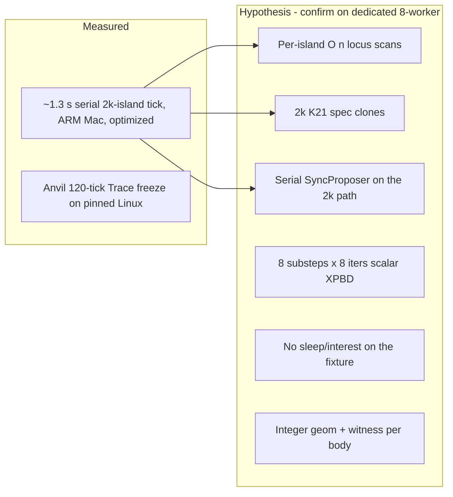
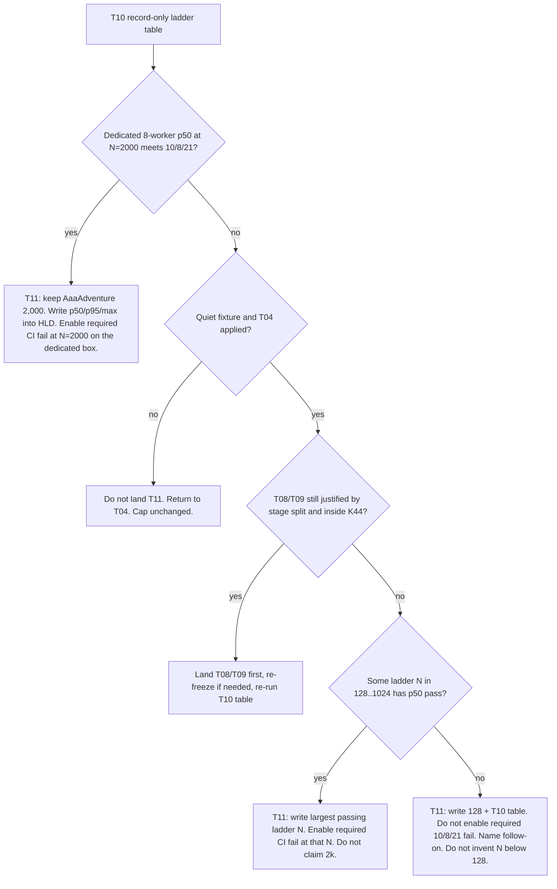
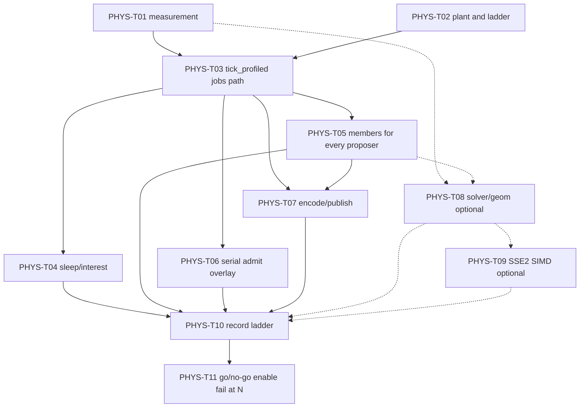

# Klotho Physics Production Throughput Plan

| Field | Value |
| --- | --- |
| Document | Physics production throughput — successor to PHYS-A01–A12 |
| Canonical path | [`docs/physics-throughput-plan.md`](physics-throughput-plan.md) |
| Author | Gal Katz |
| Date | 2026-09-17 |
| Status | Draft |
| Scope | First-title `RuntimeProfile::AaaAdventure` Phys timing: 10 ms propose join / 8 ms serial admit / 21 ms sim-thread critical path at 2,000 awake **bodies** |
| Preserves | Canon + Intent + Trace + Projection; K21 island-atomic admit; K25; K31/K39/K44; crate firewalls |
| Supercedes (timing only) | Treating PHYS-A12 capacity + frozen Trace as a throughput certification. PHYS-A12 remains the correctness/capacity gate. |
| Does not replace | [`docs/physics-animation-plan.md`](physics-animation-plan.md) (authority, geometry, character, vehicles, destruction) |
| HLD amendment | PHYS-T11 writes numbers or a lower cap into [`docs/hld.md`](hld.md). Landing this plan document is not that amendment. PHYS-A12 already records the remaining throughput gate. |

This is an engine plan a senior systems engineer can implement. It does not invent a second physics world, a parallel admit path, or a hashed third-party solver. It does not treat Anvil playability as AAA scale. Every PHYS-T PR leaves `main` green: 10/8/21 is enforced only after T11 chooses N.

---

## Overview

PHYS-A01–A12 landed the authority boundary: one quantized `Proposal::PhysIsland` per K58 island, shared integer geometry in `klotho-geom`, scalar XPBD in `klotho-phys`, island-atomic `CommitKernel` admission, Anvil combined goldens, and a pinned-Linux Trace freeze. That is correctness and **capacity**. It is not first-title timing.

The adventure profile in [`docs/hld.md`](hld.md) is `RuntimeProfile::AaaAdventure` at 30 Hz (33.3 ms). The sim-thread critical path is ingest + interest + partition + propose join + serial admit + publish, gated at **≤ 21 ms**. Propose join is **≤ 10 ms** (max of phys/motion/mind on 8 workers). Serial admit is **≤ 8 ms** for 2,000 awake **bodies**. Bodies are not islands. The capacity fixture `adventure_awake_body_capacity_admits_independent_islands` plants 2,000 independent relics and ticks them through `anvil_slice::tick`, which is a **serial** `SyncProposer` path. Local smoke on an optimized ARM Mac measured **~1.3 s** for that 2,000-island serial tick. Naive 1.3 s / 2,000 ≈ 0.65 ms per independent island. Even a real adventure room of 100–200 awake bodies would miss 21 ms on that curve. Anvil, Drift, and Ember can still be playable proving slices. That is not AAA.

This plan measures the right object on the right machine, then cuts cost in the order [`docs/physics-animation-plan.md`](physics-animation-plan.md) already allows: interest, sleep, bounded island policy, cheaper island setup, cheaper serial admit, cheaper encoding, then SIMD of the **same** scalar XPBD under K44. If the representative mixed scene still misses 10/8/21 at 2,000 bodies after that work, PHYS-T11 lowers the first-title awake-body cap with an HLD amendment and enables the required CI fail at the largest **passing** ladder N. If every ladder N including 128 misses, T11 still writes 128 plus the T10 table and does **not** enable a required 10/8/21 fail. Silent “we still claim AaaAdventure at 2k” is forbidden. A red required check that blocks the amendment PR is also forbidden. Do not invent an N below 128.

---

## Background & Motivation

### What PHYS-A12 actually certified

PHYS-A12, recorded in [`docs/hld.md`](hld.md) and [`docs/physics-animation-plan.md`](physics-animation-plan.md):

- Pinned Linux x86-64/FMA-off job (`.github/workflows/ci.yml` `phys-golden`) freezes the 120-tick Anvil Trace prefix. The **canonical literal** is the assertion in `engine/examples/anvil-slice/tests/release_acceptance.rs` under `KLOTHO_PINNED_PHYS`; HLD and this plan quote it. Current value: `9075e1b7db1a8374889ed3965aa4c65ec39d655bf9ffd3d8e77ba192b0763564`.
- Three-OS CI runs behavioral envelopes and **must not** assert the Phys prefix. Focused Phys tests retain one/eight-worker equality and the residual gate (p99 ≤ 1 mm, any sample ≤ 4 mm).
- Anvil resumes combined action/break/stack/push/platform from exact pause saves at ticks 3, 16, and 31.
- Captures replay across 30 boundaries (`repeated_captures_replay_and_report_bounded_workload`).
- A 2,000-body **independent-island** case verifies admission **capacity**.
- Save v2 records OS/CPU origin and refuses cross-platform load of movable-hull snapshots.

`phys-golden` today runs **debug** `cargo test -p klotho-phys` and `anvil-slice --test release_acceptance`. It does not run `--release` timing. A `--release` throughput step is new work in T01, record-only.

The HLD already says this is not a throughput certification. Do not argue it away. Do not treat PHYS-A12 as throughput-complete.

### The ship numbers (HLD performance model)

Adventure 30 Hz, 50k loci, **2k awake bodies** (not 2k islands), 8 workers. From [`docs/hld.md`](hld.md) §Performance model:

| Work | Thread | Budget | On sim critical path? |
| --- | --- | --- | --- |
| Ingest | sim | 0.3 ms | yes |
| Interest | sim | 0.3 ms | yes |
| Partition (K58 union-find on **phys bodies**) | sim (or 1 job) | ≤ 1.0 ms | yes |
| Phys+Motion+Mind propose 2k | 8 workers | ≤ 10 ms wall (max of the three) | **join ≤ 10 ms** |
| Serial admit ≤ 2k spatial + rites | sim | ≤ 8 ms (`Budget::AAA_ADVENTURE.us_sim = 8_000`) | yes |
| Publish CoW + rewind push | sim | ≤ 1 ms | yes |

**Critical path (no residency tick): 0.3+0.3+1+10+8+1 = 20.6 ms of 33.3 ms. Gate: ≤ 21 ms.**

Deterministic count/size caps fail closed. Wall-clock misses never change admission (K14). Required CI fail on 10/8/21 is enabled by T11 only at a **passing** ladder N, on the dedicated 8-core box, not by T10 and not on GitHub-hosted 2–4 vCPU runners. If the whole ladder misses, T11 writes 128 and leaves the fail record-only.

Shooter 60 Hz / join ≤ 4 ms / admit ≤ 5 ms is a **maintained regression**, not a first-title blocker (AAA-27). Infer stays default-off.

### Current tick paths (landed)

Two propose paths exist. They are not equivalent, and the 2,000-body fixture uses the slow one.

```mermaid
flowchart TB
  subgraph anvil [Anvil correctness path - stays serial]
    A1[partition] --> A2["CommitKernel::step with SyncProposer Phys"]
    A2 --> A3["Phys::propose walks view.loci, BTreeSet of island ids"]
    A3 --> A4["solve_island per id, serial"]
    A4 --> A5["serial admit_phys_island"]
  end
  subgraph runtime [AaaAdventure runtime path]
    R1[apply_interest] --> R2[phase_partition]
    R2 --> R3["ingest_island_jobs n_workers=8"]
    R3 --> R4["propose_islands steal queues"]
    R4 --> R5["concat island-id order, admit_key sort"]
    R5 --> R6["phase_step sync empty"]
  end
```



`anvil_slice::tick` (`engine/examples/anvil-slice/src/lib.rs`) is:

```rust
pub fn tick(k: &mut CommitKernel) -> TraceDelta {
    k.partition();
    k.step(Tick(1), Budget::AAA_ADVENTURE, &mut [&mut Phys])
        .expect("kernel")
}
```

That is `SyncProposer::propose`, not `IslandProposer::propose_island`. It does not call `apply_interest`. It does not call `ingest_island_jobs`. `FrameReport` is not produced; `us_propose` is therefore 0 by construction even if propose dominated the tick. `CommitKernel::step` already calls `world.snapshot()` before return, so `Sim::phase_step`’s `proj_us` is **propose (if sync) + admit + publish**, then compared to `Budget.us_sim` (an admit-only target). A second `kernel.snapshot()` after `proj_us` is sampled is untimed. `insert_locus` defaults `sleep_ticks = 0`, `sim_lod = Full`, `island_id = 0` (not `NO_ISLAND` until partition). The capacity fixture never classifies lod because `tick` never calls `apply_interest`, and because default lod is already Full.

**`anvil_slice::tick` stays serial** for PHYS-A12 Trace freeze. Throughput work does not migrate it onto jobs.

The production path is duplicated, not shared: `tick_profiled` is a **private** function in `engine/crates/klotho-runtime/src/main.rs`; `klotho-server` copies the loop. Neither is `Sim::tick_profiled`. The loop is interest → partition → `ingest_island_jobs(profile.workers(), &[phys, motion, mind])` → `phase_step(..., &mut [])`. `RuntimeProfile::AaaAdventure.workers() == 8`. That path is **not** what the 2,000-island capacity test exercises.

`engine/examples/anvil-slice` is on `check_gameplay_jobs` and `check_no_stream` in `scripts/ci/forbidden-imports.sh`. It cannot import `klotho-jobs` or `klotho-runtime` (`klotho-runtime` always depends on stream/manifest/infer). Throughput tests live in `klotho-runtime` (lib + integration tests). Anvil remains a correctness slice.

### Pain this creates

1. **Wrong object.** 2,000 independent islands is the worst case for serial admit (2,000 K21 transactions) and the best case for parallel propose (no coupling). It is a stress fixture. Shipping against it as if it were the adventure room is how you either panic or declare victory incorrectly.
2. **Wrong machine.** The 1.3 s number is ARM Mac, optimized, serial. GitHub-hosted `ubuntu-24.04` is 2–4 vCPU, not 8 cores. The timing authority is a **dedicated** pinned Linux x86-64/FMA-off **8-core** box, the same ISA as dedicated servers (K44).
3. **No stage budget in CI.** PHYS-A11 records proposer-stage `SolveTimings` (broad/character/vehicle/narrow/constraint/encode) on captures. `repeated_captures_replay_and_report_bounded_workload` only asserts quantile **ordering** and payload caps, not microseconds. `FrameReport.over_budget` is `proj_us > us_sim` and is not wired to the 2k fixture.
4. **Setup cost scales with island count, not body count.** `collect_members` / `collect_bodies` / `validate_phys_island` each walk `view.loci()` per island. `Motion::propose_island` and `Space::propose_island` do the same. `Mind::propose_island` calls `plan(view)` per island. `ingest_island_jobs` re-groups islands from loci even though `phase_partition()` already returned `Vec<(u16, Vec<Sigil>)>`. `propose_one` ignores the member `Vec`. 2,000 islands × ~10k loci is tens of millions of visits.
5. **Sleep and interest exist and are unused on the proving tick.** K58 already refuses to seed `sleep_ticks >= 120` independent bodies. `klotho-interest` already maps Far/Dormant. The capacity fixture plants falling relics at `y = 500` with default sleep 0 and never classifies lod.

For an AAA engine this **is** a first-title Phys release blocker.

---

## Goals & Non-Goals

### Goals

- Hit **10 / 8 / 21** on a **representative** mixed scene of up to 2,000 awake bodies, on a dedicated pinned Linux x86-64/FMA-off **8-core** box, 8 workers, 8-worker Trace ≡ 1-worker Trace — or publish the largest ladder N that does.
- Install measurement **before** solver micro-opts. A PR that “makes it faster on a Mac” without dedicated 8-worker evidence is out of order. A PR that fails `main` on 2k before T11 chooses N is also out of order.
- Report two fixtures separately: representative (ship-gate object) and 2,000 independent islands (stress / overhead only). Run a scale ladder 128 / 256 / 512 / 1024 / 2000 with the same mix **proportions**.
- Cut awake complexity via interest, sleeping, and fail-closed island caps **before** weakening the solver contract.
- Keep Anvil/Drift/Ember/Ash/Hearth goldens as correctness. `anvil_slice::tick` stays serial. T11 enables a required throughput fail only at a passing ladder N, without changing admission.
- Preserve Anvil Trace (canonical test literal) unless a PR is explicitly a determinism-affecting solver change with a re-freeze rule. Re-freeze updates test + HLD + this plan in the same PR. Only `phys-golden` with `KLOTHO_PINNED_PHYS=1` may mint a new prefix. Hearth/Ash remain phys-off.
- After the profile: either publish 10/8/21 evidence at 2k bodies, or publish a lower first-title cap with an HLD amendment. Never silent.

### Non-goals

- Parallel admit.
- `f32` on the commit path or in Projection.
- Jolt, Rapier, PhysX, or any FFI solver as hashed truth.
- A second physics world, a hidden warm-start cache, or lambdas that are not Projection columns.
- Splitting oversize islands (K58: omit, `IslandTooLarge`).
- OS-varying ISA / FMA-on for authoritative Phys.
- Weakening K21 island-atomic admit, K25 (no HashMap iteration on the commit path), or crate firewalls (`klotho-sim` ↛ infer/render/mind/space/motion/jobs/stream/phys; `klotho-commit` ↛ phys; gameplay slices ↛ jobs/stream).
- Growing Hearth. Turning Anvil into title content. Ash remains the ontology leak detector (K26).
- First-title shooter 60 Hz / 4 ms join / 5 ms admit as a release blocker.
- Three-OS Phys Trace equality.
- Runtime infer, console cert, GPU particles, marketplace/UGC, 64-player scale.
- Distaff UI work in this series.

---

## Proposed Design

### 1. Measure the right object first

PHYS-T01 lands a measurement harness. Later PRs do not guess.

**Timing authority (ship number).** A dedicated pinned Linux box, not GitHub-hosted `phys-golden`:

| Property | Ship-number box | GHA `phys-golden` |
| --- | --- | --- |
| OS / arch | Linux x86-64 | `ubuntu-24.04` x86-64 |
| ISA flags | `-C llvm-args=--fp-contract=off -C target-cpu=x86-64 -C target-feature=-fma` | same (K44) |
| Cores | **≥ 8 physical cores**, `n_workers = 8` (never `available_parallelism`) | 2 vCPU (private) / 4 vCPU (public) |
| Turbo / SMT | Documented; turbo off if the box cannot hold frequency | n/a |
| Role | 10/8/21 evidence; T11 required fail only if some ladder N passed | Trace freeze (debug, as today) + T01 `--release` **record-only** canary |
| Owner | First-title Phys owner (engine), named in T01 before any required fail exists | CI |

Local ARM Mac numbers remain smoke. Eight steal-queue workers on a 2–4 vCPU GHA runner measure oversubscription, not the HLD model. `n_workers = min(8, available_parallelism)` is allowed **only** as a local smoke default; it is never the ship number.

**Worker matrix.** Every throughput golden runs `n_workers = 1` and `n_workers = 8`. 8 ≡ 1 Trace on the same fixture remains a merge gate (AAA-04 / K34). Timing is reported for both; the **ship number is 8-worker on the dedicated box**. 1-worker exists to stop “just use 8 workers and hope” from hiding serial-admit cost. GHA may run 1-worker `--release` smoke; 8-worker on GHA is informational.

**Stages.** Extend, do not replace, PHYS-A11 `SolveTimings` / `PerformanceSummary`. Several are missing from `FrameReport` today.

| Stage | Where it lives today | What T01 adds |
| --- | --- | --- |
| Ingest | untimed | `us_ingest` on `FrameReport`, filled by runtime |
| Interest | untimed `apply_interest` | `us_interest`, filled by runtime |
| Partition | untimed `kernel.partition` | `us_partition`, filled by sim around `phase_partition` |
| Broad / character / vehicle / narrow / constraint / encode | `SolveTimings` per island, capture-only | Aggregated in **`klotho-runtime`**, not on `FrameReport` (sim ↛ phys) |
| Propose join | `ingest_island_jobs` returns µs into `us_propose` | Keep; assert it is filled on the runtime jobs path |
| Witness + speculative apply + Laws | folded into `proj_us` | `CommitKernel::last_step_timings()` (unhashed, same pattern as `last_rewind_ticks_used`); **not** on `TraceDelta` |
| Publish CoW | `step` already snapshots before return; `proj_us` includes it; a second `kernel.snapshot()` after `proj_us` is untimed | `last_step_timings().us_publish` times the snapshot **inside** `step`. Do not double-count. Optionally stop the extra snapshot in `phase_step` if it is redundant |
| Critical-path sum | not computed | `us_critical` filled by runtime as ingest+interest+partition+propose+admit+publish |

`proj_us` remains the wall of `kernel.step` (today: sync propose if any + admit + publish). Honest T01 docs: on Anvil, `over_budget` is **not** “admit only.” T01 **does not change** `over_budget = proj_us > budget.us_sim`. New `over_budget_admit` / `over_budget_propose` / `over_budget_critical` flags are informational until T11.

Quantiles are required. No gate may be expressed only as average frame time. **N ≥ 20 measured ticks** after 2 warmup ticks. Fail (when T11 enables it) on **p50**; p95 and max are informational. `summarize_timings` uses `values[(len-1)*n/100]`, so p95 of 5 samples **is the max** — that is why N=5 p95 is forbidden as a gate.

Each sample also records body count, contact count, constraint count, island count, max island size, and sleep/Full/Far/Dormant histograms.

`Instant::now` around proposer stages is already disposable and unhashed. Kernel telemetry must stay the same: never in Proposal, Trace, or Projection.

**CI posture.**

- T01–T10: record and publish numbers. **Do not fail `main` on 10/8/21.** T01 fails only if the harness itself is broken (missing stages, 8≢1 on correctness fixtures, timings not populating).
- GHA `phys-golden` keeps debug Trace freeze. T01 adds a **new** `--release` record step (not an extension of an existing timing run). That step is `continue-on-error` / non-required.
- Dedicated 8-core box: T01 lands the job script; T10 publishes the ladder table; T11 makes the chosen-N check required.

### 2. Fixtures: stress, representative, quiet, ladder

Throughput fixtures are planted by one function tests can hash, owned by `klotho-runtime` (see T02). Not `anvil-slice`. Not title content. No new gameplay ontology: Physics seed facts, Driveable, breakable `PartOf` already exist.

#### Stress fixture (not the ship gate)

Keep `adventure_awake_body_capacity_admits_independent_islands` in **anvil-slice** as the serial capacity test (PHYS-A12). Add a **runtime** jobs-path clone:

- 2,000 independent dynamic relics, hull `AabbMm { min: (-100,0,-100), max: (100,200,100) }`, 1 m X spacing, `y = 500`, `sleep_ticks = 0`, default `SimLod::Full`.
- **Do not call `apply_interest`.** 1 m × 2,000 is 2 km; default Full Chebyshev 20 m would Far almost everything and destroy the stress object.
- Proves we can **admit** 2,000 island transactions and that parallel propose scales when there is nothing to couple.
- 1-worker and 8-worker on the jobs path (T03).
- Publish propose/admit/critical numbers. They are **not** the AaaAdventure ship number.
- Report island count ≥ 2,000 if the clone still sits on extra occupancy; the runtime clone should be a vacuum Place + floor so the count is exactly 2,000 islands.

#### Representative fixture (the 10/8/21 object at N=2000)

One Place, `RuntimeProfile::AaaAdventure`, 30 Hz, Infer off. Contact-stable rest layout so K58 membership does not flicker across measured ticks.

**Plant constants (frozen):**

| Item | Value |
| --- | --- |
| Crate hull (piles / Anvil stack / pusher crates / broken pair) | `AabbMm { min: (-200, 0, -200), max: (200, 400, 200) }` (Anvil `box_hull(200, 400, 200)`) |
| Independent-prop hull | `AabbMm { min: (-100, 0, -100), max: (100, 200, 100) }` (200×200×200 mm); XZ centers **500 mm** |
| Character hull | Anvil `box_hull(300, 1800, 300)` = `AabbMm { min: (-300, 0, -300), max: (300, 1800, 300) }` |
| Character physics | `BodyPhysics { shape: Capsule, character: Some(CharacterPhysics::default()), .. }` (`roots[0].z = 20`, `step_mm = 250`) |
| K58 character pad | `posed_bounds` adds `root_extent + 1000` mm XZ = **1020 mm** and `step_mm` on Y. Posed AABB half-extent XZ = 300+1020 = **1320 mm**. `AabbMm::intersects` is closed (shared faces count). |
| Vehicle | one Relic chassis, `BodyPhysics { vehicle: Some(VehiclePhysics::default()), .. }` (not a `BodyPhysics::vehicle` constructor). Hull = phys `chassis_hull()`: `min (-400, 100, -800)`, `max (400, 500, 800)`. Wheels are queries, not members. |
| Floor | one `LocusKind::Place`, `BodyMode::Static`, `OpaqueClosed`, AABB XZ ±30_000 mm, Y [-200, 0] |
| Walls | 32 `OpaqueClosed` static relics, 200 mm thick, on the Full-square perimeter; occupancy ≠ island |
| Stairs / slopes | 4 Place hulls (Anvil 200/250 mm and 30°/50°), occupancy |
| `InterestConfig` | defaults: `full_mm = 20_000`, `far_mm = 80_000` Chebyshev XZ |
| Sleep / lod (awake set) | `sleep_ticks = 0`, `SimLod::Full` |
| Support | all dynamic relics rest on the floor (`pose.y = 0` for hulls with `min.y = 0`) |

**Observers and actor spacing (K58).** `classify` treats every `LocusKind::Actor` as an observer. Eight capsules therefore expand the Full union. **Do not plant them 400 mm apart** — that is one island. Two Anvil hulls with the 1020 mm pad have posed AABBs that intersect unless center gap **> 2640 mm** (1320+1320; closed `intersects`). Frozen pitch: **2800 mm**. Compact **2×4** cluster centered on the origin:

| Actor | Pose XZ mm | Role |
| --- | --- | --- |
| 0 | (−4200, −1400) | pusher + crate |
| 1 | (−1400, −1400) | solo |
| 2 | (1400, −1400) | solo |
| 3 | (4200, −1400) | pusher + crate |
| 4 | (−4200, 1400) | solo |
| 5 | (−1400, 1400) | solo |
| 6 | (1400, 1400) | solo |
| 7 | (4200, 1400) | solo |

Outermost Chebyshev from origin is 4200 mm. Default Full ring still covers `max(|x|,|z|) ≤ 15_000` (15 m < 20 m − 4.2 m). **All 2,000 awake bodies stay inside that 15 m square.** The sentence “one player at the origin, everyone else is not an observer” is false and is not used.

**Character coupling (only intended overlaps).** **Two** pushers. Each pusher crate sits at actor + `(450, 0, 0)` mm so the **unpadded** hulls overlap 50 mm (character max x = actor+300, crate min x = actor+250). The crate is inside that actor’s posed_bounds; that is the size-2 island. The other six actors have no crate. Motion emits no competing `MotionDelta` (K63; `Motion::propose_one` already skips `character_physics`).

**Exclusion zones.** No independent prop, pile, stack, broken-pair relic, or chassis may have a posed AABB intersecting any character `posed_bounds` (solo: ±1320 mm XZ from that actor; pusher: union of that pad and the crate hull). `plant_throughput` skips grid cells that fail this test. Inter-pile gap: outer posed AABBs of two piles are separated by **> 400 mm** (no shared faces; internal pile spacing stays 399 mm). Independent props at 500 mm centers also skip the chassis posed AABB (`±400 × ±800` mm XZ).

**Anchor poses (XZ mm, all `y = 0` except stack layers).** Chassis at (0, 10000). Already-broken pair at (0, 6000) and (300, 6000) (100 mm unpadded overlap). Anvil 5-stack at (8000, 0). Size-32 pile origins (−12000, −12000) and (12000, −12000). Remaining piles on a 4000 mm lattice in the 15 m square, skipping any origin whose pile footprint would violate exclusion or the >400 mm inter-pile gap. Independent-prop grid fills leftover cells at 500 mm. If anything still merges, fix that origin — do not relax the histogram assert.

**Breakable.** Plant **already broken**: two relics, `constraint_state.broken = true`, no live `PartOf`, no `ConstraintBreakClaim` this run. PHYS-A10 fragment spawn (0..=64) must not fire on a measured tick or the 2,000 / histogram object moves. The pair is a size-2 island of two dynamic relics whose posed AABBs overlap. Correctness of live breaks stays on Anvil goldens, not on this gate.

**Vehicle / Mind / Motion workload (defined join object).**

- Proposer list is production: `&[&phys, &motion, &mind]` (same as `tick_profiled` today).
- Each measured tick the test writes `PhysRequest { lin: 0, ang: 0 }` on the chassis so the PHYS-A09 prepare/wheel-query path runs and the island stays size-1 (idle on the floor). The test owns that write; Mind does not mint it.
- No `MindSpec` is bound. `Mind::propose_island` still runs; with zero agents `plan` is O(0). T05 iterates agents whose locus is in `members` (K22: no cached plan).
- Motion is present so join time includes it; it skips the eight driven actors and finds no other Actors.

**Island-size histogram at N = 2,000 (frozen, asserted after warmup and on every measured tick):**

| Island size | Islands | Bodies | Construction |
| --- | --- | --- | --- |
| 32 | 2 | 64 | 4×4×2 crate piles; XZ center spacing **399 mm** (1 mm posed-AABB overlap); layer 2 at `y = 400` |
| 16 | 8 | 128 | 4×4×1 piles; same 399 mm spacing |
| 8 | 16 | 128 | 4×2×1 piles |
| 4 | 32 | 128 | 2×2×1 piles |
| 5 | 1 | 5 | Vertical Anvil-class stack, 1 mm Y overlap |
| 2 | 3 | 6 | 2 actor+crate (50 mm overlap) + 1 already-broken pair |
| 1 | 1,541 | 1,541 | 6 solo characters + 1 vehicle + 1,534 independent props |
| **Total** | **1,603** | **2,000** | |

Independent props use the 200 mm hull at **500 mm** XZ centers (posed AABB ±100; 500 > 200+200, so they do not touch). 15 m square / 500 mm ≈ 60 cells/side = 3,600 slots, enough after exclusion holes around the eight character pads and the chassis. Pile crates keep the 400 mm Anvil hull so flood-fill overlap is well-defined.

**Insert order (T07 dense CoW).** Occupancy first (floor, 4 stair/slope Places, 32 walls). Then the **2,000 awake bodies as one contiguous `PackedIx` run** (characters, crates, piles, stack, broken pair, chassis, independent props). Then 4,000 Far, then 4,000 Dormant. Far/Dormant must not interleave the awake run.

Far / Dormant extra loci (not in the 2,000):

- 4,000 Far relics at `x = 50_000` mm (Chebyshev 50 m: outside Full 20 m, inside Far 80 m), 500 mm grid, `sleep_ticks = 0`.
- 4,000 Dormant relics at `x = 120_000` mm (120 m > 80 m), same grid.

Sleep ratio **among the 2,000 is 0%**. They are the awake set. Sleep is how we avoid having 2,000 awake; it is not how we fake the 2,000 gate.

**Tick protocol.** Warmup 2 ticks (contacts settle on the floor). Measure ticks 3..=22 (**N = 20**). Assert the histogram **after warmup and on every measured tick**. If a pile splits or merges, the plant is wrong — fix spacing, do not relax the assert. 1-worker and 8-worker. `--release`. Ship number on the dedicated 8-core box.

**`plant_throughput(n)`** is one function. Tests hash its world (sigil order, poses, hulls, bindings, sleep, lod) after plant, before ticks.

#### Quiet companion (workload-reduction proof, never the cap)

Same 10k loci geometry. 200 Full-awake (`sleep_ticks = 0`) including the 8 characters, vehicle, one size-16 pile, rest 1-body. 1,800 relics in the Full square with `sleep_ticks = 120`, zero vel, on the floor (not K58 seeds unless flood-filled). 8,000 Far/Dormant as above. Proves T04 cuts island count. **Quiet 200 is not an acceptable AaaAdventure cap** and is not a T11 candidate.

#### Scale ladder (T11 input)

T02 plants `plant_throughput(n)` for **n ∈ {128, 256, 512, 1024, 2000}**. Mix **proportions** of the N=2000 histogram, integer-rounded, then pad 1-body props to n. Always keep 8 characters, 1 vehicle, and the already-broken pair when `n >= 128`. Keep the size-5 Anvil stack when `n >= 256`.

| N | ×32 piles | ×16 | ×8 | ×4 | ×5 | actor+crate | break pair | vehicle | solo char | 1-body props | bodies |
| --- | --- | --- | --- | --- | --- | --- | --- | --- | --- | --- | --- |
| 128 | 0 | 0 | 1 | 2 | 0 | 2 | 1 | 1 | 6 | 99 | 128 |
| 256 | 0 | 1 | 2 | 4 | 1 | 2 | 1 | 1 | 6 | 190 | 256 |
| 512 | 1 | 2 | 4 | 8 | 1 | 2 | 1 | 1 | 6 | 366 | 512 |
| 1024 | 1 | 4 | 8 | 16 | 1 | 2 | 1 | 1 | 6 | 782 | 1024 |
| 2000 | 2 | 8 | 16 | 32 | 1 | 2 | 1 | 1 | 6 | 1534 | 2000 |

Packing rule when N shrinks: same hulls, 2800 mm actor pitch, exclusion zones, and spacings; fewer piles; Full-square occupancy still 15 m so interest cost stays comparable; Far/Dormant stay 8,000 for every N (partition/interest must pay real occupancy). T11 writes the **largest N whose dedicated 8-worker p50 meets 10/8/21** into the HLD simulation-scale row, or **128 with no required fail** if none pass. Quiet 200 is not on this ladder.

### 3. Cost-center diagnosis (hypothesis vs measured)

T01 exists because the following is **hypothesis**, ranked by what the landed code makes likely. Do not skip T01 to start SIMD.



| Rank | Cost center | Evidence in tree | Status |
| --- | --- | --- | --- |
| 1 | **Per-island `view.loci()` scans** | `solve_island` → `collect_members` / `collect_bodies` filter every locus. `collect_bodies` nested-walks loci for `AttachedTo` children. `validate_phys_island` rebuilds expected membership from `view.loci()`. `ingest_island_jobs` **re-groups** islands from loci instead of using `Partition.islands`. `Phys::propose` builds a `BTreeSet` of ids the same way. `Motion::propose_island` / `Space::propose_island` scan `view.loci()` per island. `Mind::propose_island` calls `plan(view)` per island. `propose_one` ignores the member `Vec`. 2,000 islands × ~10k loci is tens of millions of visits. | **Hypothesis.** Quadratic in island count. T03 threads membership into jobs; T05 makes **every** `IslandProposer` iterate members. |
| 2 | **Serial K21 spec per island** | `WorldMut::begin_spec` clones `Projection`. Columns are `CowCol` (`COW_CHUNK = 256`) plus `Arc<BTreeMap>` identity maps. Clone is an Arc bump; each `apply_body` `make_mut`s dirty chunks. `commit_spec` installs the spec as live. Next island repeats. Kernel `written: BTreeMap<(u128,u8),()>` grows every admit (distinct from `SpecDelta.written: BTreeSet<Sigil>`). | **Hypothesis.** Dominant on the stress fixture; still large on representative. |
| 3 | **2k path is serial propose** | `anvil_slice::tick` uses `SyncProposer` and **stays that way** for Trace freeze. Jobs exist (`klotho-jobs::propose_islands`) and runtime uses them. The capacity test does not. Runtime throughput tests must. | **Hypothesis, nearly certain.** T03 proves it on runtime tests. 8-worker cannot help admit. |
| 4 | **Fixed 8×8 XPBD even for 1-body islands** | `SUBSTEPS = 8`, `ITERS = 8` in `klotho-phys/src/solver.rs`. Isolated falling body still integrates gravity, rebuilds contacts against occupancy, and runs 64 contact/joint iterations. `Instant::now` around every stage adds syscall noise at 2k islands. | **Hypothesis.** Solver time vs setup time is exactly what T01 must split. |
| 5 | **Witness + integer geom on admit** | `check_phys_body` re-cooks shapes, swept-unions AABBs, sorts `space_candidates`, runs `swept_against` per `OpaqueClosed` occupant. Encode already ran `hits_closed_oriented`. Dual-truth is required (K61/K62); the cost is real. | **Hypothesis.** Cannot skip; can batch occupancy queries and reuse cooked shapes for the tick. |
| 6 | **Sleep/interest unused** | Capacity bodies are planted awake and falling. `anvil_slice::tick` never calls `apply_interest`. Quiet independent sleepers are already **not** K58 seeds (`is_phys_awake` ⇔ `sleep_ticks < 120`). SyncProposer still only proposes ids it finds; `NO_ISLAND` is skipped. The fixture never creates sleepers. | **Hypothesis.** T04 proves the quiet companion; it does not shrink the 2k-awake gate. |
| 7 | **Alloc / copy** | `propose_one` allocates a fresh `AdmitBuf` per island per proposer. `Proposal::PhysIsland` owns `Vec`s for members/bodies/contacts/constraints/breaks. `SolveOut.proposals: Vec<Proposal>`. `phase_step` snapshots again after `step` already published. | **Hypothesis.** After 1–6. |
| 8 | **FMA-off scalar f32 XPBD, no SIMD** | `klotho-phys` is `#![forbid(unsafe_code)]` **and** `[lints] workspace = true` with `engine/Cargo.toml` `unsafe_code = "forbid"`. Allowlisted crates set `[lints.rust] unsafe_code = "allow"` in their own Cargo.toml; phys does not. CI pins `-C target-feature=-fma`. `core::simd` / `portable_simd` is **not stable on 1.98.0**. | **Hypothesis.** Last, after numbers. Same ISA. T09 uses `std::arch` SSE2-only. |

**Measured (do not inflate):** ~1.3 s for a synthetic 2,000-island **serial** tick on a local optimized ARM Mac; Anvil Trace freeze on pinned Linux debug `phys-golden`; capture stage quantiles exist but are not budgeted; 8≡1 holds on focused Phys/Anvil correctness tests, not on the 2k timing path.

Naive 0.65 ms/island is a smoke signal, not a model. Setup cost that is O(islands × loci) will look like “per-island overhead”; solver cost that is O(substeps × contacts) will look different on size-32 piles vs size-1 props. T01’s stage split is the only honest model.

### 4. Workload reduction (before weakening the solver)

Order is mandatory. Do not SIMD a 2,000-island scene that interest would have cut to 200.

1. **Interest.** Runtime already calls `apply_interest`. Throughput ticks must too (representative and quiet; **not** stress). `SimLod::Dormant` emits no Phys proposal. `SimLod::Far` is not a K58 seed (`is_seed` requires Full). Far bodies stay in `space_ix` as occupancy. Do not island-wake `NO_ISLAND` (K58).
2. **Sleep.** `SLEEP_AFTER_TICKS = 120`. Quiet supported bodies increment `sleep_ticks` and zero vel at 120. Independent sleepers are not seeds; they join an island only via flood-fill from an overlapping awake body (crate piles). **Do not propose sleeping independent islands** — they should already be `NO_ISLAND`. T04 adds an explicit assertion: a sleeper with no overlapping awake neighbour produces zero `PhysIsland` for that sigil.
3. **Fail-closed caps.** `MAX_ISLAND_SIZE = 256`, `MAX_PHYS_ISLAND_BODIES = 256`, `MAX_PHYS_ISLAND_WRITE_LOCI = 512`. Oversize omits the whole group (`IslandTooLarge`). Do not split. A title that authors a 300-body rubble pile fails closed; it does not get a second solver.
4. **Do not lower iteration quality to hide 2,000 isolated sleepers.** If they are sleepers, they should not be solved.

Interest and sleep **reduce how often** the 2k gate is hit. They do not redefine the gate. Quiet 200 is not the cap.

### 5. Parallel propose that already exists

K34 is landed. T03’s job is to put the **runtime** 2k proving surface on it. Anvil correctness stays serial.

`klotho-jobs::propose_islands` already:

- Serial path for `n_workers == 1` (no steal).
- Steal deques for `n_workers > 1`, `MAX_WORKERS = 64`.
- Per-worker `AdmitBuf`, concat by island id, `admit_key` total sort.
- `&self` proposers (K22).

Fixes required, not a new jobs crate:

- Extract **`pub fn tick_profiled`** (or `tick_throughput`) in `klotho-runtime` **lib.rs**. `main.rs` and `klotho-server` call it. Integration tests call it. Signature includes `n_workers`, proposer slice, and the partition list.
- Throughput fixtures call that function, never `SyncProposer::propose`, never a helper in `anvil-slice`.
- `ingest_island_jobs` must consume `Partition.islands` from this tick, not re-walk `view.loci()`. `Sim::phase_partition` already returns `Vec<(u16, Vec<Sigil>)>`. Thread it through. `propose_islands` must pass `&[Sigil]` into proposers (T05).
- 8 ≡ 1 Trace on representative and stress is a merge gate of T03. Timing need not pass 10 ms yet.
- `FrameReport.us_propose` must be non-zero on these tests.

Parallel propose does **not** help serial admit. ~1,600 island transactions still join onto the sim thread.

### 6. Island setup and solver/geom cost

**Setup (T05, no Trace change if membership bits are identical).**

T03 threads `phase_partition()`’s `Vec<(u16, Vec<Sigil>)>` into `ingest_island_jobs`. T05 passes `&[Sigil]` into **every** `IslandProposer`, not Phys only:

- `Phys::solve_island` uses members. Child `PhysRequest` walks `view.related(s, Rel::AttachedTo)` / `PilotedBy` (already on `WorldView`), not every locus.
- `Motion::propose_island` / `Space::propose_island` iterate `members`, not `view.loci()`.
- `Mind::propose_island_members` iterates bound agents (`Mind`’s existing agent list, each with a `locus`) whose locus is in `members` and plans **those** only. **No** tick-cached plan, **no** `Mutex`, **no** `prepare` slot (K22 `&self`). Runtime may call `plan(view)` once on the sim thread **instead of** registering Mind as an island proposer; it must not do both. Empty agent lists stay O(0).
- Kernel `validate_phys_island` compares proposed members to live island ids of **those** sigils, not a full locus scan. Stale membership still rejects `WitnessMismatch`.

`collect_statics` already uses `space_candidates`. Solver occupancy inflate for character/vehicle is **±2000 mm XZ, ±1000 mm Y** in `solver.rs` (`collect_statics`). Partition `posed_bounds` pad for characters is **not** 2 m: `extent.max(root xz) + 1000` mm XZ and `step_mm` on Y. Vehicle inflate is not in `posed_bounds`. Keep those bounds; do not “unify” them into a slogan 2 m.

**Solver (T08, after numbers, optional).**

Keep one scalar XPBD. Legal levers, in order:

1. Do not rebuild disposable scratch (`Vec<Body>`, contact `Vec`) from heap per island if a worker-local bump/arena can reset. Output must not depend on pool identity (K25).
2. Broadphase: body-body is currently O(n²) `geom_overlap` inside the island. Fine for n≤32; the size-32 piles need a deterministic integer grid or sweep, sorted by Sigil, not a HashMap.
3. Narrowphase: `klotho-geom` integer SAT (`contact` / `manifold`). Cooking the same `Shape` every overlap is waste; cook once per body per tick.
4. Iteration policy: **changing `SUBSTEPS`/`ITERS` is a determinism-affecting solver change.** Allowed only with residual-gate proof, 8≡1, and an Anvil Trace re-freeze rule. Do not drop stacking quality to buy the 1-body path. A per-island iteration cap that depends on island size is a silent gameplay change — forbidden unless Canon/profile declares it and goldens move.
5. Early-out for empty contact sets after the first substep of a 1-body island that has no occupancy hit: still integrate gravity/sleep, skip 7×8 contact iterations. **This changes quantized pose if the skipped iterations would have depenetrated.** Prove residual envelope or do not land it.

**SIMD (T09, last, optional).**

K31/K39/K44 already allow SIMD of the **same** scalar XPBD, identical ISA in CI and every dedicated server. T09 must:

1. Set `[lints.rust] unsafe_code = "allow"` on `engine/crates/klotho-phys/Cargo.toml` (workspace `unsafe_code = "forbid"` will ignore a crate `#![allow]` otherwise). Pattern: `klotho-jobs`, `klotho-stream`, `klotho-infer`, `klotho-render`, `klotho-audio`, `klotho-platform`.
2. Lift the crate attribute to `#![allow(unsafe_code)]`.
3. Use **`std::arch` SSE2-only** on the pinned 1.98.0 toolchain. No `core::simd` / `portable_simd` (not stable on 1.98). No AVX, no FMA, no `target-cpu=native`, no OS-varying dispatch.
4. Scalar lane remains the reference; SIMD must match it bit-for-bit on the pinned image (or the PR is a re-freeze with residual proof).
5. Miri is N/A for `std::arch` SIMD. Clippy / workspace forbid is the real gate. Document each unsafe block.

`klotho-geom` stays `forbid(unsafe_code)` unless a later RFC allowlists it the same way — integer SAT SIMD is not the first bet.

### 7. Serial admit, witness, encoding, publish

Parallel admit is forbidden. The work is to make **one** island transaction cheap enough that ~1,600 of them fit in 8 ms (~5 µs each). That is tight. It is also why T01 must say whether admit is 8 ms or 800 ms today.

**Admit (T06).**

- Do not clone identity maps that cannot change this island (`by_sigil`, `rels`, `qty`, `space_ix`) more than an Arc bump — they already are `Arc`. Measure whether `CowCol` clone + `make_mut` of 256-row pose/vel/sleep chunks is the bulk. If it is, a spec overlay that journals dirty **rows** (not 256-row chunks) for the island write set is legal: drop = rollback (K21), commit copies rows into live columns. That is still serial, still atomic per island, still no partial visibility.
- `validate_phys_island` membership: see T05.
- Reuse cooked shapes for witness. `check_phys_body` may not skip the swept test.
- Kernel `written: BTreeMap<(u128,u8),()>` is K25-legal (BTree). Pre-size. Avoid per-body `Vec` churn in `phys_write_cells`. Do not confuse it with `SpecDelta.written: BTreeSet<Sigil>`.
- Laws still run in `(LawId, body Sigil)` order against the complete speculative island. Do not skip Laws to save µs.

**Encoding (T07).** Independent of T06.

- Worker-local `AdmitBuf` reused across islands (clear, do not new).
- `Proposal::PhysIsland` field `Vec`s sized from partition membership. No change to wire tags or caps.
- Encode `HullWitness` without a second occupancy walk if the solver’s last broadphase already produced the hint; the kernel still re-derives swept (K24).

**Publish (T07).**

- `World::snapshot` already shares clean CoW chunks and already runs **inside** `CommitKernel::step`. Time that. 2,000 pose writes dirty `ceil(2000/256) ≈ 8` chunks **per column** if packed densely; scattered PackedIx dirties more. Pack the representative fixture densely. Do not clone Trace/Intent.
- `us_publish` is the 1 ms gate (informational until T11). If publish misses, that is a CoW packing bug, not a reason to skip snapshots.

### 8. Go / no-go (does not deadlock `main`)

T10 **always merges green**. It publishes the ladder table from the dedicated 8-core box (and a GHA record-only canary). Over-budget at 2,000 is a row in that table, not a red required check.

T11 is the single product PR:



“Ship Anvil, claim 2k” is the option this plan exists to kill. A red T10 that cannot merge, blocking T11, is also forbidden. Inventing a cap below the ladder is also forbidden.

If the cap drops to a **passing** N, shooter 1k combat-awake remains a maintained regression with its own 4/5/11 ms budget and is not silently retargeted. Quiet 200 is never N. If even 128 misses, the HLD row becomes 128 with evidence; required 10/8/21 stay off until a follow-on (integer XPBD, a later parallel-admit RFC, or a publisher call) exists.

---

## API / Interface Changes

No author-facing Distaff API. Designers still do not learn `AdmitBuf`. Engine surfaces:

### `FrameReport` (`klotho-sim`) — phys-agnostic

Today:

```rust
pub struct FrameReport {
    pub phase: Phase,
    pub delta: TraceDelta,
    pub snap_bytes: u32,
    pub proj_us: u32,      // kernel.step wall: sync propose (if any) + admit + publish
    pub us_propose: u32,   // jobs path only
    pub over_budget: bool, // proj_us > Budget.us_sim  — T01 does not change this predicate
}
```

T01 extends with telemetry-only fields (not hashed, no phys types):

```rust
pub struct FrameReport {
    // existing fields, including over_budget as today
    pub us_ingest: u32,
    pub us_interest: u32,
    pub us_partition: u32,
    pub us_propose: u32,
    pub us_witness: u32,   // from CommitKernel::last_step_timings
    pub us_admit: u32,     // serial admit excluding publish
    pub us_publish: u32,   // snapshot already inside step
    pub us_critical: u32,  // filled by runtime
    pub over_budget_admit: bool,     // informational until T11
    pub over_budget_propose: bool,
    pub over_budget_critical: bool,
    pub n_islands: u32,
    pub n_awake_bodies: u32,
    pub max_island_size: u32,
}
```

**Do not** put `PerformanceSummary` on `FrameReport`. `klotho-sim` depends only on commit/core/trace/world; `scripts/ci/forbidden-imports.sh` `check_no_phys engine/crates/klotho-sim`. `klotho-phys` depends on `klotho-motion`. A sim → phys → motion edge is a firewall bug.

Runtime aggregates phys stages:

```rust
// klotho-runtime, not sim
pub struct ThroughputReport {
    pub frame: FrameReport,
    pub phys: Option<klotho_phys::PerformanceSummary>,
}
```

Distaff, if it ever grows a profiler panel, reads `ThroughputReport` / the T01 JSON artifact — a follow-up, not T01.

`Budget` does not grow a second admission counter. Propose budget stays a profile constant (adventure 10_000 µs, shooter 4_000 µs), not a `Budget` field that Laws can see.

### `CommitKernel::last_step_timings`

`step` returns `TraceDelta`. Timing must not ride on that delta (it would hash wall-clock into Trace). Mirror `last_rewind_ticks_used`:

```rust
pub struct StepTimings {
    pub us_witness: u32,
    pub us_admit: u32,
    pub us_publish: u32,
}

impl CommitKernel {
    pub fn last_step_timings(&self) -> StepTimings { /* last step only */ }
}
```

Unhashed, not in Proposal, not in save v2. `phase_step` copies these into `FrameReport`. Time the snapshot that `step` already performs; do not add a second timed snapshot.

### `tick_profiled` (`klotho-runtime` lib)

T01 extracts the private `main.rs` / `klotho-server` loops into:

```rust
pub fn tick_profiled(
    sim: &mut Sim,
    n_workers: usize,
    proposers: &[&dyn IslandProposer],
) -> Result<ThroughputReport, String>
```

Used by the runtime binary, `klotho-server`, and `klotho-runtime` integration tests. Not `Sim::tick_profiled` (sim ↛ jobs). Gameplay slices do not import it.

### `ingest_island_jobs`

Before: regroups islands from `view.loci()`.

After: takes `&[(u16, Vec<Sigil>)]` from `phase_partition()`. Internal to runtime.

### `IslandProposer` (T05)

Keep `propose_island(island, view, out)`. Jobs call a new method; default forwards for source compatibility:

```rust
fn propose_island_members(
    &self,
    island: u16,
    members: &[Sigil],
    view: &WorldView,
    out: &mut AdmitBuf,
) {
    let _ = members;
    self.propose_island(island, view, out);
}
```

Phys, Motion, Space, Mind override and iterate `members`. Mind plans only agents whose `locus` is in `members` (`&self`, no cache). Wire tags of `Proposal::PhysIsland` do not change.

### `klotho-phys` SIMD (T09)

`Cargo.toml` `[lints.rust] unsafe_code = "allow"`, crate `#![allow(unsafe_code)]`, `std::arch` SSE2-only. No public API change. Residual metric names stay `klotho.phys.quant_residual_mm` / `klotho.phys.rejected_non_finite`.

---

## Data Model Changes

**None on Canon, Trace, or Projection columns** for T01–T07 and T10.

| Surface | Change | Migration |
| --- | --- | --- |
| Projection | No new columns. Sleep, support, island, SimLod already exist. | n/a |
| `Proposal::PhysIsland` | Caps and field layout frozen (PHYS-A02). | n/a |
| Snapshot / save v2 | Unchanged. OS/CPU provenance stays. | n/a |
| `FrameReport` | Additive phys-agnostic telemetry. `over_budget` predicate unchanged until T11 | Callers that construct it in tests fill zeros |
| `CommitKernel::last_step_timings` | New unhashed last-step struct | Zeros before first step |
| Warm-start lambdas | Still forbidden unless a later RFC hashes them into Projection | Out of scope |
| Island id | `u16`, `NO_ISLAND = u16::MAX`, dense rank of min-Sigil | Unchanged |

If T08 changes `SUBSTEPS`/`ITERS` or contact generation, that is a **determinism-affecting** solver change: re-freeze Anvil Trace on `phys-golden` with `KLOTHO_PINNED_PHYS=1` only, update the test literal + HLD + this plan in the same PR, re-run Ember/Drift phys goldens, keep Hearth/Ash hashes (Phys-off). Three-OS CI still must not assert the Phys prefix.

---

## Alternatives Considered

### 1. Jolt / Rapier as hashed truth — **rejected**

Rev 5 A5 and K31/K44. FFI solvers have OS-varying SIMD, hidden warm-start, and a manifold the kernel cannot reproduce. Dual-truth is the whole product. Overlay-only client prediction may use whatever it wants; it is never admitted.

### 2. Parallel admit — **rejected**

K21/K34. Coupled islands are already the parallel grain. Cross-island serial admit is the determinism boundary (total `admit_key`, exclusive write cells, Law order). Parallel admit of disjoint islands is a future RFC with a new proof; it is not a PHYS-T lever. This plan must hit 8 ms **serial**.

### 3. Drop integer pose / skip kernel witness — **rejected**

K20/K61/K62. f32 in Projection is how millimetre bins drift across save/load. Skipping `check_phys_body` makes Phys a second world. Witness can be cheaper (T06); it cannot be absent.

### 4. Lower stacking quality / shrink XPBD iterations globally — **rejected as a silent change**

A global `ITERS = 2` would likely make 1-body islands cheap and five-crate stacks lie. Allowed only as an explicit, golden-moving, residual-gated solver RFC (T08), not as a throughput cheat.

### 5. “Just use 8 workers and hope” — **rejected**

8-worker propose cannot reduce ~1,600 serial K21 transactions. T01 always reports 1-worker and 8-worker. If 8-worker propose is 10 ms and 1-worker admit is 800 ms, the bug is admit, not the job system. Pinning 8 workers onto a 4-core GHA runner is the same class of error.

### 6. Second physics world / split oversize islands — **rejected**

K31/K58. Occupancy is not an island. Oversize omits. Splitting a contact group manufactures a state the solver never produced.

### 7. Warm-start lambdas in disposable caches — **rejected** unless hashed

K44/K65. If stacking needs warm-start, the bounded impulses become Projection. Hidden caches that affect pose are a fifth category.

### 8. Treat 2,000 independent islands as the ship gate — **rejected**

Wrong object. Kept as **stress**. Representative mixed scene is the gate object; T11 may lower N.

### 9. Lower the 2k cap now, before measuring — **deferred**

That is the T11 **output**, not the first commit. Measuring a 200-body quiet scene and declaring AAA is how PHYS-A12’s 1.3 s warning gets lost.

### 10. Integer XPBD instead of scalar f32 internals — **deferred**

HLD already parked this: revisit if scalar f32 still crosses millimetre bins on Ember stacking. Residual gate currently holds on Anvil. Throughput work stays on the pinned scalar lane plus optional same-ISA SSE2 SIMD.

### 11. Required GHA fail on 2k p95 as T10 — **rejected**

Deadlocks `main` if 2k misses, so T11 cannot amend the cap. Hosted runners are not 8-core. T10 records; T11 enables the fail only at a passing N on the dedicated box (or 128 record-only if none pass).

---

## Security & Privacy Considerations

| Threat | Mitigation |
| --- | --- |
| Throughput tests weakening witness validation, allowing a malformed `PhysIsland` to admit | Witness remains mandatory. T06 may cache cooked shapes; it may not skip `swept_against` / slop / crossing checks. Anvil invalid-member byte-identical reject stays green. |
| SIMD / ISA drift as a desync oracle in later multiplayer | K44: one software ISA, pinned Linux artifact, SSE2-only, no FMA, no native CPU. Client phys is Overlay-only. First title is single-player; the pin is still the law. |
| Timing telemetry leaking into Trace / saves | `SolveTimings`, `FrameReport` µs, and `last_step_timings` are unhashed, not in `Proposal`, not in save v2, not in `TraceDelta`. |
| Job steal unsoundness | `klotho-jobs` already Miri+Loom gated. T03 must not touch the deque without those tests. |
| Parallel admit “for speed” introducing partial writes | Forbidden. K21 drop = rollback remains. |
| Fixture Canon becoming a new ontology / CombatManager | Representative scene reuses Anvil/Drift/Ember facts (Physics seed, Driveable, breakable `PartOf`). No new affordance bag. Ash still fails if a `DamageComponent` appears. |
| `klotho-sim` → phys firewall hole via telemetry | `PerformanceSummary` stays out of `FrameReport`. |

No new PII, no net protocol change, no anti-cheat change. `klotho-live` stays out of world/commit/trace/runtime.

---

## Observability

| Signal | Sink | Alert / gate |
| --- | --- | --- |
| `klotho.propose.us` | `FrameReport.us_propose` | T11: dedicated-box p50 > 10_000 µs fails at a **passing** N |
| `us_admit` | `FrameReport` from `last_step_timings` | T11: p50 > 8_000 µs fails at a passing N |
| `us_critical` | `FrameReport` | T11: p50 > 21_000 µs fails at a passing N |
| `over_budget` | `FrameReport` | Unchanged predicate until T11; **never** admission |
| `over_budget_*` | `FrameReport` | Informational T01–T10; T11 may OR them into `over_budget` for the chosen-N test only |
| Stage quantiles | `ThroughputReport.phys` + JSON artifact on the dedicated box and GHA record step | Logged; Distaff panel is a **follow-up**, not T01 |
| Workload maxima | bodies, members, contacts, constraints, island count, max island size, sleep/lod histogram | T02 asserts histogram every measured tick; T11 asserts caps at N |
| `klotho.phys.quant_residual_mm` | existing Phys metric | Unchanged fail: p99 > 1 mm or any > 4 mm |
| `klotho.phys.rejected_non_finite` | existing | debug_assert on proposer; count on `SolveOut` |
| Anvil Trace prefix | `phys-golden` + `KLOTHO_PINNED_PHYS` | Canonical literal in the Anvil test; HLD/plan quote it |

Logging is structured, tick-scoped, and off the hashed path. No per-contact `println` on the 2k fixture.

Distaff: read-only island overlay already exposes hulls, sleep, support, reject reasons (PHYS-A11). A profiler panel of stages is follow-up work that consumes the T01 artifact. Editing an overlay still never writes Intent/Trace/Projection.

---

## Rollout Plan

This is engine work, not a live-ops flag. Staging is the PR series itself. **Every PR leaves `main` green.**

1. **T01** measurement harness + GHA `--release` record-only + dedicated-box script. **T02** plant/histogram/ladder in parallel (no `FrameReport` dependency).
2. **T03** `tick_profiled` in runtime lib; jobs path on runtime fixtures; membership threaded into ingest.
3. **T04–T05, T07** workload reduction, member iteration for all proposers, encode/publish. **T06** parallel (spec overlay). Anvil Trace frozen. Hearth/Ash hashes unchanged.
4. **T08–T09** optional, only after dedicated-box numbers show those stages dominate. Re-freeze rule if output bits change.
5. **T10** publishes the ladder table (record-only). Merges green even if N=2000 misses 10/8/21.
6. **T11** go/no-go: write 2k evidence, or the largest passing ladder N with a required fail at that N, or 128 + T10 table with **no** required 10/8/21 fail if the whole ladder misses.

**Staffing (calendar, one engineer unless noted):**

| PR | Size | Notes |
| --- | --- | --- |
| T01 | M (3–5 d) | sim + commit timings + runtime extract; GHA record step |
| T02 | M (2–3 d) | plant function; parallel with T01 |
| T03 | M (2–3 d) | `tick_profiled` lib; 8≡1 on fixtures |
| T04 | S (1–2 d) | quiet asserts |
| T05 | M (3–4 d) | Phys+Motion+Space+Mind+kernel membership |
| T06 | **L (1–2 w)** | world+commit spec overlay; high review cost; can perturb goldens |
| T07 | S (2–3 d) | buffer reuse; independent of T06 |
| T08 | M–L, optional | only if T01 says so |
| T09 | M–L, optional | Cargo lint + SSE2; only if T01 says so |
| T10 | S (1–2 d) + box time | record ladder; first-title Phys owner **owns the 8-core box before T10** |
| T11 | S (1 d) | docs + enable fail at passing N, or 128 record-only |

**Feature flags.** None that change admission. `RuntimeProfile::AaaAdventure` already exists. Throughput tests run under that profile. Phys-off Hearth/Ash remain the default workspace test path.

**Rollback.** Revert the last PHYS-T PR. Correctness goldens do not depend on throughput telemetry fields (zeros are legal). If T08/T09 re-froze Trace, revert restores the previous prefix **only if** test + HLD + this plan move together.

**Pin.** Dedicated servers deploy the K44 ISA. Do not ship a native-FMA Phys binary “because it was faster on a laptop.”

---

## Risks

| Risk | Severity | Mitigation |
| --- | --- | --- |
| GHA 2–4 vCPU oversubscription reported as 8-worker ship number | High | Ship number is dedicated ≥8-core box only; GHA `--release` is record-only |
| N=5 p95 is the max | High | N≥20; fail on p50; p95/max informational |
| T10 required-fail deadlocks T11 | High | T10 record-only; T11 enables fail only at a passing N |
| Whole ladder including 128 misses p50 | High | T11 writes 128 + T10 table, no required 10/8/21 fail, names follow-on; no N < 128 |
| Eight actors merge under K58 pad | High | 2800 mm 2×4 cluster; exclusion zones; Anvil ±300 hull frozen; histogram asserted every tick |
| Admit cannot reach 8 ms for ~1,600 serial transactions even with row-journal spec | High | That **is** T11. Lower the cap on the ladder. Do not parallel-admit as a sneak. |
| O(n) scans are not actually the cost; XPBD is | Medium | T01 stage split. Then T08/T09 are in order; T05 still lands because it is correctness-preserving hygiene for **all** proposers |
| SIMD fails bit-identity vs scalar | Medium | Keep scalar reference; SSE2-only; match on pinned image or re-freeze with residual proof |
| Representative histogram flickers after gravity | Medium | Rest-on-floor plant; overlap/gap numbers above; assert every measured tick; already-broken pair; no live fragment spawn |
| Full-ring packing vs 8 observers | Medium | All 8 actors at origin span 2.8 m; awake set inside 15 m; independent hulls 200 mm |
| Quiet fixture used as the cap | Medium | Ladder only; quiet 200 is not a T11 candidate |
| Re-freeze temptation after every micro-opt | Medium | Only T08/T09 may re-freeze, and only with 8≡1 + residual + Ember/Drift phys goldens; three files lockstep |
| Anvil becomes a 2k-body title scene | Low | Throughput lives in `klotho-runtime` tests; Anvil goldens stay bounded and serial |
| `FrameReport` field growth breaks out-of-tree tools | Low | Additive; zeros legal; no phys types |
| Dedicated box missing when T10 is ready | High | T01 names the owner; T10 does not merge a required fail; T11 cannot enable a fail on a box that does not exist |

---

## Open Questions

Only product forks. Implementation questions belong in PR descriptions after T01.

1. **Cap vs another quarter after the T10 table.** If some ladder N passes, T11 writes that N and enables the required fail. If **every** N including 128 misses p50, T11 still writes **128** plus the T10 table, does **not** enable a required 10/8/21 fail, and names the follow-on (integer XPBD / later parallel-admit RFC / publisher call). It does not invent an N below 128. A parallel-admit RFC is a new HLD revision, not a PHYS-T sneak.

2. **What N is still “AAA” for the first title?** That is a publisher-facing call. Engineering tables p50 at 128/256/512/1024/2000 and the content implication (how many Full-rate props a Place may author). It will not keep the 2k row in the HLD if the row is false. Quiet 200 is not on the table. 128-with-record-only is an engineering holding pattern, not a claim that 128 met 10/8/21.

No other open questions. Island grain, integer pose, pinned ISA, serial admit, Jolt-as-truth, and “fail `main` before choosing N” are closed.

---

## Key Decisions

1. **The ship-gate object is a representative mixed scene of up to 2,000 awake bodies, not 2,000 independent islands.** The independent-island fixture is stress/overhead. Bodies ≠ islands. Rationale: K53/HLD performance model; the capacity test maximises serial transactions and minimises coupling.

2. **Dedicated pinned Linux x86-64/FMA-off ≥8-core 8-worker is the timing authority.** GHA `phys-golden` freezes Trace (debug) and may `--release` record; it is not the 10/8/21 machine. 1-worker is reported so admit cannot hide behind jobs. Local Mac 1.3 s is smoke. `n_workers` is never `available_parallelism` for the ship number. Rationale: K44 dedicated-server artifact; hosted runners are 2–4 vCPU.

3. **No parallel admit. No hashed third-party solver. No f32 Projection. No split islands.** Rationale: K21/K31/K58/K59/K20. Throughput may not rewrite the programming model.

4. **Sleep, interest, and fail-closed island caps before weakening the solver contract.** Rationale: physics-animation-plan performance gates; 2,000 Full-rate sleepers are a fixture bug, not an XPBD bug. Sleep does not redefine the 2k-awake gate. Quiet 200 is never the cap.

5. **Measurement and record-only CI before solver SIMD or iteration changes.** A faster Mac without dedicated 8-worker evidence is out of order. Rationale: the 1.3 s number is the wrong object on the wrong machine; do not “optimise” it.

6. **Anvil Trace stays frozen** at the canonical test literal in `anvil-slice/tests/release_acceptance.rs` (currently `9075e1b7db1a8374889ed3965aa4c65ec39d655bf9ffd3d8e77ba192b0763564`). HLD and this plan quote it. Re-freeze is T08/T09 only, with residual gate, 8≡1, Ember/Drift phys goldens, and test+HLD+plan in one PR. Only `phys-golden` + `KLOTHO_PINNED_PHYS=1` mints a new prefix. Three-OS CI must not assert it. Hearth/Ash remain phys-off. `anvil_slice::tick` stays serial. Rationale: PHYS-A12 correctness must not regress while we chase µs.

7. **T10 records; T11 enables required fail only at a ladder N whose p50 passed.** If none passed, T11 writes 128 + the table and leaves the fail record-only. Throughput goldens do not change admission. `over_budget` keeps today’s predicate until T11 enables a passing-N check. Rationale: K14, and `main` must not deadlock the cap amendment or go red on a known miss.

8. **Explicit go/no-go on a pre-declared ladder (128/256/512/1024/2000).** Hit 10/8/21 at 2k bodies, or amend the HLD cap to the largest passing N with evidence, or hold at 128 record-only if the whole ladder misses. Never silent. Never substitute the quiet fixture. Never invent N < 128. Rationale: PHYS-A12 already recorded the miss; repeating that pattern is how first-title Phys slips.

9. **Crate graph and number types stay frozen.** SIMD of scalar XPBD may allow `unsafe` in `klotho-phys` only, via crate Cargo.toml `unsafe_code = "allow"` and `std::arch` SSE2 on 1.98. `klotho-commit` still does not depend on phys. `klotho-sim` still does not depend on jobs or phys. `anvil-slice` still does not depend on jobs or runtime. Rationale: Agents.md / HLD firewalls / `forbidden-imports.sh`.

10. **First title remains single-player action-adventure, 30 Hz auth, 60–120 Hz present, Infer default-off.** Shooter 4/5/11 is a maintained regression. Rationale: AAA-27.

---

## References

- [`docs/hld.md`](hld.md) — PHYS-A12 landed, throughput open; K31, K34, K39, K44, K55, K58–K65; performance model 10/8/21; PHYS-A12 remaining release gate. Header “rev 12”; footer still says “rev 11” — T11 is the amendment that reconciles throughput, not this plan landing.
- [`docs/physics-animation-plan.md`](physics-animation-plan.md) — authority contract, stage list, PHYS-A01–A12 sequence, production-throughput still open.
- [`AGENTS.md`](../AGENTS.md) — crate graph, AaaAdventure freeze, forbid parallel admit / f32 commit / HashMap commit-path iteration.
- Commit path: `engine/crates/klotho-commit/src/{kernel,admit,proposal,partition,laws,swept}.rs`.
- Phys: `engine/crates/klotho-phys/src/{lib,solver,profile,quant,joints,vehicle}.rs`.
- Geom: `engine/crates/klotho-geom/` (core-only; integer queries).
- Jobs: `engine/crates/klotho-jobs/src/lib.rs` (`propose_islands`).
- Runtime: `engine/crates/klotho-runtime/src/{jobs,interest,profile,main,lib}.rs` — `tick_profiled` moves to lib.
- Sim: `engine/crates/klotho-sim/src/lib.rs` (`FrameReport`, `over_budget`).
- Interest: `engine/crates/klotho-interest/src/lib.rs`.
- World CoW: `engine/crates/klotho-world/src/{cow,proj,mutate,spec,world}.rs`.
- Anvil (correctness only): `engine/examples/anvil-slice/src/lib.rs`, `tests/release_acceptance.rs`.
- Pinned CI: `.github/workflows/ci.yml` job `phys-golden`.
- Canonical Anvil Trace: test literal under `KLOTHO_PINNED_PHYS`.

---

## PR Plan

Each PR leaves `main` green, is independently reviewable, and does not depend on Distaff/UI work. Prefix `PHYS-T` (throughput). Do not start T08/T09 before dedicated-box T01 numbers exist. Do not fail required CI on 10/8/21 before T11.



### PHYS-T01 — Pinned measurement harness

- **Title:** PHYS-T01 — Stage timing, `last_step_timings`, phys-agnostic `FrameReport`
- **Files / components:** `klotho-sim` (`FrameReport` additive fields; **no** phys types), `klotho-commit` (`last_step_timings`, unhashed), `klotho-runtime` (extract `pub fn tick_profiled` to **lib.rs**; `ThroughputReport` holds `PerformanceSummary`; `main.rs` / `klotho-server` call the lib fn), `.github/workflows/ci.yml` `phys-golden` **new** `--release` record-only step (`continue-on-error`), dedicated-box script + box spec (ISA, ≥8 cores, turbo policy). First-title Phys owner named as box owner.
- **Depends on:** none (PHYS-A12 landed)
- **Effort:** M, 3–5 days
- **Changes:** Ingest/interest/partition/witness/admit/publish/critical µs and informational `over_budget_*`. **Do not change** `over_budget = proj_us > us_sim`. Time the snapshot already inside `step`. Aggregate `SolveTimings` in runtime only. 1-worker and 8-worker. N≥20 in the harness API even if T01’s Anvil sanity sample is smaller. Pinned ISA flags unchanged. Do not change admission. Do not re-freeze Trace. No Distaff panel.
- **Gates:** Existing Anvil/Phys goldens green; 8≡1 on current Anvil; harness tests prove fields populate on the runtime jobs path; GHA record step uploads JSON (non-required); sim still has no phys import.

### PHYS-T02 — Representative plant, quiet, ladder

- **Title:** PHYS-T02 — `plant_throughput(n)` mixed scene, quiet fixture, scale ladder
- **Files / components:** `klotho-runtime` test helper module + integration tests. Optional `anvil-slice` as a **runtime dev-dependency** for hull constants only (allowed direction). **No** jobs/runtime import in `anvil-slice`. Comment-fix on `adventure_awake_body_capacity_admits_independent_islands`: capacity/stress, not the timing gate. No Hearth growth.
- **Depends on:** none (histogram/capacity asserts do not need T01 `FrameReport` fields)
- **Effort:** M, 2–3 days
- **Changes:** Implement the plant in §2 (Anvil character hull ±300, 2800 mm 2×4 actor cluster, pusher crates at +450 mm, exclusion zones around character `posed_bounds`, inter-pile gap > 400 mm, chassis `VehiclePhysics::default()` + `chassis_hull()`, contiguous PackedIx for the 2,000 awake bodies, already-broken pair, Full packing ≤15 m, Far/Dormant after the awake run). `plant_throughput(n)` for 128/256/512/1024/2000. Hash plant. Assert histogram **after warmup and every measured tick** (even if timings are not yet recorded). Quiet fixture. Stress jobs-path clone **without** interest.
- **Gates:** Histogram assertions hold across measured ticks; Anvil 30-tick combined golden unchanged; Hearth/Ash hashes unchanged; serial capacity test still admits with zero rejects.

### PHYS-T03 — Jobs path on the 2k proving surface

- **Title:** PHYS-T03 — Runtime fixtures propose through `tick_profiled` (8 ≡ 1)
- **Files / components:** `klotho-runtime` lib (`tick_profiled`, `ingest_island_jobs` consumes `Partition.islands`), integration tests from T02. Not `anvil-slice`.
- **Depends on:** T01 (lib extract may land in T01; T03 uses it), T02 (fixtures)
- **Effort:** M, 2–3 days
- **Changes:** Representative (with interest) and stress (without interest) run `tick_profiled(n_workers=1|8, &[phys, motion, mind])`. `us_propose != 0`. 8-worker Trace ≡ 1-worker Trace on both fixtures. `anvil_slice::tick` **unchanged** (serial PHYS-A12 freeze). Membership list is passed into jobs; proposers may still ignore it until T05.
- **Gates:** 8≡1 Trace on representative and stress; `us_propose` populated; PHYS-A12 Trace freeze on the correctness path; no budget fail; forbidden-imports green.

### PHYS-T04 — Sleep, interest, do-not-propose sleeping independents

- **Title:** PHYS-T04 — Far/Dormant and independent sleepers emit no `PhysIsland`
- **Files / components:** `klotho-phys`, `klotho-commit/src/partition.rs` (no behavior change unless a seed bug), `klotho-interest`, runtime quiet fixture
- **Depends on:** T03
- **Effort:** S, 1–2 days
- **Changes:** Explicit tests: independent `sleep_ticks >= 120` ⇒ not a seed ⇒ `NO_ISLAND` ⇒ zero proposal; Far/Dormant 8,000 do not become partition seeds; overlapping sleeper still flood-fills into an awake crate pile (AAA-08 stacking golden stays). Defense in depth on `SyncProposer` too.
- **Gates:** Quiet fixture island count ≪ 2,000; stacking wake golden; Anvil Trace frozen; Chorus Far/Full goldens unchanged.

### PHYS-T05 — Island setup without per-island world scans

- **Title:** PHYS-T05 — Every `IslandProposer` iterates K58 members, not `view.loci()`
- **Files / components:** `klotho-commit` (`IslandProposer::propose_island_members`, `validate_phys_island`), `klotho-phys/src/solver.rs`, `klotho-motion`, `klotho-space`, `klotho-mind` (iterate agents in `members` only; no plan cache), `klotho-jobs` (`propose_one` passes `&[Sigil]`; no steal-deque change), `klotho-runtime/src/jobs.rs`
- **Depends on:** T03 (jobs pass membership)
- **Effort:** M, 3–4 days
- **Changes:** Phys uses members in `solve_island`; child `PhysRequest` via `view.related`. Motion/Space iterate members. Mind iterates `self.agents` whose locus is in `members` and plans those only — **no** cached per-tick plan, **no** `Mutex`/`prepare` (K22). Runtime may `plan(view)` once on the sim thread **xor** register Mind as an island proposer. Admit membership check is per-member island-id compare. Output bits must match pre-T05 on Anvil (Trace frozen). No HashMap on the commit path.
- **Gates:** Anvil Trace freeze; 8≡1; Ember/Drift phys goldens; residual gate; representative histogram unchanged; Hearth/Ash hashes.

### PHYS-T06 — Serial admit write-set without parallel admit

- **Title:** PHYS-T06 — Island-atomic spec overlay: row journal, no world clone tax
- **Files / components:** `klotho-world/src/{mutate,spec,cow,proj}.rs` (`begin_spec` / `commit_spec`), `klotho-commit/src/kernel.rs` (`admit_phys_island`, `phys_write_cells`, `check_phys_body` occupancy reuse)
- **Depends on:** T03; **parallel with T05/T07**
- **Effort:** L, 1–2 weeks, high review cost
- **Changes:** Keep K21 drop=rollback. Replace per-island full-column `make_mut` tax with a journal of dirty packed rows for the island write set, or prove via T01 that Arc-bump CoW is already cheap and only fix kernel `written`/`Vec` churn. Kernel still reproduces swept witnesses. Laws unchanged. **No parallel admit.**
- **Gates:** Invalid-member island leaves Projection byte-identical; Anvil Trace frozen; save/load continuation; Hearth/Ash hashes; admit stage recorded vs T03 baseline (not a fail threshold).

### PHYS-T07 — Encoding, `AdmitBuf` reuse, CoW publish

- **Title:** PHYS-T07 — Worker-local encode buffers and dense PackedIx publish
- **Files / components:** `klotho-jobs` (`propose_one` buffer reuse — no steal-deque change without Miri/Loom), `klotho-phys` encode, `klotho-world` snapshot packing, `klotho-sim` extra snapshot in `phase_step` if still redundant
- **Depends on:** T03, T05. **Not** T06.
- **Effort:** S, 2–3 days
- **Changes:** Reuse per-worker `AdmitBuf`. Pre-size `PhysIsland` `Vec`s from membership. Dense packing of the N bodies so publish dirties O(columns × chunks) not O(bodies). `us_publish` measured against 1 ms (record).
- **Gates:** Miri+Loom if steal/queue code changes; otherwise jobs tests only. Anvil Trace frozen. 8≡1.

### PHYS-T08 — Broadphase, narrowphase, XPBD iteration policy (optional)

- **Title:** PHYS-T08 — Deterministic broad/narrow cost cuts on the scalar lane
- **Files / components:** `klotho-phys/src/solver.rs`, `klotho-geom/src/{query,shape}.rs`
- **Depends on:** dedicated-box T01 numbers showing these stages dominate (do not merge on hope); T05 for cooked-shape reuse
- **Effort:** M–L, only if justified
- **Changes:** Cook shapes once per body per tick. Deterministic integer broadphase inside large islands (sorted, no HashMap). Optional 1-body empty-contact early-out **only** with residual proof. **`SUBSTEPS`/`ITERS` changes are opt-in with re-freeze.** Do not lower stacking quality silently.
- **Gates:** Residual p99 ≤ 1 mm / max ≤ 4 mm; 8≡1; if output changes: new Anvil prefix minted only by `phys-golden` + `KLOTHO_PINNED_PHYS`, test+HLD+this plan in the same PR, Ember/Drift phys goldens updated, Hearth/Ash unchanged, three-OS CI still does not assert the prefix.

### PHYS-T09 — SIMD of the scalar XPBD (K44) (optional)

- **Title:** PHYS-T09 — Same-ISA SSE2 SIMD of scalar XPBD, FMA-off
- **Files / components:** `engine/crates/klotho-phys/Cargo.toml` (`[lints.rust] unsafe_code = "allow"`), crate `#![allow(unsafe_code)]`, `std::arch` SSE2-only on 1.98.0, pinned `RUSTFLAGS` unchanged
- **Depends on:** T08 scalar reference stable; T01 evidence that constraint/narrow is the remaining miss
- **Effort:** M–L, only if justified
- **Changes:** Vectorise the scalar contact/constraint loop. Bit-identical to scalar on the pinned image, or treat as a re-freeze with residual proof. No `portable_simd`, no AVX/FMA dispatch. Dedicated servers still deploy the pinned artifact.
- **Gates:** Pinned 8≡1; residual gate; clippy/forbid; documented unsafe blocks; Miri N/A for `std::arch`. Anvil Trace frozen **or** re-frozen in-PR with the lockstep file rule. Crate graph unchanged (`klotho-commit` ↛ phys).

### PHYS-T10 — Record the ladder (always green)

- **Title:** PHYS-T10 — Dedicated-box ladder table for 128/256/512/1024/2000
- **Files / components:** `klotho-runtime` throughput tests; dedicated-box job; GHA `--release` record canary (non-required); artifact JSON checked in or attached
- **Depends on:** T04, T05, T07, and T06 if landed. T08/T09 optional dashed.
- **Effort:** S, 1–2 days plus box time. Box owner must already exist (T01).
- **Changes:** Run `plant_throughput(n)` at each ladder N, dedicated 8-worker **and** 1-worker, N≥20 ticks, `--release`, K44 ISA. Publish p50/p95/max for propose/admit/critical plus stage quantiles. Stress and quiet reported separately. **Do not fail CI if N=2000 misses 10/8/21.** Optional informational GHA canary. `over_budget` predicate unchanged.
- **Gates:** Artifact exists; tests are deterministic (histogram); `main` green; Anvil Trace frozen.

### PHYS-T11 — Go / no-go HLD amendment + enable fail at N

- **Title:** PHYS-T11 — First-title Phys throughput: 2k evidence or cap amendment
- **Files / components:** [`docs/hld.md`](hld.md) (Last verified, simulation-scale table, PHYS-A12 remaining-gate paragraph), [`docs/physics-animation-plan.md`](physics-animation-plan.md) completion note, this document’s Status, dedicated-box required check **only if some ladder N passed**, `over_budget` OR of flags **only** on that test
- **Depends on:** T10 table
- **Effort:** S, 1 day
- **Changes:** If N=2000 p50 meets 10/8/21: write the numbers into the HLD, mark Phys throughput closed for first title, enable required dedicated-box fail at 2000. If a smaller ladder N passes: **do not keep the 2,000 row**; write that N plus the T10 table; enable required fail at **that** N. If **every** N including 128 misses: write **128** plus the T10 table; **do not** enable a required 10/8/21 fail (record-only remains); name the follow-on (integer XPBD / later parallel-admit RFC / publisher call). Do not invent N < 128. Quiet 200 is not eligible. Shooter regression row unchanged unless its own test failed. GHA stays non-required for 10/8/21.
- **Gates:** Document PR. Required dedicated check only if some ladder N passed. No silent cap. `main` green. Anvil Trace still frozen unless a solver PR already re-froze it.

---

*End of physics throughput plan. Klotho’s product is still Canon / Intent / Trace / Projection. PHYS-A12 certified correctness and capacity. This series measures 10/8/21 on a plantable representative scene, then either certifies 2,000 awake bodies or tells the truth about a lower cap — without ever leaving `main` red as a substitute for that decision. If a PR parallel-admits, hashes Jolt, splits an island, puts f32 in Projection, imports phys into sim, imports jobs into anvil-slice, or claims AaaAdventure at 2k from a Mac serial tick or a 4-core GHA runner, it is a bug, not a feature.*
